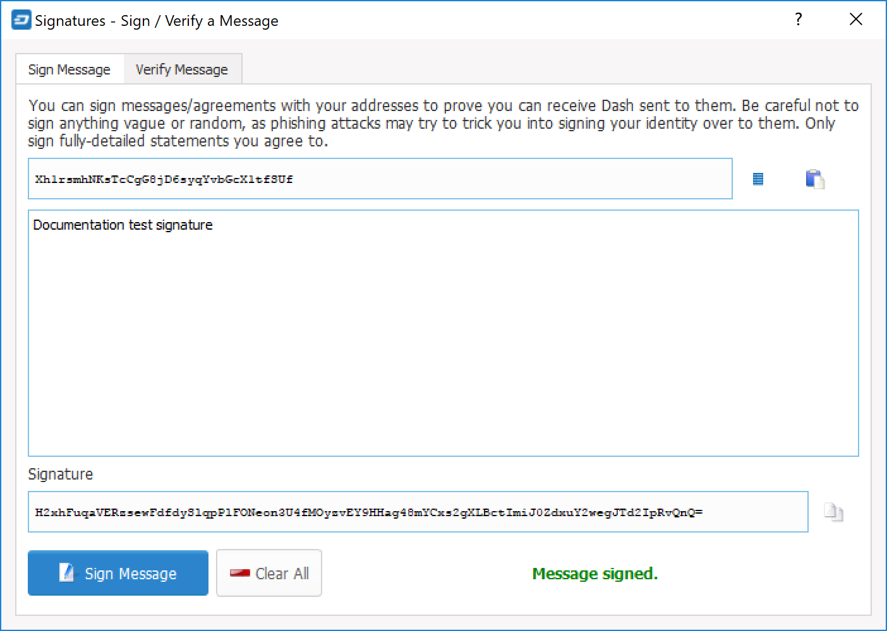
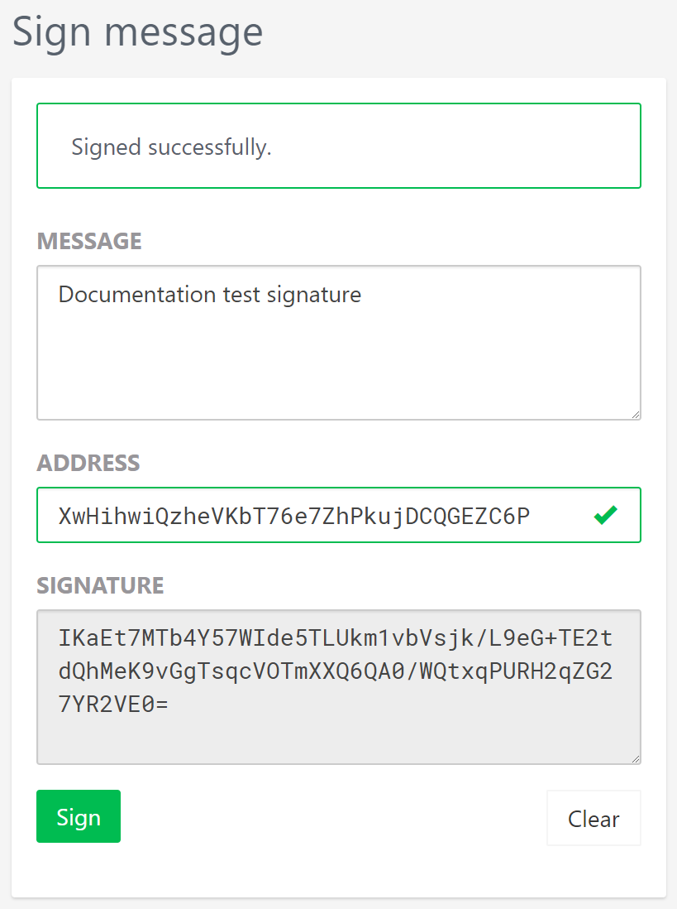
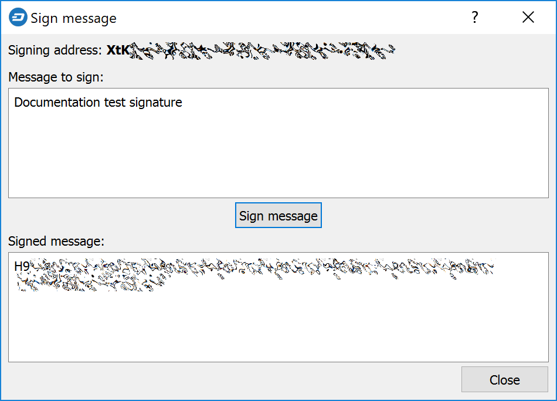
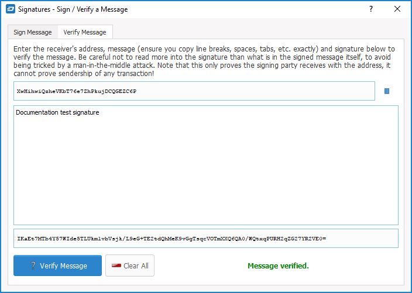
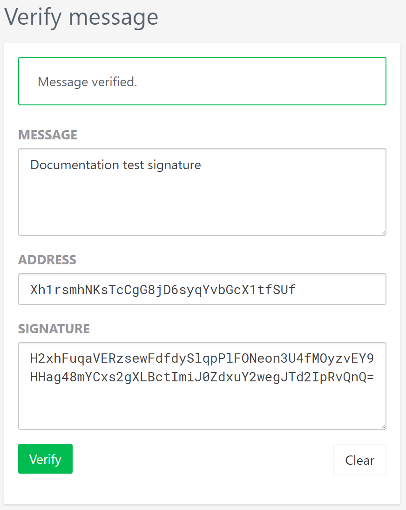

.. meta::
   :description: Guides and screenshots on how to sign and verify messages using the Dash cryptocurrency
   :keywords: dash, sign, verify, message, trezor, dash core

.. _dashcore-signing:

==============================
Signing and Verifying Messages
==============================

Dash wallets function by securely storing the private keys used to
create transactions using publicly visible addresses on a distributed
ledger called a blockchain. In some cases, it may be necessary to verify
an address to demonstrate control of the funds that it holds, that you
can receive using the address, or even to verify your identity to an
exchange that has previously seen a transaction from that address. To
avoid phishing attacks, take great care when sending signed messages to
parties you do not trust, since ambiguously worded messages could be
used to impersonate your identity.

Signing messages requires a private key. Verifying messages requires a
public address. In this way, you can write an arbitrary message and
generate a signature that could only have been created by a user with
control of the private key for this address. Any user with the message,
the public address and the signature can easily verify that only you
could have created the signature. Messages are not stored on the
blockchain. Instead, you must send these three text snippets (message,
address and signature) to your intended recipient using another
communication channel, such as email. As an example, you can test the
following message and signature and verify that it was signed by the
given address::

  Message: Documentation test signature
  Address: XwHihwiQzheVKbT76e7ZhPkujDCQGEZC6P
  Signature: IKaEt7MTb4Y57WIde5TLUkm1vbVsjk/L9eG+TE2tdQhMeK9vGgTsqcVOTmXXQ6QA0/WQtxqPURH2qZG27YR2VE0=

Signing a Message
=================

The following screenshots show how to sign a message using the Dash Core
wallet (**File > Sign message**), Trezor web wallet (Sign & Verify >
Sign message) and DMT (**Tools > Sign message with HW for current
masternode's address**):

*Signing messages in Dash Core, Trezor web wallet and DMT*

Verifying a Message
===================

The following screenshots show how to verify a message using the Dash
Core wallet (**File > Sign message**) and Trezor web wallet (**Sign &
Verify > Sign message**):

*Verifying messages in Dash Core and Trezor web wallet. Notice that the
message verified by Dash Core was generated in Trezor, and vice versa*
