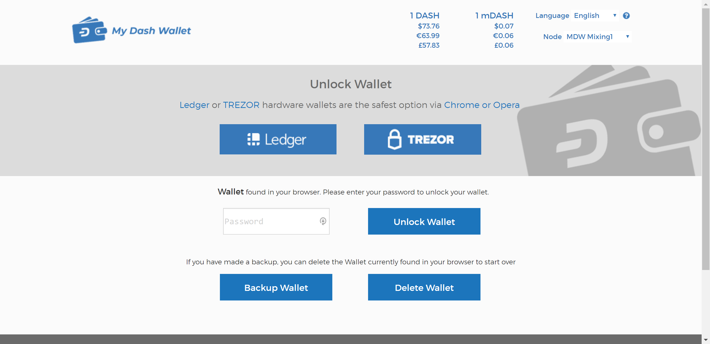

.. meta::
   :description: MyDashWallet is a secure web wallet for Dash, supporting InstantSend and CoinJoin
   :keywords: dash, mydashwallet, web, wallet, coinjoin, privatesend, instantsend, my dash wallet

.. _dash-web-wallet:

MyDashWallet
============

`MyDashWallet <https://mydashwallet.org/>`_ is a web interface to the
Dash blockchain, inspired by `MyEtherWallet
<https://www.myetherwallet.com>`_ and created by `DeltaEngine.net
<https://deltaengine.net/>`_. It is explicitly not an online wallet,
meaning you maintain control over your private keys at all times. Unlike
many other light wallets, MyDashWallet also supports advanced Dash
features such as InstantSend and CoinJoin. The project is non-profit,
open source and free to use. You can load a wallet and transact in a
variety of wallet formats:

- Keystore wallet (file-based)
- Ledger hardware wallet
- Trezor hardware wallet
- Private key
- BIP39/44 HD recovery phrase (coming soon)
- BIP32 HD recovery phrase (coming soon)

Please note that web wallets may not be as secure as alternatives such
as hardware wallets. Be aware of the risk of storing large amounts of
Dash in keyfile wallets, since they are an easier target to attack than
mobile or hardware wallets. 

MyDashWallet offers complete and detailed documentation for all functions.

- `Getting started <https://mydashwallet.org/help>`_
- `How to Create a Wallet via Keystore file <https://old.mydashwallet.org/AboutCreateNewWallet>`_
- `Using the Ledger Hardware Wallet on MyDashWallet <https://old.mydashwallet.org/AboutLedgerHardwareWallet>`_
- `Using the Trezor Hardware Wallet on MyDashWallet <https://old.mydashwallet.org/AboutTrezorHardwareWallet>`_
- `How to does DASH InstantSend work on MyDashWallet? <https://old.mydashwallet.org/AboutInstantSend>`_
- `How to does DASH PrivateSend work on MyDashWallet? <https://old.mydashwallet.org/AboutPrivateSend>`_

.. image:: img/mydashwallet-opened.png
   :width: 400px

.. _west-wallet:

WestWallet
==========

.. image:: img/westwallet.png
   :width: 160px
   :align: right

`WestWallet <https://westwallet.io/>`_ is a multicurrency web wallet
for storing, sharing and transferring the most popular cryptocurrencies.
The wallet includes an automatable instant exchange, instant transfers
between users and automatic withdrawal.

Please note that web wallets may not be as secure as alternatives such
as hardware wallets. Be aware of the risk of storing large amounts of
Dash in keyfile wallets, since they are an easier target to attack than
mobile or hardware wallets. 

Support for WestWallet is available at 
`info@westwallet.info <info@westwallet.info>`_.
