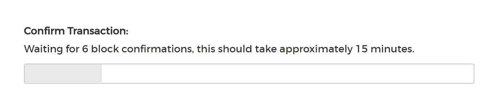
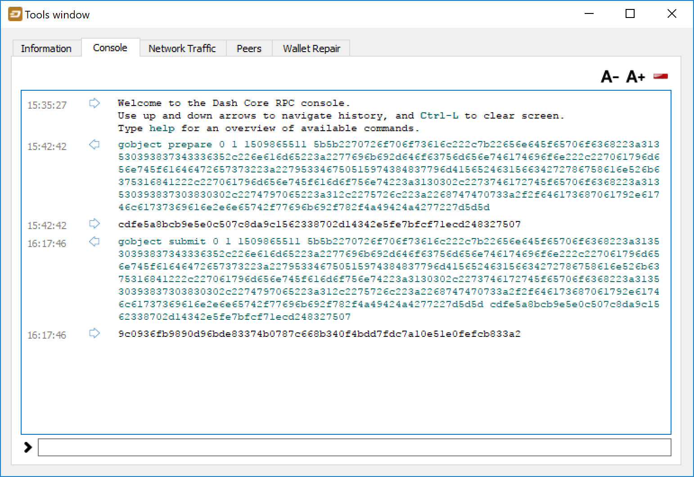
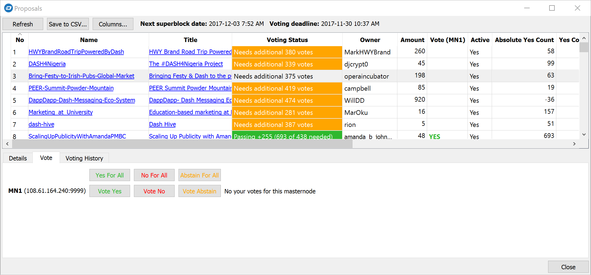

.. _governance:

==========
Governance
==========

Decentralized Governance by Blockchain, or DGBB, is Dash's attempt to
solve two important problems in cryptocurrency: governance and funding.
Governance in a decentralized project is difficult, because by
definition there are no central authorities to make decisions for the
project. In Dash, such decisions are made by the network, that is, by
the owners of masternodes. The DGBB system allows each masternode to
vote once (yes/no/abstain) for each proposal. If a proposal passes, it
can then be implemented (or not) by Dash's developers. A key example is
early in 2016, when Dash's Core Team submitted a proposal to the network
asking whether the blocksize should be increased to 2 MB. Within 24
hours, consensus had been reached to approve this change. Compare this
to Bitcoin, where debate on the blocksize has been raging for nearly
three years and has resulted in serious splits within the community and
even forks to the Bitcoin blockchain.

The DGBB also provides a means for Dash to fund its own development.
While other projects have to depend on donations or premined endowments,
Dash uses 10% of the block reward to fund its own development. Every
time a block is mined, 45% of the reward goes to the miner, 45% goes to
a masternode, and the remaining 10% is not created until the end of the
month. During the month, anybody can make a budget proposal to the
network. If that proposal earns the net approval of at least 10% of the
masternode network, then at the end of the month the requested amount
will be paid out in a "superblock". At that time, the block rewards that
were not paid out (10% of each block) will be used to fund approved
proposals. The network thus funds itself by reserving 10% of the block
reward for budget projects.

.. raw:: html

    

        <iframe src="//www.youtube.com/embed/jHsVU1LBuAY" frameborder="0" allowfullscreen style="position: absolute; top: 0; left: 0; width: 100%; height: 100%;"></iframe>
    

.. _understanding-governance:

Understanding Dash Governance
=============================

Introduction
------------

One of the greatest challenges of building a cryptocurrency platform is
ensuring you create a decentralized system of governance to manage,
fund, maintain and expand the project. This key element has been absent
in every major currency to date, so the natural response is to create a
not-for-profit foundation that is tasked with maintaining the core
protocol and promoting the coin, but is not really connected to the coin
holders in any meaningful way. This approach has a few issues that have
been made evident from the experience of older crypto currency
platforms.

Current crypto foundations are not related to the currency itself by any
mechanism that is included in the protocol and are not designed to
outlive early adopters when they lose interest. The foundation then
struggles to maintain funding until it implodes and core development of
the protocol is left scrambling for funding or depending on charity that
can’t be counted on and does not allow for proper budgeting and
planning. Donations are also unfair to donors because there are always
free riders that benefit from the effort done by others without
contributing. Other projects have financed themselves by premining coins
or running prelaunch sales, which is not a great solution either because
control of the funds is centralized and at that stage it is impossible
to quantify the future needs of the project.

Through the network of full nodes and the collateral requirement, Dash
already has a decentralized network of masternode operators that are
heavily invested in the future of the currency, and that as a group can
act as stewards of the core protocol development and promotion. We
propose a decentralized management system based on the masternode voting
mechanism. Masternode operators are not the only ones interested in the
success of Dash, but they are the most stable ones because, unlike
miners, they can’t reuse their asset for any other purpose or coin.

In the budget system, a portion of the block reward is held in escrow by
the network itself, in the name of the operators, to be executed in the
development and expansion of the ecosystem according to the vote of the
masternodes in different budget proposals. These funds are directed to
supporting development and promotion of the coin. Masternode operators
vote on specific budgets and projects to be funded, thus defining the
direction the coin is taking. This is done in a completely transparent
way through a public portal where new initiatives are proposed and
masternodes can vote on them. Functioning like a decentralized
Kickstarter or Lighthouse, the budget can be used for anything that
creates value within the ecosystem.

This is a 100% decentralized system powered by the masternodes, where
budgets are set and paid directly from the blockchain. The blockchain
hires core developers in this way and introduces a new concept of paid
blockchain contractors, where people work for and are directly
compensated by the network, through the decentralized votes of all
masternode operators. One advantage of this model is it can survive
early adopters. If early masternode operators sell their coins, the new
owner can set up a masternode and with it acquire the right to vote on
the budgets and projects. This guarantees there is a working system of
maintenance as people come and go, making the network capable of
sustaining itself on its own without depending on specific actors.

Budgets and masternode voting
-----------------------------

The system works as a decentralized voting mechanism set up in the rules
governing the blockchain, where budgets for specific projects are
proposed, then the masternodes as a whole vote on them. Each project, if
it passes, is added to the total budget and paid directly from the
blockchain to the person doing the work. This allows Dash to hire core
developers and pay them directly after approval of the work in a
decentralized fashion.

A masternode votes on a proposal (technically a governance object on the
blockchain) using the example command “masternode vote yes”, “masternode
vote no” or “masternode vote abstain”. The votes then propagate across
the network, and are tallied according to instructions followed by the
network itself. Budgets under discussion and voting progress can be
viewed using the example command “masternode budget show”.

A well defined decentralized system of governance allows a
cryptocurrency network to endure and survive its original creators. In
this way, later generations of masternode operators have a clear way to
support the system as defined by the protocol itself, applying wisdom of
the crowd techniques and the bond of trust established by the masternode
collateral to create a decentralized management system. This creates
incredible value within the currency, allowing us to be more agile and
compete with other payment systems, such as Bitcoin and credit cards, on
a global scale.

As the system has developed, a strong team of productive contractors
paid from blockchain rewards has arisen and become established. This
includes the core development team, escrow providers, news and reporting
staff, experimental development labs, partnerships with universities,
hiring of marketing and PR firms and integrations with third party
exchanges and payment platforms. The market recognizes the value of the
stability of the network as a whole, and that the possibility of
reliable and sufficient funding results in faster and more coherent
implementation of the Dash roadmap and core Dash services.

Reward schedule
---------------

To guarantee long term sustainability of the blockchain, the network
keeps a portion of the block rewards back as new blocks are created,
with the masternode operators tasked to act as stewards and invest in
the maintenance and expansion of the network by voting. This results in
faster development and promotion, creating a virtuous cycle that
benefits all actors, including miners, masternode operators, investors
and users. More importantly, this gives the blockchain itself a self-
preservation mechanism that is beyond the control of any individual.

+----------------------------------------+-----+
| Mining reward for Proof-of-Work        | 45% |
+----------------------------------------+-----+
| Masternode reward for Proof-of-Service | 45% |
+----------------------------------------+-----+
| Decentralized governance budget        | 10% |
+----------------------------------------+-----+

Masternodes and miners take 45% of the mining reward each, at the time
it is created. The remaining 10% is disbursed monthly by the masternode
operators once the results of their votes are tallied, creating the
first self-sustaining decentralized cryptocurrency platform organized as
a Decentralized Autonomous Organization (DAO). The masternode operators
establish a social contract with the network they benefit from and are
bound to act as caretakers, dedicating their time, due diligence work
and a portion of the network rewards to furthering the ecosystem. This
has a ripple effect that benefits all parties involved - especially the
end users.

The value generated by work done implementing proposals is expected to
be greater than allocating 100% of rewards to mining because the network
has needs beyond only cryptographically securing the blockchain. The
expected result is greater net benefit not only for proposal winners,
but also masternode operators, miners and normal users. In fact, the
introduction of the decentralized governance budget itself was decided
by a masternode vote, making the first distributed decision the actual
creation of the system, similar to establishing a constitution.

This approach of distributing the normal block reward in a way that
considers all critical elements a cryptocurrency needs for its long term
viability, e.g. mining, full nodes, development and promotion, is
revolutionary as it is done without changing the emission or creating
any additional inflation for investors. The network simply distributes
the available resources in a way that is of greater net benefit to all
parties.

Contractors and proposals
-------------------------

Contractors of the blockchain can be developers, outreach professionals,
team leaders, attorneys or even people appointed to do specific tasks.
Proposals generally begin life as simple `pre-proposal forum posts
<https://www.dash.org/forum/topic/pre-budget-proposal-discussions.93/>`_
on the Dash Forum, where feedback and suggestions are solicited from the
general community. Once the proposal owner decides they have a
reasonable chance of passing their proposal, it is created as a
governance object on the blockchain. A fee of 5 DASH is associated with
this action to prevent spam and ensure only serious proposals make it to
this stage. Several tools exist to allow masternode operators to
comfortably review and vote on propoals. The net total of yes votes must
exceed 10% of the total masternode count at the time votes are tallied
in order to pass. If there are more passing proposals than the available
block reward can provide for, the proposals with the most yes votes will
pass first, creating a cut-off point for less popular proposals. The
same process is then repeated every month, and the total amount of Dash
available for proposals decreases by approximately 7.14% per year,
together with the overall block reward.

Proposal websites
-----------------

The community has gathered around `Dash Central
<https://www.dashcentral.org>`_ as a website to facilitate discussion
and voting on proposals formally entered on the Dash blockchain. Other
websites, such as `Dash Ninja <https://www.dashninja.pl>`_ and `Dash
Vote Tracker <https://dashvotetracker.com>`_ are available to monitor
progress over time and gather more detailed statistics. `Dash Masternode
Tool <https://github.com/Bertrand256/dash-masternode-tool/releases>`_
also allows for voting without the need to share masternode private keys
with a third party service.

.. figure:: img/governance-dashcentral.png
   :width: 400px

   A typical view of proposal discussion and voting on Dash Central

Each proposal includes a description of the proposal goals, details of
what work will be done and a breakdown of the requested budget. Many
proposals also link to their own website or the pre-proposal discussion,
or include a video to validate the identity and sincerity of the
proposal owner. Discussion on Dash Central occurs below this
information, and masternode owners have the option to verify their
ownership of a masternode and ability to cast a vote by signing a
message from the masternode collateral address. Masternodes can vote at
any time, and also change their vote at any time until the cutoff block
is mined and voting stops. After voting stops, the blockchain executes a
decentralized tally and validates all votes. Once consensus is reached,
the results are broadcast and the budget is allocated soon after in a
superblock.

.. figure:: img/governance-dashcentral-vote.png
   :width: 400px

   Proposal details and voting buttons on Dash Central

Once passed, proposals are able to report back to the network on the
`Dash Forum <https://www.dash.org/forum/topic/approved-proposals-
updates-news.140>`_ or via published public channels and social media.
Since it is possible to create proposals that pay out over several
months, it is also possible to revoke funding from a project by changing
the vote if development or spending of already allocated funds is
unsatisfactory. This encourages proposal owners to work honestly and
diligently to win the trust and approval of the network. Ongoing
discussion and gradual improvement over time results in a close bond
between the network and those working for the network in supporting
roles.

Voting on proposals is updated in real time every 2.5 minutes as blocks
are mined, so current winning proposals and the total allocation of the
available budget are always open and visible to everyone. `Dash Vote
Tracker <https://dashvotetracker.com>`_ is a popular site used for this
purpose.

.. figure:: img/governance-dashvotetracker.png
   :width: 400px

   Monitoring budget allocation on Dash Vote Tracker

Finally, `Dash Watch <http://dashwatch.org>`_ (which was itself funded
through a budget proposal) exists to monitor the ability of blockchain
contractors to deliver on their promises with respect to delivery dates
and the total amounts of budget allocated over multiple voting periods.
A team of dedicated staff routinely interact with proposal owners to
track progress of the various projects and provide reports to voting
masternodes in a single location.

.. figure:: img/governance-dashwatch.png
   :width: 400px

   Proposal monitoring on Dash Watch

Budget allocation
-----------------

The total budget of the network can be calculated by taking 10% of the
reward over the period of time between two superblocks, which occur
every 16616 blocks or approximately 30.29 days. A voting cutoff occurs
before the superblock, and the final votes are tallied at this point. A
proposal must satisfy the condition ``(YES votes - NO votes) > (Total
Number of Masternodes / 10)`` in order to be considered passing. Then,
in the superblock, the winning proposals are awarded in the order of the
margin by which they are passing until either the entire budget is
allocated or no more passing proposals exist. This allows for completely
trustless and decentralized allocation of the budget.

Due to the decentralized nature of the masternode system, it is
sometimes necessary to form funded organisations, such as committees or
companies, to be responsible for some project or task. These are
submitted in the same way, but the committee itself receives the funds.
Another alternative is to place trusted escrow services between the
budget allocation event and the actual submitter of the proposal to
ensure that work is paid for in stages, as it is delivered. Some
oversight over blockchain contractors is sometimes needed. Each budgeted
item requires either a team manager or a committee responsible for
implementation of the work. Periodically, this manager is expected to
report on budget expenditure and completed work to show the value
created from the allocated funds. This allows repeat proposal submitters
to build up a reputation and gain trust from the community. Proposals
which do not provide regular reports and cannot answer questions about
their budget allocation will soon be defunded if it is part of a regular
monthly proposal cycle. The result is a kind of self-policing system.

Any unallocated budget is simply never created in the superblock,
reducing unnecessary inflation.

Scaling and future uses
-----------------------

As the number of blockchain contractors increases, a point is reached
where masternode operators cannot be realistically expected to evaluate
the volume of proposals. At this point funding organizations can be
created to act as contractors for the distribution of funds to many
smaller decentralized projects, according to current needs. Dash Core
Group, Inc. is one example of such an organization.

The existence of the decentralized budget system puts the power of
determining where Dash goes in the future in the hands of the masternode
network itself. All core development and several peripheral developers
are already funded from the budget, and other projects not even
conceivable at this time will likely arise in the future. This decouples
the survival and value of the blockchain from the current userbase and
developers, making Dash the first blockchain designed to outlive its
original users, a self sustainable decentralized cryptocurrency network
that can still operate cohesively and bring added value services to end
users in a consistent way.

Conclusion
----------

Every masternode operator establishes a bond of trust and a social
contract with the network in which she is bound to contribute to the
development and maintenance of the ecosystem she benefits from. Under
this model, a portion of the funds that the operator is bound to receive
are in a sense allocated in custody, not in ownership, and are held in
escrow by the network to be executed by the operators for the benefit of
the ecosystem. Everyone contributes equally and proportionately to the
benefits they are receiving and the risks they are taking, there are no
privileges and no loopholes. This is complemented by the full node
voting mechanism that allows for a distributed group to vote on a
continuous basis on practical matters without the need to forfeit their
right to decide to others, every few years, like with traditional
governments or cooperative corporations.

We envision a future in which this model of transparent, unbreakable and
verifiable contribution to the common good, in combination with
continuous participation of the crowd through active voting, is utilized
to manage organizations that are owned or operated jointly by its
members, who share the benefits and responsibilities of those
collectives, like governments, cooperative corporations, unions, DAOs,
cryptocurrencies, etc. We call this model decentralized governance by
blockchain.

.. _using-governance:

Using the Governance System
===========================

Dash's Decentralized Governance by Blockchain (DGBB) is a novel voting
and funding platform. This documentation introduces and details the
theory and practice to use the system.

Understanding the process
-------------------------

Introduction
^^^^^^^^^^^^

- DGBB consists of three components: Proposals, Votes, and Budgets
- Anyone can submit a proposal for a small fee
- Masternode owners can cast for, against or abstain votes on proposals
- Approved proposals become budgets
- Budgets are paid directly from the blockchain to the proposal owner

Proposals
^^^^^^^^^

- Proposals are a request to receive funds
- Proposals can be submitted by anyone for a fee of 5 Dash. The proposal
  fee is irreversibly destroyed on submission.
- Proposals cannot be altered once submitted

Votes
^^^^^

- Votes are cast by masternode owners
- Votes can be changed at any time
- Votes are counted every 16616 blocks (approx. 30.29 days)

Budgets
^^^^^^^

- Budgets are proposals which receive a net total of yes votes equal to
  or greater than 10% of the total possible votes (for example over 448
  out of 4480)
- Budgets can be nullified at any time if vote totals (cast or re-cast)
  fall below the approval threshold
- Budgets are processed (paid) in order of yes minus no votes. More
  popular budgets get payment priority. 
- Approximately 6176 dash (in 2018) are available for each budget cycle,
  decreasing by 7.14% every 210240 blocks (approx. 383.25 days).

Object structure
^^^^^^^^^^^^^^^^

The following information is required to create a proposal:

- proposal-name: a unique label, 20 characters or less
- url: a proposer-created webpage or forum post containing detailed
  proposal information
- payment-count: how many cycles the proposal is requesting payment
- block-start: the requested start of proposal payments
- dash-address: the address to receive proposal payments
- monthly-payment-dash: the requested payment amount

Persistence
^^^^^^^^^^^

- Proposals become active one day after submission
- Proposals will remain visible on the network until they are either
  disapproved or the proposal's last payment-cycle is reached
- Approval occurs when yes votes minus no votes equals 10% or more of
  the total available votes.
- Disapproval occurs when no votes minus yes votes equals 10% or more of
  the total available votes.
- The total available votes is the count of online and responding
  masternodes and can be seen by running the command 
  ``masternode count`` in the Dash Core wallet debug window. A graph of
  the total masternode count can be found `here 
  <http://178.254.23.111/~pub/masternode_count.png>`_

Templates
^^^^^^^^^

The following two Microsoft Word templates are available from Dash Core
Group to help facilitate standardized proposal submission and updates.
Usage is recommended, but not required.

- `Project Proposal Template <https://github.com/dashpay/docs/raw/master/binary/Dash%20Project%20Proposal%20Template%20v1.0.docx>`_
- `Project Status Update Template <https://github.com/dashpay/docs/raw/master/binary/Dash%20Project%20Status%20Update%20Template%20v1.0.docx>`_

.. _budget-cycles:

Budget cycles
-------------

When preparing a proposal, be aware of when the next cycle will occur
and plan accordingly. It is recommended to choose your proposal payment
start block at least one cycle in the future to allow time for
discussion and gathering support and votes. Note that votes will no
longer be tallied 1662 blocks (approximately 3 days) prior to the
superblock.

+--------------+-----------------------------+
| Block height | Approximate date            |
+==============+=============================+
| 747720       | Tue Oct 3 20:17:56 UTC 2017 |
+--------------+-----------------------------+
| 764336       | Fri Nov 3 03:22:58 UTC 2017 |
+--------------+-----------------------------+
| 780952       | Sun Dec 3 10:28:00 UTC 2017 |
+--------------+-----------------------------+
| 797568       | Tue Jan 2 17:33:02 UTC 2018 |
+--------------+-----------------------------+
| 814184       | Fri Feb 2 00:38:04 UTC 2018 |
+--------------+-----------------------------+
| 830800       | Sun Mar 4 07:43:06 UTC 2018 |
+--------------+-----------------------------+
| 847416       | Tue Apr 3 14:48:08 UTC 2018 |
+--------------+-----------------------------+
| 864032       | Thu May 3 21:53:10 UTC 2018 |
+--------------+-----------------------------+
| 880648       | Sun Jun 3 04:58:12 UTC 2018 |
+--------------+-----------------------------+
| 897264       | Tue Jul 3 12:03:14 UTC 2018 |
+--------------+-----------------------------+
| 913880       | Thu Aug 2 19:08:16 UTC 2018 |
+--------------+-----------------------------+
| 930496       | Sun Sep 2 02:13:18 UTC 2018 |
+--------------+-----------------------------+
| 947112       | Tue Oct 2 09:18:20 UTC 2018 |
+--------------+-----------------------------+
| 963728       | Thu Nov 1 16:23:22 UTC 2018 |
+--------------+-----------------------------+
| 980344       | Sat Dec 1 23:28:24 UTC 2018 |
+--------------+-----------------------------+
| 996960       | Tue Jan 1 06:33:26 UTC 2019 |
+--------------+-----------------------------+

You can view the source code for this calculation at this
`GitHub gist <https://gist.github.com/strophy/9eb743f7bc717c17a2e776e461f24c49>`_

.. _creating-proposals:

Creating proposals
------------------

Once you have prepared the text of your proposal and set up a website or
forum post, it is time to submit your proposal to the blockchain for
voting. While all tasks involved with creating a budget proposal can be
executed from the Dash Core wallet console, several tools providing a
user interface have been developed to simplify this procedure.

Dash Budget Proposal Generator
^^^^^^^^^^^^^^^^^^^^^^^^^^^^^^

- https://proposal.dash.org

The `Dash Budget Proposal Generator <https://proposal.dash.org>`_
supports creating budget proposals on both mainnet and testnet. In the
first step, you must enter a short, clear and unique name for the
proposal as it will appear on the blockchain. Proposal names are limited
to 40 characters. You can then provide a link to the forum or
DashCentral where your proposal is described in more detail (use a `URL
shortening service <https://goo.gl>`_ if necessary), as well as select
the amount of payment you are requesting, how often the payment should
occur, and the superblock date on which you are requesting payment. This
allows you to control in which budget period your proposal will appear,
and gives you enough time to build support for your proposal by
familiarising voters with your project. Note that the payment amount is
fixed and cannot be modified after it has been submitted to the
blockchain.

.. image:: img/proposal-create.png
   :width: 300px

.. figure:: img/proposal-burn-prepare.png
   :width: 300px

   Steps 1 & 2: Creating your proposal and preparing the command

Next, the proposal generator will provide you with a command to run from
the console of your Dash Core wallet to prepare your budget proposal
governance object. Running this command will cost you 5 DASH, which will
be "burnt" or permanently removed from circulation. This one-time fee
protects the governance system from becoming overwhelmed by spam, poorly
thought out proposals or users not acting in good faith. A small
transaction fee is charged as well, so make sure slightly more than 5
DASH is available in your wallet. Many budget proposals request
reimbursement of the 5 DASH fee.

First unlock your wallet by clicking **Settings > Unlock wallet**, then
open the console by clicking **Tools > Debug console** and paste the
generated command. The transaction ID will appear. Copy and paste this
into the proposal generator response window. As soon as you do this, the
system will show a progress bar as it waits for 6 confirmations as
follows:

.. image:: img/proposal-burn-console.png
   :width: 300px

   Step 3: Creating the proposal transaction and waiting for 6 
   confirmations of the transaction ID

Once 6 block confirmations exist, another command will appear to submit
the prepared governance object to the network for voting. Copy and paste
this command, and your governance object ID will appear as follows:

.. image:: img/proposal-submit.png
   :width: 300px

   Step 4: Submitting the governance object to the network

You can use this ID to track voting on the proposal until the budget
closes and you receive your payout. You can also submit the ID to
DashCentral to claim your proposal and enable simpified voting for
masternodes using DashCentral voting services.

DashCentral Proposal Generator
^^^^^^^^^^^^^^^^^^^^^^^^^^^^^^

- https://www.dashcentral.org/budget/create

DashCentral also includes a tool to create budget proposals, or claim
existing proposals so you can add a description on DashCentral and begin
discussion with the community. The steps to be taken are almost
identical to the procedure described above, and documentation is
available `here <https://www.dashcentral.org/about/contact>`_.

Voting on proposals
-------------------

**You must vote at least three days before the superblock is created or
your vote will not be counted. The exact deadline is 1662 blocks before
the superblock.**

Voting on DGBB proposals is an important part of operating a masternode.
Since masternodes are heavily invested in Dash, they are expected to
critically appraise proposals each month and vote in a manner they
perceive to be consistent with the best interests of the network. Each
masternode may vote once on each proposal, and the vote can be changed
at any time before the voting deadline. The following sites and tools
are available to view and manage proposals and voting:

- `DashCentral <https://www.dashcentral.org/budget>`_
- `Dash Budget Proposal Vote Tracker <https://dashvotetracker.com/>`_
- `Dash Ninja - Governance <https://www.dashninja.pl/governance.html>`_
- `Dash Masternode Tool - Proposals <https://github.com/Bertrand256/dash-masternode-tool/releases>`_

For information on how to create a proposal, see :ref:`here
<creating-proposals>`.

DashCentral
^^^^^^^^^^^

Many masternode operators store their password-protected masternode
private key on `DashCentral <https://www.dashcentral.org>`_ to enable
simple voting with a user-friendly interface. The popularity of this
site has made it a common place for discussion of the proposals after
they are submitted to the governance system. To vote from the
DashCentral web interface, first add your masternode private key to your
account according to the instructions here. Note that the masternode
private key is not the same as the private key controlling the 1000 DASH
collateral, so there is no risk of losing your collateral. A separate
password is required to unlock the masternode private key for voting, so
the risk of the site operator voting in your name is minimal.

When you are ready to vote, go to the `budget proposals page
<https://www.dashcentral.org/budget>`_. Simply click to view the
proposals, then click either **Vote YES**, **Vote ABSTAIN** or **Vote
NO**.

.. figure:: img/vote-dashcentral.png
   :width: 400px

   Voting interface on DashCentral

Dash Masternode Tool (DMT)
^^^^^^^^^^^^^^^^^^^^^^^^^^

If you started your masternode from a hardware wallet using `DMT
<https://github.com/Bertrand256/dash-masternode-tool/releases>`_, you
can also use the tool to cast votes. Click **Tools > Proposals** and
wait for the list of proposals to load. You can easily see the voting
status of each proposal, and selecting a proposal shows details on the
**Details** tab in the lower half of the window. Switch to the **Vote**
tab to **Vote Yes**, **Vote No** or **Vote Abstain** directly from DMT.

   Voting interface in DMT

Dash Core wallet or masternode
^^^^^^^^^^^^^^^^^^^^^^^^^^^^^^

If you started your masternode using the Dash Core Wallet (not
recommended), you can vote manually from **Tools > Debug console**, or
directly from your masternode via SSH using ``dash-cli``. First click on
the proposal you want to vote on at either `DashCentral
<https://www.dashcentral.org/budget>`_ or `Dash Ninja
<https://www.dashninja.pl/governance.html>`_. You will see a command for
manual voting below the proposal description. Copy and paste the command
and modify it as necessary. As an example, take this proposal from `Dash
Ninja <https://www.dashninja.pl/proposaldetails.html?proposalhash=6ed741
8455e07f4b30b99f0d4a24a2b83282e12b26fe3415673ecbea04ff6c9d>`_ (or
`DashCentral
<https://www.dashcentral.org/p/ScalingUpPublicityWithAmandaPMBC>`_). The
voting code for Dash Core Wallet is as follows::

  gobject vote-many 6ed7418455e07f4b30b99f0d4a24a2b83282e12b26fe3415673ecbea04ff6c9d funding yes
  gobject vote-many 6ed7418455e07f4b30b99f0d4a24a2b83282e12b26fe3415673ecbea04ff6c9d funding no
  gobject vote-many 6ed7418455e07f4b30b99f0d4a24a2b83282e12b26fe3415673ecbea04ff6c9d funding abstain

Note that to vote from your masternode directly, you need to prefix the
command with ``dash-cli``, which is usually found in the ``.dashcore``
folder. The command should be similar to the following::

  ~/.dashcore/dash-cli gobject vote-many 6ed7418455e07f4b30b99f0d4a24a2b83282e12b26fe3415673ecbea04ff6c9d funding yes
  ~/.dashcore/dash-cli gobject vote-many 6ed7418455e07f4b30b99f0d4a24a2b83282e12b26fe3415673ecbea04ff6c9d funding no
  ~/.dashcore/dash-cli gobject vote-many 6ed7418455e07f4b30b99f0d4a24a2b83282e12b26fe3415673ecbea04ff6c9d funding abstain

Note this command will trigger a vote from all masternodes configured in
``dash.conf``. If you have multiple masternodes each with its own .conf
file, or if you want to vote with only some of your masternodes, you
must change the command from ``vote-many`` to ``vote``. If your vote was
successful, you should see a confirmation message reading **Voted
successfully**.

.. figure:: img/vote-dashcore.png
   :width: 300px

   Voting from the debug console in Dash Core Wallet

You can also view a list of proposals in JSON format from the console to
copy and paste the proposal hash for voting as follows::

  gobject list

8 Steps to a Successful Proposal
================================

Proposals in the Dash governance system are subject to voting by
masternodes. So, like any voting, you need to convince the voters that
your proposal should pass. Here are some key points to consider in every
proposal:

Keep your proposal clear
  Your proposal should have a clear title, followed by a short and
  simple description of the objectives. Explain early in your proposal
  exactly how it will benefit the Dash network, how much Dash you are
  requesting, how you arrived at this value, and finally who you are and
  how you plan to do the work. Masternodes should be able to immediately
  get an idea of what you are proposing from the first few lines of your
  proposal.

Run a pre-proposal discussion
  Get feedback from the community before you post your proposal to the
  blockchain. A discussion period of around two weeks will help you find
  out if someone has proposed something similar in the past, and whether
  it succeeded or failed. There are `pre-proposal channels on the forum
  <https://www.dash.org/forum/topic/pre-budget-proposal-
  discussions.93>`_ and `Dash Nation Discord <http://dashchat.org>`_,
  and `Reddit <https://www.reddit.com/r/dashpay>`_ also attracts a lot
  of views - consider the discussion on these channels to be the
  research phase of your proposal. Later, you can post a link to the
  forum discussion when your proposal goes live to show you are
  including community feedback in your work.

Manage your identity and reputation
  The Dash community is one of the network's strongest features, and
  newcomers are always welcome. However, because of the way proposals
  work, there needs to be reasonable trust that the work promised in the
  proposal will be completed if it passes. If you are new, consider
  starting with a smaller proposal first to prove your ability to deliver
  on time and budget. Attaching your real name or `Keybase
  <https://keybase.io>`_ identity to a proposal also helps build trust. If
  you are a making a large proposal, get a team together and nominate (or
  hire) one person to serve as community liaison, since posting from
  multiple accounts can be confusing.

Run an enthusiastic campaign for your proposal
  Proposals with a video or website have a far greater chance of
  succeeding! Uploading a video gives your proposal a human touch and a
  chance to convey your enthusiasm in a way that isn't always possible
  in text. Post your video to the `forum
  <https://www.dash.org/forum/topic/pre-budget-proposal-
  discussions.93>`_ and `DashCentral
  <https://www.dashcentral.org/budget>`_, become a regular on Discord
  or run a webinar to explain the proposal and answer questions. Put
  some work in before you ask for funding to demonstrate your
  involvement with Dash - but don't be annoying and spam many channels
  asking for votes.

Demonstrate your commitment to the network
  If you are asking for a significant investment to start up or expand a
  for-profit business built on Dash, you need to explain why and for how
  long this funding is required, and what you are offering in return. It
  can be very helpful to show you have skin in the game by matching the
  contribution provided in Dash with funds from your own business or
  investors. Equity or exclusivity agreements can be reached with `Dash
  Core Group, Inc. <bradley.zastrow@dash.org>`_, but must be clarified
  in writing before the proposal is posted.

Post your proposal early and make yourself available for questions
  The voting window closes 1662 blocks (or just under 3 days) before the
  superblock. To give the masternode operators enough time to consider,
  discuss and vote on your proposal, you must post it well in advance of
  the voting deadline - it's better to wait for the next superblock than
  to rush! Most masternodes will see your proposal for the first time
  once it appears on the blockchain or when you claim it on DashCentral.
  The first few hours of discussion between masternode owners typically
  bring up a lot of questions and can be critical to influence opinion
  and voting, so make yourself available during this time.

Keep the community updated when your proposal passes
  Your proposal should include details of how you plan to keep the
  community and network informed of your work. Meet your commitments and
  post regular reports so your output is clear, and make yourself
  available on social channels to answer questions. Remember, your
  ability to pass future proposals depends on your demonstrated ability
  to deliver and communicate.

Consider arrangements for large requests
  If you are requesting a significant amount of funding, there is an
  understandable concern that you will deliver on your promises to the
  network. Reach out to trusted intermediaries such as `Dash Core Group,
  Inc. <bradley.zastrow@dash.org>`_ or `Green Candle, Inc.
  <https://greencandle.io>`_ in advance for advice on escrow, and make
  the conditions for escrow release public and part of the proposal. If
  your proposal is so large that uses a significant percentage of the
  budget, there is a risk that approving your proposal will bump smaller
  proposals out of the budget. Consider breaking your proposal into
  smaller monthly payments instead.

See :ref:`this documentation <using-governance>` for specific
instructions on how to create a proposal when you are ready. Good luck!

For an example of good reporting, reputation management and use of a
video to request funding in a pre-proposal, see this video from Amanda
B. Johnson's extremely popular **DASH: Detailed** proposal:

.. raw:: html

    

        <iframe src="//www.youtube.com/embed/NuJZwmpMlVA" frameborder="0" allowfullscreen style="position: absolute; top: 0; left: 0; width: 100%; height: 100%;"></iframe>
    

A few additional points:

#. It is currently not possible to pay a budget proposal to a multisig
   address, or to change the payment address after the proposal is
   posted to the blockchain.
    
#. To avoid accusations of favouritism and inside trading, Dash Core
   cannot promote your proposal for you. If your proposal is an
   integration, reach out to the business development team in advance.
   Once your product is live, it may be possible to announce it from
   Dash Core channels.
    
#. If your proposal is for news, promotion or marketing, make sure you
   synchronise your efforts with major existing organisations such as
   Dash Force News or marketing firms contracted by Dash Core.
    
#. You are responsible for your own planning to hedge against price
   volatility. If your proposal involves significant payments to third
   parties in fiat currency, reach out to `Dash Core Group, Inc.
   <bradley.zastrow@dash.org>`_ or `Green Candle, Inc.
   <https://greencandle.io>`_ for advice on escrow, price maintenance,
   converting currencies and hedging against volatility.
    
#. For the same reason, it is not recommended to request funding for
   period of longer than three months. Masternodes don't want to see and
   vote on the same proposal without updates several months in a row,
   and price volatility makes it a risky proposition both to the network
   and yourself.
    
#. Before entering your budget proposal on the blockchain, check how
   many proposals already exist for the current budget cycle. If it is
   likely to become very crowded or if some proposals are requesting a
   significant portion of the budget, voting is likely to be very
   competitive with weaker projects being forced out of the budget, even
   if they collect sufficient votes to pass the 10% threshold. See
   :ref:`here <understanding-governance>` for more details.

