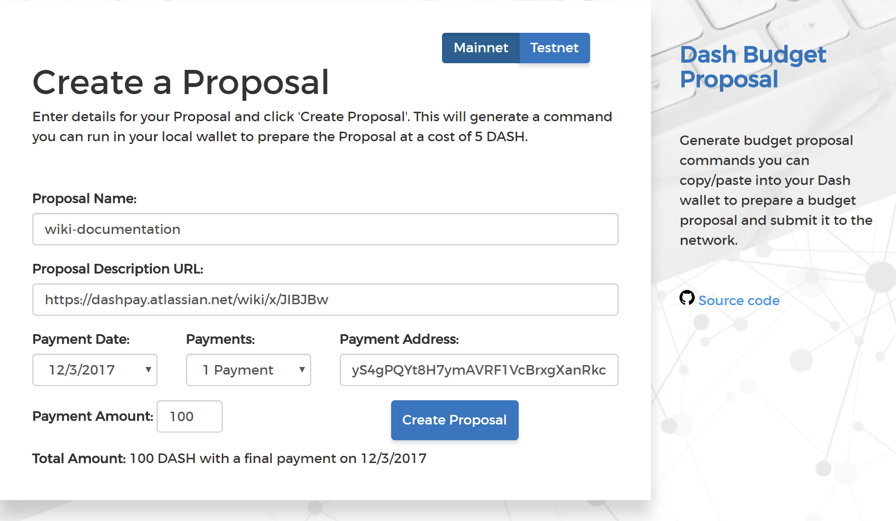
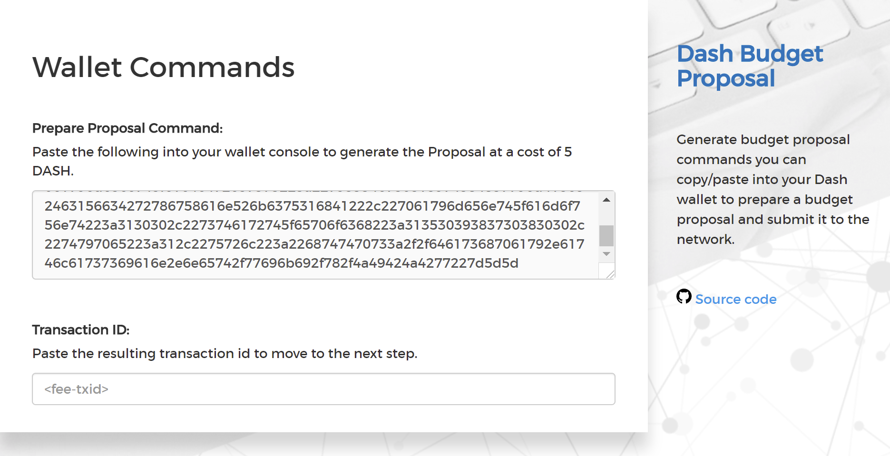
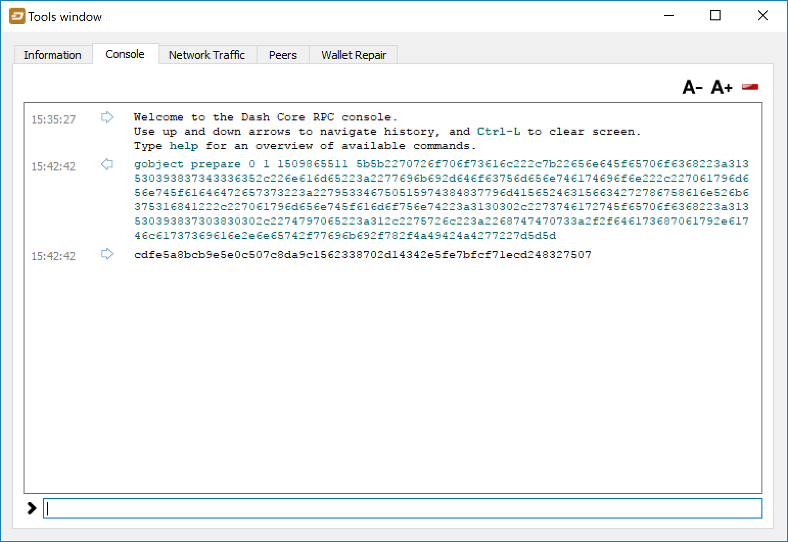
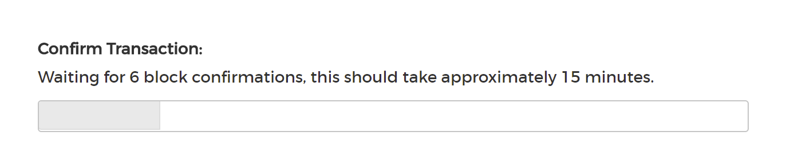
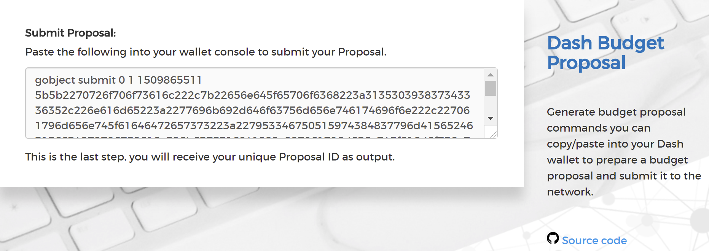
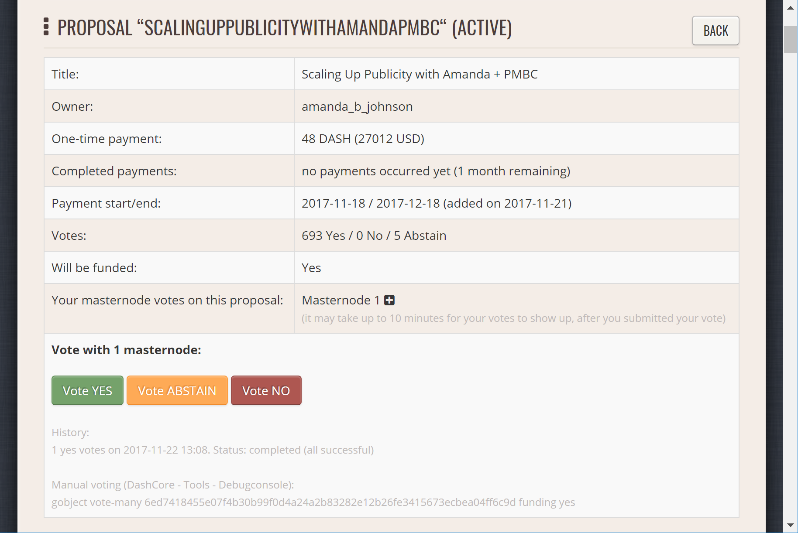
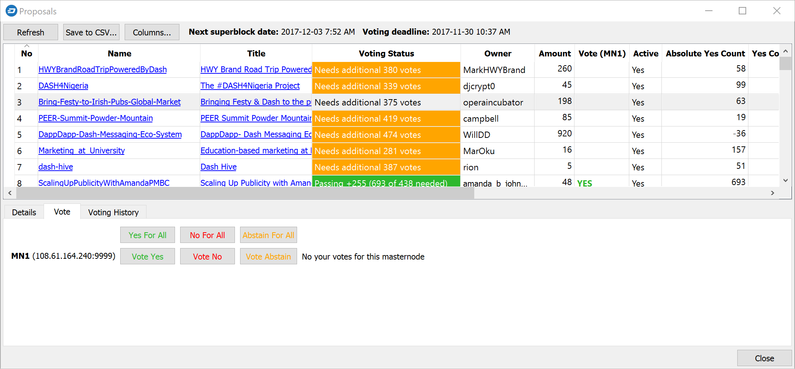
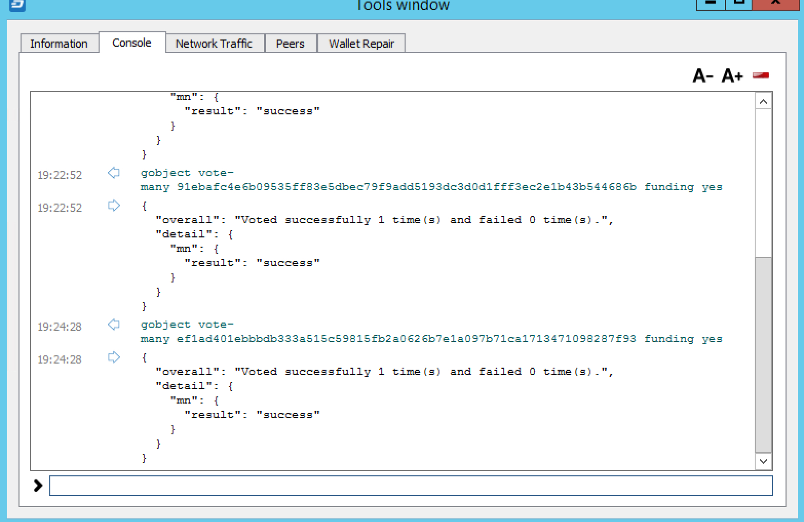

.. _using-governance:

=========================
Using the Dash Governance
=========================

Dash's Decentralized Governance by Blockchain (DGBB) is a novel voting
and funding platform. This documentation introduces and details the
theory and practice to use the system.

Understanding the process
=========================

Introduction
------------

- DGBB consists of three components: Proposals, Votes, and Budgets
- Anyone can submit a proposal for a small fee
- Masternode owners can cast for, against or abstain votes on proposals
- Approved proposals become budgets
- Budgets are paid directly from the blockchain to the proposal owner

Proposals
---------

- Proposals are a request to receive funds
- Proposals can be submitted by anyone for a fee of 5 Dash. The proposal
  fee is irreversibly destroyed on submission.
- Proposals cannot be altered once submitted

Votes
-----

- Votes are cast by masternode owners
- Votes can be changed at any time
- Votes are counted every 16616 blocks (approx. 30.29 days)

Budgets
-------

- Budgets are proposals which receive a net total of yes votes equal to
  or greater than 10% of the total possible votes (for example over 448
  out of 4480)
- Budgets can be nullified at any time if vote totals (cast or re-cast)
  fall below the approval threshold
- Budgets are processed (paid) in order of yes minus no votes. More
  popular budgets get payment priority. 
- Approximately 6176 dash (in 2018) are available for each budget cycle,
  decreasing by 7.14% every 210240 blocks (approx. 383.25 days).

Object structure
----------------

The following information is required to create a proposal:

- proposal-name: a unique label, 20 characters or less
- url: a proposer-created webpage or forum post containing detailed
  proposal information
- payment-count: how many cycles the proposal is requesting payment
- block-start: the requested start of proposal payments
- dash-address: the address to receive proposal payments
- monthly-payment-dash: the requested payment amount

Persistence
-----------

- Proposals become active one day after submission
- Proposals will remain visible on the network until they are either
  disapproved or the proposal's last payment-cycle is reached
- Approval occurs when yes votes minus no votes equals 10% or more of
  the total available votes.
- Disapproval occurs when no votes minus yes votes equals 10% or more of
  the total available votes.
- The total available votes is the count of online and responding
  masternodes and can be seen by running the command 
  ``masternode count`` in the Dash Core wallet debug window. A graph of
  the total masternode count can be found `here 
  <http://178.254.23.111/~pub/masternode_count.png>`__

Templates
---------

The following two Microsoft Word templates are available from Dash Core
Group to help facilitate standardized proposal submission and updates.
Usage is recommended, but not required.

- `Project Proposal Template <https://github.com/dashpay/docs/raw/master/binary/Dash%20Project%20Proposal%20Template%20v1.0.docx>`_
- `Project Status Update Template <https://github.com/dashpay/docs/raw/master/binary/Dash%20Project%20Status%20Update%20Template%20v1.0.docx>`_

.. _budget-cycles:

Budget cycles
=============

When preparing a proposal, be aware of when the next cycle will occur
and plan accordingly. It is recommended to choose your proposal payment
start block at least one cycle in the future to allow time for
discussion and gathering support and votes. Note that votes will no
longer be tallied 1662 blocks (approximately 3 days) prior to the
superblock.

+--------------+-----------------------------+
| Block height | Approximate date            |
+==============+=============================+
| 747720       | Tue Oct 3 20:17:56 UTC 2017 |
+--------------+-----------------------------+
| 764336       | Fri Nov 3 03:22:58 UTC 2017 |
+--------------+-----------------------------+
| 780952       | Sun Dec 3 10:28:00 UTC 2017 |
+--------------+-----------------------------+
| 797568       | Tue Jan 2 17:33:02 UTC 2018 |
+--------------+-----------------------------+
| 814184       | Fri Feb 2 00:38:04 UTC 2018 |
+--------------+-----------------------------+
| 830800       | Sun Mar 4 07:43:06 UTC 2018 |
+--------------+-----------------------------+
| 847416       | Tue Apr 3 14:48:08 UTC 2018 |
+--------------+-----------------------------+
| 864032       | Thu May 3 21:53:10 UTC 2018 |
+--------------+-----------------------------+
| 880648       | Sun Jun 3 04:58:12 UTC 2018 |
+--------------+-----------------------------+
| 897264       | Tue Jul 3 12:03:14 UTC 2018 |
+--------------+-----------------------------+
| 913880       | Thu Aug 2 19:08:16 UTC 2018 |
+--------------+-----------------------------+
| 930496       | Sun Sep 2 02:13:18 UTC 2018 |
+--------------+-----------------------------+
| 947112       | Tue Oct 2 09:18:20 UTC 2018 |
+--------------+-----------------------------+
| 963728       | Thu Nov 1 16:23:22 UTC 2018 |
+--------------+-----------------------------+
| 980344       | Sat Dec 1 23:28:24 UTC 2018 |
+--------------+-----------------------------+
| 996960       | Tue Jan 1 06:33:26 UTC 2019 |
+--------------+-----------------------------+

You can view the source code for this calculation at this
`GitHub gist <https://gist.github.com/strophy/9eb743f7bc717c17a2e776e461f24c49>`_

.. _creating-proposals:

Creating proposals
==================

Once you have prepared the text of your proposal and set up a website or
forum post, it is time to submit your proposal to the blockchain for
voting. While all tasks involved with creating a budget proposal can be
executed from the Dash Core wallet console, several tools providing a
user interface have been developed to simplify this procedure.

Dash Budget Proposal Generator
------------------------------

- https://proposal.dash.org

The `Dash Budget Proposal Generator <https://proposal.dash.org>`__
supports creating budget proposals on both mainnet and testnet. In the
first step, you must enter a short, clear and unique name for the
proposal as it will appear on the blockchain. Proposal names are limited
to 40 characters. You can then provide a link to the forum or
DashCentral where your proposal is described in more detail (use a `URL
shortening service <https://goo.gl>`_ if necessary), as well as select
the amount of payment you are requesting, how often the payment should
occur, and the superblock date on which you are requesting payment. This
allows you to control in which budget period your proposal will appear,
and gives you enough time to build support for your proposal by
familiarising voters with your project. Note that the payment amount is
fixed and cannot be modified after it has been submitted to the
blockchain.

   Steps 1 & 2: Creating your proposal and preparing the command

Next, the proposal generator will provide you with a command to run from
the console of your Dash Core wallet to prepare your budget proposal
governance object. Running this command will cost you 5 DASH, which will
be "burnt" or permanently removed from circulation. This one-time fee
protects the governance system from becoming overwhelmed by spam, poorly
thought out proposals or users not acting in good faith. A small
transaction fee is charged as well, so make sure slightly more than 5
DASH is available in your wallet. Many budget proposals request
reimbursement of the 5 DASH fee.

First unlock your wallet by clicking **Settings > Unlock wallet**, then
open the console by clicking **Tools > Debug console** and paste the
generated command. The transaction ID will appear. Copy and paste this
into the proposal generator response window. As soon as you do this, the
system will show a progress bar as it waits for 6 confirmations as
follows:

   Step 3: Creating the proposal transaction and waiting for 6 
   confirmations of the transaction ID

Once 6 block confirmations exist, another command will appear to submit
the prepared governance object to the network for voting. Copy and paste
this command, and your governance object ID will appear as follows:

.. figure:: img/proposal-submit-console.png
   :width: 250px

   Step 4: Submitting the governance object to the network

You can use this ID to track voting on the proposal until the budget
closes and you receive your payout. You can also submit the ID to
DashCentral to claim your proposal and enable simpified voting for
masternodes using DashCentral voting services.

DashCentral Proposal Generator
------------------------------

- https://www.dashcentral.org/budget/create

DashCentral also includes a tool to create budget proposals, or claim
existing proposals so you can add a description on DashCentral and begin
discussion with the community. The steps to be taken are almost
identical to the procedure described above, and documentation is
available `here <https://www.dashcentral.org/about/contact>`_.

Voting on proposals
===================

**You must vote at least three days before the superblock is created or
your vote will not be counted. The exact deadline is 1662 blocks before
the superblock.**

Note that if you do not operate a masternode, you may still be able to
vote on DashBoost proposals. See https://www.dashboost.org for more
information.

Voting on DGBB proposals is an important part of operating a masternode.
Since masternodes are heavily invested in Dash, they are expected to
critically appraise proposals each month and vote in a manner they
perceive to be consistent with the best interests of the network. Each
masternode may vote once on each proposal, and the vote can be changed
at any time before the voting deadline. The following sites and tools
are available to view and manage proposals and voting:

- `DashCentral <https://www.dashcentral.org/budget>`__
- `Dash Budget Proposal Vote Tracker <https://dashvotetracker.com/>`__
- `Dash Ninja - Governance <https://www.dashninja.pl/governance.html>`__
- `Dash Masternode Tool - Proposals <https://github.com/Bertrand256/dash-masternode-tool/releases>`__

For information on how to create a proposal, see :ref:`here
<creating-proposals>`.

DashCentral
-----------

Many masternode operators store their password-protected masternode
private key on `DashCentral <https://www.dashcentral.org>`__ to enable
simple voting with a user-friendly interface. The popularity of this
site has made it a common place for discussion of the proposals after
they are submitted to the governance system. To vote from the
DashCentral web interface, first add your masternode private key to your
account according to the instructions here. Note that the masternode
private key is not the same as the private key controlling the 1000 DASH
collateral, so there is no risk of losing your collateral. A separate
password is required to unlock the masternode private key for voting, so
the risk of the site operator voting in your name is minimal.

When you are ready to vote, go to the `budget proposals page
<https://www.dashcentral.org/budget>`_. Simply click to view the
proposals, then click either **Vote YES**, **Vote ABSTAIN** or **Vote
NO**.

   Voting interface on DashCentral

Dash Masternode Tool (DMT)
--------------------------

If you started your masternode from a hardware wallet using `DMT
<https://github.com/Bertrand256/dash-masternode-tool/releases>`_, you
can also use the tool to cast votes. Click **Tools > Proposals** and
wait for the list of proposals to load. You can easily see the voting
status of each proposal, and selecting a proposal shows details on the
**Details** tab in the lower half of the window. Switch to the **Vote**
tab to **Vote Yes**, **Vote No** or **Vote Abstain** directly from DMT.

   Voting interface in DMT

Dash Core wallet or masternode
------------------------------

If you started your masternode using the Dash Core Wallet (not
recommended), you can vote manually from **Tools > Debug console**, or
directly from your masternode via SSH using ``dash-cli``. First click on
the proposal you want to vote on at either `DashCentral
<https://www.dashcentral.org/budget>`__ or `Dash Ninja
<https://www.dashninja.pl/governance.html>`__. You will see a command
for manual voting below the proposal description. Copy and paste the
command and modify it as necessary. As an example, take this proposal
from `Dash Ninja
<https://www.dashninja.pl/proposaldetails.html?proposalhash=6ed741
8455e07f4b30b99f0d4a24a2b83282e12b26fe3415673ecbea04ff6c9d>`__ (or
`DashCentral
<https://www.dashcentral.org/p/ScalingUpPublicityWithAmandaPMBC>`__).
The voting code for Dash Core Wallet is as follows::

  gobject vote-many 6ed7418455e07f4b30b99f0d4a24a2b83282e12b26fe3415673ecbea04ff6c9d funding yes
  gobject vote-many 6ed7418455e07f4b30b99f0d4a24a2b83282e12b26fe3415673ecbea04ff6c9d funding no
  gobject vote-many 6ed7418455e07f4b30b99f0d4a24a2b83282e12b26fe3415673ecbea04ff6c9d funding abstain

Note that to vote from your masternode directly, you need to prefix the
command with ``dash-cli``, which is usually found in the ``.dashcore``
folder. The command should be similar to the following::

  ~/.dashcore/dash-cli gobject vote-many 6ed7418455e07f4b30b99f0d4a24a2b83282e12b26fe3415673ecbea04ff6c9d funding yes
  ~/.dashcore/dash-cli gobject vote-many 6ed7418455e07f4b30b99f0d4a24a2b83282e12b26fe3415673ecbea04ff6c9d funding no
  ~/.dashcore/dash-cli gobject vote-many 6ed7418455e07f4b30b99f0d4a24a2b83282e12b26fe3415673ecbea04ff6c9d funding abstain

Note this command will trigger a vote from all masternodes configured in
``dash.conf``. If you have multiple masternodes each with its own .conf
file, or if you want to vote with only some of your masternodes, you
must change the command from ``vote-many`` to ``vote``. If your vote was
successful, you should see a confirmation message reading **Voted
successfully**.

   Voting from the debug console in Dash Core Wallet

You can also view a list of proposals in JSON format from the console to
copy and paste the proposal hash for voting as follows::

  gobject list
