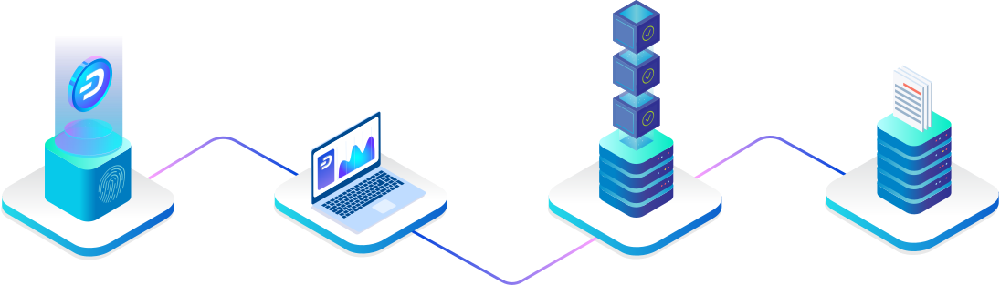

:html_theme.sidebar_secondary.remove:

.. meta::
   :description: The Dash Documentation offers information and guides on Dash, the open source peer-to-peer cryptocurrency with a strong focus on the payments industry. 
   :keywords: dash, cryptocurrency, blockchain, documentation, guide, masternodes, mining, wallets, merchants, governance, instantsend, coinjoin, x11, instant, private, secure, digital cash

==================
Dash Documentation
==================

Dash aims to be the most user-friendly and scalable payments-focused
cryptocurrency in the world. The Dash network features :ref:`instant
transaction confirmation <instantsend>`, double spend protection,
optional :ref:`privacy <coinjoin>` equal to that of physical cash, a
:ref:`self-governing, self-funding model <decentralized-governance>` 
driven by :ref:`incentivized full nodes <masternode-network>` and a 
`clear roadmap <https://www.dash.org/roadmap/>`_ for on-chain scaling to
up to 400MB blocks using custom-developed open source hardware. While
Dash is based on Bitcoin and compatible with many key components of the
Bitcoin ecosystem, its two-tier network structure offers significant
improvements in transaction speed, privacy and governance. This section
of the documentation describes these and many more key features that set
Dash apart in the blockchain economy.

Check out the `official Dash website <https://www.dash.org/>`__ to learn
how `individuals <https://www.dash.org/individuals/>`__ and `businesses
<https://www.dash.org/businesses/>`__ can use Dash. The videos, links
and documentation collected here can help you get started. New
users may be interested in getting started with an appropriate
:ref:`wallet <wallets>`, learning about :ref:`how to buy Dash
<how-to-buy>` and :ref:`where to spend Dash <earning-spending>`, 
learning about :ref:`safety <safety>` or joining one of the many 
:ref:`Dash community sites <information>`.

.. toctree::
   :hidden:
   :maxdepth: 3
   
   docs/user/index
