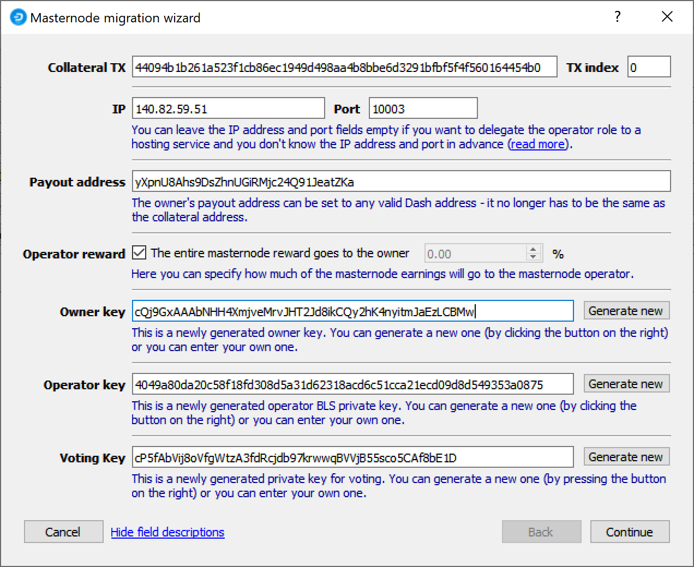
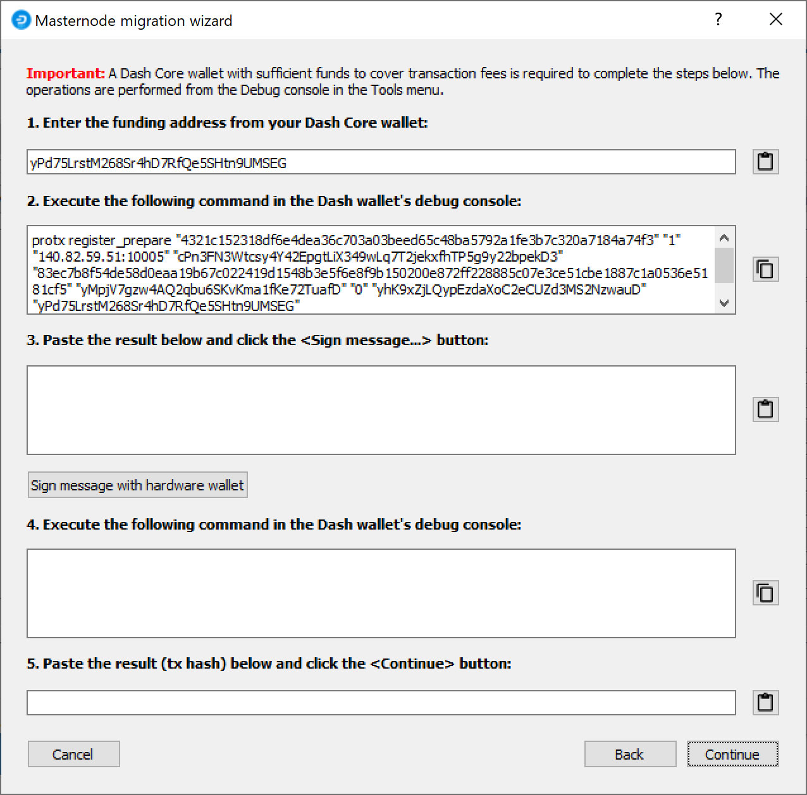

.. meta::
   :description: The upgrade to Dash 0.13.0 involves changes to signature formats as defined in DIP3. This documentation walks you through the upgrade process.
   :keywords: dash, cryptocurrency, masternode, maintenance, dip3, upgrade, deterministic, dmt

.. _dip3-upgrade:

===========================
Dash 0.13 Upgrade Procedure
===========================

Dash 0.13.0 implements DIP003, which introduces several changes to how a
Dash masternode is set up and operated. A list of available
documentation appears below:

- `DIP003 Deterministic Masternode Lists <https://github.com/dashpay/dips/blob/master/dip-0003.md>`__
- :ref:`dip3-changes`
- :ref:`dip3-upgrade` (you are here)
- :ref:`Full masternode setup guide <masternode-setup>`
- :ref:`Information for users of hosted masternodes <hosted-setup>`
- :ref:`Information for operators of hosted masternodes <operator-transactions>`

It is highly recommended to first read at least the list of changes
before continuing in order to familiarize yourself with the new concepts
in DIP003. This documentation describes the upgrade procedure in two steps:

1. :ref:`Update the masternode software <masternode-dip3-update>`
2. Register the DIP003 masternode

   - :ref:`From a hardware wallet <dmt-dip3-upgrade>`
   - :ref:`From the Dash Core wallet <dashcore-dip3-upgrade>`

Step 1 should be done immediately as soon as Dash 0.13.0 is released.
Once miners have updated and DIP003 has activated on the network, it
will become possible to complete Step 2 and register a DIP003
masternode. After enough masternodes have completed this step, Spork 15
will be enabled and all new network functions will take effect.

.. _masternode-dip3-update:

Masternode Software Update
==========================

Begin by updating the Dash software on your masternode. Depending on
whether you installed Dash manually or using dashman, you must follow
the procedure appropriate for your masternode, as described below.

Option 1: Updating from dashman
-------------------------------

To update Dash using dashman, log in to your server and enter the
following commands::

  ~/dashman/dashman sync
  ~/dashman/dashman update

Check the status of your masternode::

  ~/dashman/dashman status

The Dash software on the masternode is now updated. Since Dash 0.13 also
updates the protocol version, it is necessary to issue a ``masternode start`` 
from Dash Core or DMT command to keep your masternode in the payment
list during the transition period. See the `0.12.3 documentation
<https://docs.dash.org/en/0.12.3/masternodes/setup.html#start-your-masternode>`__ 
for more details.

Option 2: Manual update
-----------------------

To update Dash manually, log in to your server using ssh or PuTTY. If
your crontab contains an entry to automatically restart dashd, invoke
``crontab -e`` and comment out the appropriate line by adding the ``#``
character. It should look something like this::

  # * * * * * pidof dashd || ~/.dashcore/dashd

Then stop Dash running::

  ~/.dashcore/dash-cli stop

Visit the `GitHub releases page
<https://github.com/dashpay/dash/releases>`_ and copy the link to the
latest x86_64-linux-gnu version. Go back to your terminal window and
enter the following command, pasting in the address to the latest
version of Dash Core by right clicking or pressing **Ctrl + V**::

  cd /tmp
  wget https://github.com/dashpay/dash/releases/download/v0.13.0.0-rc10/dashcore-0.13.0.0-rc10-x86_64-linux-gnu.tar.gz

Verify the integrity of your download by running the following command
and comparing the output against the value for the file as shown in the
``SHA256SUMS.asc`` file::

  sha256sum dashcore-0.13.0.0-rc10-x86_64-linux-gnu.tar.gz

Extract the compressed archive and copy the new files to the directory::

  tar xfv dashcore-0.13.0.0-rc10-x86_64-linux-gnu.tar.gz
  cp -f dashcore-0.13.0/bin/dashd ~/.dashcore/
  cp -f dashcore-0.13.0/bin/dash-cli ~/.dashcore/

Restart Dash::

  ~/.dashcore/dashd

You will see a message reading "Dash Core server starting". We will now
update Sentinel::

  cd ~/.dashcore/sentinel/
  git checkout master
  git pull

Finally, uncomment the line to automatically restart Dash in your
crontab by invoking ``crontab -e`` again and deleting the ``#``
character.

The Dash software on the masternode is now updated. Since Dash 0.13 also
updates the protocol version, it is necessary to issue a ``masternode start`` 
from Dash Core or DMT command to keep your masternode in the payment
list during the transition period. See the `0.12.3 documentation
<https://docs.dash.org/en/0.12.3/masternodes/setup.html#start-your-masternode>`__ 
for more details.

.. _dmt-dip3-upgrade:

Masternode Registration from DMT
================================

This documentation describes the procedure to register an existing
masternode for the DIP003 masternode list if the collateral is held on a
hardware wallet. DIP003 must be activated and DMT 0.9.21 or higher is
required. You can update DMT by downloading the version appropriate for
your system from the `DMT Releases page <https://github.com/Bertrand256/dash-masternode-tool/releases>`__. 
Open DMT and ensure your existing masternode configuration appears.

Configuration
-------------

Click the **Send ProRegTx** button to get started. The **Masternode
migration wizard** appears.

   The DMT Masternode migration wizard

All fields are prefilled with suggested values. 

- It should not be necessary to change the **Collateral Tx** or
  **IP/Port** fields if you are using your existing collateral and server.
- You can optionally modify the **Payout address** to any valid existing
  or new Dash address, since it is no longer mandatory to receive payouts
  at the collateral address. 
- If your masternode is hosted by an external operator, you can specify
  the percentage of the reward to allocate to the operator in the
  **Operator reward** field.
- The three masternode keys (owner, operator, voting) are newly 
  generated and do not need to be changed.

Click **Next** when you are ready to continue. DMT will verify the
collateral is in place and prepare to create the ProRegTx special
transaction to register the masternode on the blockchain. This command
must be sent from a Dash Core wallet holding a balance, since a standard
transaction fee is involved. You can choose to send this from the DMT
developer's remote RPC node (**automatic method**), or use your own Dash
Core wallet to submit the transaction (**manual method**). Click
**Continue** when you are ready.

Option 1: Automatic method
--------------------------

Note that because Trezor does not yet support Dash `special transactions
<https://github.com/dashpay/dips/blob/master/dip-0002.md>`__, it is
necessary to transmit your owner private key (NOT the collateral private
key) to the remote server to sign the registration transaction. Only use
the automatic method if you are connected to your own Dash RPC client,
or if you trust the operator of the node. You can see the name of the
node you are connected to in the lower right corner of the main DMT
window. The default nodes in DMT (named ``alice``, ``luna`` and
``suzy``) are maintained by the author of DMT, who has kindly offered to
cover the transaction fees for the DIP003 upgrade.

DMT will prepare a ProTx message and prompt you to confirm signing the
message on your hardware wallet. The signed message will be registered
on the blockchain immediately. A window appears with the final
configuration information. Click **Save to a file** and enter a new file
name. This file contains various private and public keys related to the
ownership, operation and voting for the masternode, so keep it in a
secure location. Continue below with the :ref:`final step 
<DMT-enter-BLS>` of entering the BLS key on the masternode.

Option 2: Manual method
-----------------------

The following window appears:

   Manual registration commands in the DMT Masternode migration wizard

Open Dash Core, wait for the blockchain to synchronise and then click
**Tools -> Debug console**. Complete the following steps:

1. Copy and paste the command from Step 1 into the Dash Core debug
   console and press **Enter**.
2. Copy and paste the output back into the Step 2 field of the DMT
   Masternode migration wizard.
3. Click **Sign message with hardware wallet** and confirm signing the
   message on your hardware wallet.
4. Copy and paste the command from Step 3 into the Dash Core debug
   console and press **Enter**. Dash Core will create a registration
   transaction on the blockchain.
5. Copy and paste the transaction hash back into the Step 4 field of the
   DMT Masternode migration wizard and click **Continue**.

A window appears with the final configuration information. Click **Save
to a file** and enter a new file name. This file contains various
private and public keys related to the ownership, operation and voting
for the masternode, so keep it in a secure location.

.. _DMT-enter-BLS:

Enter the BLS key on the masternode
-----------------------------------

Finally, it is necessary to enter the BLS private key generated by DMT
on the masternode itself, or send it to your hosting operator. If you
are operating the masternode yourself, log in to your masternode using
``ssh`` or PuTTY and edit the configuration file on your masternode as
follows::

  nano ~/.dashcore/dash.conf

The editor appears with the existing masternode configuration. Add this
line to the end of the file, replacing the key with your BLS secret key
generated above::

  masternodeblsprivkey=6708c32427c464fc360d76d36b73585b158b46a1f2e24dfce19db4f48d47270b

Press enter to make sure there is a blank line at the end of the file,
then press **Ctrl + X** to close the editor and **Y** and **Enter** save
the file. We now need to restart the masternode for this change to take
effect. Enter the following commands, waiting a few seconds in between
to give Dash Core time to shut down::

  ~/.dashcore/dash-cli stop
  ~/.dashcore/dashd

Your masternode is now upgraded to DIP003 and will appear on the
Deterministic Masternode List. You can view this list on the
**Masternodes -> DIP3 Masternodes** tab of the Dash Core wallet, or in
the console using the command ``protx list valid``, where the txid of
the final transaction in Step 5 identifies your DIP003 masternode. Note
again that all functions related to DIP003 will only take effect once
Spork 15 is enabled on the network. You can view the spork status using
the ``spork active`` command.

.. _dashcore-dip3-upgrade:

Masternode Registration from Dash Core
======================================

This documentation describes the procedure to register an existing
masternode for the DIP003 masternode list if the collateral is held in
the Dash Core software full wallet. DIP003 must be activated. The
commands are shown as if they were entered in the Dash Core GUI by
opening the console from Tools > Debug console, but the same result can
be achieved on a masternode by entering the same commands and adding the
prefix  ``~/.dashcore/dash-cli`` to each command.

Generate a BLS key pair
-----------------------

A public/private BLS key pair is required for the operator of the
masternode. If you are using a hosting service, they will provide you
with their public key, and you can skip this step. If you are hosting
your own masternode, generate a BLS public/private keypair as follows::

  bls generate

  {
    "secret": "565950700d7bdc6a9dbc9963920bc756551b02de6e4711eff9ba6d4af59c0101",
    "public": "01d2c43f022eeceaaf09532d84350feb49d7e72c183e56737c816076d0e803d4f86036bd4151160f5732ab4a461bd127"
  }

**These keys are NOT stored by the wallet and must be kept secure,
similar to the value provided in the past by the** ``masternode genkey``
**command.** 

Add the private key to your masternode configuration
----------------------------------------------------

The public key will be used in following steps. The BLS secret key must
be entered in the ``dash.conf`` file on the masternode. This allows the
masternode to watch the blockchain for relevant Pro*Tx transactions, and
will cause it to start serving as a masternode when the signed ProRegTx
is broadcast by the owner (final step below). Log in to your masternode
using ``ssh`` or PuTTY and edit the configuration file on your 
masternode as follows::

  nano ~/.dashcore/dash.conf

The editor appears with the existing masternode configuration. Add this
line to the end of the file, replacing the key with your BLS secret key
generated above::

  masternodeblsprivkey=565950700d7bdc6a9dbc9963920bc756551b02de6e4711eff9ba6d4af59c0101

Press enter to make sure there is a blank line at the end of the file,
then press **Ctrl + X** to close the editor and **Y** and **Enter** save
the file. We now need to restart the masternode for this change to take
effect. Enter the following commands, waiting a few seconds in between
to give Dash Core time to shut down::

  ~/.dashcore/dash-cli stop
  ~/.dashcore/dashd

We will now prepare the transaction used to register a DIP003 masternode
on the network.

Prepare a ProRegTx transaction
------------------------------

First, we need to get a new, unused address from the wallet to serve as
the owner address. This is different to the collateral address. It must
also be used as the voting address if Spork 15 is not yet active.
Generate a new address as follows::

  getnewaddress

  yc98KR6YQRo1qZVBhp2ZwuiNM7hcrMfGfz

Then either generate or choose an existing second address to receive the
owner's masternode payouts::

  getnewaddress

  ycBFJGv7V95aSs6XvMewFyp1AMngeRHBwy

Next, we will prepare an unsigned ProRegTx special transaction using the
``protx register_prepare`` command. This command has the following
syntax::

  protx register_prepare collateralHash collateralIndex ipAndPort ownerKeyAddr 
    operatorPubKey votingKeyAddr operatorReward payoutAddress (feeSourceAddress)

Open a text editor such as notepad to prepare this command. Replace each
argument to the command as follows:

- ``collateralHash``: The txid of the 1000 Dash collateral funding 
  transaction
- ``collateralIndex``: The output index of the 1000 Dash funding 
  transaction
- ``ipAndPort``: Masternode IP address and port, in the format 
  ``x.x.x.x:yyyy``
- ``ownerKeyAddr``: The new Dash address generated above for the 
  owner/voting address
- ``operatorPubKey``: The BLS public key generated above (or provided 
  by your hosting service)
- ``votingKeyAddr``: The new Dash address generated above, or the 
  address of a delegate, used for proposal voting
- ``operatorReward``: The percentage of the block reward allocated to 
  the operator as payment
- ``payoutAddress``: A new or existing Dash address to receive the 
  owner's masternode rewards
- ``feeSourceAddress``: An (optional) address used to fund ProTx fee. 
  ``payoutAddress`` will be used if not specified.
  
Note that the operator is responsible for :ref:`specifying their own
reward <dip3-update-service>` address in a separate ``update_service``
transaction if you specify a non-zero ``operatorReward``. The owner of
the masternode collateral does not specify the operator's payout
address.

Example (remove line breaks if copying)::

  protx register_prepare
    2c499e3862e5aa5f220278f42f9dfac32566d50f1e70ae0585dd13290227fdc7
    1
    140.82.59.51:19999
    yc98KR6YQRo1qZVBhp2ZwuiNM7hcrMfGfz
    01d2c43f022eeceaaf09532d84350feb49d7e72c183e56737c816076d0e803d4f86036bd4151160f5732ab4a461bd127
    yc98KR6YQRo1qZVBhp2ZwuiNM7hcrMfGfz
    0
    ycBFJGv7V95aSs6XvMewFyp1AMngeRHBwy

Output::

  {
    "tx": "030001000191def1f8bb265861f92e9984ac25c5142ebeda44901334e304c447dad5adf6070000000000feffffff0121dff505000000001976a9149e2deda2452b57e999685cb7dabdd6f4c3937f0788ac00000000d1010000000000c7fd27022913dd8505ae701e0fd56625c3fa9d2ff47802225faae562389e492c0100000000000000000000000000ffff8c523b334e1fad8e6259e14db7d05431ef4333d94b70df1391c601d2c43f022eeceaaf09532d84350feb49d7e72c183e56737c816076d0e803d4f86036bd4151160f5732ab4a461bd127ad8e6259e14db7d05431ef4333d94b70df1391c600001976a914adf50b01774202a184a2c7150593442b89c212e788acf8d42b331ae7a29076b464e61fdbcfc0b13f611d3d7f88bbe066e6ebabdfab7700",
    "collateralAddress": "yPd75LrstM268Sr4hD7RfQe5SHtn9UMSEG",
    "signMessage": "ycBFJGv7V95aSs6XvMewFyp1AMngeRHBwy|0|yc98KR6YQRo1qZVBhp2ZwuiNM7hcrMfGfz|yc98KR6YQRo1qZVBhp2ZwuiNM7hcrMfGfz|54e34b8b996839c32f91e28a9e5806ec5ba5a1dadcffe47719f5b808219acf84"
  }

Next we will use the ``collateralAddress`` and ``signMessage`` fields to
sign the transaction, and the output of the ``tx`` field to submit the
transaction.

Sign the ProRegTx transaction
-----------------------------

Now we will sign the content of the ``signMessage`` field using the
private key for the collateral address as specified in
``collateralAddress``. Note that no internet connection is required for
this step, meaning that the wallet can remain disconnected from the
internet in cold storage to sign the message. In this example we will
again use Dash Core, but it is equally possible to use the signing
function of a hardware wallet. The command takes the following syntax::

  signmessage address message

Example::

  signmessage yPd75LrstM268Sr4hD7RfQe5SHtn9UMSEG ycBFJGv7V95aSs6XvMewFyp1AMngeRHBwy|0|yc98KR6YQRo1qZVBhp2ZwuiNM7hcrMfGfz|yc98KR6YQRo1qZVBhp2ZwuiNM7hcrMfGfz|54e34b8b996839c32f91e28a9e5806ec5ba5a1dadcffe47719f5b808219acf84

Output::

  IMf5P6WT60E+QcA5+ixors38umHuhTxx6TNHMsf9gLTIPcpilXkm1jDglMpK+JND0W3k/Z+NzEWUxvRy71NEDns=

Submit the signed message
-------------------------

We will now create the ProRegTx special transaction to register the
masternode on the blockchain. This command must be sent from a Dash Core
wallet holding a balance, since a standard transaction fee is involved.
The command takes the following syntax::

  protx register_submit tx sig

Where: 

- ``tx``: The serialized transaction previously returned in the ``tx`` 
  output field from ``protx register_prepare`` in Step 2
- ``sig``: The message signed with the collateral key from Step 3

Example::

  protx register_submit 030001000191def1f8bb265861f92e9984ac25c5142ebeda44901334e304c447dad5adf6070000000000feffffff0121dff505000000001976a9149e2deda2452b57e999685cb7dabdd6f4c3937f0788ac00000000d1010000000000c7fd27022913dd8505ae701e0fd56625c3fa9d2ff47802225faae562389e492c0100000000000000000000000000ffff8c523b334e1fad8e6259e14db7d05431ef4333d94b70df1391c601d2c43f022eeceaaf09532d84350feb49d7e72c183e56737c816076d0e803d4f86036bd4151160f5732ab4a461bd127ad8e6259e14db7d05431ef4333d94b70df1391c600001976a914adf50b01774202a184a2c7150593442b89c212e788acf8d42b331ae7a29076b464e61fdbcfc0b13f611d3d7f88bbe066e6ebabdfab7700 IMf5P6WT60E+QcA5+ixors38umHuhTxx6TNHMsf9gLTIPcpilXkm1jDglMpK+JND0W3k/Z+NzEWUxvRy71NEDns=

Output::

  9f5ec7540baeefc4b7581d88d236792851f26b4b754684a31ee35d09bdfb7fb6

Your masternode is now upgraded to DIP003 and will appear on the
Deterministic Masternode List after the transaction is mined to a block.
You can view this list on the **Masternodes -> DIP3 Masternodes** tab of
the Dash Core wallet, or in the console using the command ``protx list
valid``, where the txid of the final ``protx register_submit``
transaction identifies your DIP003 masternode. Note again that all
functions related to DIP003 will only take effect once Spork 15 is enabled
on the network. You can view the spork status using the ``spork active``
command.
