.. meta::
   :description: Maintaining a Dash masternode involves staying up to date with the latest version, voting and handling payments
   :keywords: dash, cryptocurrency, masternode, maintenance, maintain, payments, withdrawal, voting, monitoring

.. _masternode-maintenance:

===========
Maintenance
===========

Masternodes require regular maintenance to ensure you do not drop off
the payment queue. This includes promptly installing updates to Dash, as
well as maintaining the security and performance of the server. In
addition, masternodes should vote on proposals and perform other tasks
in the interest of the network and the value of the Dash they hold.

.. _masternode-update:

Updating masternodes
====================

Periodically, the Dash Core development team will release updates to
Dash. Since normal nodes rely on them for services and copies of the
blockchain, masternodes are expected to update to new versions of Dash.
In some cases, hardware upgrades may also be necessary. Not updating
will eventually result in your masternode being removed from the payment
queue by the Proof of Service (PoSe) system. If you run a hosted
masternode, your hosting operator will take care of updates for you. If
not, the method of updating depends on how you installed Dash.

Minor version updates to Dash (e.g. from 0.12.3.1 to 0.12.3.2) do not
make changes to the protocol version, while major version updates (e.g.
from 0.12.2.3 to 0.12.3.0) will usually increase the network protocol
version. If the protocol version did not change, you DO NOT need to
restart your masternode if you complete the update within 60 minutes. If
the protocol version did change, you must issue a start command from
your wallet. Do not send start commands to your masternode if not
necessary, as it will send you to the back of the payment queue.

.. _deterministic_upgrade

Dsah 0.13 Upgrade Procedure
---------------------------

Dash 0.13.0 introduced `Deterministic Masternode Lists
<https://github.com/dashpay/dips/blob/master/dip-0003.md>`_, a new
method of finding consensus on the list of valid masternodes. Due to the
deep underlying changes and new signature formats involved, the
instructions on how to set up a masternode have changed as well. This
documentation describes how to upgrade a masternode from Dash 0.12.3 to
Dash 0.13.0 without moving your collateral. The procedure involves four
major steps: 

1. Generating a BLS key pair
2. Preparing a ProRegTx transaction
3. Signing the ProRegTx transaction
4. Submitting the signed message

Steps 1, 2 and 4 can be carried out either on your masternode or in the
Dash Core wallet. Signing the transaction in step 3 must be done using
the wallet holding the private key to the 1000 Dash collateral. This
documentation describes the commands as if they were entered in Dash
Core by opening the console from **Tools > Debug console**, but the same
result can be achieved on a masternode by entering the same commands and
adding the prefix ``~/.dashcore/dash-cli`` to each command.

Begin by logging in to your masternode using ssh or PuTTY. A
public/private BLS key pair is required for the operator of the
masternode. If you are using a hosting service, they will provide you
with their public key, and you can skip this step. If you are hosting
your own masternode, generate a BLS public/private keypair as follows::

  bls generate

  {
  "secret": "2dbc0abdd52467569e4e74db61406b32c8ce41f38e5919ab0ee5596dc4b384cf",
  "public": "84d8468dd9b495443ae9d0e12e608229111edf5ea94d52deb1623716566444425a3deb4a0fa09477e5eafb8fc94a2384"
  }

The public key will be used in following steps. The secret key must be
kept secure since it is used to sign operator-related masternode
messages and update operator-related masternode parameters (e.g. IP
Address, Port). **These keys are NOT stored by the wallet and must be
backed up, similar to the value provided in the past by the ``masternode
genkey`` command.**

Next, we will prepare an unsigned ProRegTx special transaction using the
``protx register_prepare`` command. This command has the following
syntax::

  protx register_prepare "collateralHash" collateralIndex "ipAndPort" "ownerKeyAddr" 
    "operatorKeyAddr" "votingKeyAddr" operatorReward "payoutAddress"

Open a text editor such as notepad to prepare this command. Replace each
argument to the command as follows:

- ``"collateralHash"``: The txid of the 1000 Dash collateral funding transaction
- ``collateralIndex``: The output index of the 1000 Dash funding transaction
- ``"ipAndPort"``: Masternode IP address and port, in the format ``x.x.x.x:yyyy``
- ``"ownerKeyAddr"``: The Dash address holding the 1000 Dash collateral
- ``"operatorKeyAddr"``: The BLS public key generated above (or provided by your hosting service)
- ``"votingKeyAddr"``: A Dash address used for proposal voting (can be the same as ``ownerKeyAddr``)
- ``operatorReward``: The percentage of the block reward allocated to the operator as payment
- ``"payoutAddress"``: A Dash address to receive the masternode rewards (can be different to the collateral address)

Begin by generating 

First we need to stop Dash running::

  ~/.dashcore/dash-cli stop

To manually download and install the components of your Dash masternode,
visit https://www.dash.org/wallets/ on your computer to find the link to
the latest Dash Core wallet. Click **Linux**, then right-click on
**Download TGZ** for **Dash Core Linux 64 Bit** and select **Copy link
address**. Go back to your terminal window and enter the following
command, pasting in the address to the latest version of Dash Core by
right clicking or pressing **Ctrl + V**::

  cd ~
  wget https://github.com/dashpay/dash/releases/download/v0.12.3.3/dashcore-0.12.3.3-x86_64-linux-gnu.tar.gz

Verify the integrity of your download by running the following command
and comparing the output against the value for the file as shown on the
Dash website under **Hash File**::

  sha256sum dashcore-0.12.3.3-x86_64-linux-gnu.tar.gz

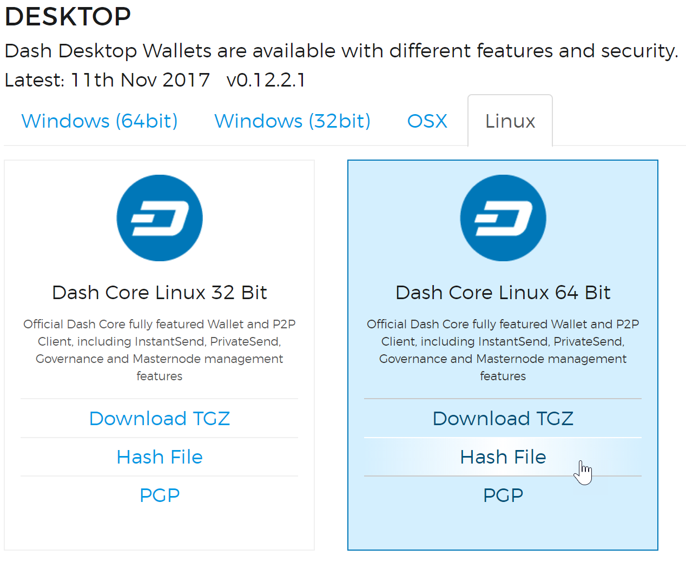

   Link to the hash file to verify download integrity

Remove the old binaries from the working directory, extract the
compressed archive, copy the new files to the directory and set them as
executable::

  rm ~/.dashcore/dashd
  rm ~/.dashcore/dash-cli
  tar xfvz dashcore-0.12.3.3-x86_64-linux-gnu.tar.gz
  cp dashcore-0.12.3/bin/dashd ~/.dashcore/
  cp dashcore-0.12.3/bin/dash-cli ~/.dashcore/

Clean up unneeded files::

  rm dashcore-0.12.3.3-x86_64-linux-gnu.tar.gz
  rm -r dashcore-0.12.3/

Restart Dash::

  ~/.dashcore/dashd

You will see a message reading "Dash Core server starting". We will now
update Sentinel::

  cd ~/.dashcore/sentinel/
  git pull

If the protocol version changed during this update, you will need to
issue a start command from your wallet. If you are using a hardware
wallet, you can issue the start command by simply clicking the button in
DMT. If you are using Dash Core wallet, update it to the latest version,
then open the debug console and enter this command, where MN1 is the
alias for your masternode::

  masternode start-alias MN1

Monitor the status of your masternode as it starts up::

  ~/.dashcore/dash-cli getblockcount
  ~/.dashcore/dash-cli getnetworkinfo
  ~/.dashcore/dash-cli mnsync status
  ~/.dashcore/dash-cli masternode status

In particular, the last command should return the status **Masternode
successfully started**. If you see an error similar to **Invalid
protocol version**, then the protocol version has changed and you must
send a start command from your wallet again. You can also monitor the
status of your masternode from Sentinel. If Sentinel detects a
functioning masternode, the following command should return nothing::

  cd ~/.dashcore/sentinel
  venv/bin/python bin/sentinel.py

Finally, you can check for your masternode by its collateral address
using `DashNinja <https://www.dashninja.pl/>`_, or search the consensus
list of masternodes using this command and entering your masternode IP
address::

  ~/.dashcore/dash-cli masternode list full | grep <your ip address>

Updating from dashman
---------------------

Versions of Dash prior to 0.13.0 frequently used a tool called
``dashman`` by community member moocowmoo to install Dash. This tool has
been deprecated until it is updated. You can follow the instructions
below to upgrade your system::

**OBSOLETE**

To update Dash using dashman, log in to your server and enter the
following commands::

  ~/dashman/dashman sync
  ~/dashman/dashman update

Check the status of your masternode::

  ~/dashman/dashman status

If you are doing a major version update and need to restart your
masternode, update the software version of the wallet holding the
collateral to the latest version now by following the instructions
:ref:`here <masternode-setup-start>`. Continue monitoring your
masternode. After some time, all statuses should turn green, in
particular **masternode started: YES** and **masternode network state:
ENABLED**.

.. _masternode-withdrawals:

Payment withdrawals
===================

Once your masternode has been accepted by the network, it will enter the
masternode payment queue and slowly begin moving up. A masternode within
the top 10% of the list is selected and receives a payment each time a
new Dash block is mined. For more details on this process, see here.
These payments are sent to the same address you used to start your
masternode, which means you need to be careful when withdrawing the
payments. The original 1000 DASH payment you used to start your
masternode must remain untouched in a single unspent transaction output
(utxo) or your masternode will drop off the payment list - you may have
seen this ID when preparing to send the start masternode command.
Payments appear in separate UTXOs, so we need a method of only spending
those UTXOs and not the one containing the 1000 DASH. Note that
masternode payouts can only be spent after 100 confirmations.

Option 1: Withdrawals using a hardware wallet
---------------------------------------------

If you used a hardware wallet such as Trezor to start your masternode,
you must also use this process to make payout withdrawals. Once again,
we will be using Bertrand256's Dash Masternode Tool (DMT) to select the
correct outputs. With DMT, we can select specific UTXOs to withdraw the
payments without touching the original collateral transaction. This is
not possible using the Trezor web wallet alone.

Open DMT and verify the RPC and HW connections are working. From the
**Tools** menu, select **Transfer funds from current masternode's
address** or **Transfer funds from all masternode's addresses**, if you
use DMT to control multiple masternodes.

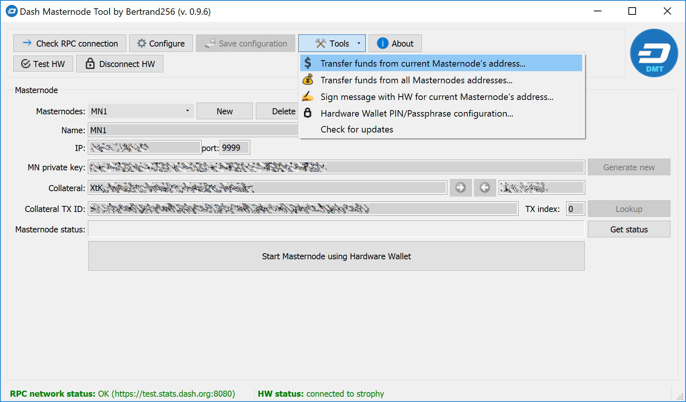

   Selecting the transfer funds function in DMT

DMT will load for a moment, then display a window showing the available
UTXOs you can use in your withdrawal. By default, all UTXOs not used as
masternode collateral are checked. The masternode collateral UTXOs are
not only unchecked but also hidden in order to avoid unintentionally
sending funds associated with collateral and stopping your masternode.
You can show these hidden entries by unchecking the **Hide collateral
utxos** option. Enter your destination address for the transaction. The
window should appear as follows:

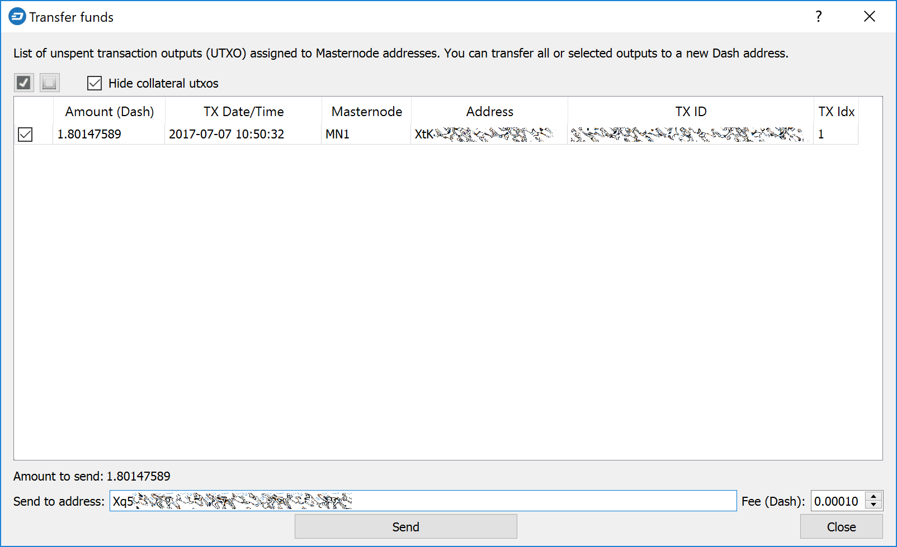

   Selecting the UTXOs to use as inputs in the withdrawal transaction

Verify the transaction fee and click **Send**. Your Trezor will prompt
to enter your PIN and confirm the transaction on the device. Once this
is done, confirm one more time to DMT that you want to broadcast the
transaction to the network by clicking Yes. A confirmation with the
transaction ID will appear.

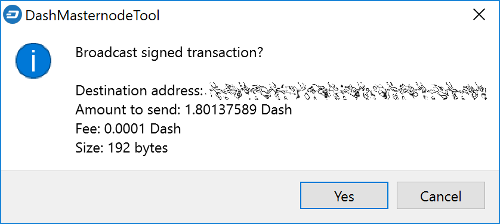

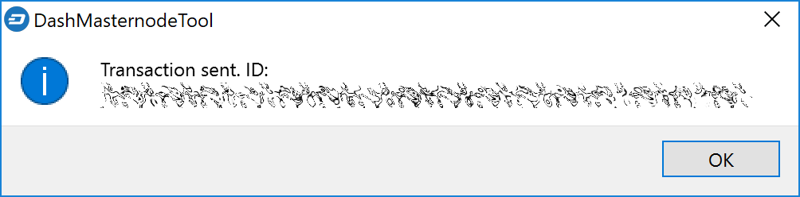

   Confirming broadcast of the transaction to the network

Option 2: Withdrawals from Dash Core wallet
-------------------------------------------

Similar to DMT as described above, we need a method in Dash Core wallet
to restrict which UTXOs are spent when making withdrawals from a
masternode address to ensure that the collateral UTXO is not touched. In
Dash Core wallet, this feature is known as Coin Control, and it must be
enabled before you can use it. Click **Settings > Options > Wallet >
Enable coin control features**. Now, when you go to the **Send** tab in
your wallet, a new button labelled **Inputs...** will appear. Click this
button to select which UTXOs can be used as input for any transactions
you create. The following window appears:

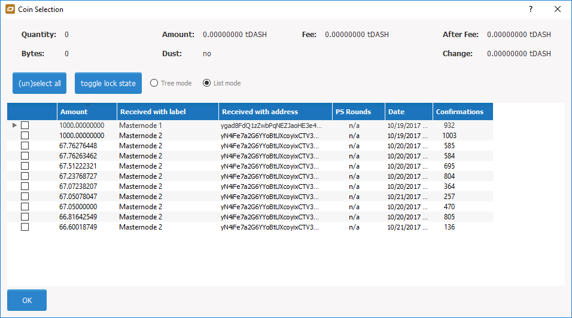

   Coin Selection window in Dash Core wallet, showing two masternodes
   (testnet)

Right click on the transaction(s) showing an amount of 1000 DASH, then
select **Lock unspent**. A small lock will appear next to the
transaction. Then click **OK**. You can now safely create transactions
with your remaining funds without affecting the original collateral
UTXOs.

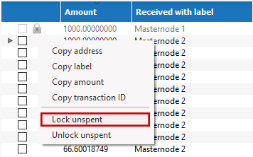

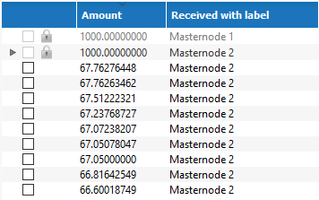

   Locking UTXOs in Dash Core wallet

Finding your position in the payment queue
==========================================

Prior to Dash 0.12.4, each masternode may have a slightly different view
of the network. In addition, selection from the top 10% of masternodes
in the list in the :ref:`selection pool <payment-logic>` is random. This
means that there is no definite answer to when your masternode will be
selected for payment. However, it is possible to make an approximation
based on the time your masternode entered the back of the queue.

Community members xkcd, Bertrand256 and moocowmoo have all published
various tools you can run to determine your approximate position in the
payment queue, and bots are available on Discord and Slack as well.

- mn_queue: https://github.com/kxcd/mn_queue
- Dashman: https://github.com/moocowmoo/dashman
- DMT: https://github.com/Bertrand256/dash-masternode-tool

DashCentral voting, verification and monitoring
===============================================

DashCentral is a community-supported website managed by community member
Rango. It has become a *de facto* site for discussion of budget
proposals and to facilitate voting from a graphical user interface, but
also offers functions to monitor masternodes.

Adding your masternode to DashCentral
-------------------------------------

`Dashcentral <https://www.dashcentral.org/>`_ allows you to vote on
proposals from the comfort of your browser. After completing
`registration <https://www.dashcentral.org/register>`_, go to the
`masternodes <https://www.dashcentral.org/masternodes>`_ page and click
the **Add masternode now** button. Enter your collateral address on the
following screen:

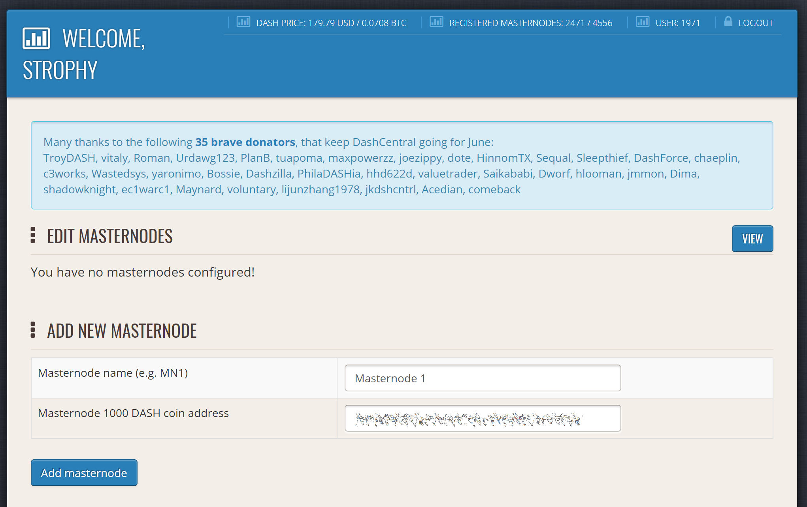

   Adding a masternode to DashCentral

Click **Add masternode**. Your masternode has now been added to
DashCentral.

Enabling voting from DashCentral
--------------------------------

Click **Edit** under **Voting privkeys** to enter your masternode
private key to enable voting through the DashCentral web interface.
Enter a voting passphrase (not the same as your login password, but
equally important to remember!) and enter the private key (the same key
you used in the dash.conf file on your masternode) on the following
screen:

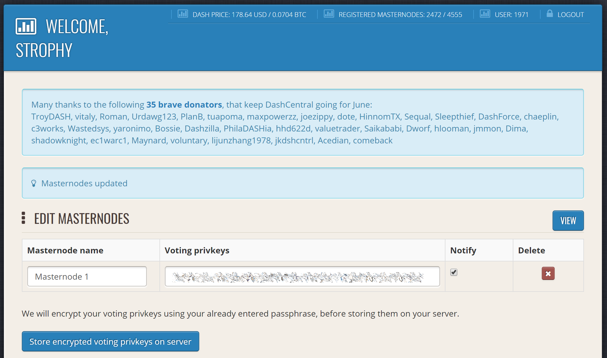

   Adding voting privkeys to DashCentral

It is important to note that the private key to start your masternode is
unrelated to the private keys to the collateral address storing your
1000 DASH. These keys can be used to issue commands on behalf of the
masternode, such as voting, but cannot be used to access the collateral.
The keys are encrypted on your device and never stored as plain text on
DashCentral servers. Once you have entered the key, click **Store
encrypted voting privkeys on server**. You can now vote on proposals
from the DashCentral web interface.

Verifying ownership
-------------------

You can also issue a message from your address to verify ownership of
your masternode to DashCentral. Click **Unverified** under **Ownership**
and the following screen will appear:

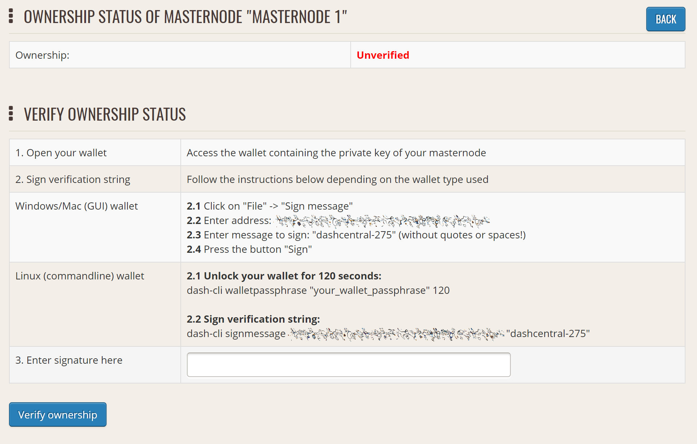

   Verifying ownership of your masternode to DashCentral

Instructions on how to sign your collateral address using a software
wallet appear. If you are using a hardware wallet other than Trezor, you
will need to use the DMT app to sign the address. If you are using the
Trezor hardware wallet, go to your `Trezor wallet
<https://wallet.trezor.io/>`_, copy the collateral address and click
**Sign & Verify**. The following screen will appear, where you can enter
the message provided by DashCentral and the address you wish to sign:

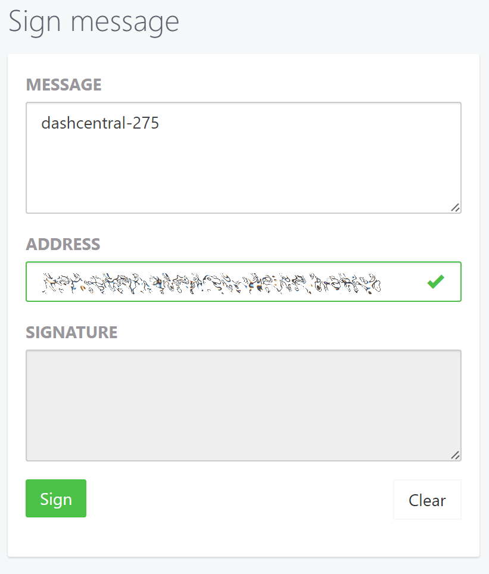

   Signing a message from the Trezor Wallet

Click **Sign**, confirm on your Trezor device and enter your PIN to sign
the message. A message signature will appear in the **Signature** box.
Copy this signature and paste it into the box on DashCentral and click
**Verify ownership**. Verification is now complete.

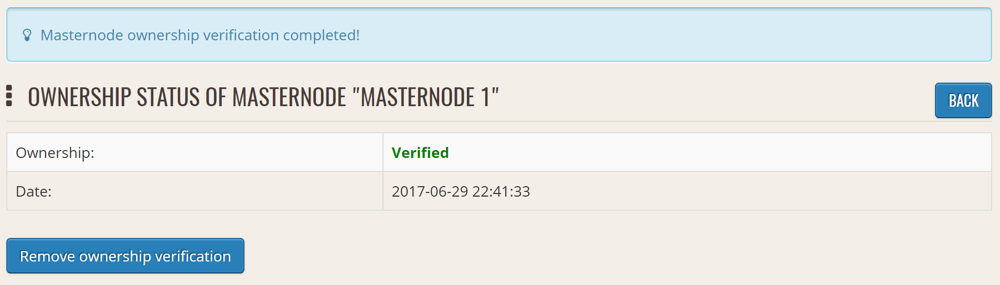

   Masternode ownership has been successfully verified

Installing the DashCentral monitoring script
--------------------------------------------

DashCentral offers a service to monitor your masternode, automatically
restart dashd in the event of a crash and send email in the event of an
error. Go to the `Account settings
<https://www.dashcentral.org/account/edit>`_ page and generate a new API
key, adding a PIN to your account if necessary. Scroll to the following
screen:

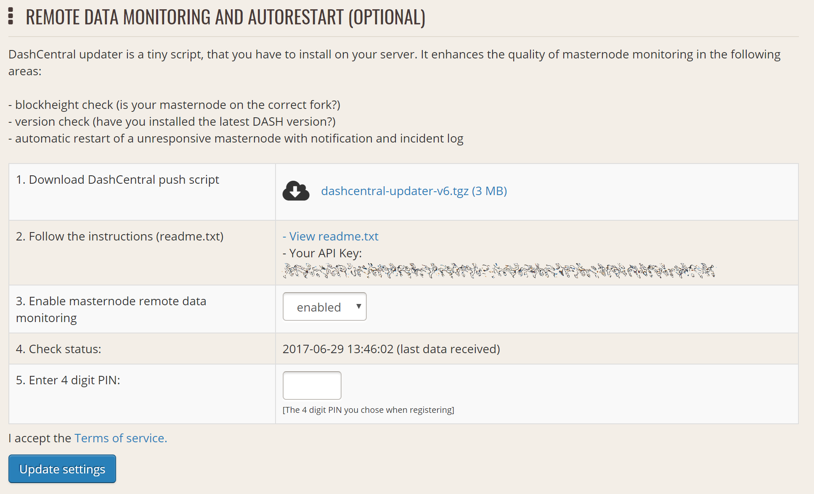

   Setting up the DashCentral monitoring script

Copy the link to the current version of the dashcentral script by right-
click and selecting **Copy link address**. Open PuTTY and connect to
your masternode, then type::

  wget https://www.dashcentral.org/downloads/dashcentral-updater-v6.tgz

Replace the link with the current version of dashcentral-updater as
necessary. Decompress the archive using the following command::

  tar xvzf dashcentral-updater-v6.tgz

View your masternode configuration details by typing::

  cat .dashcore/dash.conf

Copy the values for ``rpcuser`` and ``rpcpassword``. Then edit the
dashcentral configuration by typing::

  nano dashcentral-updater/dashcentral.conf

Replace the values for ``api_key``, your masternode collateral address,
``rpc_user``, ``rpc_password``, ``daemon_binary`` and ``daemon_datadir``
according to your system. A common configuration, where ``lwhite`` is
the name of the Linux user, may look like this:

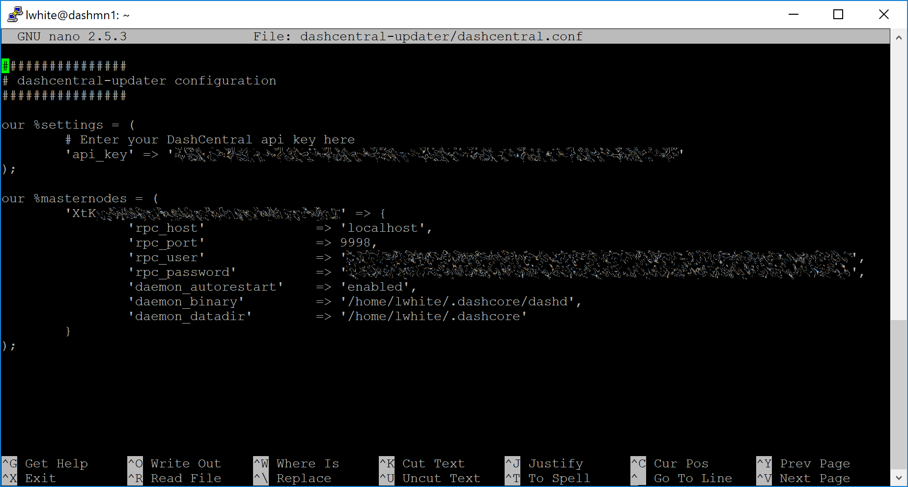

   DashCentral updater configuration file

::

  ################
  # dashcentral-updater configuration
  ################

  our %settings = (
      # Enter your DashCentral api key here
      'api_key' => 'api_key_from_dashcentral'
  );

  our %masternodes = (
      'masternode_collateral_address' => {
          'rpc_host'           => 'localhost',
          'rpc_port'           => 9998,
          'rpc_user'           => 'rpc_user_from_dash.conf',
          'rpc_password'       => 'rpc_password_from_dash.conf',
          'daemon_autorestart' => 'enabled',
          'daemon_binary'      => '/home/<username>/.dashcore/dashd',
          'daemon_datadir'     => '/home/<username>/.dashcore'
      }
  );

Press **Ctrl + X** to exit, confirm you want save with **Y** and press
**Enter**. Test your configuration by running the dashcentral script,
then check the website. If it was successful, you will see that an
update has been sent::

  dashcentral-updater/dcupdater

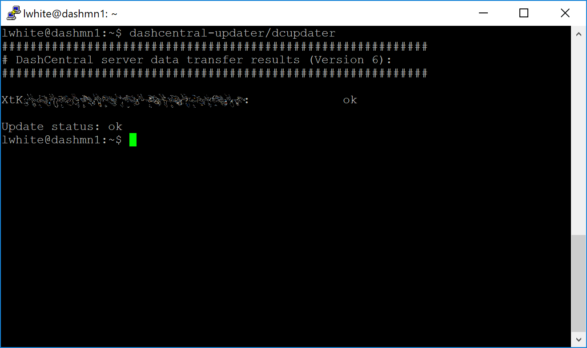

   Manually testing the DashCentral updater

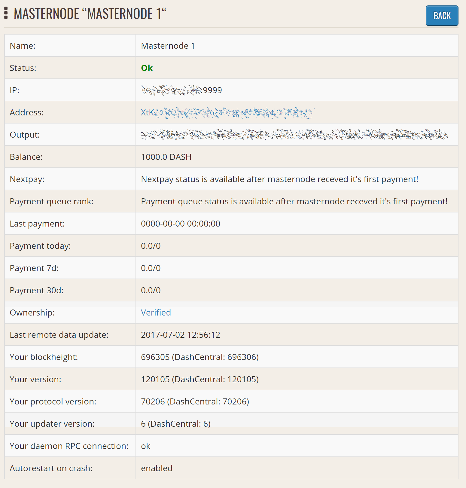

   DashCentral updater has successfully sent data to the DashCentral
   site

Once you have verified your configuration is working, we can edit the
crontab on your system to schedule the dcupdater script to run every 2
minutes. This allows the system to give you early warning in the event
of a fault and will even restart the dashd daemon if it hangs or
crashes. This is an effective way to make sure you do not drop off the
payment queue. Type the following command::

  crontab -e

Select an editor if necessary and add the following line to your crontab
after the line for sentinel, replacing lwhite with your username on your
system::

  */2 * * * * /home/lwhite/dashcentral-updater/dcupdater

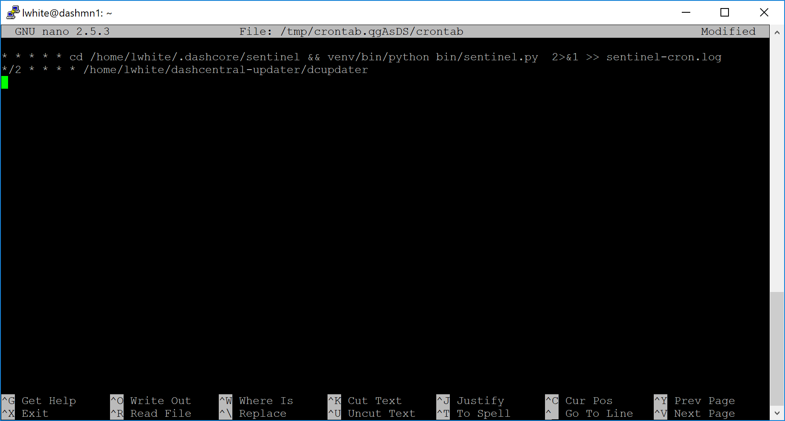

   Editing crontab to run the DashCentral updater automatically

Press **Ctrl + X** to exit, confirm you want save with **Y** and press
**Enter**. The dcupdater script will now run every two minutes, restart
dashd whenever necessary and email you in the event of an error.

Masternode monitoring tools
===========================

Several sites operated by community members are available to monitor key
information and statistics relating to the masternode network.

Block Explorers
---------------

Since Dash is a public blockchain, it is possible to use block explorers
to view the balances of any Dash public address, as well as examine the
transactions entered in any given block. Each unique transaction is also
searchable by its txid. A number of block explorers are available for
the Dash network.

- `CryptoID <https://chainz.cryptoid.info/>`__ offers a `Dash blockchain
  explorer <https://chainz.cryptoid.info/dash/>`__ and a `function
  <https://chainz.cryptoid.info/dash/masternodes.dws>`__ to view and map
  Dash masternodes.
- `BitInfoCharts <https://bitinfocharts.com>`_ offers a `page
  <https://bitinfocharts.com/dash/>`_ of price statistics and
  information and a `blockchain explorer
  <https://bitinfocharts.com/dash/explorer/>`__.
- `CoinCheckup <https://coincheckup.com/coins/dash/charts>`__ offers a
  range of statistics and data on most blockchains, including Dash.
- `CoinPayments <https://www.coinpayments.net/>`__ offers a simple `Dash
  blockchain explorer
  <http://explorer.coinpayments.net/index.php?chain=7>`__.
- `Dash.org <https://www.dash.org/>`__ includes two blockchain explorers
  at `explorer.dash.org <http://explorer.dash.org/>`__ and
  `insight.dash.org <http://insight.dash.org/>`__.
- `Trezor <https://trezor.io/>`__ operates a `blockchain explorer <https
  ://dash-bitcore1.trezor.io/>`__ powered by a `Dash fork
  <https://github.com/dashpay/insight-ui-dash>`__ of `insight
  <https://insight.is/>`__, an advanced blockchain API tool

Dash Masternode Tool
--------------------

https://github.com/Bertrand256/dash-masternode-tool

Written and maintained by community member Bertrand256, Dash Masternode
Tool (DMT) allows you to start a masternode from all major hardware
wallets such as Trezor, Ledger and KeepKey. It also supports functions
to vote on proposals and withdraw masternode payments without affecting
the collateral transaction.

DASH Ninja
----------

https://www.dashninja.pl

DASH Ninja, operated by forum member and Dash Core developer elbereth,
offers key statistics on the adoption of different versions of Dash
across the masternode network. Several features to monitor governance of
the Dash, the masternode payment schedule and the geographic
distribution of masternodes are also available, as well as a simple
blockchain explorer.

DashCentral
-----------

https://www.dashcentral.org

DashCentral, operated by forum member rango, offers an advanced service
to monitor masternodes and vote on budget proposals through an advanced
web interface. An `Android app <https://play.google.com/store/apps/detai
ls?id=net.paregov.android.dashcentral>`_ is also available.

Masternode.me
-------------

https://stats.masternode.me

Masternode.me, operated by forum member and Dash Core developer
moocowmoo, offers sequential reports on the price, generation rate,
blockchain information and some information on masternodes.

Dash Masternode Information
---------------------------

http://178.254.23.111/~pub/Dash/Dash_Info.html

This site, operated by forum member and Dash Core developer crowning,
offers a visual representation of many key statistics of the Dash
masternode network, including graphs of the total masternode count over
time, price information and network distribution.
