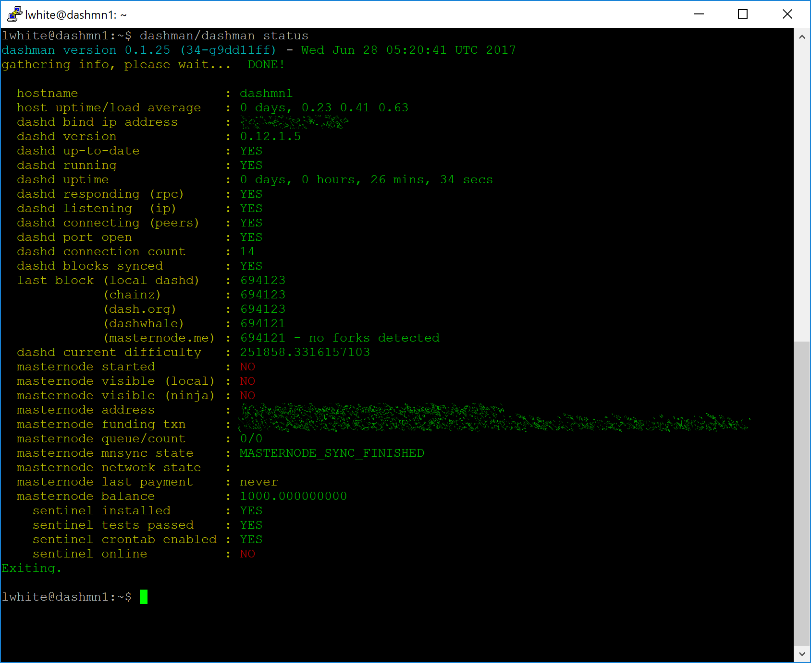
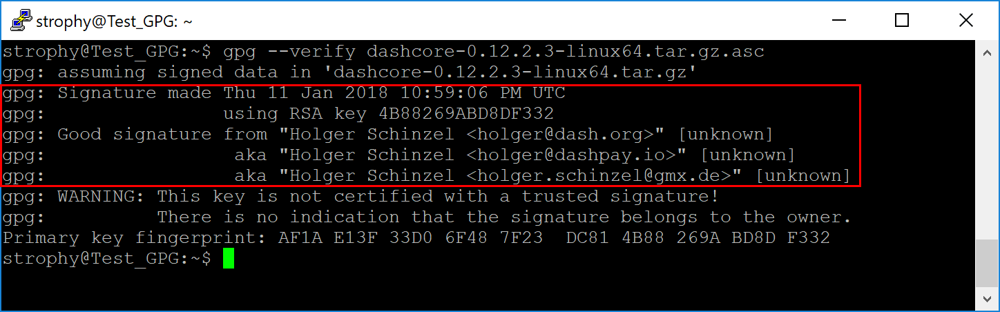
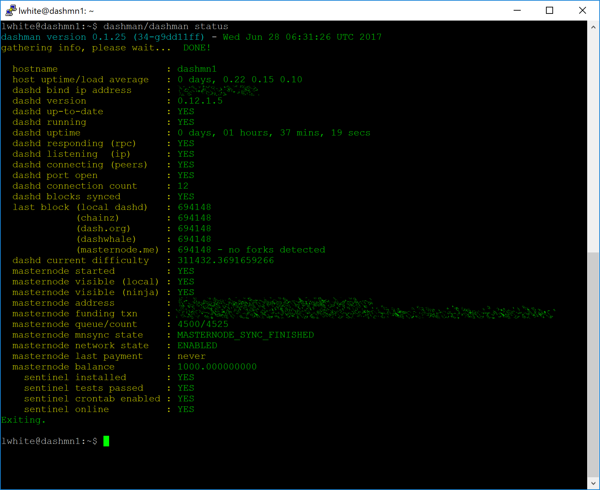

.. meta::
   :description: This guide describes how to set up a Dash masternode. It also describes various options for hosting and different wallets
   :keywords: dash, guide, masternodes, trezor, dip3, setup, bls

.. _masternode-setup:

=====
Setup
=====

Setting up a masternode requires a basic understanding of Linux and
blockchain technology, as well as an ability to follow instructions
closely. It also requires regular maintenance and careful security,
particularly if you are not storing your Dash on a hardware wallet.
There are some decisions to be made along the way, and optional extra
steps to take for increased security.

Commercial :ref:`masternode hosting services <masternode-hosting>` are
available if you prefer to delegate day-to-day operation of your
masternode to a professional operator. When using these hosting
services, you retain full control of the 1000 DASH collateral and pay an
agreed percentage of your reward to the operator. It is also possible to
delegate your voting keys to a representative, see the 
:ref:`governance documentation <using-governance>` for more
information.

Before you begin
================

This guide assumes you are setting up a single masternode for the first
time. If you are updating a masternode, see  :ref:`here <masternode-update>` 
instead. If Spork 15 is not yet enabled, it is not possible to directly
set up a DIP3 masternode. You will need to set up the masternode
following the `old process
<https://docs.dash.org/en/stable/masternodes/setup.html>`_ and then work
through the :ref:`upgrade procedure <dip3-upgrade>`. You will need:

- 1000 Dash
- A wallet to store your Dash, preferably a hardware wallet, although 
  Dash Core wallet is also supported
- A Linux server, preferably a Virtual Private Server (VPS)

Dash 0.13.0 implements DIP3, which introduces several changes to how a
Dash masternode is set up and operated. A list of available
documentation appears below:

- `DIP3 Deterministic Masternode Lists <https://github.com/dashpay/dips/blob/master/dip-0003.md>`__
- :ref:`dip3-changes`
- :ref:`dip3-upgrade`
- :ref:`Full masternode setup guide <masternode-setup>` (you are here)
- :ref:`Information for users of hosted masternodes <hosted-setup>`
- :ref:`Information for operators of hosted masternodes <operator-transactions>`

It is highly recommended to first read at least the list of changes
before continuing in order to familiarize yourself with the new concepts
in DIP3. This documentation describes the commands as if they were
entered in the Dash Core GUI by opening the console from **Tools > Debug
console**, but the same result can be achieved on a masternode by
entering the same commands and adding the prefix 
``~/.dashcore/dash-cli`` to each command.

.. _vps-setup:

Set up your VPS
===============

A VPS, more commonly known as a cloud server, is fully functional
installation of an operating system (usually Linux) operating within a
virtual machine. The virtual machine allows the VPS provider to run
multiple systems on one physical server, making it more efficient and
much cheaper than having a single operating system running on the "bare
metal" of each server. A VPS is ideal for hosting a Dash masternode
because they typically offer guaranteed uptime, redundancy in the case
of hardware failure and a static IP address that is required to ensure
you remain in the masternode payment queue. While running a masternode
from home on a desktop computer is technically possible, it will most
likely not work reliably because most ISPs allocate dynamic IP addresses
to home users.

We will use `Vultr <https://www.vultr.com/>`_ hosting as an example of a
VPS, although `DigitalOcean <https://www.digitalocean.com/>`_, `Amazon
EC2 <https://aws.amazon.com/ec2>`_, `Google Cloud
<https://cloud.google.com/compute/>`_, `Choopa
<https://www.choopa.com/>`_ and `OVH <https://www.ovh.com/>`_ are also
popular choices. First create an account and add credit. Then go to the
**Servers** menu item on the left and click **+** to add a new server.
Select a location for your new server on the following screen:

.. figure:: img/setup-server-location.png
   :width: 400px

   Vultr server location selection screen

Select Ubuntu 18.04 x64 as the server type. We use this LTS release of
Ubuntu instead of the latest version because LTS releases are supported
with security updates for 5 years, instead of the usual 9 months.

.. figure:: img/setup-server-type.png
   :width: 400px

   Vultr server type selection screen

Select a server size offering at least 2GB of memory.

.. figure:: img/setup-server-size.png
   :width: 400px

   Vultr server size selection screen

Enter a hostname and label for your server. In this example we will use
``dashmn1`` as the hostname.

.. figure:: img/setup-server-hostname.png
   :width: 400px

   Vultr server hostname & label selection screen

Vultr will now install your server. This process may take a few minutes.

.. figure:: img/setup-server-installing.png
   :width: 400px

   Vultr server installation screen

Click **Manage** when installation is complete and take note of the IP
address, username and password.

.. figure:: img/setup-server-manage.png
   :width: 276px

   Vultr server management screen

Set up your operating system
============================

We will begin by connecting to your newly provisioned server. On
Windows, we will first download an app called PuTTY to connect to the
server. Go to the `PuTTY download page <https://www.chiark.greenend.org.uk/~sgtatham/putty/latest.html>`_
and select the appropriate MSI installer for your system.
On Mac or Linux you can ssh directly from
the terminal - simply type ``ssh root@<server_ip>`` and enter your
password when prompted.

.. figure:: img/setup-putty-download.png
   :width: 400px

   PuTTY download page

Double-click the downloaded file to install PuTTY, then run the app from
your Start menu. Enter the IP address of the server in the **Host Name**
field and click **Open**. You may see a certificate warning, since this
is the first time you are connecting to this server. You can safely
click **Yes** to trust this server in the future.

.. figure:: img/setup-putty-alert.png
   :width: 320px

   PuTTY security alert when connecting to a new server

You are now connected to your server and should see a terminal
window. Begin by logging in to your server with the user ``root`` and
password supplied by your hosting provider.

.. figure:: img/setup-putty-connect.png
   :width: 400px

   Password challenge when connecting to your VPS for the first time

You should immediately change the root password and store it in a safe
place for security. You can copy and paste any of the following commands
by selecting them in your browser, pressing **Ctrl + C**, then switching
to the PuTTY window and right-clicking in the window. The text will
paste at the current cursor location::

  passwd root

Enter and confirm a new password (preferably long and randomly
generated). Next we will create a new user with the following command,
replacing ``<username>`` with a username of your choice::

  adduser <username>

You will be prompted for a password. Enter and confirm using a new
password (different to your root password) and store it in a safe place.
You will also see prompts for user information, but this can be left
blank. Once the user has been created, we will add them to the sudo
group so they can perform commands as root::

  usermod -aG sudo <username>

Now, while still as root, we will update the system from the Ubuntu
package repository::

  apt update
  apt upgrade

The system will show a list of upgradable packages. Press **Y** and
**Enter** to install the packages. We will now install a firewall (and
some other packages we will use later), add swap memory and reboot the
server to apply any necessary kernel updates, and then login to our
newly secured environment as the new user::

  apt install ufw python virtualenv git unzip pv

(press **Y** and **Enter** to confirm)

::

  ufw allow ssh/tcp
  ufw limit ssh/tcp
  ufw allow 9999/tcp
  ufw logging on
  ufw enable

(press **Y** and **Enter** to confirm)

::

  fallocate -l 4G /swapfile
  chmod 600 /swapfile
  mkswap /swapfile
  swapon /swapfile
  nano /etc/fstab

Add the following line at the end of the file (press tab to separate
each word/number), then press **Ctrl + X** to close the editor, then
**Y** and **Enter** save the file.

::

  /swapfile none swap sw 0 0

Finally, in order to prevent brute force password hacking attacks, open
the SSH configuration file to disable root login over SSH::

  nano /etc/ssh/sshd_config

Locate the line that reads ``PermitRootLogin yes`` and set it to
``PermitRootLogin no``. Directly below this, add a line which reads
``AllowUsers <username>``, replacing ``<username>`` with the username
you selected above. The press **Ctrl + X** to close the editor, then
**Y** and **Enter** save the file.

Then reboot the server:

::

  reboot now

PuTTY will disconnect when the server reboots.

While this setup includes basic steps to protect your server against
attacks, much more can be done. In particular, `authenticating with a
public key <https://help.ubuntu.com/community/SSH/OpenSSH/Keys>`_
instead of a username/password combination, `installing fail2ban
<https://www.linode.com/docs/security/using-fail2ban-for-security>`_ to
block login brute force attacks and `enabling automatic security updates
<https://help.ubuntu.com/community/AutomaticSecurityUpdates>`_ is
advisable. More tips are available `here <https://www.cyberciti.biz/tips/linux-security.html>`__. 
However, since the masternode does not actually store the keys to any
Dash, these steps are considered beyond the scope of this guide.

Send the collateral
===================

A Dash address with a single unspent transaction output (UTXO) of
exactly 1000 DASH is required to operate a masternode. Once it has been
sent, various keys regarding the transaction must be extracted for later
entry in a configuration file and registration transaction as proof to
write the configuration to the blockchain so the masternode can be
included in the deterministic list. A masternode can be started from a
hardware wallet or the official Dash Core wallet, although a hardware
wallet is highly recommended to enhance security and protect yourself
against hacking. This guide will describe the steps for both hardware
wallets and Dash Core.

Option 1: Sending from a hardware wallet
----------------------------------------

Set up your Trezor using the Trezor wallet at https://wallet.trezor.io/
and send a test transaction to verify that it is working properly. For
help on this, see :ref:`this guide <hardware-trezor>` - you may also
choose to (carefully!) `add a passphrase <https://blog.trezor.io/hide-your-trezor-wallets-with-multiple-passphrases-f2e0834026eb>`_
to your Trezor to further protect your collateral. Create a new account
in your Trezor wallet by clicking **Add account**. Then click the
**Receive** tab and send exactly 1000 DASH to the address displayed. If
you are setting up multiple masternodes, send 1000 DASH to consecutive
addresses within the same new account. You should see the transaction as
soon as the first confirmation arrives, usually within a few minutes.

.. figure:: img/setup-collateral-trezor.png
   :width: 400px

   Trezor Wallet Receive tab showing successfully received collateral of
   1000 DASH

Once the transaction appears, click the QR code on the right to view the
transaction on the blockchain. Keep this window open as we complete the
following steps, since we will soon need to confirm that 15
confirmations exist, as shown in the following screenshot.

.. figure:: img/setup-collateral-blocks.png
   :width: 400px

   Trezor blockchain explorer showing 15 confirmations for collateral
   transfer

While we are waiting for 15 confirmations, download the latest version
of the Dash Masternode Tool (DMT) from the GitHub releases page `here
<https://github.com/Bertrand256/dash-masternode-tool/releases>`__. Unzip
and run the file. The following window appears.

.. figure:: img/setup-collateral-dmt-start.png
   :width: 400px

   Dash Masternode Tool startup screen

Click the third button from the left **Check Dash Network Connection**
in the top left corner of the main window to verify that the connection
is working. Then connect your Trezor device and click the next button
**Test Hardware Wallet Connection** to verify the Trezor connection is
working.

.. image:: img/setup-collateral-connection.png
   :width: 100px

.. figure:: img/setup-collateral-hardware.png
   :width: 180px

   Dash Masternode Tool successful connection confirmations

We will now use DMT to extract the transaction ID and legacy masternode
key (necessary for successful startup during the DIP3 transition
period). Carry out the following sequence of steps as shown in this
screenshot:

.. figure:: img/setup-collateral-dmt-steps.png
   :width: 400px

   Dash Masternode Tool configuration steps

#. Click the **New** button.
#. Ensure you are on the settings page for a Non-deterministic 
   masternode and click **Generate new** to generate a legacy masternode
   key. Copy this key into a text editor.
#. Click **Alter configuration to deterministic**
#. Enter a name for your masternode. The host name you specified 
   for your VPS above is a good choice.
#. Enter the IP address of your masternode. This was given to you
   by the VPS provider when you set up the server.
#. Enter the TCP port number. This should be 9999.
#. Click **Locate collateral** to view unused collateral funding 
   transactions available on the connected hardware wallet. The 
   **Collateral address**, **index** and **Collateral TX hash** fields 
   should be filled automatically

.. figure:: img/setup-collateral-dmt-ready.png
   :width: 400px

   Dash Masternode Tool with configuration ready to start masternode

Leave DMT open and continue with the next step: :ref:`installing Dash
Core on your VPS <masternode-setup-install-dashcore>`.

Option 2: Sending from Dash Core wallet
---------------------------------------

Open Dash Core wallet and wait for it to synchronize with the network.
It should look like this when ready:

.. figure:: img/setup-collateral-dashcore.png
   :width: 400px

   Fully synchronized Dash Core wallet

Click **Tools > Debug console** to open the console. Type the following
two commands into the console to generate a legacy masternode key
(necessary for successful startup during the DIP3 transition period) and
a new Dash address for the collateral::

  masternode genkey
  93PAqQsDjcVdYJHRfQPjsSt5338GCswMnUaSxoCD8J6fiLk4NHL

  getnewaddress
  yiFfzbwiN9oneftd7cEfr3kQLRwQ4kp7ue

Take note of the legacy masternode private key and collateral address,
since we will need it later. The next step is to secure your wallet (if
you have not already done so). First, encrypt the wallet by selecting
**Settings > Encrypt wallet**. You should use a strong, new password
that you have never used somewhere else. Take note of your password and
store it somewhere safe or you will be permanently locked out of your
wallet and lose access to your funds. Next, back up your wallet file by
selecting **File > Backup Wallet**. Save the file to a secure location
physically separate to your computer, since this will be the only way
you can access our funds if anything happens to your computer. For more
details on these steps, see :ref:`here <dashcore-backup>`.

Now send exactly 1000 DASH in a single transaction to the new address
you generated in the previous step. This may be sent from another
wallet, or from funds already held in your current wallet. Once the
transaction is complete, view the transaction in a `blockchain explorer
<http://insight.dash.org/insight/>`_ by searching for the address. You
will need 15 confirmations before you can start the masternode, but you
can continue with the next step at this point already: installing Dash
Core on your VPS.

.. figure:: img/setup-collateral-blocks.png
   :width: 400px

   Trezor blockchain explorer showing 15 confirmations for collateral
   transfer

.. _masternode-setup-install-dashcore:

Install Dash Core
=================

Dash Core is the software behind both the Dash Core GUI wallet and Dash
masternodes. If not displaying a GUI, it runs as a daemon on your VPS
(dashd), controlled by a simple command interface (dash-cli).

Open PuTTY or a console again and connect using the username and
password you just created for your new, non-root user. There are two
options to install Dash Core, an automated option using a script utility
called dashman by Dash Core Team member moocowmoo, and a more
complicated option which will allow you to understand all of the key
steps involved in preparing your masternode.

Option 1: Automated installation using dashman
----------------------------------------------

To install Dash using dashman, enter the following commands after
logging in::

  cd ~
  git clone https://github.com/moocowmoo/dashman
  ~/dashman/dashman install

(press **Y** and **Enter** to confirm)

dashman will download the latest version of Dash Core for your system,
as well as an initial snapshot of the blockchain to speed up the
bootstrapping process. Next download and install Sentinel, which is
required for masternodes at version 0.12.1 or higher::

  ~/dashman/dashman install sentinel

Your system is now running as a standard Dash node, and is busy
completing synchronisation with the blockchain. Since dashman does not
automatically restart your masternode in the event of a system error,
add a check function to crontab to make sure it checks every minute to
ensure your masternode is still running::

  crontab -e

Choose nano as your editor and enter the following line at the end of
the file, after the line for sentinel::

  * * * * * pidof dashd || ~/.dashcore/dashd

Press enter to make sure there is a blank line at the end of the file,
then press **Ctrl + X** to close the editor and **Y** and **Enter** save
the file. Check the sync status and wait until all blockchain
synchronisation and the 15 confirmations for the collateral transaction
are complete::

  ~/dashman/dashman status

   dashman status output showing masternode ready to be started

Continue with the :ref:`next step to start your masternode
<register-masternode>`.

Option 2: Manual installation
-----------------------------

To manually download and install the components of your Dash masternode,
visit the `GitHub releases page <https://github.com/dashpay/dash/releases>`_ 
and copy the link to the latest ``x86_64-linux-gnu`` version. Go back to
your terminal window and enter the following command, pasting in the
address to the latest version of Dash Core by right clicking or pressing
**Ctrl + V**::

  cd /tmp
  wget https://github.com/dashpay/dash/releases/download/v0.13.0.0-rc10/dashcore-0.13.0.0-rc10-x86_64-linux-gnu.tar.gz

Verify the integrity of your download by running the following command
and comparing the output against the value for the file as shown in the
``SHA256SUMS.asc`` file::

  wget https://github.com/dashpay/dash/releases/download/v0.13.0.0-rc10/SHA256SUMS.asc
  sha256sum dashcore-0.13.0.0-rc10-x86_64-linux-gnu.tar.gz
  cat SHA256SUMS.asc

You can also optionally verify the authenticity of your download as an
official release by Dash Core Team. All releases of Dash are signed
using GPG by UdjinM6 with the key ``8359 2BD1 400D 58D9``, `verifiable
here on Keybase <https://keybase.io/udjinm6>`_. Import the key, download
the ASC file for the current release of Dash and verify the signature as
follows::

  curl https://keybase.io/udjinm6/pgp_keys.asc | gpg --import
  gpg --verify SHA256SUMS.asc

   Downloading the PGP key and verifying the signed binary

Create a working directory for Dash, extract the compressed archive,
copy the necessary files to the directory and set them as executable::

  mkdir ~/.dashcore
  tar xfv dashcore-0.13.0.0-rc10-x86_64-linux-gnu.tar.gz
  cp -f dashcore-0.13.0/bin/dashd ~/.dashcore/
  cp -f dashcore-0.13.0/bin/dash-cli ~/.dashcore/
  chmod 777 ~/.dashcore/dash*

Create a configuration file using the following command::

  nano ~/.dashcore/dash.conf

An editor window will appear. We now need to create a configuration file
specifying several variables. Copy and paste the following text to get
started, then replace the variables specific to your configuration as
follows::

  #----
  rpcuser=XXXXXXXXXXXXX
  rpcpassword=XXXXXXXXXXXXXXXXXXXXXXXXXXXX
  rpcallowip=127.0.0.1
  #----
  listen=1
  server=1
  daemon=1
  maxconnections=64
  #----
  masternode=1
  masternodeprivkey=XXXXXXXXXXXXXXXXXXXXXXX
  externalip=XXX.XXX.XXX.XXX
  #----

Replace the fields marked with ``XXXXXXX`` as follows:

- ``rpcuser``: enter any string of numbers or letters, no special
  characters allowed
- ``rpcpassword``: enter any string of numbers or letters, no special
  characters allowed
- ``masternodeprivkey``: this is the legacy masternode private key you
  generated in the previous step
- ``externalip``: this is the IP address of your VPS

The result should look something like this:

.. figure:: img/setup-manual-conf.png
   :width: 400px

   Entering key data in dash.conf on the masternode

Press **Ctrl + X** to close the editor and **Y** and **Enter** save the
file. You can now start running Dash on the masternode to begin
synchronization with the blockchain::

  ~/.dashcore/dashd

You will see a message reading **Dash Core server starting**. We will
now install Sentinel, a piece of software which operates as a watchdog
to communicate to the network that your node is working properly::

  cd ~/.dashcore
  git clone https://github.com/dashpay/sentinel.git
  cd sentinel
  virtualenv venv
  venv/bin/pip install -r requirements.txt
  venv/bin/python bin/sentinel.py

You will see a message reading **dashd not synced with network! Awaiting
full sync before running Sentinel.** Add dashd and sentinel to crontab
to make sure it runs every minute to check on your masternode::

  crontab -e

Choose nano as your editor and enter the following lines at the end of
the file::

  * * * * * cd ~/.dashcore/sentinel && ./venv/bin/python bin/sentinel.py 2>&1 >> sentinel-cron.log
  * * * * * pidof dashd || ~/.dashcore/dashd

Press enter to make sure there is a blank line at the end of the file,
then press **Ctrl + X** to close the editor and **Y** and **Enter** save
the file. We now need to wait for 15 confirmations of the collateral
transaction to complete, and wait for the blockchain to finish
synchronizing on the masternode. You can use the following commands to
monitor progress::

  ~/.dashcore/dash-cli mnsync status

When synchronisation is complete, you should see the following
response::

  {
   "AssetID": 999,
   "AssetName": "MASTERNODE_SYNC_FINISHED",
   "Attempt": 0,
   "IsBlockchainSynced": true,
   "IsMasternodeListSynced": true,
   "IsWinnersListSynced": true,
   "IsSynced": true,
   "IsFailed": false
  }

Continue with the next step to construct the ProTx transaction required
to enable your masternode.

.. _register-masternode:

Register your masternode
========================

DIP3 introduces several changes to how a masternode is set up and
operated. These are described briefly under :ref:`dip3-changes` in
this documentation, or in full detail in `DIP3
<https://github.com/dashpay/dips/blob/master/dip-0003.md>`_ itself. It
is highly recommended to first read at least the brief documentation
before continuing in order to familiarize yourself with the new concepts
in DIP3.

Option 1: Registering from a hardware wallet
--------------------------------------------

Go back to DMT and ensure that all fields from the previous step are
still filled out correctly.  Click **Generate new** for the three
private keys required for a DIP3 deterministic masternode:

- Owner private key
- Operator private key
- Voting private key

.. figure:: img/setup-dmt-filled.png
   :width: 220px

   Dash Masternode Tool ready to register a new masternode

Then click **Send ProRegTx** and confirm the following two messages:

.. image:: img/setup-dmt-send.png
   :width: 220px

.. figure:: img/setup-dmt-sent.png
   :width: 220px

   Dash Masternode Tool confirmation dialogs to register a masternode

The BLS secret key must be entered in the ``dash.conf`` file on the
masternode. This allows the masternode to watch the blockchain for
relevant Pro*Tx transactions, and will cause it to start serving as a
masternode when the signed ProRegTx is broadcast by the owner, as we
just did above. Edit the configuration file on your masternode as
follows::

  nano ~/.dashcore/dash.conf

The editor appears with the existing masternode configuration. Add this
line to the end of the file, replacing the key with your BLS secret key
generated above::

  masternodeblsprivkey=21e27edbabf70a677303d527d750b502628e1c51d66d3bfd2b4583f690fbd14e

Press enter to make sure there is a blank line at the end of the file,
then press **Ctrl + X** to close the editor and **Y** and **Enter** save
the file. We now need to restart the masternode for this change to take
effect. Enter the following commands, waiting a few seconds in between
to give Dash Core time to shut down::

  ~/.dashcore/dash-cli stop
  ~/.dashcore/dashd

At this point you can monitor your masternode using ``dashman/dashman
status``, by entering ``~/.dashcore/dash-cli masternode status`` or
using the **Get status** function in DMT. You will probably need to wait
around 30 minutes as the node passes through the PRE_ENABLED stage and
finally reaches ENABLED. Give it some time, the final result should
appear as follows:

.. figure:: img/setup-dash-cli-started.png
   :width: 400px

   dash-cli masternode status output showing successfully started masternode

At this point you can safely log out of your server by typing ``exit``.
Congratulations! Your masternode is now running.

.. _dashcore-protx:

Option 2: Registering from Dash Core wallet
-------------------------------------------

Identify the funding transaction
^^^^^^^^^^^^^^^^^^^^^^^^^^^^^^^^

If you used an address in Dash Core wallet for your collateral
transaction, you now need to find the txid of the transaction. Click
**Tools > Debug console** and enter the following command::

  masternode outputs

This should return a string of characters similar to this::

  {
  "ad308ec104bdf113444be609eb3dce9474a5550424204c6538843e3ccd3d4e78" : "1",
  }

The first long string is your transaction hash, while the last number is
the index. 

.. _bls-generation:

Generate a BLS key pair
^^^^^^^^^^^^^^^^^^^^^^^

A public/private BLS key pair is required for the operator of the
masternode. If you are using a hosting service, they will provide you
with their public key, and you can skip this step. If you are hosting
your own masternode, generate a BLS public/private keypair as follows::

  bls generate

  {
    "secret": "28a85abb5aa8e820f65e33974cef0ab0bf06195f61454d2feb7fa578612d2228",
    "public": "144cbf4d472716b9504a54c7ca26906a3346253b787ffeb1a4999325049f5b2c51ef2e7c215d85f0a9142ec1c78db99b"
  }

**These keys are NOT stored by the wallet and must be kept secure,
similar to the value provided in the past by the** ``masternode genkey``
**command.** The public key will be used in following steps. The secret
key must be entered in the ``dash.conf`` file on the masternode. This
allows the masternode to watch the network for relevant Pro*Tx
transactions, and will cause it to start serving as a masternode when
the signed ProRegTx is broadcast by the owner (Step 5 below). Log in to
your masternode using ``ssh`` or PuTTY and edit the configuration file
on your masternode as follows::

  nano ~/.dashcore/dash.conf

The editor appears with the existing masternode configuration. Add this
line to the end of the file, replacing the key with your BLS secret key
generated above::

  masternodeblsprivkey=28a85abb5aa8e820f65e33974cef0ab0bf06195f61454d2feb7fa578612d2228

Press enter to make sure there is a blank line at the end of the file,
then press **Ctrl + X** to close the editor and **Y** and **Enter** save
the file. We now need to restart the masternode for this change to take
effect. Enter the following commands, waiting a few seconds in between
to give Dash Core time to shut down::

  ~/.dashcore/dash-cli stop
  ~/.dashcore/dashd

We will now prepare the transaction used to register a DIP3 masternode
on the network.

Prepare a ProRegTx transaction
^^^^^^^^^^^^^^^^^^^^^^^^^^^^^^

First, we need to get a new, unused address from the wallet to serve as
the owner address. This is different to the collateral address. It must
also be used as the voting address if Spork 15 is not yet active.
Generate a new address as follows::

  getnewaddress

  yMwR1zf2Cv9gcMdHULRVbTTMGw7arvpbM5

Then either generate or choose an existing second address to receive the
owner's masternode payouts::

  getnewaddress

  yLqyR8PHEB7Fp1ue8nSuLfuxQhrj5PSTDv

Next, we will prepare an unsigned ProRegTx special transaction using the
``protx register_prepare`` command. This command has the following
syntax::

  protx register_prepare collateralHash collateralIndex ipAndPort ownerKeyAddr 
    operatorKeyAddr votingKeyAddr operatorReward payoutAddress

Open a text editor such as notepad to prepare this command. Replace each
argument to the command as follows:

- ``collateralHash``: The txid of the 1000 Dash collateral funding 
  transaction
- ``collateralIndex``: The output index of the 1000 Dash funding 
  transaction
- ``ipAndPort``: Masternode IP address and port, in the format 
  ``x.x.x.x:yyyy``
- ``ownerKeyAddr``: The new Dash address generated above for the 
  owner/voting address
- ``operatorKeyAddr``: The BLS public key generated above (or provided 
  by your hosting service)
- ``votingKeyAddr``: The new Dash address generated above, or the 
  address of a delegate, used for proposal voting
- ``operatorReward``: The percentage of the block reward allocated to 
  the operator as payment
- ``payoutAddress``: A new or existing Dash address to receive the 
  owner's masternode rewards

Note that the operator is responsible for specifying their own reward
address in a separate ``update_service`` transaction if you specify a
non-zero ``operatorReward``. The owner of the masternode collateral does
not specify the operator's payout address.

Example (remove line breaks if copying)::

  protx register_prepare
    ad308ec104bdf113444be609eb3dce9474a5550424204c6538843e3ccd3d4e78
    1
    140.82.59.51:10004
    yMwR1zf2Cv9gcMdHULRVbTTMGw7arvpbM5 
    144cbf4d472716b9504a54c7ca26906a3346253b787ffeb1a4999325049f5b2c51ef2e7c215d85f0a9142ec1c78db99b
    yMwR1zf2Cv9gcMdHULRVbTTMGw7arvpbM5 
    0
    yLqyR8PHEB7Fp1ue8nSuLfuxQhrj5PSTDv

Output::

  {
     "tx": "0300010001784e3dcd3c3e8438654c20240455a57494ce3deb09e64b4413f1bd04c18e30ad0000000000feffffff01cccfa204000000001976a9141ea44ced396667eb7d1c5b3699e04b5b3046ecfb88ac00000000d1010000000000784e3dcd3c3e8438654c20240455a57494ce3deb09e64b4413f1bd04c18e30ad0100000000000000000000000000ffff8c523b33271411c59262c9633a1bb810a7fc2b833c43cfa852ab144cbf4d472716b9504a54c7ca26906a3346253b787ffeb1a4999325049f5b2c51ef2e7c215d85f0a9142ec1c78db99b11c59262c9633a1bb810a7fc2b833c43cfa852ab00001976a91405c5fed6a3eb0b92ea5119039efae7a8dee5456488ac4e6cc5451440a6044dbd04d33a11f4cddc9021532ede3012ebbc31c0bb4ceb9c00",
    "collateralAddress": "yiFfzbwiN9oneftd7cEfr3kQLRwQ4kp7ue",
    "signMessage": "yLqyR8PHEB7Fp1ue8nSuLfuxQhrj5PSTDv|0|yMwR1zf2Cv9gcMdHULRVbTTMGw7arvpbM5|yMwR1zf2Cv9gcMdHULRVbTTMGw7arvpbM5|4e00de34ee03d28adb4e1fdaec966ae239c11da7e6115f566fc4b3f75c8a5503"
  }

We will use the ``collateralAddress`` and ``signMessage`` fields in Step
4, and the output of the ``tx`` field in Step 5.

Sign the ProRegTx transaction
^^^^^^^^^^^^^^^^^^^^^^^^^^^^^

Now we will sign the content of the ``signMessage`` field using the
private key for the collateral address as specified in
``collateralAddress``. Note that no internet connection is required for
this step, meaning that the wallet can remain disconnected from the
internet in cold storage to sign the message. In this example we will
again use Dash Core, but it is equally possible to use the signing
function of a hardware wallet. The command takes the following syntax::

  signmessage address message

Example::

  signmessage yiFfzbwiN9oneftd7cEfr3kQLRwQ4kp7ue yLqyR8PHEB7Fp1ue8nSuLfuxQhrj5PSTDv|0|yMwR1zf2Cv9gcMdHULRVbTTMGw7arvpbM5|yMwR1zf2Cv9gcMdHULRVbTTMGw7arvpbM5|4e00de34ee03d28adb4e1fdaec966ae239c11da7e6115f566fc4b3f75c8a5503

Output::

  H3ub9BATtvuV+zDGdkUQNoUGpaYFr/O1FypmrSmH5WJ0KFRi8T10FSew0EJO/+Ij+OLv4r0rt+HS9pQFsZgc2dE=

Submit the signed message
^^^^^^^^^^^^^^^^^^^^^^^^^

We will now register the ProRegTx special transaction on the blockchain
to register the masternode. This command must be sent from a Dash Core
wallet holding a balance, since a standard transaction fee is involved.
The command takes the following syntax::

  protx register_submit tx sig

Where: 

- ``tx``: The serialized transaction previously returned in the ``tx`` output field from ``protx register_prepare`` in Step 2
- ``sig``: The message signed with the collateral key from Step 3

Example::

  protx register_submit 0300010001784e3dcd3c3e8438654c20240455a57494ce3deb09e64b4413f1bd04c18e30ad0000000000feffffff01cccfa204000000001976a9141ea44ced396667eb7d1c5b3699e04b5b3046ecfb88ac00000000d1010000000000784e3dcd3c3e8438654c20240455a57494ce3deb09e64b4413f1bd04c18e30ad0100000000000000000000000000ffff8c523b33271411c59262c9633a1bb810a7fc2b833c43cfa852ab144cbf4d472716b9504a54c7ca26906a3346253b787ffeb1a4999325049f5b2c51ef2e7c215d85f0a9142ec1c78db99b11c59262c9633a1bb810a7fc2b833c43cfa852ab00001976a91405c5fed6a3eb0b92ea5119039efae7a8dee5456488ac4e6cc5451440a6044dbd04d33a11f4cddc9021532ede3012ebbc31c0bb4ceb9c00 H3ub9BATtvuV+zDGdkUQNoUGpaYFr/O1FypmrSmH5WJ0KFRi8T10FSew0EJO/+Ij+OLv4r0rt+HS9pQFsZgc2dE=

Output::

  b823338301e47875493c20361a23aef034578030c639480203b394669ab05e09

Your masternode is now upgraded to DIP3 and will appear on the
Deterministic Masternode List after the transaction is mined to a block.
You can view this list on the **Masternodes -> DIP3 Masternodes** tab of
the Dash Core wallet, or in the console using the command ``protx list
valid``, where the txid of the final ``protx register_submit``
transaction identifies your DIP3 masternode. Note again that all
functions related to DIP3 will only take effect once Spork 15 is enabled
on the network. You can view the spork status using the ``spork active``
command.

At this point you can go back to your terminal window and monitor your
masternode using ``dashman/dashman status``, by entering
``~/.dashcore/dash-cli masternode status`` or using the **Get status**
function in DMT. You will probably need to wait around 30 minutes as the
node passes through the PRE_ENABLED stage and finally reaches ENABLED.
Give it some time, the final result should appear as follows:

   dashman status output showing successfully started masternode

At this point you can safely log out of your server by typing ``exit``.
Congratulations! Your masternode is now running.

