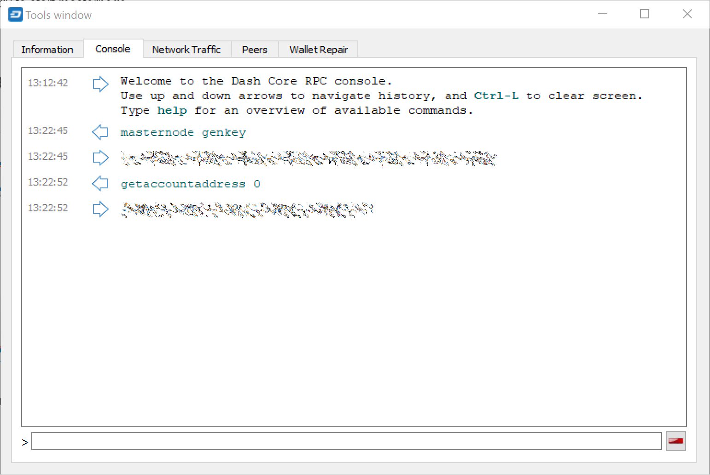
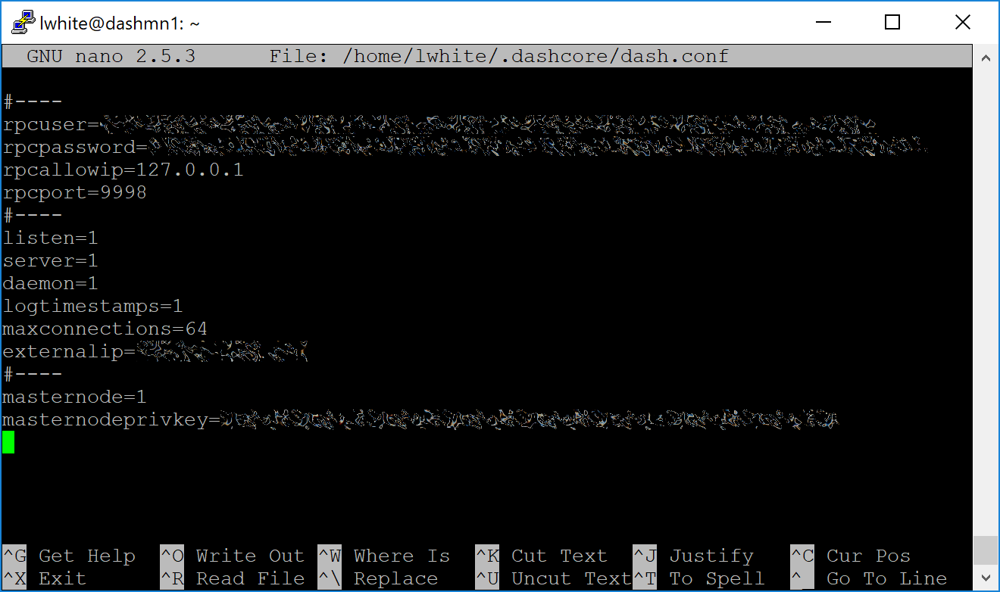

.. _masternode_setup:

=====
Setup
=====

Setting up a masternode requires a basic understanding of Linux and
blockchain technology, as well as an ability to follow instructions
closely. It also requires regular maintenance and careful security,
particularly if you are not storing your Dash on a hardware wallet.
There are some decisions to be made along the way, and optional extra
steps to take for increased security.

If you prefer to use a masternode hosting service, several community
members provide hosting at `masternode.me <https://masternode.me/>`_,
`node40.com <https://www.node40.com/hosting/>`_, `dashmasternode.io
<http://dashmasternode.io/>`_ or `masternodehosting
<https://masternodehosting.com/>`_. When using these hosting services,
all you have to do is send a single transaction of 1000 DASH to a
specific address and communicate the transaction ID to the hosting
service. Simply follow the steps here.

This guide is heavily based on previous guides written by `Bertrand256
<https://github.com/Bertrand256/dash-masternode-
tool/blob/master/README.md>`_, `moocowmoo
<https://github.com/moocowmoo/dashman/blob/master/README.md>`_, `tao
<https://www.dash.org/forum/threads/taos-masternode-setup-guide-for-
dummies-updated-for-12-1.2680/>`_, `BolehVPN
<https://dashpay.atlassian.net/wiki/spaces/DOC/pages/24019061>`_ and
tungfa. Tao's hugely popular original guide and support thread is
available `here <https://www.dash.org/forum/threads/taos-masternode-
setup-guide-for-dummies-updated-for-12-1.2680/>`_, as well many more
guides for specific cases in this forum.

Before you begin
================

This guide assumes you are setting up a masternode for the first time.
If you are updating a masternode, see :ref:`here <masternode_update>`
instead. You will need:

- 1000 Dash
- A wallet to store your Dash, either a hardware wallet or Dash Core 
  wallet
- A Linux server, preferably a Virtual Private Server (VPS)

This guide also assumes you will be working from a Windows computer.
However, since most of the work is done on your Linux VPS, alternative
steps for using macOS or Linux will be indicated where necessary.

Set up your VPS
===============

A VPS, more commonly known as a cloud server, is fully functional
installation of an operating system (usually Linux) operating within a
virtual machine. The virtual machine allows the VPS provider to run
multiple systems on one physical server, making it more efficient and
much cheaper than having a single operating system running on the "bare
metal " of each server. A VPS is ideal for hosting a Dash masternode
because they typically offer guaranteed uptime, redundancy in the case
of hardware failure and a static IP address that is required to ensure
you remain in the masternode payment queue. While running a masternode
from home on a desktop computer is technically possible, it will most
likely not work reliably because most ISPs allocate dynamic IP addresses
to home users.

We will use `Vultr <https://www.vultr.com/>`_ hosting as an example of a
VPS, although `DigitalOcean <https://www.digitalocean.com/>`_, `Amazon
EC2 <https://aws.amazon.com/ec2>`_, `Google Cloud
<https://cloud.google.com/compute/>`_, `Choopa
<https://www.choopa.com/>`_ and `OVH <https://www.ovh.com/>`_ are also
popular choices. First create an account and add credit. Then go to the
Servers menu item on the left and click **+** to add a new server.
Select a location for your new server on the following screen:

.. figure:: img/setup-server-location.png
   :width: 400px

   Vultr server location selection screen

Select Ubuntu 16.04 x64 as the server type. We use 16.04 instead of the
latest version because 16.04 is an LTS release of Ubuntu, which will be
supported with security updates for 5 years instead of the usual 9
months.

.. figure:: img/setup-server-type.png
   :width: 400px

   Vultr server type selection screen

Select a server size offering at least 2GB of memory.

.. figure:: img/setup-server-size.png
   :width: 400px

   Vultr server size selection screen

Enter a hostname and label for your server. In this example we will use
``dashmn1`` as the hostname.

.. figure:: img/setup-server-hostname.png
   :width: 400px

   Vultr server hostname & label selection screen

Vultr will now install your server. This process may take a few minutes.

.. figure:: img/setup-server-installing.png
   :width: 400px

   Vultr server installation screen

Click **Manage** when installation is complete and take note of the IP
address, username and password.

.. figure:: img/setup-server-manage.png
   :width: 276px

   Vultr server management screen

Set up your operating system
============================

We will begin by connecting to your newly provisioned server. On
Windows, we will first download an app called PuTTY to connect to the
server. Go to the PuTTY download page here and select the appropriate
MSI installer for your system. On Mac or Linux you can ssh directly from
the terminal - simply type ``ssh root@<server_ip>`` and enter your
password when prompted.

.. figure:: img/setup-putty-download.png
   :width: 400px

   PuTTY download page

Double-click the downloaded file to install PuTTY, then run the app from
your Start menu. Enter the IP address of the server in the **Host Name**
field and click **Open**. You may see a certificate warning, since this
is the first time you are connecting to this server. You can safely
click **Yes** to trust this server in the future.

.. figure:: img/setup-putty-alert.png
   :width: 320px

   PuTTY security alert when connecting to a new server

You are now connected to your server and should see a terminal
window. Begin by logging in to your server with the user ``root`` and
password supplied by your hosting provider.

.. figure:: img/setup-putty-connect.png
   :width: 400px

   Password challenge when connecting to your VPS for the first time

You should immediately change the root password and store it in a safe
place for security. You can copy and paste any of the following commands
by selecting them in your browser, pressing **Ctrl + C**, then switching
to the PuTTY window and right-clicking in the window. The text will
paste at the current cursor location::

  passwd root

Enter and confirm a new password (preferably long and randomly
generated). Next we will create a new user with the following command,
replacing ``<username>`` with a username of your choice::

  adduser <username>

You will be prompted for a password. Enter and confirm using a new
password (different to your root password) and store it in a safe place.
You will also see prompts for user information, but this can be left
blank. Once the user has been created, we will add them to the sudo
group so they can perform commands as root::

  usermod -aG sudo <username>

Now, while still as root, we will update the system from the Ubuntu
package repository::

  apt update
  apt upgrade

The system will show a list of upgradable packages. Press **Y** and
**Enter** to install the packages. We will now install a firewall (and
some other packages we will use later), add swap memory and reboot the
server to apply any necessary kernel updates, and then login to our
newly secured environment as the new user::

  apt install ufw python virtualenv git unzip pv

(press **Y** and **Enter** to confirm)

::

  ufw allow ssh/tcp
  ufw limit ssh/tcp
  ufw allow 9999/tcp
  ufw logging on
  ufw enable

(press **Y** and **Enter** to confirm)

::

  fallocate -l 4G /swapfile
  chmod 600 /swapfile
  mkswap /swapfile
  swapon /swapfile
  nano /etc/fstab

Add the following line at the end of the file (press tab to separate
each word/number), then press **Ctrl + X** to close the editor, then
**Y** and **Enter** save the file.

::

  /swapfile none swap sw 0 0

Then reboot the server:

::

  reboot now

PuTTY will disconnect when the server reboots.

While this setup includes basic steps to protect your server against
attacks, much more can be done. In particular, `authenticating with a
public key <https://help.ubuntu.com/community/SSH/OpenSSH/Keys>`_
instead of a username/password combination, `installing fail2ban
<https://www.linode.com/docs/security/using-fail2ban-for-security>`_ to
block login brute force attacks, `disabling root login
<https://help.ubuntu.com/lts/serverguide/user-management.html>`_ and
`enabling automatic security updates
<https://help.ubuntu.com/community/AutomaticSecurityUpdates>`_ is
advisable. More tips are available `here <https://www.cyberciti.biz/tips
/linux-security.html>`_. However, since the masternode does not actually
store the keys to any Dash, these steps are considered beyong the scope
of this guide.

Send the collateral
===================

A Dash address with a single unspent transaction output (UTXO) of
exactly 1000 DASH is required to operate a masternode. Once it has been
sent, various keys regarding the transaction must be extracted for later
entry in a configuration file as proof that the transaction was
completed successfully. A masternode can be started from a hardware
wallet or the official Dash Core wallet, although a hardware wallet is
highly recommended to enhance security and protect yourself against
hacking. This guide will describe the steps for both hardware wallets
and Dash Core.

Option 1: Sending from a hardware wallet
----------------------------------------

Set up your Trezor using the Trezor wallet at https://wallet.trezor.io/
and send a test transaction to verify that it is working properly. For
help on this, see :ref:`this guide <hardware_trezor>` - you may also
choose to (carefully!) `add a passphrase <https://blog.trezor.io/hide-
your-trezor-wallets-with-multiple-passphrases-f2e0834026eb>`_ to your
Trezor to further protect your collateral. Create a new account in your
Trezor wallet by clicking **Add account**. Then click the **Receive**
tab and send exactly 1000 DASH to the address displayed. You should see
the transaction as soon as the first confirmation arrives, usually
within a few minutes.

.. figure:: img/setup-collateral-trezor.png
   :width: 400px

   Trezor Wallet Receive tab showing successfully received collateral of
   1000 DASH

Once the transaction appears, click the QR code on the right to view the
transaction on the blockchain. Keep this window open as we complete the
following steps, since we will soon need to confirm that 15
confirmations exist, as shown in the following screenshot.

.. figure:: img/setup-collateral-blocks.png
   :width: 400px

   Trezor blockchain explorer showing 15 confirmations for collateral
   transfer

While we are waiting for 15 confirmations, download the latest version
of the Dash Masternode Tool (DMT) from the Github releases page here.
Unzip and run the file. The following window appears.

.. figure:: img/setup-collateral-dmt-start.png
   :width: 400px

   Dash Masternode Tool startup screen

Click **Check RPC connection** in the top left corner of the main window
to verify that the connection is working. Then connect your Trezor
device and click **Test HW** to verify the Trezor connection is working.

.. image:: img/setup-collateral-connection.png
   :width: 100px

.. figure:: img/setup-collateral-hardware.png
   :width: 180px

   Dash Masternode Tool successful connection confirmations

We will now use DMT to extract the transaction ID. Carry out the
following sequence of steps as shown in this screenshot from DMT
developer Bertrand256:

.. figure:: img/setup-collateral-dmt-steps.png
   :width: 400px

   Dash Masternode Tool configuration steps

#. Enter the name of your masternode here. This should match the
   hostname as defined when setting up your server, dashmn1 in this
   case. You can view this in the first line of the output of
   dashman/dashman status.
#. Enter the IP address of your masternode here. This was given to you
   by the VPS provider when you set up the server.
#. Enter the TCP port number. This should be 9999.
#. Click Generate new to generate a new masternode private key.
#. Copy the collateral address where you sent the 1000 DASH collateral
   from your Trezor Wallet and paste it in this field.
#. Click the arrow → to derive the BIP32 path from your collateral
   address. You can verify this against the BIP32 path shown on the
   receive tab in your Trezor Wallet for the transaction.
#. Click Lookup to find the collateral TX ID for the transaction which
   transferred the collateral to the address. You can verify this
   against the TX ID shown on the confirmation page of the blockchain
   explorer for your collateral address.

.. figure:: img/setup-collateral-dmt-ready.png
   :width: 400px

   Dash Masternode Tool with configuration ready to start masternode

Leave DMT open, take note of the masternode private key and collateral
address and continue with the next step: :ref:`installing Dash Core on
your VPS <masternode_setup_install_dashcore>`.

Option 2: Sending from Dash Core wallet
---------------------------------------

Open Dash Core wallet and wait for it to synchronize with the network.
It should like this when ready:

.. figure:: img/setup-collateral-dashcore.png
   :width: 400px

   Fully synchronized Dash Core wallet

Click **Tools > Debug console** to open the console. Type the following
two commands into the console to generate a masternode key and get a
fresh address::

  masternode genkey
  getaccountaddress 0

   Generating a masternode private key in Dash Core wallet

Take note of the masternode private key and collateral address, since we
will need it later. The next step is to secure your wallet (if you have
not already done so). First, encrypt the wallet by selecting **Settings
> Encrypt wallet**. You should use a strong, new password that you have
never used somewhere else. Take note of your password and store it
somewhere safe or you will be permanently locked out of your wallet and
lose access to your funds. Next, back up your wallet file by selecting
**File > Backup Wallet**. Save the file to a secure location physically
separate to your computer, since this will be the only way you can
access our funds if anything happens to your computer. For more details
on these steps, see :ref:`here <dashcore_backup>`.

Now send exactly 1000 DASH in a single transaction to the account
address you generated in the previous step. This may be sent from
another wallet, or from funds already held in your current wallet. Once
the transaction is complete, view the transaction in a `blockchain
explorer <http://insight.dash.org/insight/>`_ by searching for the
address. You will need 15 confirmations before you can start the
masternode, but you can continue with the next step at this point
already: installing Dash Core on your VPS.

.. figure:: img/setup-collateral-blocks.png
   :width: 400px

   Trezor blockchain explorer showing 15 confirmations for collateral
   transfer

.. _masternode_setup_install_dashcore:

Install Dash Core
=================

Dash Core is the software behind both the Dash Core GUI wallet and Dash
masternodes. If not displaying a GUI, it runs as a daemon on your VPS
(dashd), controlled by a simple command interface (dash-cli).

Open PuTTY or a console again and connect using the username and
password you just created for your new, non-root user. There are two
options to install Dash Core, an automated option using a script utility
called dashman by Dash Core Team member moocowmoo, and a more
complicated option which will allow you to understand all of the key
steps involved in preparing your masternode.

Option 1: Automated installation using dashman
----------------------------------------------

To install Dash using dashman, enter the following commands after
logging in::

  cd ~
  git clone https://github.com/moocowmoo/dashman
  ~/dashman/dashman install

(press **Y** and **Enter** to confirm)

dashman will download the latest version of Dash Core for your system,
as well as an initial snapshot of the blockchain to speed up the
bootstrapping process. Next download and install sentinel, which is
required for masternodes at version 12.1 or higher::

  ~/dashman/dashman install sentinel

Your system is now running as a standard Dash node, and is busy
completing synchronisation with the blockchain. We now need to enter the
masternode private key generated in the previous step. Edit the
configuration file using the following command::

  nano ~/.dashcore/dash.conf

Uncomment the last two lines by deleting the # symbol at the start of
the line, then paste the masternode private key you generated after
``masternodeprivkey=``. You can simply click the right mouse button to
paste into the terminal window. Press **Ctrl + X** to close the editor
and **Y** and **Enter** save the file.

   Entering masternodeprivkey in dash.conf on the masternode

At this point you should restart dashd to load the new configuration
file by typing the following::

  ~/dashman/dashman restart

Press **Y** and **Enter** to confirm. Then check the sync status and
wait until all blockchain synchronisation and the 15 confirmations for
the collateral transaction are complete::

  ~/dashman/dashman status

.. figure:: img/setup-dashman-done.png
   :width: 400px

   dashman status output showing masternode ready to be started

Continue with the :ref:`next step to start your masternode
<masternode_setup_start>`.

Option 2: Manual installation
-----------------------------

To manually download and install the components of your Dash masternode,
visit https://www.dash.org/wallets on your computer to find the link to
the latest Dash Core wallet. Click **Linux**, then right-click on
**Download TGZ** for **Dash Core Linux 64 Bit** and select **Copy link
address**. Go back to your terminal window and enter the following
command, pasting in the address to the latest version of Dash Core
(0.12.2.2 in the example) by right clicking or pressing **Ctrl + V**::

  cd ~
  wget https://github.com/dashpay/dash/releases/download/v0.12.2.2/dashcore-0.12.2.2-linux64.tar.gz

Verify the integrity of your download by running the following command
and comparing the output against the value for the file as shown on the
Dash website under **Hash File**::

  sha256sum dashcore-0.12.2.2-linux64.tar.gz

.. figure:: img/setup-manual-download.png
   :width: 250px

   Link to the hash file to verify download integrity

Create a working directory for Dash, extract the compressed archive,
copy the necessary files to the directory and set them as executable::

  mkdir .dashcore
  tar xfvz dashcore-0.12.2.2-linux64.tar.gz
  cp dashcore-0.12.2/bin/dashd .dashcore/
  cp dashcore-0.12.2/bin/dash-cli .dashcore/
  chmod 777 .dashcore/dash*

Clean up unneeded files::

  rm dashcore-0.12.2.2-linux64.tar.gz
  rm -r dashcore-0.12.2/

Create a configuration file using the following command::

  nano ~/.dashcore/dash.conf

An editor window will appear. We now need to create a configuration file
specifying several variables. Copy and paste the following text to get
started, then replace the variables specific to your configuration as
follows::

  #----
  rpcuser=XXXXXXXXXXXXX
  rpcpassword=XXXXXXXXXXXXXXXXXXXXXXXXXXXX
  rpcallowip=127.0.0.1
  #----
  listen=1
  server=1
  daemon=1
  maxconnections=64
  #----
  masternode=1
  masternodeprivkey=XXXXXXXXXXXXXXXXXXXXXXX
  externalip=XXX.XXX.XXX.XXX
  #----

Replace the fields marked with ``XXXXXXX`` as follows:

- ``rpcuser``: enter any string of numbers or letters, no special
  characters allowed
- ``rpcpassword``: enter any string of numbers or letters, no special
  characters allowed
- ``masternodeprivkey``: this is the private key you generated in the
  previous step
- ``externalip``: this is the IP address of your VPS

The result should look something like this:

.. figure:: img/setup-manual-conf.png
   :width: 400px

   Entering key data in dash.conf on the masternode

Press **Ctrl + X** to close the editor and **Y** and **Enter** save the
file. You can now start running Dash on the masternode to begin
synchronization with the blockchain::

  ~/.dashcore/dashd

You will see a message reading **Dash Core server starting**. We will
now install Sentinel, a piece of software which operates as a watchdog
to communicate to the network that your node is working properly::

  cd ~/.dashcore
  git clone https://github.com/dashpay/sentinel.git
  cd sentinel
  virtualenv venv
  venv/bin/pip install -r requirements.txt
  venv/bin/python bin/sentinel.py

You will see a message reading **dashd not synced with network! Awaiting
full sync before running Sentinel.** Add sentinel to crontab to make
sure it runs every minute to check on your masternode::

  crontab -e

Choose nano as your editor and enter the following line at the end of
the file::

  * * * * * cd ~/.dashcore/sentinel && ./venv/bin/python bin/sentinel.py 2>&1 >> sentinel-cron.log

Press enter to make sure there is a blank line at the end of the file,
then press **Ctrl + X** to close the editor and **Y** and **Enter** save
the file. We now need to wait for 15 confirmations of the collateral
transaction to complete, and wait for the blockchain to finish
synchronizing on the masternode. You can use the following commands to
monitor progress::

  ~/.dashcore/dash-cli mnsync status

When synchronisation is complete, you should see the following
response::

  {
   "AssetID": 999,
   "AssetName": "MASTERNODE_SYNC_FINISHED",
   "Attempt": 0,
   "IsBlockchainSynced": true,
   "IsMasternodeListSynced": true,
   "IsWinnersListSynced": true,
   "IsSynced": true,
   "IsFailed": false
  }

Continue with the next step to start your masternode.

.. _masternode_setup_start:

Start your masternode
=====================

Depending on how you sent your masternode collateral, you will need to
start your masternode with a command sent either by your hardware wallet
or by Dash Core wallet. Before you continue, you must ensure that your
1000 DASH collateral transaction has at least 15 confirmation, and that
dashd is running and fully synchronized with the blockchain on your
masternode. See the previous step for details on how to do this. During
the startup process, your masternode may pass through the following
states:

- MASTERNODE_SYNC: This indicates the data currently being synchronised
  in the masternode
- MASTERNODE_SYNC_FAILED: Synchronisation could not complete, check your
  firewall and restart dashd
- WATCHDOG_EXPIRED: Waiting for sentinel to restart, make sure it is
  entered in crontab
- NEW_START_REQUIRED: Start command must be sent from wallet
- PRE_ENABLED: Waiting for network to recognize started masternode
- ENABLED: Masternode successfully started

If you masternode does not seem to start immediately, do not arbitrarily
issue more start commands. Each time you do so, you will reset your
position in the payment queue.

Option 1: Starting from a hardware wallet
-----------------------------------------

Go back to DMT and ensure that all fields are filled out correctly.
Click **Lookup** to find the collateral TX ID for the transaction which
transferred the collateral to the address if you were not able to do so
earlier. Then click **Start Masternode using Hardware Wallet** and
confirm the following two messages:

.. image:: img/setup-dmt-send.png
   :width: 220px

.. figure:: img/setup-dmt-sent.png
   :width: 220px

   Dash Masternode Tool confirmation dialogs to start a masternode

At this point you can monitor your masternode using ``dashman/dashman
status``, by entering ``~/.dashcore/dash-cli masternode status`` or
using the **Get status** function in DMT. You will probably need to wait
around 30 minutes as the node passes through the PRE_ENABLED stage and
finally reaches ENABLED. Give it some time, the final result should
appear as follows:

.. figure:: img/setup-dashman-started.png
   :width: 400px

   dashman status output showing successfully started masternode

At this point you can safely log out of your server by typing exit.
Congratulations! Your masternode is now running.

Option 2: Starting from Dash Core wallet
----------------------------------------

If you used an address in Dash Core wallet for your collateral
transaction, you now need to find the txid of the transaction. Click
**Tools > Debug console** and enter the following command::

  masternode outputs

This should return a string of characters similar to this::

  {
  "06e38868bb8f9958e34d5155437d009b72dff33fc28874c87fd42e51c0f74fdb" : "0",
  }

The first long string is your transaction hash, while the last number is
the index. We now need to create a file called *masternode.conf* for
this wallet in order to be able to use it to issue the command to start
your masternode on the network. Open a new text file in Notepad (or
TextEdit on macOS, gedit on Linux) and enter the following information:

- **Label**: Any single word used to identify your masternode, e.g. MN1
- **IP and port**: The IP address and port (usually 9999) configured in
  the dash.conf file, separated by a colon (:)
- **Masternode private key**: This is the result of your masternode
  genkey command earlier, also the same as configured in the dash.conf
  file
- **Transaction hash**: The txid we just identified using masternode
  outputs
- **Index**: The index we just identified using masternode outputs

Enter all of this information on a single line with each item separated
by a space, for example::

  MN1 52.14.2.67:9999 XrxSr3fXpX3dZcU7CoiFuFWqeHYw83r28btCFfIHqf6zkMp1PZ4 06e38868bb8f9958e34d5155437d009b72dff33fc28874c87fd42e51c0f74fdb 0

Save this file in the **DashCore** data folder on the PC running the
Dash Core wallet using the filename *masternode.conf*. You may need to
enable **View hidden items** to view this folder. Be sure to select
**All files** if using Notepad so you don't end up with a *.conf.txt*
file extension by mistake. For different operating systems, the DashCore
folder can be found in the following locations (copy and paste the
shortcut text into the **Save** dialog to find it quickly):

+----------+-----------------------------------------------------+--------------------------------------------+
| Platform | Path                                                | Shortcut                                   |
+==========+=====================================================+============================================+
| Linux    | ``/home/yourusername/.dashcore``                    | ``~/.dashcore``                            |
+----------+-----------------------------------------------------+--------------------------------------------+
| macOS    | ``/Macintosh HD/Library/Application Support``       | ``~/Library/Application Support/DashCore`` |
+----------+-----------------------------------------------------+--------------------------------------------+
| Windows  | ``C:\Users\yourusername\AppData\Roaming\Dash Core`` | ``%APPDATA%\DashCore``                     |
+----------+-----------------------------------------------------+--------------------------------------------+

Now close your text editor and also shut down and restart Dash Core
wallet. Dash Core will recognize masternode.conf during startup, and is
now ready to activate your masternode. Go to **Settings > Unlock
Wallet** and enter your wallet passphrase. Then click **Tools > Debug
console** again and enter the following command to start your masternode
(replace MN1 with the label for your masternode)::

  masternode start-alias MN1

At this point you can go back to your terminal window and monitor your
masternode using ``dashman/dashman status``, by entering
``~/.dashcore/dash- cli masternode status`` or using the **Get status**
function in DMT. You will probably need to wait around 30 minutes as the
node passes through the PRE_ENABLED stage and finally reaches ENABLED.
Give it some time, the final result should appear as follows:

.. figure:: img/setup-dashman-started.png
   :width: 400px

   dashman status output showing successfully started masternode

At this point you can safely log out of your server by typing ``exit``.
Congratulations! Your masternode is now running.
