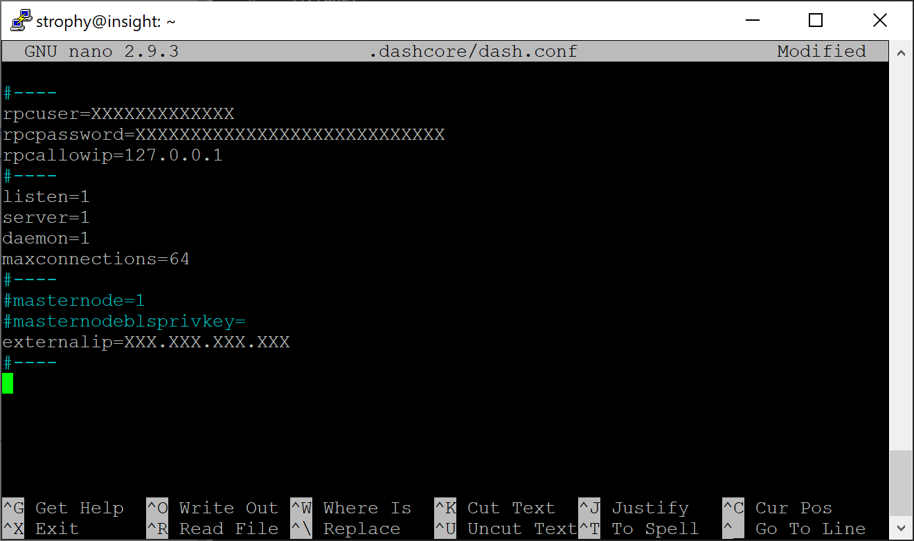
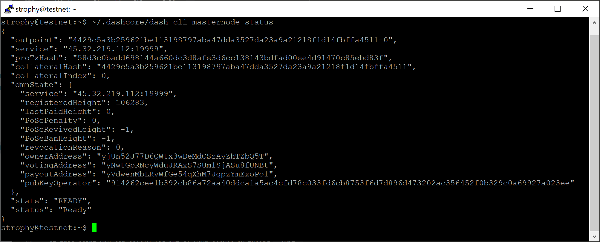

.. meta::
   :description: This guide describes how to set up a Dash masternode. It also describes various options for hosting and different wallets
   :keywords: dash, guide, masternodes, trezor, dip3, setup, bls

.. _masternode-setup:

=====
Setup
=====

Setting up a masternode requires a basic understanding of Linux and
blockchain technology, as well as an ability to follow instructions
closely. It also requires regular maintenance and careful security,
particularly if you are not storing your Dash on a hardware wallet.
There are some decisions to be made along the way, and optional extra
steps to take for increased security.

Commercial :ref:`masternode hosting services <masternode-hosting>` are
available if you prefer to delegate day-to-day operation of your
masternode to a professional operator. When using these hosting
services, you retain full control of the 1000 DASH collateral and pay an
agreed percentage of your reward to the operator. It is also possible to
delegate your voting keys to a representative, see the 
:ref:`governance documentation <delegating-votes>` for more
information.

Before you begin
================

This guide assumes you are setting up a single mainnet masternode for
the first time. If you are updating a masternode, see  :ref:`here
<masternode-update>` instead. You will need:

- 1000 Dash
- A wallet to store your Dash, preferably a hardware wallet, although 
  Dash Core wallet is also supported
- A Linux server, preferably a Virtual Private Server (VPS)

Dash 0.13.0 and later implement DIP003, which introduces several changes
to how a Dash masternode is set up and operated. While this network
upgrade was completed in early 2019, a list of available documentation
appears below:

- `DIP003 Deterministic Masternode Lists <https://github.com/dashpay/dips/blob/master/dip-0003.md>`__
- :ref:`dip3-changes`
- `Dash 0.13 Upgrade Procedure for Masternodes (legacy documentation) <https://docs.dash.org/en/0.13.0/masternodes/dip3-upgrade.html>`__
- :ref:`Full masternode setup guide <masternode-setup>` (you are here)
- :ref:`Information for users of hosted masternodes <hosted-setup>`
- :ref:`Information for operators of hosted masternodes <operator-transactions>`

This documentation describes the commands as if they were entered in the Dash
Core GUI by opening the console from **Window > Console**, but the same result
can be achieved on a masternode by entering the same commands and adding the
prefix ``~/.dashcore/dash-cli`` to each command.

.. _vps-setup:

Set up your VPS
===============

A VPS, more commonly known as a cloud server, is fully functional
installation of an operating system (usually Linux) operating within a
virtual machine. The virtual machine allows the VPS provider to run
multiple systems on one physical server, making it more efficient and
much cheaper than having a single operating system running on the "bare
metal" of each server. A VPS is ideal for hosting a Dash masternode
because they typically offer guaranteed uptime, redundancy in the case
of hardware failure and a static IP address that is required to ensure
you remain in the masternode payment queue. While running a masternode
from home on a desktop computer is technically possible, it will most
likely not work reliably because most ISPs allocate dynamic IP addresses
to home users.

We will use `Vultr <https://www.vultr.com/>`_ hosting as an example of a
VPS, although `DigitalOcean <https://www.digitalocean.com/>`_, `Amazon
EC2 <https://aws.amazon.com/ec2/>`_, `Google Cloud
<https://cloud.google.com/compute/>`_, `Choopa
<https://www.choopa.com/>`_ and `OVH <https://www.ovh.com.au/>`_ are
also popular choices. First create an account and add credit. Then go to
the **Servers** menu item on the left and click **+** to add a new
server. Select a location for your new server on the following screen:

.. figure:: img/setup-server-location.png
   :width: 400px

   Vultr server location selection screen

Select Ubuntu 20.04 x64 as the server type. We use this LTS release of
Ubuntu instead of the latest version because LTS releases are supported
with security updates for 5 years, instead of the usual 9 months.

.. figure:: img/setup-server-type.png
   :width: 400px

   Vultr server type selection screen

Select a server size offering at least 2GB of memory.

.. figure:: img/setup-server-size.png
   :width: 400px

   Vultr server size selection screen

Enter a hostname and label for your server. In this example we will use
``dashmn1`` as the hostname.

.. figure:: img/setup-server-hostname.png
   :width: 400px

   Vultr server hostname & label selection screen

Vultr will now install your server. This process may take a few minutes.

.. figure:: img/setup-server-installing.png
   :width: 400px

   Vultr server installation screen

Click **Manage** when installation is complete and take note of the IP
address, username and password.

.. figure:: img/setup-server-manage.png
   :width: 276px

   Vultr server management screen

.. _vps-os-setup:

Set up your operating system
============================

We will begin by connecting to your newly provisioned server. On
Windows, we will first download an app called PuTTY to connect to the
server. Go to the `PuTTY download page <https://www.chiark.greenend.org.uk/~sgtatham/putty/latest.html>`_
and select the appropriate MSI installer for your system.
On Mac or Linux you can ssh directly from
the terminal - simply type ``ssh root@<server_ip>`` and enter your
password when prompted.

.. figure:: img/setup-putty-download.png
   :width: 400px

   PuTTY download page

Double-click the downloaded file to install PuTTY, then run the app from
your Start menu. Enter the IP address of the server in the **Host Name**
field and click **Open**. You may see a certificate warning, since this
is the first time you are connecting to this server. You can safely
click **Yes** to trust this server in the future.

.. figure:: img/setup-putty-alert.png
   :width: 320px

   PuTTY security alert when connecting to a new server

You are now connected to your server and should see a terminal
window. Begin by logging in to your server with the user ``root`` and
password supplied by your hosting provider.

.. figure:: img/setup-putty-connect.png
   :width: 400px

   Password challenge when connecting to your VPS for the first time

You should immediately change the root password and store it in a safe
place for security. You can copy and paste any of the following commands
by selecting them in your browser, pressing **Ctrl + C**, then switching
to the PuTTY window and right-clicking in the window. The text will
paste at the current cursor location::

  passwd root

Enter and confirm a new password (preferably long and randomly
generated). Next we will create a new user with the following command,
replacing ``<username>`` with a username of your choice::

  adduser <username>

You will be prompted for a password. Enter and confirm using a new
password (different to your root password) and store it in a safe place.
You will also see prompts for user information, but this can be left
blank. Once the user has been created, we will add them to the sudo
group so they can perform commands as root::

  usermod -aG sudo <username>

Now, while still as root, we will update the system from the Ubuntu
package repository::

  apt update
  apt upgrade

The system will show a list of upgradable packages. Press **Y** and
**Enter** to install the packages. We will now install a firewall (and
some other packages we will use later), add swap memory and reboot the
server to apply any necessary kernel updates, and then login to our
newly secured environment as the new user::

  apt install ufw python virtualenv git unzip pv

(press **Y** and **Enter** to confirm)

::

  ufw allow ssh/tcp
  ufw limit ssh/tcp
  ufw allow 9999/tcp
  ufw logging on
  ufw enable

(press **Y** and **Enter** to confirm)

::

  fallocate -l 4G /swapfile
  chmod 600 /swapfile
  mkswap /swapfile
  swapon /swapfile
  nano /etc/fstab

Add the following line at the end of the file (press tab to separate
each word/number), then press **Ctrl + X** to close the editor, then
**Y** and **Enter** save the file.

::

  /swapfile none swap sw 0 0

Finally, in order to prevent brute force password hacking attacks, we
will install fail2ban and disable root login over ssh. These steps are
optional, but highly recommended. Start with fail2ban::

  apt install fail2ban

Create a new configuration file::

  nano /etc/fail2ban/jail.local

And paste in the following configuration::

  [sshd]
  enabled = true
  port = 22
  filter = sshd
  logpath = /var/log/auth.log
  maxretry = 3

Then press **Ctrl + X** to close the editor, then **Y** and **Enter**
save the file. Retart and enable the fail2ban service::

  systemctl restart fail2ban
  systemctl enable fail2ban

Next, open the SSH configuration file to disable root login over SSH::

  nano /etc/ssh/sshd_config

Locate the line that reads ``PermitRootLogin yes`` and set it to
``PermitRootLogin no``. Directly below this, add a line which reads
``AllowUsers <username>``, replacing ``<username>`` with the username
you selected above. Then press **Ctrl + X** to close the editor, then
**Y** and **Enter** save the file.

Then reboot the server::

  reboot now

PuTTY will disconnect when the server reboots.

While this setup includes basic steps to protect your server against
attacks, much more can be done. In particular, `authenticating with a public key <https://help.ubuntu.com/community/SSH/OpenSSH/Keys>`_
instead of a username/password combination and `enabling automatic security updates <https://help.ubuntu.com/community/AutomaticSecurityUpdates>`_ 
is advisable. More tips are available `here <https://www.cyberciti.biz/tips/linux-security.html>`__. 
However, since the masternode does not actually store the keys to any
Dash, these steps are considered beyond the scope of this guide.

Send the collateral
===================

A Dash address with a single unspent transaction output (UTXO) of exactly 1000
DASH is required to operate a masternode. Once it has been sent, various keys
regarding the transaction must be extracted for later entry in a configuration
file and registration transaction as proof to write the configuration to the
blockchain so the masternode can be included in the deterministic list.

A masternode can be registered from a hardware wallet, the official Dash Core
wallet, or a Dash Electrum wallet, although a hardware wallet is highly
recommended to enhance security and protect yourself against hacking. This guide
will describe the steps for both hardware wallets and Dash Core.

.. note::

  Details of registering a masternode with Dash Electrum can be found on the
  :ref:`Electrum - Advanced Functions page <electrum-masternodes>`.

Option 1: Sending from a hardware wallet
----------------------------------------

Set up your Trezor using the Trezor wallet at https://wallet.trezor.io/
and send a test transaction to verify that it is working properly. For
help on this, see :ref:`this guide <hardware-trezor>` - you may also
choose to (carefully!) `add a passphrase <https://blog.trezor.io/passphrase-the-ultimate-protection-for-your-accounts-3a311990925b>`_
to your Trezor to further protect your collateral. Create a new account
in your Trezor wallet by clicking **Add account**. Then click the
**Receive** tab and send exactly 1000 DASH to the address displayed. If
you are setting up multiple masternodes, send 1000 DASH to consecutive
addresses within the same new account. You should see the transaction as
soon as the first confirmation arrives, usually within a few minutes.

.. figure:: img/setup-collateral-trezor.png
   :width: 400px

   Trezor Wallet Receive tab showing successfully received collateral of
   1000 DASH

Once the transaction appears, click the QR code on the right to view the
transaction on the blockchain. Keep this window open as we complete the
following steps, since we will soon need to confirm that 15
confirmations exist, as shown in the following screenshot.

.. figure:: img/setup-collateral-blocks.png
   :width: 400px

   Trezor blockchain explorer showing 15 confirmations for collateral
   transfer

While we are waiting for 15 confirmations, download the latest version
of the Dash Masternode Tool (DMT) from the GitHub releases page `here
<https://github.com/Bertrand256/dash-masternode-tool/releases>`__. Unzip
and run the file. The following window appears.

.. figure:: img/setup-collateral-dmt-start.png
   :width: 400px

   Dash Masternode Tool startup screen

Click the third button from the left **Check Dash Network Connection**
in the top left corner of the main window to verify that the connection
is working. Then connect your Trezor device and click the next button
**Test Hardware Wallet Connection** to verify the Trezor connection is
working.

.. image:: img/setup-collateral-connection.png
   :width: 100px

.. figure:: img/setup-collateral-hardware.png
   :width: 180px

   Dash Masternode Tool successful connection confirmations

We will now use DMT to enter some basic information about the masternode
and extract the transaction ID. Carry out the following sequence of
steps as shown in this screenshot:

.. figure:: img/setup-collateral-dmt-steps.png
   :width: 400px

   Dash Masternode Tool configuration steps

#. Click the **New** button.
#. Enter a name for your masternode. The host name you specified 
   for your VPS above is a good choice.
#. Enter the IP address of your masternode. This was given to you
   by the VPS provider when you set up the server. Then enter the TCP 
   port number. This should be 9999.
#. Click **Locate collateral** to view unused collateral funding 
   transactions available on the connected hardware wallet. Select the 
   address to which you sent 1000 Dash and click **Apply**. The 
   **Collateral address**, **path**, **Collateral TX hash** and
   **index** fields should be filled automatically.

.. figure:: img/setup-collateral-dmt-ready.png
   :width: 400px

   Dash Masternode Tool with masternode configuration

Leave DMT open and continue with the next step: :ref:`installing Dash
Core on your VPS <masternode-setup-install-dashcore>`.

Option 2: Sending from Dash Core wallet
---------------------------------------

Open Dash Core wallet and wait for it to synchronize with the network.
It should look like this when ready:

.. figure:: img/setup-collateral-dashcore.png
   :width: 400px

   Fully synchronized Dash Core wallet

Click **Window > Console** to open the console. Type the following
command into the console to generate a new Dash address for the
collateral::

  getnewaddress
  yiFfzbwiN9oneftd7cEfr3kQLRwQ4kp7ue

Take note of the collateral address, since we will need it later.  The
next step is to secure your wallet (if you have not already done so).
First, encrypt the wallet by selecting **Settings > Encrypt wallet**.
You should use a strong, new password that you have never used somewhere
else. Take note of your password and store it somewhere safe or you will
be permanently locked out of your wallet and lose access to your funds.
Next, back up your wallet file by selecting **File > Backup Wallet**.
Save the file to a secure location physically separate to your computer,
since this will be the only way you can access our funds if anything
happens to your computer. For more details on these steps, see
:ref:`here <dashcore-backup>`.

Now send exactly 1000 DASH in a single transaction to the new address
you generated in the previous step. This may be sent from another
wallet, or from funds already held in your current wallet. Once the
transaction is complete, view the transaction in a `blockchain explorer
<https://insight.dash.org/insight/>`_ by searching for the address. You
will need 15 confirmations before you can register the masternode, but
you can continue with the next step at this point already: generating
your masternode operator key.

.. figure:: img/setup-collateral-blocks.png
   :width: 400px

   Trezor blockchain explorer showing 15 confirmations for collateral
   transfer

.. _masternode-setup-install-dashcore:

Install Dash Core
=================

Dash Core is the software behind both the Dash Core GUI wallet and Dash
masternodes. If not displaying a GUI, it runs as a daemon on your VPS
(dashd), controlled by a simple command interface (dash-cli).

Open PuTTY or a console again and connect using the username and
password you just created for your new, non-root user. The following
options are available for installing a Dash masternode:

- Manual installation (this guide)
- `xkcd's installation guide <https://www.dash.org/forum/threads/system-wide-masternode-setup-with-systemd-auto-re-start-rfc.39460/>`__
- `dashman installation <https://docs.dash.org/en/0.15.0/masternodes/setup.html#option-1-automated-installation-using-dashman>`__ (deprecated)
- `mn-bootstrap installation <https://docs.dash.org/en/mn-bootstrap/masternodes/setup.html#install-mn-bootstrap>`__ (beta version, currently testnet only)

Manual installation
-----------------------------

To manually download and install the components of your Dash masternode,
visit the `GitHub releases page <https://github.com/dashpay/dash/releases>`_ 
and copy the link to the latest ``x86_64-linux-gnu`` version. Go back to
your terminal window and enter the following command, pasting in the
address to the latest version of Dash Core by right clicking or pressing
**Ctrl + V**::

  cd /tmp
  wget https://github.com/dashpay/dash/releases/download/v0.17.0.3/dashcore-0.17.0.3-x86_64-linux-gnu.tar.gz

Verify the authenticity of your download by checking its detached
signature against the public key published by the Dash Core development
team. All releases of Dash are signed using GPG with one of the
following keys:

- Alexander Block (codablock) with the key ``63A9 6B40 6102 E091``,
  `verifiable here on Keybase <https://keybase.io/codablock>`__
- Pasta (pasta) with the key ``5252 7BED ABE8 7984``, `verifiable here
  on Keybase <https://keybase.io/pasta>`__

::

  curl https://keybase.io/codablock/pgp_keys.asc | gpg --import
  curl https://keybase.io/pasta/pgp_keys.asc | gpg --import
  wget https://github.com/dashpay/dash/releases/download/v0.17.0.3/dashcore-0.17.0.3-x86_64-linux-gnu.tar.gz.asc
  gpg --verify dashcore-0.17.0.3-x86_64-linux-gnu.tar.gz.asc

Create a working directory for Dash, extract the compressed archive and
copy the necessary files to the directory::

  mkdir ~/.dashcore
  tar xfv dashcore-0.17.0.3-x86_64-linux-gnu.tar.gz
  cp -f dashcore-0.17.0/bin/dashd ~/.dashcore/
  cp -f dashcore-0.17.0/bin/dash-cli ~/.dashcore/

Create a configuration file using the following command::

  nano ~/.dashcore/dash.conf

An editor window will appear. We now need to create a configuration file
specifying several variables. Copy and paste the following text to get
started, then replace the variables specific to your configuration as
follows::

  #----
  rpcuser=XXXXXXXXXXXXX
  rpcpassword=XXXXXXXXXXXXXXXXXXXXXXXXXXXX
  rpcallowip=127.0.0.1
  #----
  listen=1
  server=1
  daemon=1
  #----
  #masternodeblsprivkey=
  externalip=XXX.XXX.XXX.XXX
  #----

Replace the fields marked with ``XXXXXXX`` as follows:

- ``rpcuser``: enter any string of numbers or letters, no special
  characters allowed
- ``rpcpassword``: enter any string of numbers or letters, no special
  characters allowed
- ``externalip``: this is the IP address of your VPS

Leave the ``masternodeblsprivkey`` field commented out for now. The
result should look something like this:

   Entering key data in dash.conf on the masternode

Press **Ctrl + X** to close the editor and **Y** and **Enter** save the
file. You can now start running Dash on the masternode to begin
synchronization with the blockchain::

  ~/.dashcore/dashd

You will see a message reading **Dash Core server starting**. We will
now install Sentinel, a piece of software which operates as a watchdog
to communicate to the network that your node is working properly::

  cd ~/.dashcore
  git clone https://github.com/dashpay/sentinel.git
  cd sentinel
  virtualenv venv
  venv/bin/pip install -r requirements.txt
  venv/bin/python bin/sentinel.py

You will see a message reading **dashd not synced with network! Awaiting
full sync before running Sentinel.** Add dashd and sentinel to crontab
to make sure it runs every minute to check on your masternode::

  crontab -e

Choose nano as your editor and enter the following lines at the end of
the file::

  * * * * * cd ~/.dashcore/sentinel && ./venv/bin/python bin/sentinel.py 2>&1 >> sentinel-cron.log
  * * * * * pidof dashd || ~/.dashcore/dashd

Press enter to make sure there is a blank line at the end of the file,
then press **Ctrl + X** to close the editor and **Y** and **Enter** save
the file. We now need to wait for 15 confirmations of the collateral
transaction to complete, and wait for the blockchain to finish
synchronizing on the masternode. You can use the following commands to
monitor progress::

  ~/.dashcore/dash-cli mnsync status

When synchronisation is complete, you should see the following
response::

  {
    "AssetID": 999,
    "AssetName": "MASTERNODE_SYNC_FINISHED",
    "AssetStartTime": 1558596597,
    "Attempt": 0,
    "IsBlockchainSynced": true,
    "IsSynced": true,
    "IsFailed": false
  }

Continue with the next step to construct the ProTx transaction required
to enable your masternode.

.. _register-masternode:

Register your masternode
========================

DIP003 introduced several changes to how a masternode is set up and
operated. These changes and the three keys required for the different
masternode roles are described briefly under :ref:`dip3-changes` in this
documentation.

Option 1: Registering from a hardware wallet
--------------------------------------------

Go back to DMT and ensure that all fields from the previous step are
still filled out correctly.  Click **Generate new** for the three
private keys required for a DIP003 deterministic masternode:

- Owner private key
- Operator private key
- Voting private key

.. figure:: img/setup-dmt-full.png
   :width: 220px

   Dash Masternode Tool ready to register a new masternode

Then click **Register masternode**. Optionally specify a different
**Payout address** and/or **Operator reward**, then click **Continue**.
Select **Remote Dash RPC Node (automatic method)**. (See `here <https://github.com/Bertrand256/dash-masternode-tool/blob/master/doc/config-connection-direct.md>`__ 
for documentation on using your own local RPC node.) and confirm the
following two messages:

.. image:: img/setup-dmt-send.png
   :width: 220px

.. figure:: img/setup-dmt-sent.png
   :width: 220px

   Dash Masternode Tool confirmation dialogs to register a masternode

The BLS private key must be entered in the ``dash.conf`` file on the
masternode. This allows the masternode to watch the blockchain for
relevant Pro*Tx transactions, and will cause it to start serving as a
masternode when the signed ProRegTx is broadcast by the owner, as we
just did above. Log in to your masternode using ``ssh`` or PuTTY and
edit the configuration file as follows::

  nano ~/.dashcore/dash.conf

The editor appears with the existing masternode configuration. Add or
uncomment this lines in the file, replacing the key with your BLS
private key generated above::

  masternodeblsprivkey=24c1fa3c22c6ea6b1cc68a37be18acb51042b19465fe0a26301c8717bf939805

Press enter to make sure there is a blank line at the end of the file,
then press **Ctrl + X** to close the editor and **Y** and **Enter** save
the file. Note that providing a ``masternodeblsprivkey`` enables
masternode mode, which will automatically force the ``txindex=1``,
``peerbloomfilters=1``, and ``prune=0`` settings necessary to provide
masternode service. We now need to restart the masternode for this
change to take effect. Enter the following commands, waiting a few
seconds in between to give Dash Core time to shut down::

  ~/.dashcore/dash-cli stop
  sleep 15
  ~/.dashcore/dashd

At this point you can monitor your masternode by entering
``~/.dashcore/dash-cli masternode status`` or using the **Get status**
function in DMT. The final result should appear as follows:

   dash-cli masternode status output showing successfully registered masternode

At this point you can safely log out of your server by typing ``exit``.
Congratulations! Your masternode is now running.

.. _dashcore-protx:

Option 2: Registering from Dash Core wallet
-------------------------------------------

Identify the funding transaction
^^^^^^^^^^^^^^^^^^^^^^^^^^^^^^^^

If you used an address in Dash Core wallet for your collateral
transaction, you now need to find the txid of the transaction. Click
**Window > Console** and enter the following command::

  masternode outputs

This should return a string of characters similar to the following::

  {
  "16347a28f4e5edf39f4dceac60e2327931a25fdee1fb4b94b63eeacf0d5879e3" : "1",
  }

The first long string is your ``collateralHash``, while the last number
is the ``collateralIndex``. 

.. _bls-generation:

Generate a BLS key pair
^^^^^^^^^^^^^^^^^^^^^^^

A public/private BLS key pair is required to operate a masternode. The
private key is specified on the masternode itself, and allows it to be
included in the deterministic masternode list once a provider
registration transaction with the corresponding public key has been
created.

If you are using a hosting service, they may provide you with their
public key, and you can skip this step. If you are hosting your own
masternode or have agreed to provide your host with the BLS private key,
generate a BLS public/private keypair in Dash Core by clicking **Tools >
Console** and entering the following command::

  bls generate

  {
    "secret": "395555d67d884364f9e37e7e1b29536519b74af2e5ff7b62122e62c2fffab35e",
    "public": "99f20ed1538e28259ff80044982372519a2e6e4cdedb01c96f8f22e755b2b3124fbeebdf6de3587189cf44b3c6e7670e"
  }

**These keys are NOT stored by the wallet and must be kept secure,
similar to the value provided in the past by the** ``masternode genkey``
**command.**

Add the private key to your masternode configuration
^^^^^^^^^^^^^^^^^^^^^^^^^^^^^^^^^^^^^^^^^^^^^^^^^^^^

The public key will be used in following steps. The private key must be
entered in the ``dash.conf`` file on the masternode. This allows the
masternode to watch the blockchain for relevant Pro*Tx transactions, and
will cause it to start serving as a masternode when the signed ProRegTx
is broadcast by the owner (final step below). Log in to your masternode
using ``ssh`` or PuTTY and edit the configuration file as follows::

  nano ~/.dashcore/dash.conf

The editor appears with the existing masternode configuration. Add or
uncomment this line in the file, replacing the key with your BLS private
key generated above::

  masternodeblsprivkey=395555d67d884364f9e37e7e1b29536519b74af2e5ff7b62122e62c2fffab35e

Press enter to make sure there is a blank line at the end of the file,
then press **Ctrl + X** to close the editor and **Y** and **Enter** save
the file. Note that providing a ``masternodeblsprivkey`` enables
masternode mode, which will automatically force the ``txindex=1``,
``peerbloomfilters=1``, and ``prune=0`` settings necessary to provide
masternode service. We now need to restart the masternode for this
change to take effect. Enter the following commands, waiting a few
seconds in between to give Dash Core time to shut down::

  ~/.dashcore/dash-cli stop
  sleep 15
  ~/.dashcore/dashd

We will now prepare the transaction used to register the masternode on
the network.

Prepare a ProRegTx transaction
^^^^^^^^^^^^^^^^^^^^^^^^^^^^^^

A pair of BLS keys for the operator were already generated above, and
the private key was entered on the masternode. The public key is used in
this transaction as the ``operatorPubKey``.

First, we need to get a new, unused address from the wallet to serve as
the **owner key address** (``ownerKeyAddr``). This is not the same as
the collateral address holding 1000 Dash. Generate a new address as
follows::

  getnewaddress

  yfgxFhqrdDG15ZWKJAN6dQvn6dZdgBPAip

This address can also be used as the **voting key address**
(``votingKeyAddr``). Alternatively, you can specify an address provided
to you by your chosen voting delegate, or simply generate a new voting
key address as follows::

  getnewaddress

  yfRaZN8c3Erpqj9iKnmQ9QDBeUuRhWV3Mg

Then either generate or choose an existing address to receive the
**owner's masternode payouts** (``payoutAddress``). It is also possible
to use an address external to the wallet::

  getnewaddress

  yjZVt49WsQd6XSrPVAUGXtJccxviH9ZQpN

You can also optionally generate and fund another address as the
**transaction fee source** (``feeSourceAddress``). If you selected an
external payout address, you must specify a fee source address. 

Either the payout address or fee source address must have enough balance
to pay the transaction fee, or the ``register_prepare`` transaction will
fail.

The private keys to the owner and fee source addresses must exist in the
wallet submitting the transaction to the network. If your wallet is
protected by a password, it must now be unlocked to perform the
following commands. Unlock your wallet for 5 minutes::

  walletpassphrase yourSecretPassword 300

We will now prepare an unsigned ProRegTx special transaction using the
``protx register_prepare`` command. This command has the following
syntax::

  protx register_prepare collateralHash collateralIndex ipAndPort ownerKeyAddr 
    operatorPubKey votingKeyAddr operatorReward payoutAddress (feeSourceAddress)

Open a text editor such as notepad to prepare this command. Replace each
argument to the command as follows:

- ``collateralHash``: The txid of the 1000 Dash collateral funding 
  transaction
- ``collateralIndex``: The output index of the 1000 Dash funding 
  transaction
- ``ipAndPort``: Masternode IP address and port, in the format 
  ``x.x.x.x:yyyy``
- ``ownerKeyAddr``: The new Dash address generated above for the 
  owner/voting address
- ``operatorPubKey``: The BLS public key generated above (or provided 
  by your hosting service)
- ``votingKeyAddr``: The new Dash address generated above, or the 
  address of a delegate, used for proposal voting
- ``operatorReward``: The percentage of the block reward allocated to 
  the operator as payment
- ``payoutAddress``: A new or existing Dash address to receive the 
  owner's masternode rewards
- ``feeSourceAddress``: An (optional) address used to fund ProTx fee. 
  ``payoutAddress`` will be used if not specified.

Note that the operator is responsible for :ref:`specifying their own
reward <dip3-update-service>` address in a separate ``update_service``
transaction if you specify a non-zero ``operatorReward``. The owner of
the masternode collateral does not specify the operator's payout
address.

Example (remove line breaks if copying)::

  protx register_prepare 
    16347a28f4e5edf39f4dceac60e2327931a25fdee1fb4b94b63eeacf0d5879e3 
    1 
    45.76.230.239:19999 
    yfgxFhqrdDG15ZWKJAN6dQvn6dZdgBPAip 
    99f20ed1538e28259ff80044982372519a2e6e4cdedb01c96f8f22e755b2b3124fbeebdf6de3587189cf44b3c6e7670e 
    yfRaZN8c3Erpqj9iKnmQ9QDBeUuRhWV3Mg 
    0 
    yjZVt49WsQd6XSrPVAUGXtJccxviH9ZQpN 
    yR83WsikBaBaNusTnHZf28kAcL8oVmp1TE

Output::

  {
    "tx": "030001000175c9d23c2710798ef0788e6a4d609460586a20e91a15f2097f56fc6e007c4f8e0000000000feffffff01a1949800000000001976a91434b09363474b14d02739a327fe76e6ea12deecad88ac00000000d1010000000000e379580dcfea3eb6944bfbe1de5fa2317932e260acce4d9ff3ede5f4287a34160100000000000000000000000000ffff2d4ce6ef4e1fd47babdb9092489c82426623299dde76b9c72d9799f20ed1538e28259ff80044982372519a2e6e4cdedb01c96f8f22e755b2b3124fbeebdf6de3587189cf44b3c6e7670ed1935246865dce1accce6c8691c8466bd67ebf1200001976a914fef33f56f709ba6b08d073932f925afedaa3700488acfdb281e134504145b5f8c7bd7b47fd241f3b7ea1f97ebf382249f601a0187f5300",
    "collateralAddress": "yjSPYvgUiAQ9AFj5tKFA8thFLoLBUxQERb",
    "signMessage": "yjZVt49WsQd6XSrPVAUGXtJccxviH9ZQpN|0|yfgxFhqrdDG15ZWKJAN6dQvn6dZdgBPAip|yfRaZN8c3Erpqj9iKnmQ9QDBeUuRhWV3Mg|ad5f82257bd00a5a1cb5da1a44a6eb8899cf096d3748d68b8ea6d6b10046a28e"
  }

Next we will use the ``collateralAddress`` and ``signMessage`` fields to
sign the transaction, and the output of the ``tx`` field to submit the
transaction.

Sign the ProRegTx transaction
^^^^^^^^^^^^^^^^^^^^^^^^^^^^^

We will now sign the content of the ``signMessage`` field using the
private key for the collateral address as specified in
``collateralAddress``. Note that no internet connection is required for
this step, meaning that the wallet can remain disconnected from the
internet in cold storage to sign the message. In this example we will
again use Dash Core, but it is equally possible to use the signing
function of a hardware wallet. The command takes the following syntax::

  signmessage collateralAddress signMessage

Example::

  signmessage yjSPYvgUiAQ9AFj5tKFA8thFLoLBUxQERb yjZVt49WsQd6XSrPVAUGXtJccxviH9ZQpN|0|yfgxFhqrdDG15ZWKJAN6dQvn6dZdgBPAip|yfRaZN8c3Erpqj9iKnmQ9QDBeUuRhWV3Mg|ad5f82257bd00a5a1cb5da1a44a6eb8899cf096d3748d68b8ea6d6b10046a28e

Output::

  II8JvEBMj6I3Ws8wqxh0bXVds6Ny+7h5HAQhqmd5r/0lWBCpsxMJHJT3KBcZ23oUZtsa6gjgISf+a8GzJg1BfEg=

Submit the signed message
^^^^^^^^^^^^^^^^^^^^^^^^^

We will now submit the ProRegTx special transaction to the blockchain to
register the masternode. This command must be sent from a Dash Core
wallet holding a balance on either the ``feeSourceAddress`` or
``payoutAddress``, since a standard transaction fee is involved. The
command takes the following syntax::

  protx register_submit tx sig

Where: 

- ``tx``: The serialized transaction previously returned in the ``tx`` 
  output field from the ``protx register_prepare`` command
- ``sig``: The message signed with the collateral key from the 
  ``signmessage`` command

Example::

  protx register_submit 030001000175c9d23c2710798ef0788e6a4d609460586a20e91a15f2097f56fc6e007c4f8e0000000000feffffff01a1949800000000001976a91434b09363474b14d02739a327fe76e6ea12deecad88ac00000000d1010000000000e379580dcfea3eb6944bfbe1de5fa2317932e260acce4d9ff3ede5f4287a34160100000000000000000000000000ffff2d4ce6ef4e1fd47babdb9092489c82426623299dde76b9c72d9799f20ed1538e28259ff80044982372519a2e6e4cdedb01c96f8f22e755b2b3124fbeebdf6de3587189cf44b3c6e7670ed1935246865dce1accce6c8691c8466bd67ebf1200001976a914fef33f56f709ba6b08d073932f925afedaa3700488acfdb281e134504145b5f8c7bd7b47fd241f3b7ea1f97ebf382249f601a0187f5300 II8JvEBMj6I3Ws8wqxh0bXVds6Ny+7h5HAQhqmd5r/0lWBCpsxMJHJT3KBcZ23oUZtsa6gjgISf+a8GzJg1BfEg=

Output::

  aba8c22f8992d78fd4ff0c94cb19a5c30e62e7587ee43d5285296a4e6e5af062

Your masternode is now registered and will appear on the Deterministic
Masternode List after the transaction is mined to a block. You can view
this list on the **Masternodes -> DIP3 Masternodes** tab of the Dash
Core wallet, or in the console using the command ``protx list valid``,
where the txid of the final ``protx register_submit`` transaction
identifies your masternode.

At this point you can go back to your terminal window and monitor your
masternode by entering ``~/.dashcore/dash-cli masternode status`` or
using the **Get status** function in DMT. 

At this point you can safely log out of your server by typing ``exit``.
Congratulations! Your masternode is now running.

.. _dashelectrum-protx:

Option 3: Registering from Dash Electrum wallet
-----------------------------------------------

Dash Electrum supports registering and managing masternodes. Details can be
found on the :ref:`Electrum - Advanced Functions page <electrum-masternodes>`.
If combined with Electrum's :ref:`multisig features <electrum-multisig>` the
masternode collateral can be stored in a multisig wallet for increased security
flexibility.

.. warning::
  Always exercise caution when using multisig accounts and verify that each
  mnemonic is backed up appropriately. See `this page
  <https://github.com/dashpay/docs/blob/master/wallets/electrum/dip3_p2sh_howto.md>`_
  for the Dash Electrum documentation demonstrating how to configure a
  masternode using a multisig collateral.
  