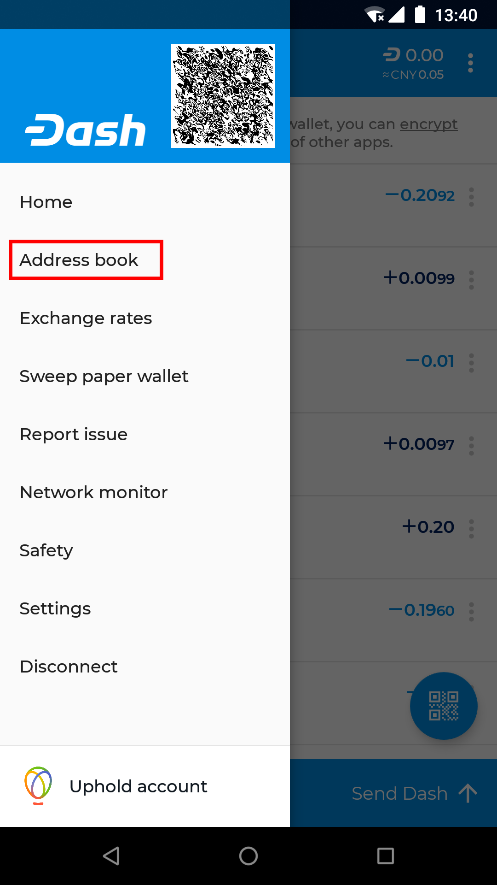
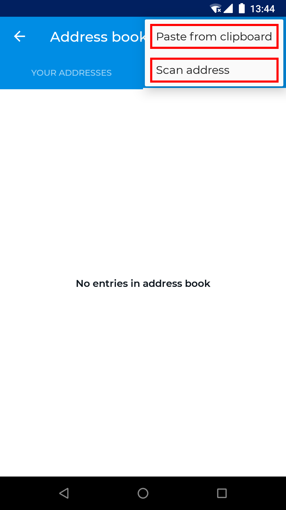
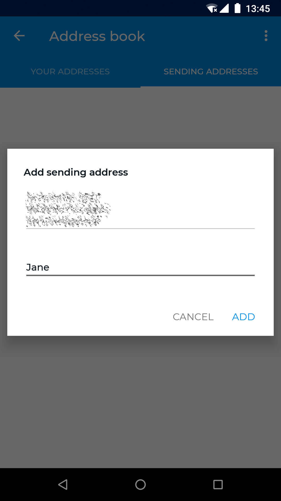
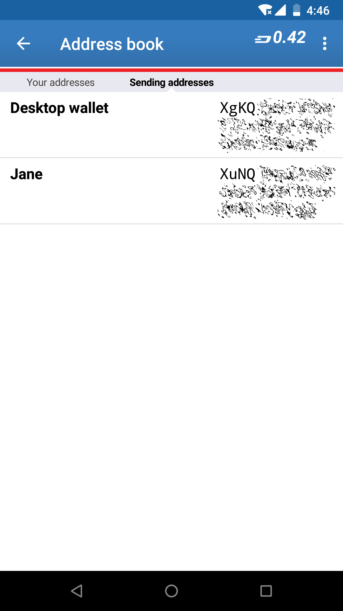
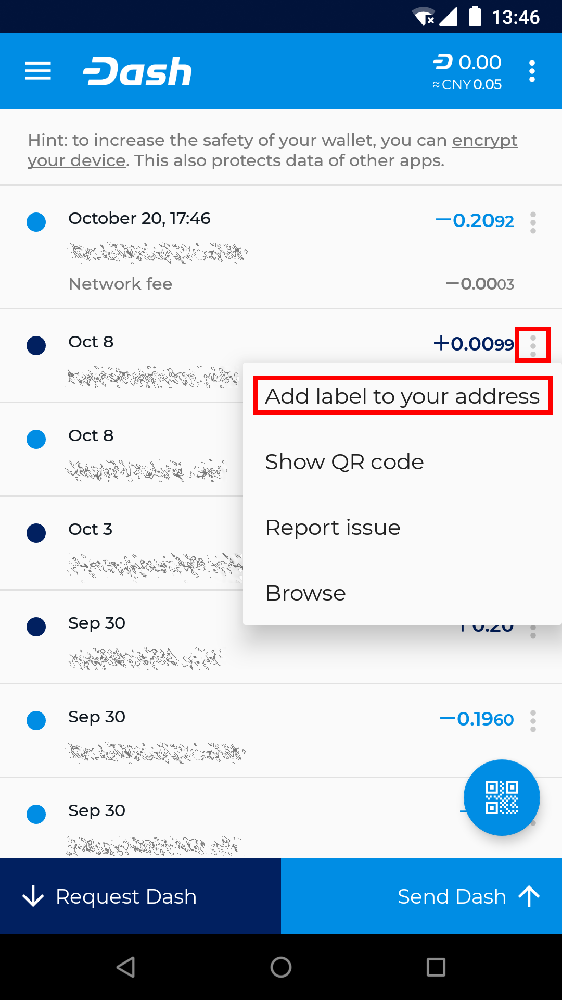
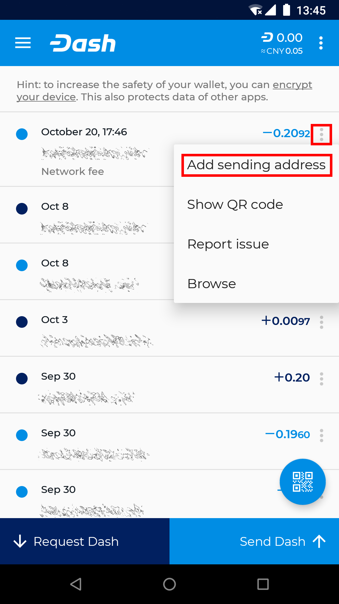
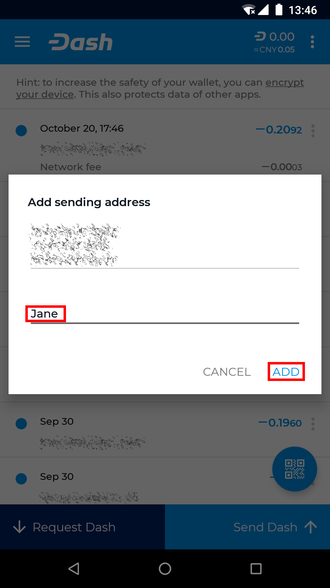

.. _dash-android-advanced-functions:

Advanced functions
==================

Address book
------------

Your Android wallet allows you to manage frequently used addresses by
adding a label to help you identify the owner. You can also label your
own addresses in the wallet in order to keep track of regular incoming
payments. You can access the address book by tapping the menu button,
then **Address book**. This will display a screen where you can swipe
left and right between your own addresses and the addresses to which you
frequently send Dash, such as family members for example. Tap **More
options** button to add an address from the clipboard or by scanning a
QR code, or tap an existing address to **Send Dash** or **Edit** the
label.

.. image:: img/address-tap-menu.png
    :width: 160 px

*Accessing the address book and adding an address*

You can also add labels directly from the main transaction history
screen by tapping the **More options** button for the transaction (three
vertical dots) and entering or editing a label. 

*Adding and editing address labels in transaction view*

Exchange rates
--------------

Dash Wallet for Android allows you to display the equivalent value of
your Dash balance and in transactions by selecting a default fiat
currency. The exchange rate for this currency will appear when making
transactions, and you can also tap in the fiat currency field to enter
the value in that currency instead of Dash.

Sweep paper wallet
------------------

Network monitor
---------------

Settings
--------

Denomination and precision

Own name

Auto-close send coins dialog

Connectivity indicator

Trusted peer

Skip regular peer discovery

Block explorer

Data usage

Balance reminder

Enable InstantSend

Enable Lite Mode

Show disclaimer

BIP70 for scan-to-pay

Look up wallet names