.. _dash-android-advanced-functions:

Advanced functions
==================

Address book
------------

Your Android wallet allows you to manage frequently used addresses by
adding a label to help you identify the owner. You can also label your
own addresses in the wallet in order to keep track of regular incoming
payments. You can access the address book by tapping the **Menu
button**, then **Address book**. This will display a screen where you
can swipe left and right between your own addresses and the addresses to
which you frequently send Dash, such as family members for example. Tap
the **More options** button to **Paste from clipboard** or to **Scan
address* from a QR code, or tap an existing address to **Send Dash** or
**Edit** the label.

.. image:: img/menu-address.png
   :width: 160 px
.. image:: img/address-menu.png
   :width: 160 px
.. image:: img/address-add.png
   :width: 160 px
.. image:: img/address-tap-menu.png
   :width: 160 px

*Accessing the address book and adding an address*

You can also add labels directly from the main transaction history
screen by tapping the **More options** button for the transaction (three
vertical dots) and selecting either **Add label to your address**,
**Edit label of your address**, **Add sending address** or **Edit label
of sending address**.

.. image:: img/address-tx-add-own.png
   :width: 160 px
.. image:: img/address-tx-add-sending.png
   :width: 160 px
.. image:: img/address-tx-edit.png
   :width: 160 px

*Adding and editing address labels in transaction view*

Exchange rates
--------------

Dash Wallet for Android allows you to display the equivalent value of
your Dash balance and in transactions by selecting a default fiat
currency. To select a default currency, tap the **Menu button**, then
**Exchange rates**. Find your preferred fiat currency, then tap the
**More options** button for that currency and select **Set as default**.
The exchange rate for this currency will appear when sending Dash, and
you can also tap in the fiat currency field to enter the value in the
fiat currency directly, instead of in Dash.

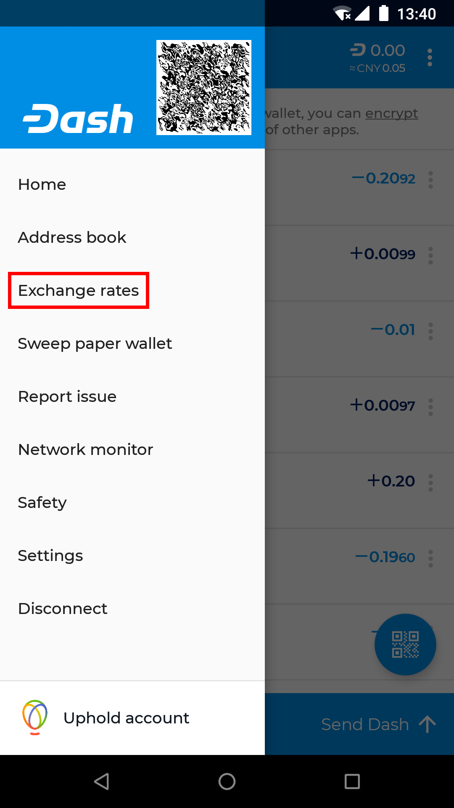
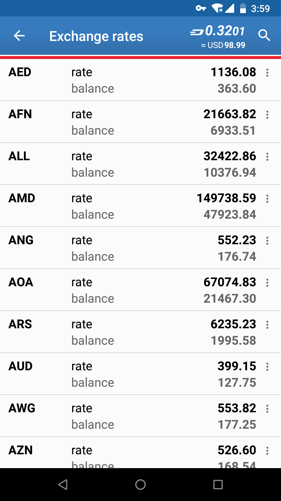
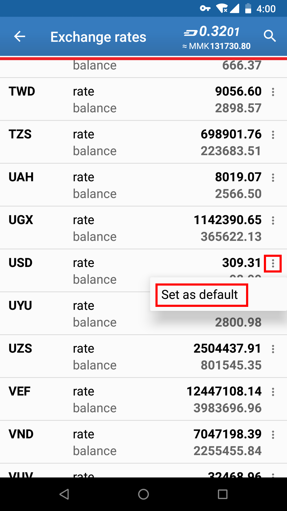
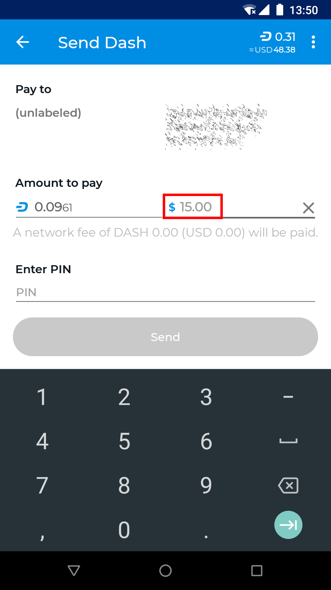

*Selecting a fiat exchange rate and creating a transaction denominated
in USD*

Sweep paper wallet
------------------

Sweeping a paper wallet is a method of transferring the value stored on
an address you may have received as a paper wallet or from an ATM into
your own wallet. You must have access to the private key for an address
to use this function. In this process, all Dash stored on the address
will be sent to a new address that has been deterministically generated
from your wallet seed. The private keys you sweep do not become a part
of your wallet.

To sweep a paper wallet, tap the **Menu button** and select **Sweep
paper wallet**. Tap the **Scan** button and scan the QR code from your
paper wallet. Once the private key has been identified, tap **Sweep** to
create the transaction moving the Dash into your own wallet. Once this
transaction is confirmed, the paper is worthless and should be
destroyed.

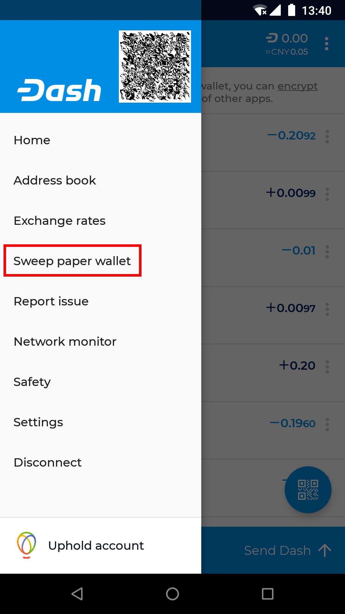
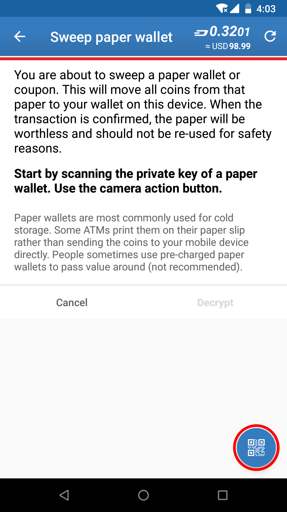
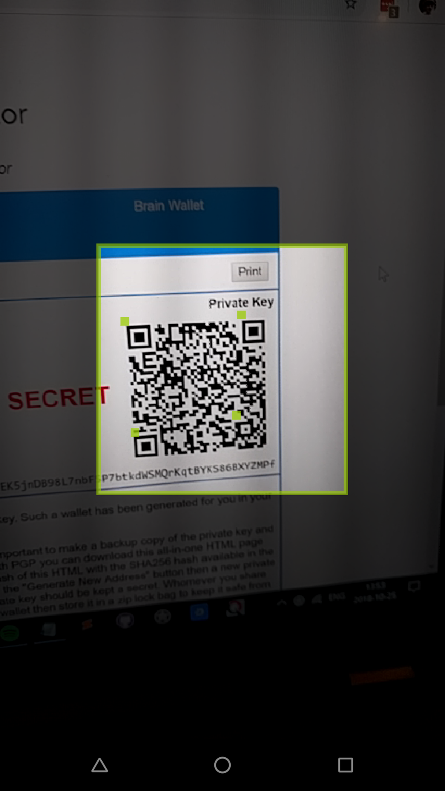
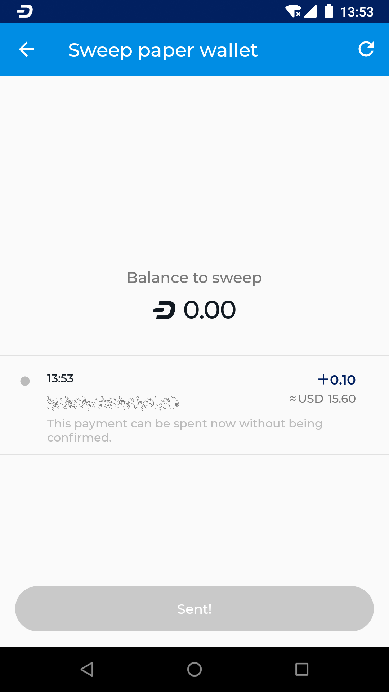

*Sweeping a paper wallet with 0.10 DASH into the Android Wallet*

Network monitor
---------------

The Dash Android Wallet is a light wallet and functions in SPV mode,
meaning it does not download a full copy of the blockchain. The network
monitor allows you to view details about the full nodes to which you are
connected. You can also swipe left to view blocks as they are created on
the blockchain.

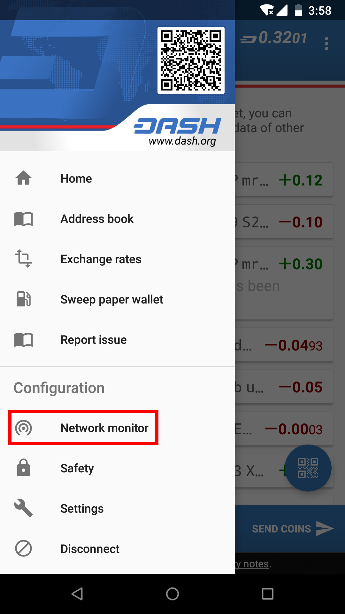
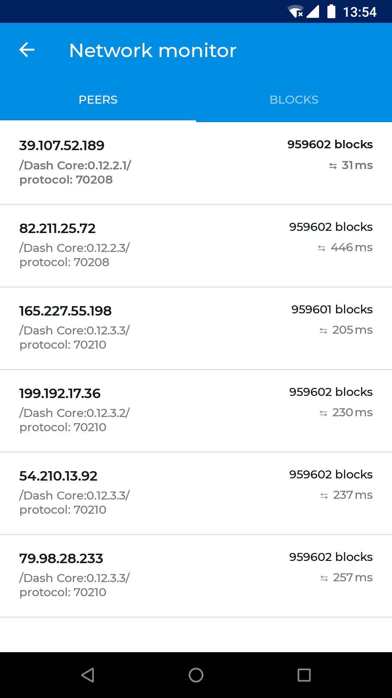
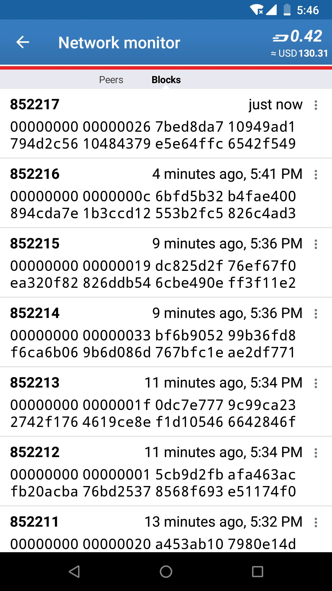

*Viewing peers and blocks to monitor network activity*

Settings
--------

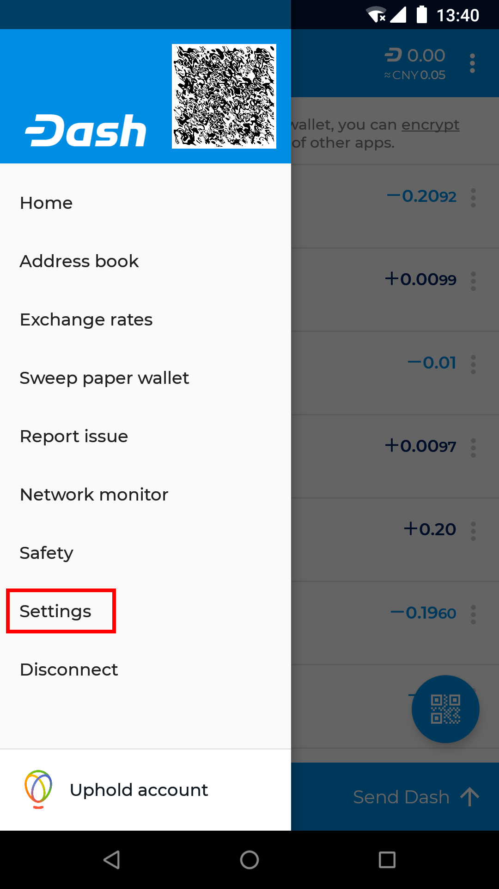
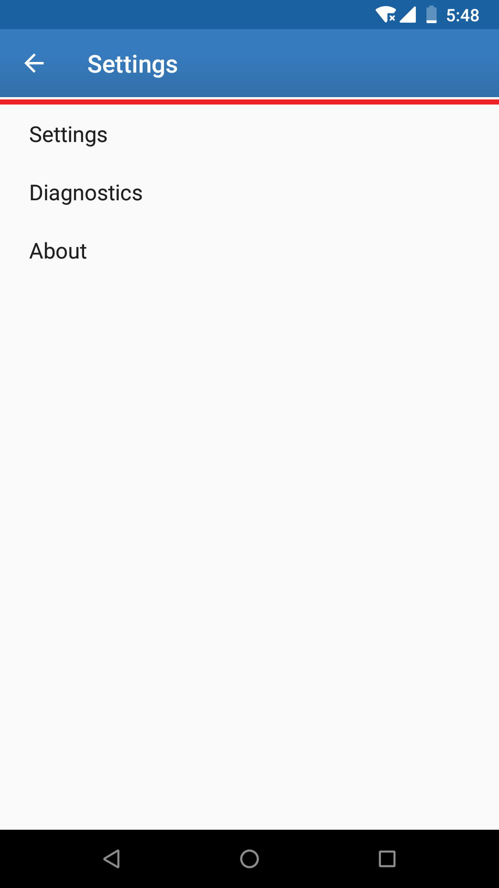

*The Settings menu in Dash Android Wallet*

The settings menu contains a range of options to control the behavior of
the Dash Android Wallet. To access the settings, tap the **Menu
button**, then **Settings**. You can then choose between **Settings**,
**Diagnostics** and **About**, which displays wallet version, copyright,
license and source code information.

Settings
^^^^^^^^

Denomination and precision

Own name

Auto-close send coins dialog

Connectivity indicator

Trusted peer

Skip regular peer discovery

Block explorer

Data usage

Balance reminder

Enable InstantSend

Enable Lite Mode

Show disclaimer

BIP70 for scan-to-pay

Look up wallet names

Diagnostics
^^^^^^^^^^^

