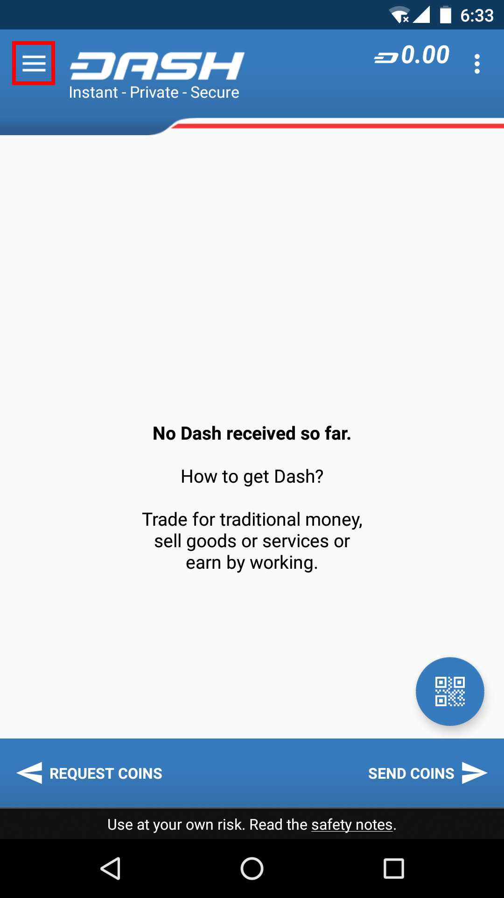
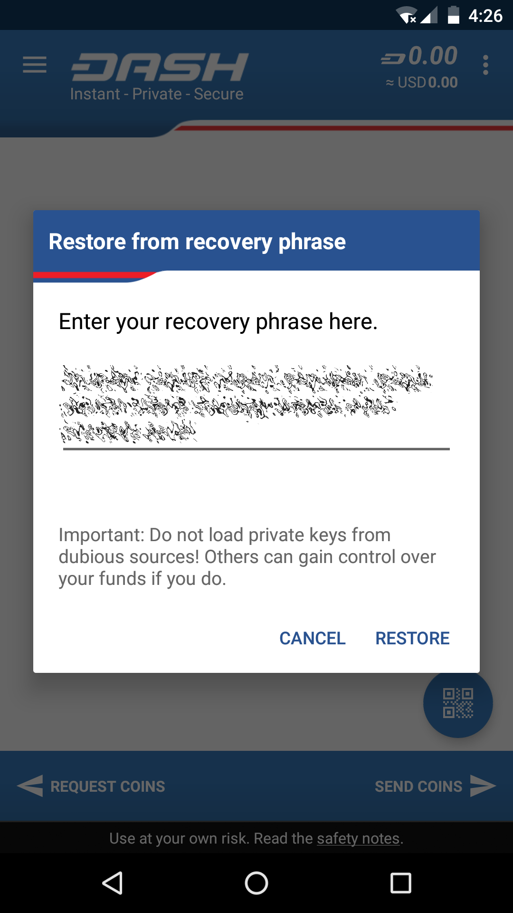

.. _dash_android_basic_usage:

Getting Started
===============

Creating a New Wallet
---------------------

When you first start your Dash Wallet, it will automatically generate a
new wallet for you. The first thing you should do is back up this wallet
by tapping the menu button in the top left corner and selecting
**Safety** > **View recovery phrase**. You will need this phrase
to recover the funds later if you lose or damage your phone or need to
transfer the account to another device. Write the phrase down and store
it in a safe place - if you lose this, you will also lose access to your
funds forever. If you prefer, you can also back up a password protected
wallet file by selecting **Safety** > **Back up wallet**.

.. image:: img/setup2.png
    :width: 30 %
.. image:: img/setup3.png
    :width: 30 %
.. image:: img/setup4.png
    :width: 30 %

*Viewing the recovery phrase for a new wallet in Dash Wallet for
Android*

Restoring from Backup
---------------------

If you already have an existing Dash Wallet for Android, you can restore
it at this point by tapping the menu button in the top left corner and
selecting **Safety** > **Restore from recovery phrase**. Carefully enter
your recovery phrase and tap **Restore**. Your wallet may restart, and
it will take some time for any past transactions and balances to appear.

.. image:: img/restore1.png
    :width: 25 %
.. image:: img/restore2.png
    :width: 25 %

.. image:: img/restore4.png
    :width: 25 %

*Restoring an existing wallet from recovery phrase in Dash Wallet for
Android*

Receiving Dash
--------------

Tap the **Request coins** button at the bottom left of the screen to
receive Dash. The wallet will generate and display a QR code for the
other device to scan, and you can optionally enter the dash or dollar
value of the transaction to save the payer time. You can tap the menu
button in the top right corner and select **Copy address** to copy and
paste it in another app to send it to a person paying you remotely. You
will receive a notification when the transfer occurs, and you can view
the confirmation status on the main screen and the balance in the top
right corner. Dash Wallet for Android considers a transaction spendable
after 6 block confirmations have taken place (approx. 15 minutes).
