.. _dash-copay-getting-started:

===============
Getting Started
===============

This documentation describes how to use the most common features of the
Dash Copay wallet. Since the functionality is similar across all
supported platforms (Android, iOS, Windows, macOS, Linux), the
instructions and screenshots will reference the Android software,
highlighting differences between the platforms where necessary.

Dash Copay is currently undergoing beta testing using 
:ref:`testnet <testnet>` and will be available for Android. iOS, Windows, 
macOS and Linux versions when they are ready.

Update June 2018:
<https://www.dash.org/forum/threads/dashcopay-release-plan.38915/#post-190465>

.. _dash-copay-installation:

Installation
============

When you first start your Dash Wallet, you will be prompted to choose
between creating a new wallet or restoring an existing wallet from
backup. Choose **Get started** to create a new wallet unless you have
existing funds stored in another wallet using a recovery phrase. Your
new wallet will be generated, and a recovery phrase will appear so you
can recover the funds later if you lose or damage your device or need to
transfer the account to another device. Write the phrase down on paper
and store it in a safe place - if you lose this, you will also lose
access to your funds forever. Do not take screenshots to store your
recovery phrase! Screenshots may be automatically backed up to cloud
file storage services where you may no longer have complete control over
who views the files.

|image2| |image3| |image4|
|image5| |image6| |image7|

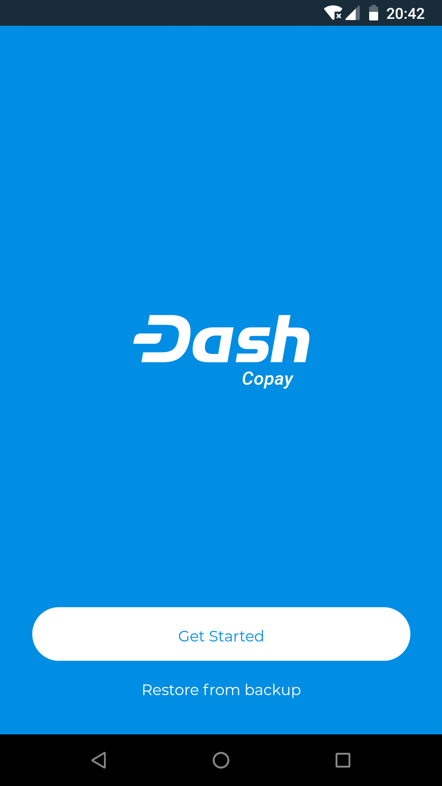
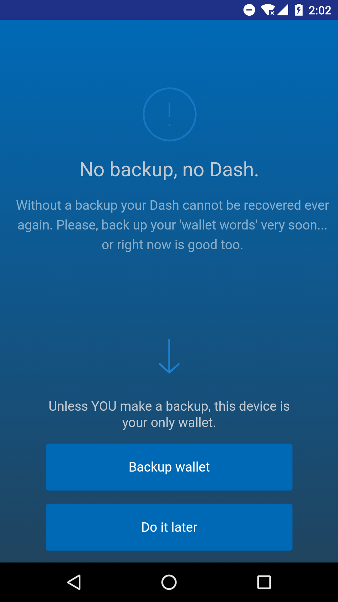
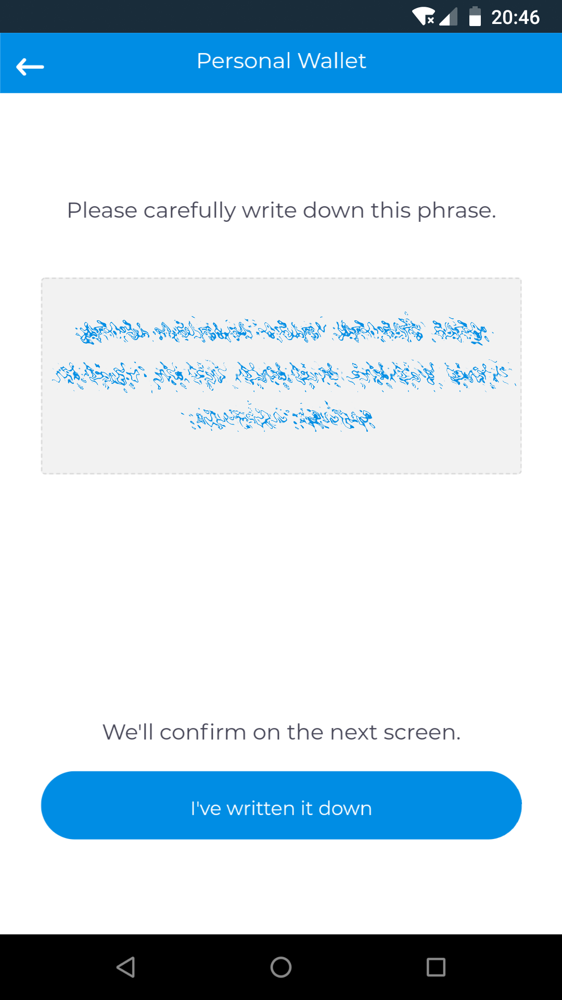
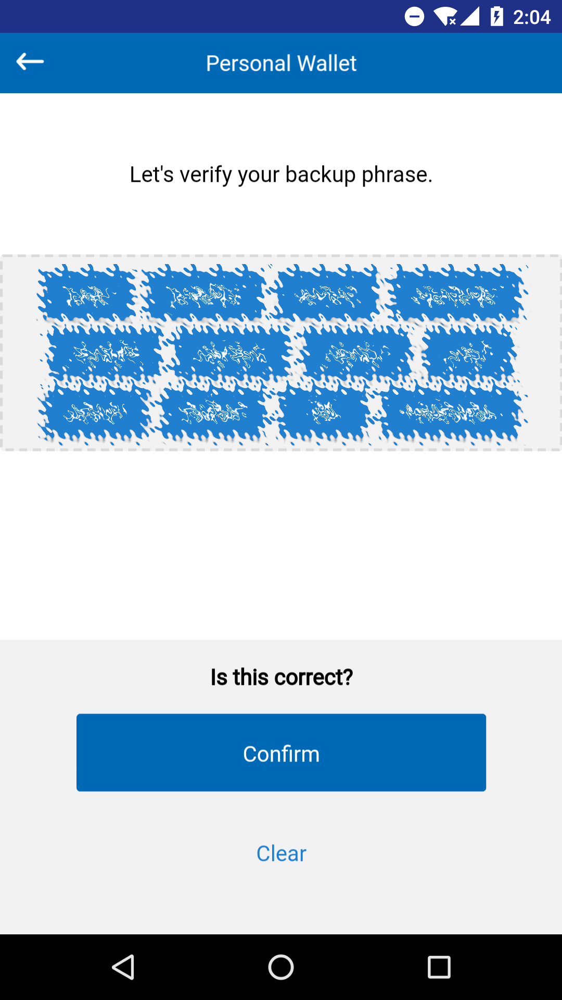
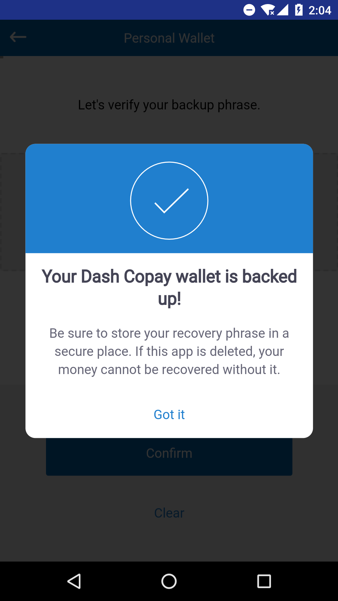
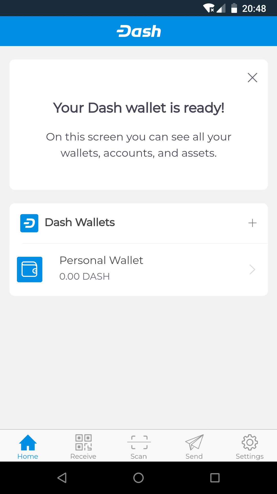

*Creating a new wallet and generating the recovery phrase in Dash Copay
wallet*

If you want to restore an existing Dash Copay wallet, simply tap
**Restore from backup** and enter the 12 word recovery phrase. File/text
backups are also supported.

Receiving
=========

Simply tap the **Receive** icon at the bottom of the screen to receive
Dash. The wallet will generate and display a QR code for the other
device to scan, or you can simply tap the displayed address to copy it
to the clipboard so you can paste it in another app. If you have
multiple wallets, you can see the name of the wallet at the bottom of
the screen, and tap it to switch between wallets. The receiving address
will change and you will receive a notification when you receive the
transfer.

|image8| |image9|

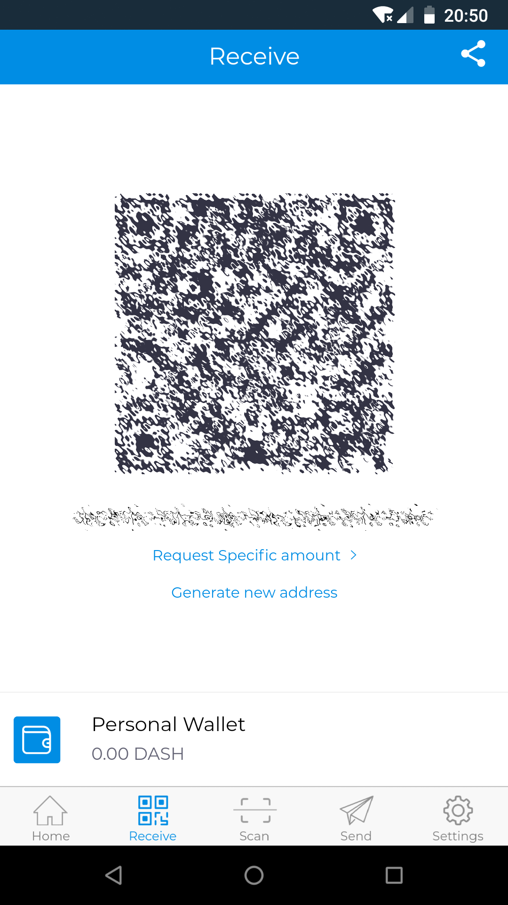
.. |image9| image:: img/receive-done.png
   :width: 200px

*Receiving dash and viewing your balance in Dash Copay wallet*

Sending
=======

Depending on how your payee has provided their receiving address to you,
you can send Dash by tapping either the **Scan** icon to use the device
camera to scan a QR code, or the **Send** icon to paste a copied address
or select an address from your Dash Copay address book. Once you have
entered the address, it may be possible or necessary to enter the amount
of Dash to be sent or an optional label for the recipient, and to decide
if you want to send with InstantSend on or off (on by default). If you
have multiple wallets, you must also choose which wallet you will use to
send the funds. Once the transaction is complete, you will see a payment
confirmation screen.

|image10| |image11| |image12|
|image13| |image14| |image15|

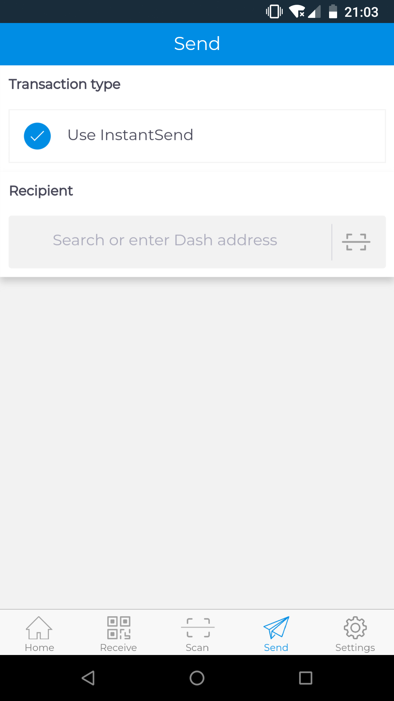
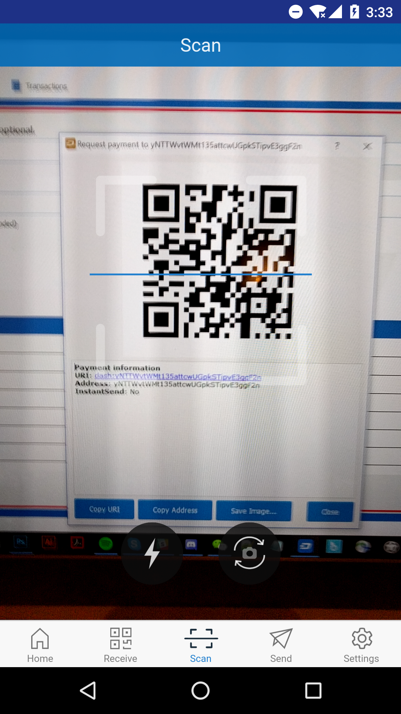
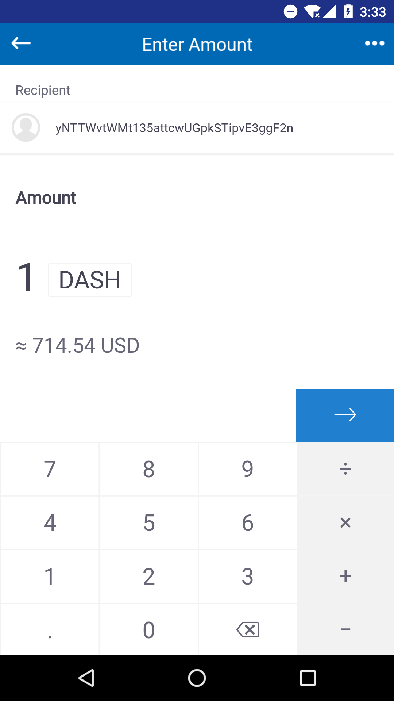
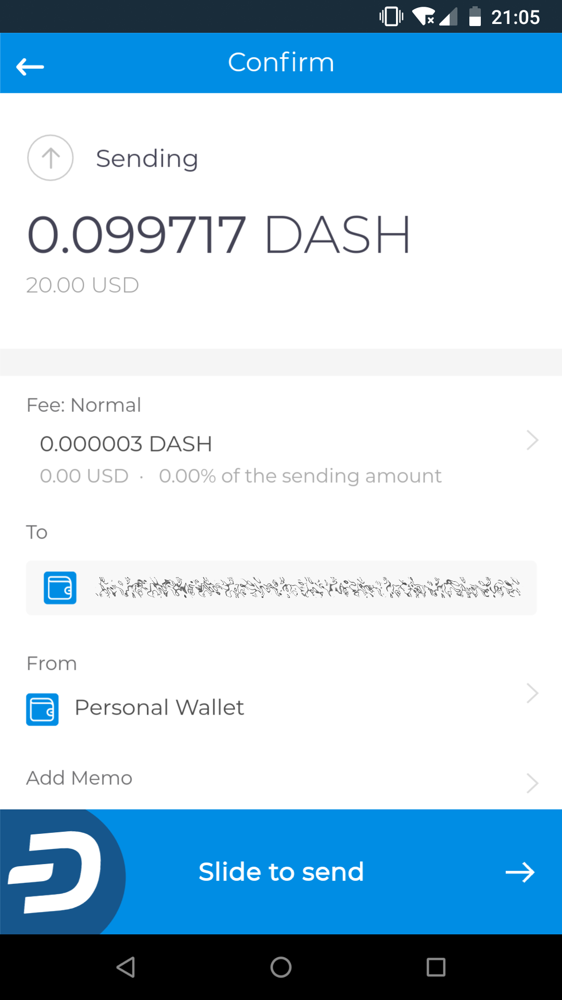
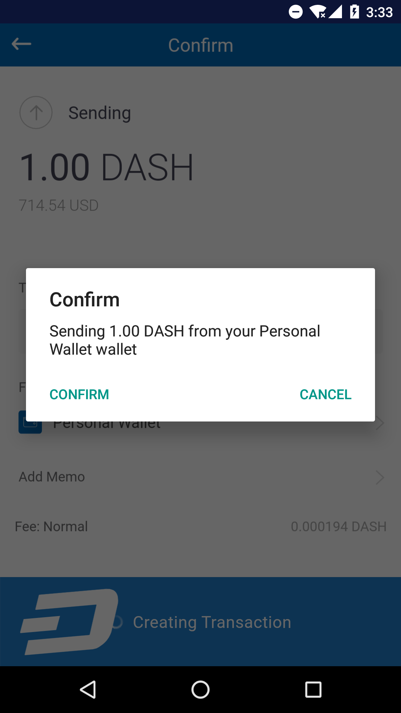
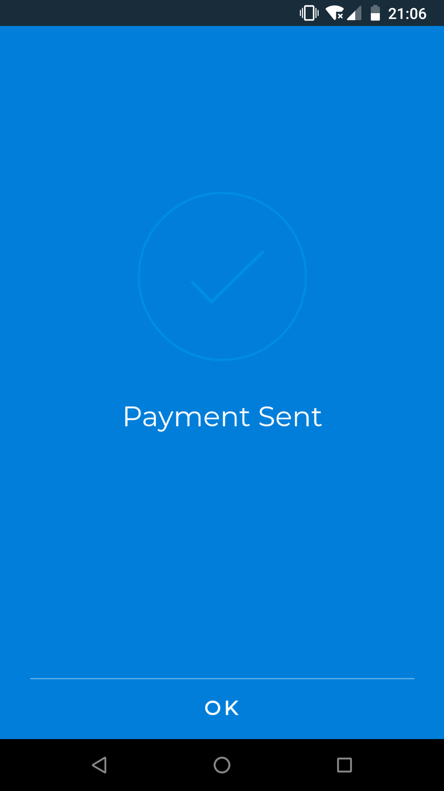

*Sending Dash from Dash Copay wallet*

Viewing transactions and balances
=================================

Your recent transactions appear on the **Home** screen. You can tap any
transaction to view more details or enter a **Memo** to help you
remember the purpose of the transaction. Tap **View on blockchain** to
open the Insight blockchain explorer to view full transaction details.
All the wallets you have created and their respective balances appear
below the recent transactions on the **Home** screen. You can tap any
wallet to view the balance and transaction history associated with that
wallet only.

|image16| |image17| |image18|

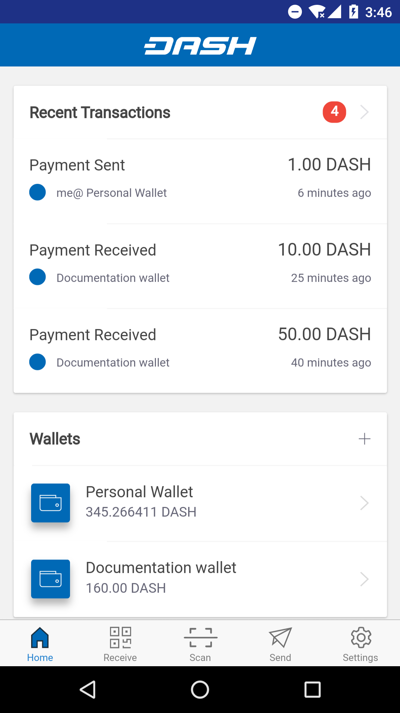
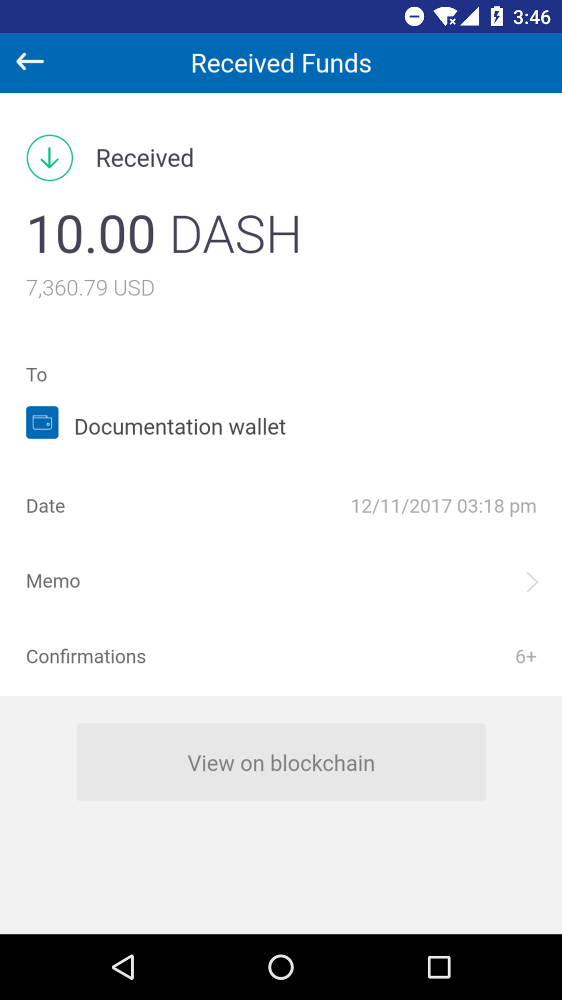
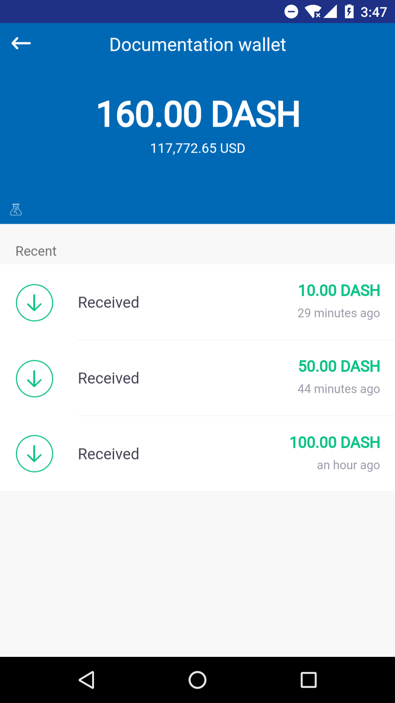

*Home screen, transaction details and wallet details in Dash Copay
wallet*
