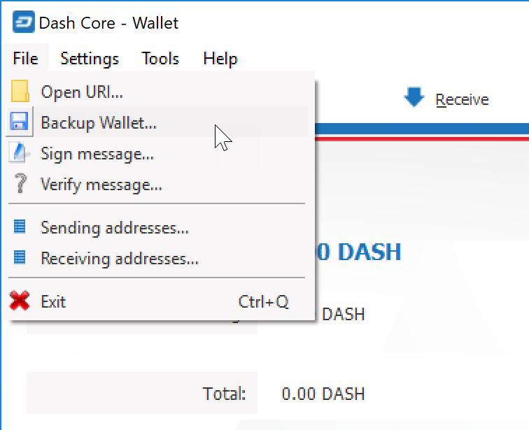
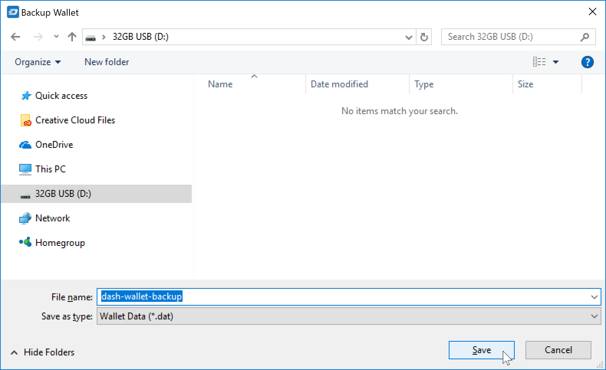

.. _dashcore_backup:

=================================
Wallet Backup
=================================

This documentation describes how to safely back up your wallet file for
safe storage in case your computer or laptop is damaged or lost. Dash
Core stores all data necessary to control your Dash addresses in a
single file called *wallet.dat*. This wallet is in the Berkeley DB
format and stores the pairs of private/public cryptographic keys used to
manage your balances on the Dash blockchain. Dash Core makes most of
these operations transparent and even generates automatic backups of
your wallet file in case it is corrupted, but the user is responsible
for ensuring that these backups are stored in a safe place. **If you
lose access to your wallet file, you will permanently lose access to
your Dash.**

It is important to consider that if you have not encrypted your wallet
using the **Settings > Encrypt Wallet** menu item, anyone with access to
the backed up wallet.dat file will immediately have full access to your
Dash. If you do choose to encrypt your wallet, do not store the password
in the same place as the wallet.dat file, particularly if you are saving
the backup to the cloud.

Backup from Dash Core
=====================

Firstly, never copy your wallet.dat file while Dash Core is open. Always
use the **File > Backup Wallet** menu if the wallet is open. When you
select this menu item, a dialog box will appear to specify where the
file should be saved. Enter a name for the file, select a location and
click **Save**. The example below shows saving the file to a USB stick.
Keep this file in a physically separate location to your computer.

   The Dash Core Send tab

Backup by copying wallet.dat
============================

**If Dash Core is not running**, you can also backup your wallet by
simply copying the *wallet.dat* file to another location. This file is
located in the *DashCore* data folder. You were given the option to
specify the location of this folder during installation, but by default
the folder is in the following locations on different operating systems:

- Windows::
  
  C:\Users\YourUserName\Appdata\Roaming\DashCore
  
  You can access this folder directly by Windows Key + R and typing
  %APPDATA%\DashCore

- Linux
  
  ::

    /home/YourUserName/.dashcore

  You can access this folder directly by typing cd ~/.dashcore at the
  terminal or ~/.dashcore in the path bar using the Go > Enter
  Location... menu item in Files

macOS
/Users/YourUserName/Library/Application Support/DashCore
You can access this folder by typing cd ~/Library/Application Support/DashCore at the terminal or ~/Library/Application Support/DashCore in dialog at the Go > Go To Folder menu item in Finder