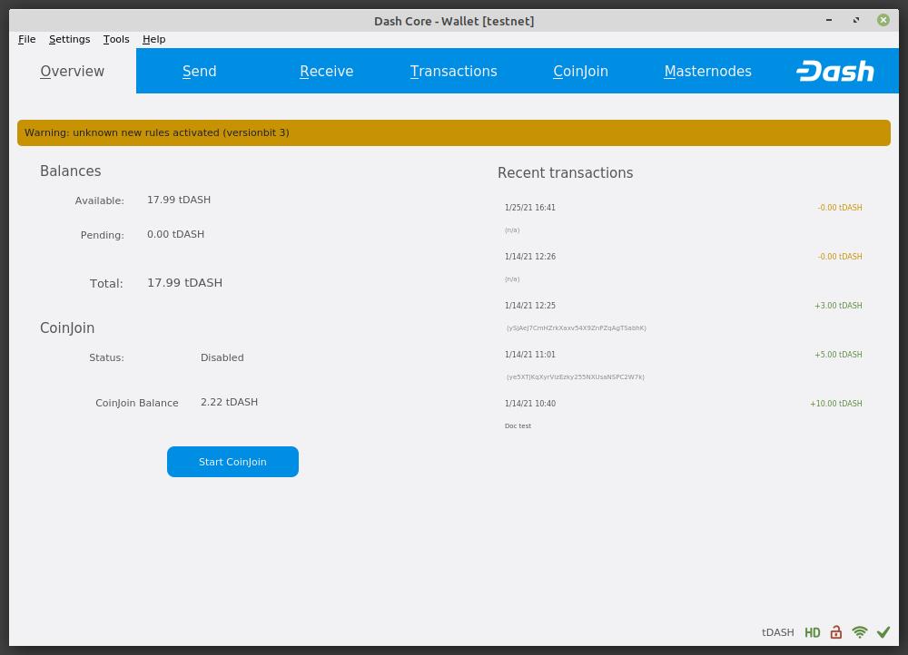

.. _dash-core-wallet:

Dash Core Wallet
================

Dash Core Wallet is the full official release of Dash, and supports all
Dash features as they are released, including InstantSend and
CoinJoin, as well as an RPC console and governance features. Dash
Core Wallet (sometimes known as the QT wallet, due to the QT software
framework used in development) is a professional or heavy wallet which
downloads the full blockchain (several GB in size) and can operate as
both a full node or masternode on the network. Because of the
requirement to hold a full copy of the blockchain, some time is required
for synchronisation when starting the wallet. Once this is done, the
correct balances will be displayed and the functions in the wallet can
be used. Dash Core Wallet is available for macOS, Linux, Raspberry Pi
and Windows.

Features:

-  InstantSend
-  CoinJoin
-  Wallet encryption
-  Coin control and fee control
-  QR code generation and address book
-  Masternode commands and voting
-  Automated backup
-  Debug console

Available documentation:

.. toctree::
   :maxdepth: 1

   installation.rst
   interface.rst
   send-receive.rst
   coinjoin-instantsend.rst
   backup.rst
   cmd-rpc.rst
   advanced.rst

   Dash Core Wallet