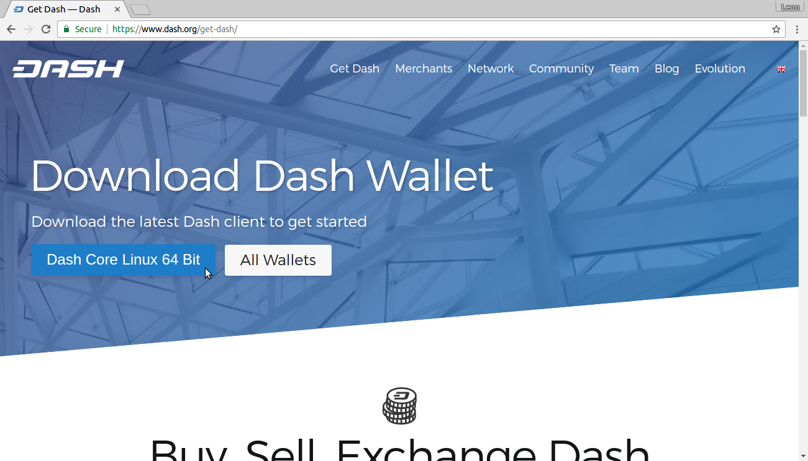
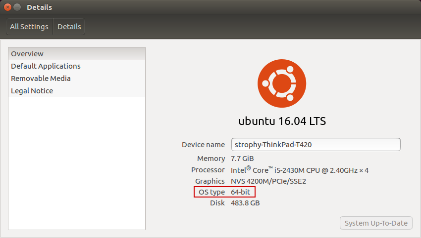
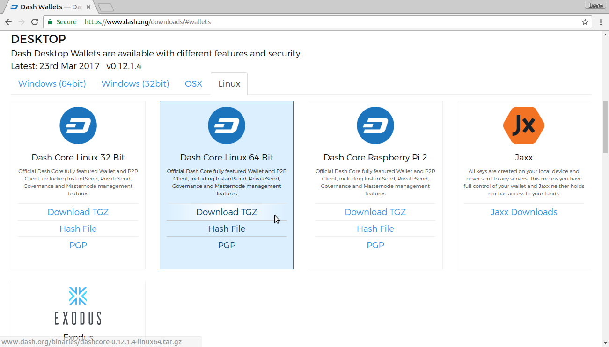
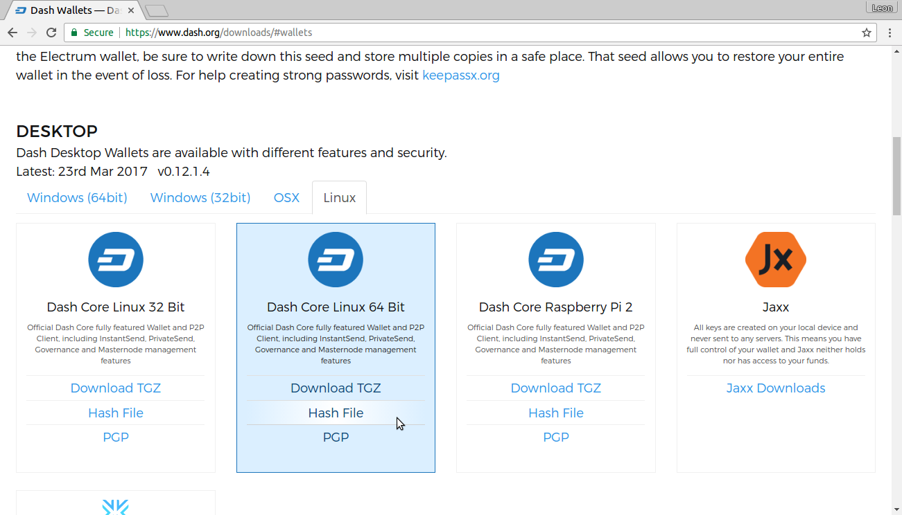
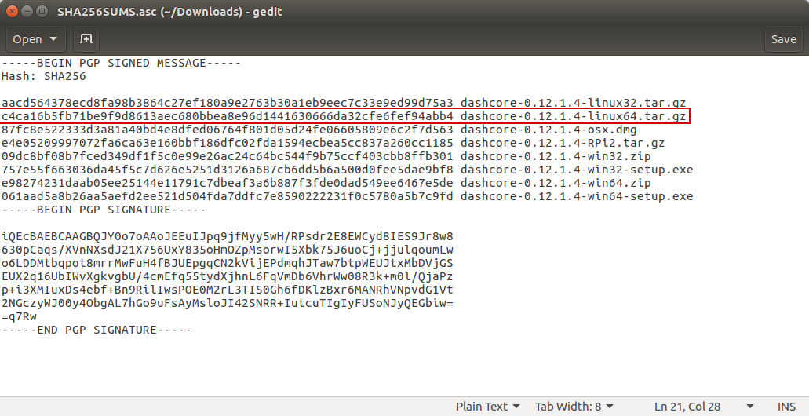
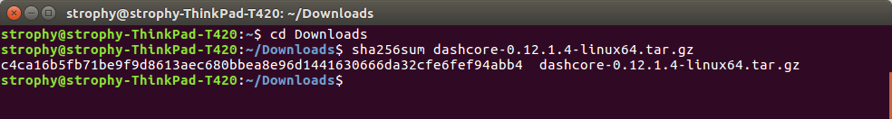
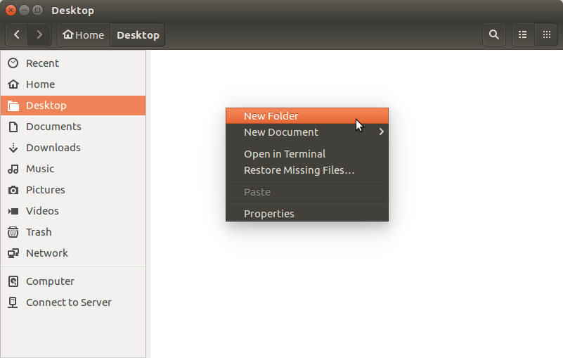
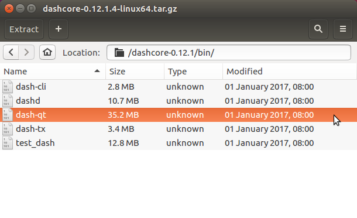
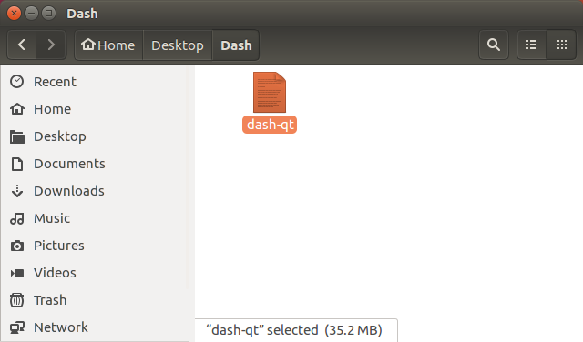
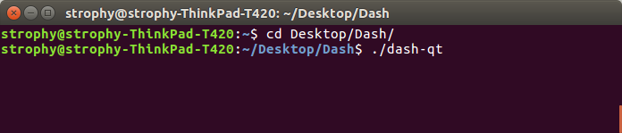

.. _dashcore_installation_linux:

Linux Installation Guide
========================

This guide describes how to download, verify, install and encrypt the
Dash Core wallet for Linux. The guide is written for Ubuntu 16.04 LTS,
but the steps should be similar for other Linux distributions.

Downloading the Dash Core wallet
----------------------------------

Visit https://www.dash.org/get-dash/ to download the latest Dash Core
wallet. In most cases, the website will properly detect which version
you need. Click the blue Dash Core button to download the package
directly.

   The website properly detects the wallet appropriate for your system

If detection does not work, you will need to manually choose your
operating system and whether you need a 32 or 64 bit version. If you are
unsure whether your version of Linux is 32 or 64 bit, you can check in
Ubuntu under the **System menu > About This Computer**. For details on
how to check this in other versions of Linux, see
`here <https://www.howtogeek.com/198615/how-to-check-if-your-linux-system-is-32-bit-or-64-bit/>`__.

   Ubuntu System Overview. This is a 64 bit system.

Once you know which version you need, download Dash Core to your
computer from `https://www.dash.org/wallets <https://www.dash.org/wallets>`.

   Manually selecting and downloading Dash Core

Save the file you downloaded to your Downloads folder.

Verifying Dash Core
----------------------

This step is optional, but recommended to verify the integrity of the
file you downloaded. This is done by checking its SHA256 hash against
the hash published by the Dash Core development team. To view the
published hash, click the **Hash file** button on the wallet download
page.

   Downloading the Dash Core hash file

Once both the Dash Core file and the hash file have downloaded,
double-click the hash file or view it in your browser and find the hash
value for the Dash Core file you downloaded.

   Viewing the Dash Core hash file

This hash value should correspond with the hash value of the file you
have downloaded to ensure it is authentic and was not corrupted during
transit. To do this, open Terminal, browse to the location where you
saved the file, and run the sha256sum command.

   Generating an SHA256 hash for the downloaded file

If the hashes match, then you have an authentic copy of Dash Core for
Linux.

Extracting Dash Core
----------------------

Dash Core for Linux is distributed as a compressed archive and not an
installer. This is because this same archive also contains other files
built for running a masternode on a server, for example. In this guide,
we will extract the executable file with a graphical user interface
(GUI) designed for use by end users as a wallet.

Begin by creating a folder for the Dash Core executable file on the
Desktop. Browse to the Desktop (or the location of your choice) and
create the folder.

   Creating a folder on the Desktop

.. figure:: img/linux/106329798.png
   :height: 250px

   Renaming the folder to Dash

Next, open the archive by double-clicking on it. The Archive Manager
will appear. Browse to the dashcore-0.12.1/bin/ folder and extract the
dash-qt file to the Dash folder you created on the Desktop by drag and
drop.

   The dash-qt file in Archive Manager

   The dash-qt file in the Dash folder on the Desktop

To run Dash Core for the first time, open Terminal and browse to the
Dash folder on the Desktop, or where you chose to extract the file. Type
``./dash-qt`` to run the file.

   Running Dash Core from the Terminal

The first time the program is launched, you will be offered a choice of
where you want to store your blockchain and wallet data. Choose a
location with enough free space, as the blockchain can reach around
3-4GB in size. It is recommended to use the default data folder if
possible.

.. figure:: img/linux/106329842.png
   :height: 250px

   Choosing the Dash Core data folder

Dash Core will then start up. This will take a little longer than usual
the first time you run it, since Dash Core needs to generate
cryptographic data to secure your wallet.

.. figure:: img/linux/106329854.png
   :height: 250px

   Starting Dash Core

Synchronizing Dash Core to the Dash network
-------------------------------------------

Once Dash Core is successfully installed and started, you will see the
wallet overview screen. You will notice that the wallet is “out of
sync”, and the status bar at the bottom of the window will show the
synchronization progress.

.. figure:: img/linux/106329873.png
   :height: 250px

   Dash Core begins synchronizing with the Dash network

During this process, Dash Core will download a full copy of the Dash
blockchain from other nodes to your device. Depending on your internet
connection, this may take a long time. If you see the message “No block
source available”, check your internet connection. When synchronization
is complete, you will see a small blue tick in the lower right corner.

.. figure:: img/linux/106329889.png
   :height: 250px

   Dash Core synchronization is complete

You can now begin to use your wallet to send and receive funds.

Encrypting your Dash wallet
---------------------------

After your wallet has synchronized with the Dash network, it is strongly
advised to encrypt the wallet with a password or passphrase to prevent
unauthorized access. You should use a strong, new password that you have
never used somewhere else. Take note of your password and store it
somewhere safe or you will be locked out of your wallet and lose access
to your funds.

To encrypt your wallet, click **Settings** > **Encrypt** wallet.

.. figure:: img/linux/106329907.png
   :height: 250px

   Encrypting the Dash wallet with a password

You will be asked to enter and verify a password.

.. figure:: img/linux/106329946.png
   :height: 150px

   Entering a password

.. figure:: img/linux/106329973.png
   :width: 359px

   Confirm you want to encrypt your wallet

When the encryption process is complete, you will see a warning that
past backups of your wallet will no longer be usable, and be asked to
shut down Dash Core. When you restart Dash Core, you will see a small
blue lock in the lower right corner.

.. figure:: img/linux/106329989.png
   :height: 250px

   Fully encrypted and synchronized Dash Core wallet

Using the Ubuntu Repository to install Dash Core
------------------------------------------------

Ubuntu allows you to add third-party repositories to install and update
software using the apt command line utility. Dash Core team maintains
such a repository, although the software version included here may be
older than what is available on the website. To install Dash Core from
the repository, open the Terminal and enter the following commands::

    sudo add-apt-repository ppa:dash.org/dash
    sudo apt update
    sudo apt install dashd dash-qt
