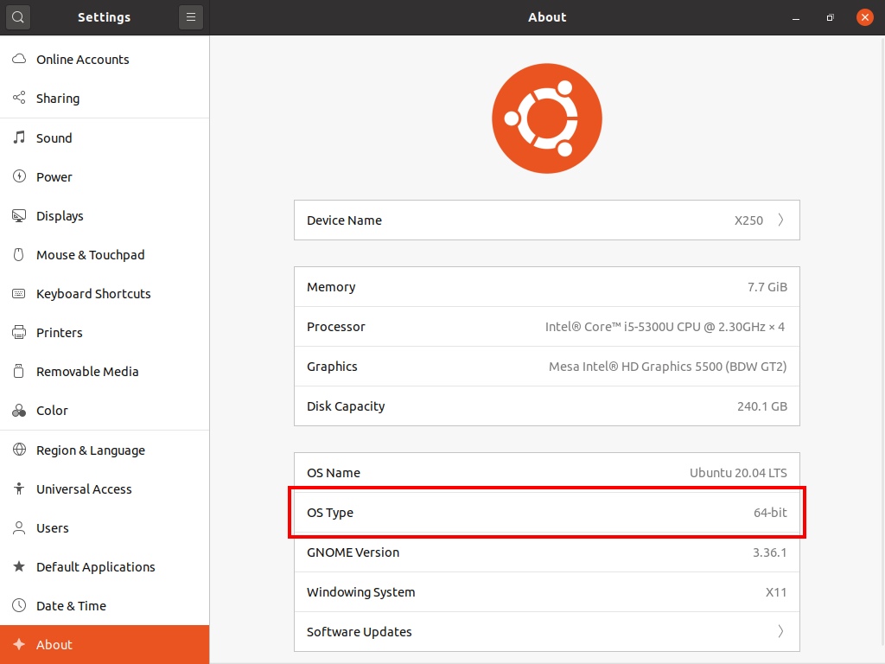
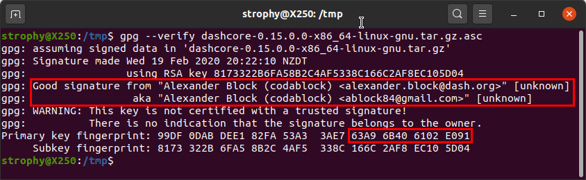
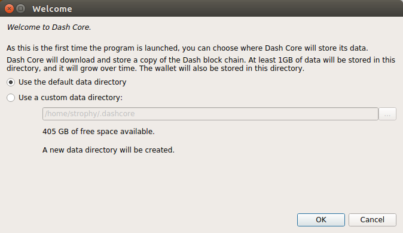
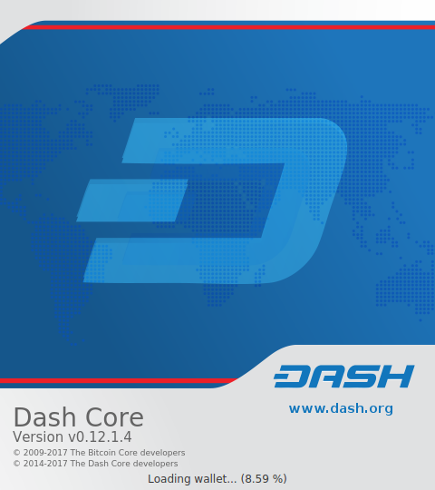
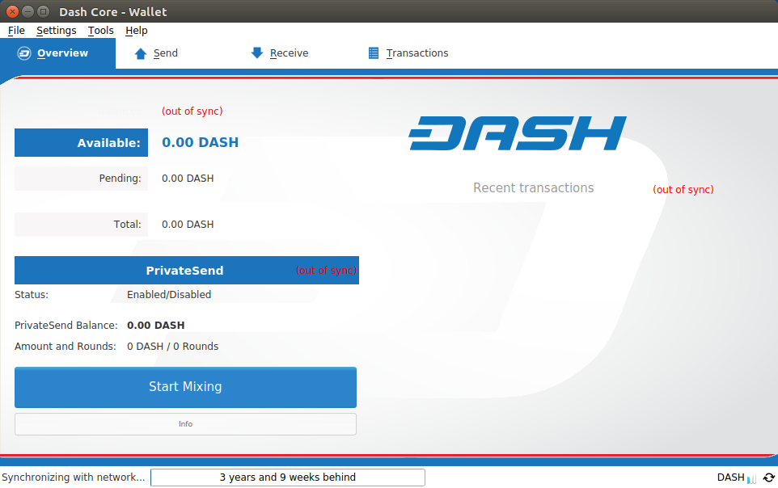
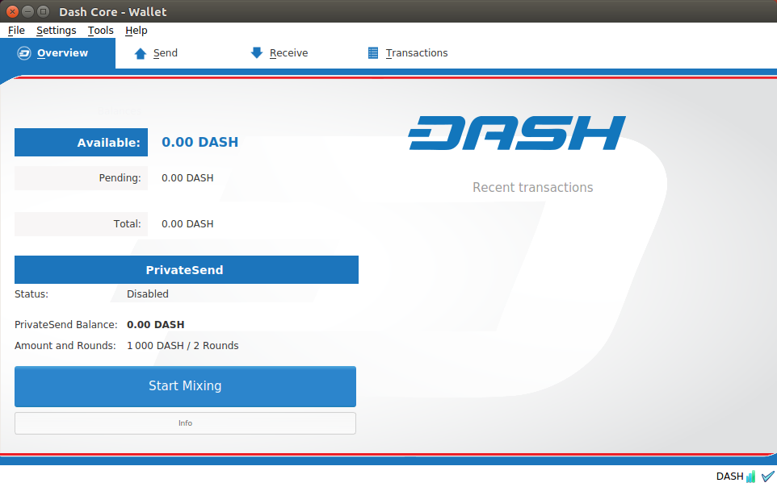
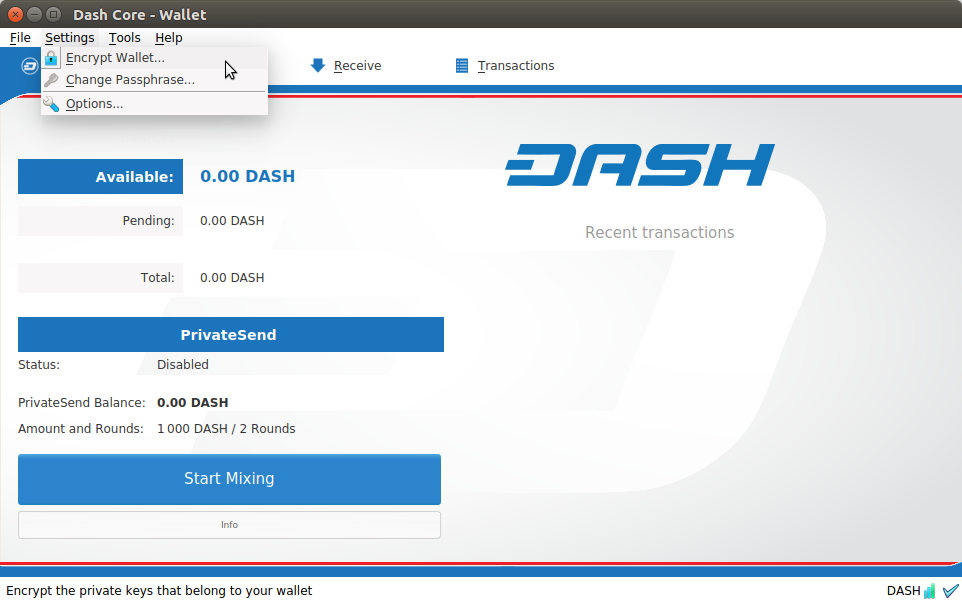
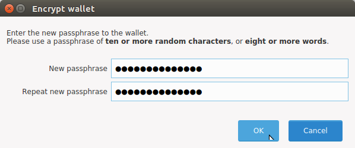
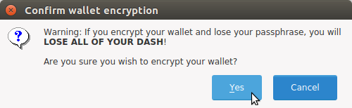

.. meta::
   :description: How to download, install and encrypt the Dash Core wallet in Linux
   :keywords: dash, core, wallet, linux, ubuntu, installation

.. _dashcore-installation-linux:

Linux Installation Guide
========================

This guide describes how to download, verify, install and encrypt the
Dash Core wallet for Linux. The guide is written for Ubuntu 20.04 LTS,
but the steps should be similar for other Linux distributions.

Downloading the Dash Core wallet
--------------------------------

Visit https://www.dash.org/downloads/ to download the latest Dash Core
wallet. In most cases, the website will properly detect which version
you need. Click the Dash Core button to download the package
directly.

.. figure:: img/linux/download.png
   :height: 250px

   The website properly detects the wallet appropriate for your system

If detection does not work, you will need to manually choose your
operating system and whether you need a 32 or 64 bit version. If you are
unsure whether your version of Linux is 32 or 64 bit, you can check in
Ubuntu under the **Settings > About > OS Type**. For details on how to
check this in other versions of Linux, see `here
<https://www.howtogeek.com/198615/how-to-check-if-your-linux-system-is-32-bit-or-64-bit/>`__.

   Ubuntu System Overview. This is a 64 bit system.

If you have a 32-bit system, download **Dash Core x86**. If you have a
64-bit system, download **Dash Core x64**. Once you know which version
you need, download the Dash Core TGZ file to your computer from
https://www.dash.org/downloads/ and save it to your Downloads folder.

Verifying Dash Core
-------------------

This step is optional, but recommended to verify the authenticity of the
file you downloaded. This is done by checking its detached signature 
against the public key published by the Dash Core development team. 
To download the detached signature, click the **Signature** button on the 
wallet download page and save it to the same folder as the downloaded
binary.

All releases of Dash are signed using GPG with one of the following keys:

- Alexander Block (codablock) with the key ``63A9 6B40 6102 E091``,
  `verifiable here on Keybase <https://keybase.io/codablock>`__
- Pasta (pasta) with the key ``5252 7BED ABE8 7984``, `verifiable here
  on Keybase <https://keybase.io/pasta>`__

Open a terminal, import the keys and verify the authenticity of your
download as follows::

  curl https://keybase.io/codablock/pgp_keys.asc | gpg --import
  curl https://keybase.io/pasta/pgp_keys.asc | gpg --import
  gpg --verify dashcore-0.16.0.1-x86_64-linux-gnu.tar.gz.asc

   Downloading the PGP key and verifying the signed binary

If you see the message ``Good signature from ...`` then you have an
authentic copy of Dash Core for Linux.

Extracting Dash Core
----------------------

Dash Core for Linux is distributed as a compressed archive and not an
installer. This is because this same archive also contains other files
built for running a masternode on a server, for example. In this guide,
we will extract the executable file with a graphical user interface
(GUI) designed for use by end users as a wallet.

Extract Dash Core as follows::

  tar xzf dashcore-0.16.0.1-x86_64-linux-gnu.tar.gz

This will create a folder named ``dashcore-0.16.0`` in the current working
directory. We will now install the executable binaries to
``/usr/local/bin`` using the ``install`` command::

  sudo install -m 0755 -o root -g root -t /usr/local/bin dashcore-0.16.0/bin/*

Start Dash Core from the terminal with the following command::
  
  dash-qt

The first time the program is launched, you will be offered a choice of
where you want to store your blockchain and wallet data. Choose a
location with enough free space, as the blockchain can reach 30GB+ in
size. It is recommended to use the default data folder if possible.

   Choosing the Dash Core data folder

Dash Core will then start up. This will take a little longer than usual
the first time you run it, since Dash Core needs to generate
cryptographic data to secure your wallet.

   Starting Dash Core

Synchronizing Dash Core to the Dash network
-------------------------------------------

Once Dash Core is successfully installed and started, you will see the
wallet overview screen. You will notice that the wallet is “out of
sync”, and the status bar at the bottom of the window will show the
synchronization progress.

   Dash Core begins synchronizing with the Dash network

During this process, Dash Core will download a full copy of the Dash
blockchain from other nodes to your device. Depending on your internet
connection, this may take a long time. If you see the message “No block
source available”, check your internet connection. When synchronization
is complete, you will see a small blue tick in the lower right corner.

   Dash Core synchronization is complete

You can now begin to use your wallet to send and receive funds.

Encrypting your Dash wallet
---------------------------

After your wallet has synchronized with the Dash network, it is strongly
advised to encrypt the wallet with a password or passphrase to prevent
unauthorized access. You should use a strong, new password that you have
never used somewhere else. Take note of your password and store it
somewhere safe or you will be locked out of your wallet and lose access
to your funds.

To encrypt your wallet, click **Settings** > **Encrypt wallet**.

   Encrypting the Dash wallet with a password

You will be asked to enter and verify a password.

   Entering a password

   Confirm you want to encrypt your wallet

When the encryption process is complete, you will see a warning that
past backups of your wallet will no longer be usable, and be asked to
shut down Dash Core. When you restart Dash Core, you will see a small
blue lock in the lower right corner.

   Fully encrypted and synchronized Dash Core wallet
