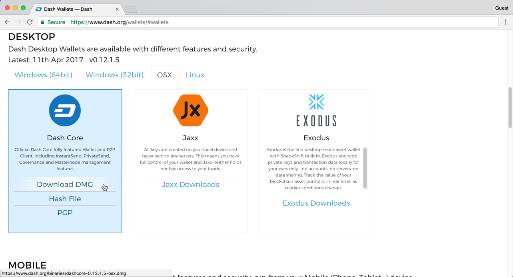
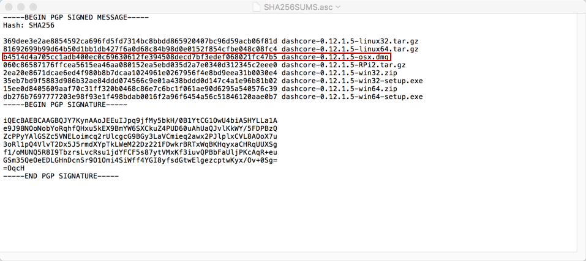
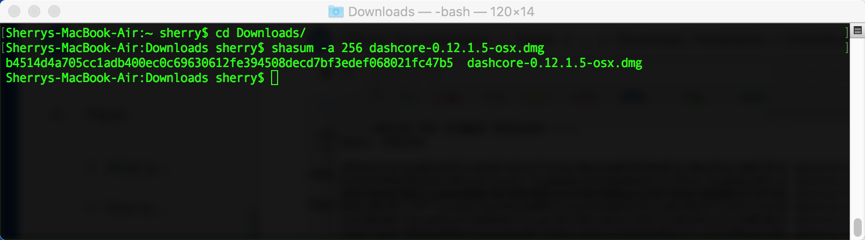
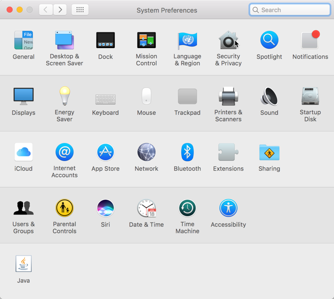
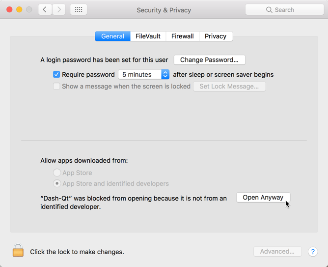

.. _dashcore_installation_macos:

macOS Installation Guide
========================

This guide describes how to download, install and encrypt the Dash Core
wallet for macOS. The guide is written for macOS Sierra, but the steps
should be similar for other versions.

Downloading the Dash Core wallet
--------------------------------

Visit https://www.dash.org/get-dash/ to download the latest Dash
Core wallet. In most cases, the website will properly detect which
version you need. Click the blue **Dash Core** button to download
the installer directly.

.. figure:: img/macos/112414571.png
   :width: 451px

   The website properly detects the wallet appropriate for your system

If detection does not work, you will need to manually choose your
operating system. Go to https://www.dash.org/wallets and select the 
**OSX** tab, then click **Download DMG**.

   Manually selecting and downloading an installer

Save the file you downloaded to your Downloads folder.

Verifying Dash Core
-------------------

This step is optional, but recommended to verify the integrity of the
file you downloaded. This is done by checking its SHA256 hash against
the hash published by the Dash Core development team. To view the
published hash, click the **Hash file** button on the wallet download
page.

.. figure:: img/macos/112414700.png
   :width: 451px

   Downloading the Dash Core hash file

Once both the Dash Core file and the hash file have downloaded,
double-click the hash file or view it in your browser and find the hash
value for the Dash Core file you downloaded.

   Viewing the Dash Core hash file

This hash value should correspond with the hash value of the file you
have downloaded to ensure it is authentic and was not corrupted during
transit. To do this, open **Terminal**, browse to the location where you
saved the file, and run the following command, replacing the version
with the specific version of the file you downloaded::

   shasum -a 256 <dashcore-version-osx.dmg

   Generating an SHA256 hash for the downloaded file

If the hashes match, then you have an authentic copy of Dash Core for
macOS.

Installing Dash Core
--------------------

Open Finder and browse to your Downloads folder. Then double-click on
the .dmg file you downloaded to decompress it. A window appears showing
the contents of the file.

.. figure:: img/macos/112414813.png
   :height: 250px

   Opening the Dash Core .dmg file

Drag the Dash Core application file into your Applications folder to
install Dash Core.

.. figure:: img/macos/112414846.png
   :height: 250px

   Installing Dash Core

Running Dash Core for the first time
------------------------------------

To run Dash Core for the first time, either open Launchpad or browse to
your **Applications** folder in Finder. Double-click **Dash Core** or
**Dash-Qt** to start the application. You may see a warning about
opening an app from an unidentified developer. To resolve this problem,
go to your **System Preferences** and select **Security & Privacy**. A
warning about the unidentified developer will appear at the bottom of
this screen. Click **Open Anyway** to allow your computer to run Dash
Core, then try to open it again. This time you will be able to click
**Open** to start Dash Core. This warning will only appear once.

.. figure:: img/macos/112414895.png
   :width: 280px

   macOS blocking Dash Core from running because it was not downloaded
   from the App Store

    Permitting macOS to run Dash Core

.. figure:: img/macos/112414905.png
   :width: 280px

   Final confirmation to run Dash Core

The first time the program is launched, you will be offered a choice of
where you want to store your blockchain and wallet data. Choose a
location with enough free space, as the blockchain can reach around
3-4GB in size. It is recommended to use the default data folder if
possible.

.. figure:: img/macos/112415002.png
   :height: 250px

   Choosing the Dash Core data folder

Dash Core will then start up. This will take a little longer than usual
the first time you run it, since Dash Core needs to generate
cryptographic data to secure your wallet.

.. figure:: img/macos/112415017.png
   :height: 250px

   Starting Dash Core

Synchronizing Dash Core to the Dash network
-------------------------------------------

Once Dash Core is successfully installed and started, you will see the
wallet overview screen. You will notice that the wallet is “out of
sync”, and the status bar at the bottom of the window will show the
synchronization progress.

.. figure:: img/macos/112415040.png
   :width: 359px

   Dash Core begins synchronizing with the Dash network

During this process, Dash Core will download a full copy of the Dash
blockchain from other nodes to your device. Depending on your internet
connection, this may take a long time. If you see the message “No block
source available”, check your internet connection. When synchronization
is complete, you will see a small blue tick in the lower right corner.

.. figure:: img/macos/112596642.png
   :width: 359px

   Dash Core synchronization is complete

You can now begin to use your wallet to send and receive funds.

Encrypting your Dash wallet
---------------------------

After your wallet has synchronized with the Dash network, it is strongly
advised to encrypt the wallet with a password or passphrase to prevent
unauthorized access. You should use a strong, new password that you have
never used somewhere else. Take note of your password and store it
somewhere safe or you will be locked out of your wallet and lose access
to your funds.

To encrypt your wallet, click **Settings** > **Encrypt** wallet.

.. figure:: img/macos/112596735.png
   :width: 359px

   Encrypting the Dash wallet with a password

You will be asked to enter and verify a password.

.. figure:: img/macos/112596740.png
   :width: 354px

   Enter a password

.. figure:: img/macos/112596745.png
   :width: 354px

   Confirm you want to encrypt your wallet

When the encryption process is complete, you will see a warning that
past backups of your wallet will no longer be usable, and be asked to
shut down Dash Core. When you restart Dash Core, you will see a small
blue lock in the lower right corner.

.. figure:: img/macos/112596927.png
   :width: 359px

   Fully encrypted and synchronized Dash Core wallet

You can now begin to use your wallet to safely send and receive funds.
