.. meta::
   :description: How to download, install and encrypt the Dash Core wallet in macOS
   :keywords: dash, core, wallet, macos, installation

.. _dashcore-installation-macos:

macOS Installation Guide
========================

This guide describes how to download, install and encrypt the Dash Core
wallet for macOS. The guide is written for macOS Sierra, but the steps
should be similar for other versions.

Downloading the Dash Core wallet
--------------------------------

Visit https://www.dash.org/downloads/ to download the latest Dash Core
wallet. In most cases, the website will properly detect which version
you need. Click **Download Installer** to download the installer
directly.

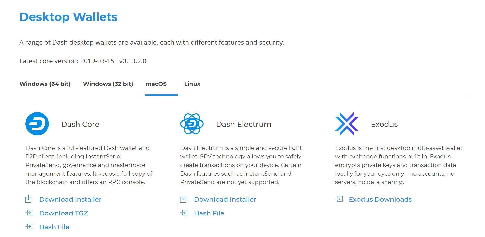

   The website properly detects the wallet appropriate for your system

If detection does not work, you will need to manually choose your
operating system. Go to https://www.dash.org/downloads/ and select the
**macOS** tab, then click **Download Installer**. Save the file you
downloaded to your Downloads folder.

Verifying Dash Core
-------------------

This step is optional, but recommended to verify the authenticity of the
file you downloaded. This is done by checking its detached signature
against the public key published by the Dash Core development team. To
download the detached signature, click the **Installer Signature**
button on the wallet download page and save it to the same folder as the
downloaded binary.

All releases of Dash are signed using GPG with one of the following keys:

- Alexander Block (codablock) with the key ``63A9 6B40 6102 E091``,
  `verifiable here on Keybase <https://keybase.io/codablock>`__
- Pasta (pasta) with the key ``5252 7BED ABE8 7984``, `verifiable here
  on Keybase <https://keybase.io/pasta>`__

Open a terminal, import the keys and verify the authenticity of your
download as follows::

  curl https://keybase.io/codablock/pgp_keys.asc | gpg --import
  curl https://keybase.io/pasta/pgp_keys.asc | gpg --import
  gpg --verify dashcore-0.16.0.1-x86_64-linux-gnu.tar.gz.asc

.. figure:: img/linux/setup-linux-gpg.png
   :width: 400px

   Downloading the PGP key and verifying the signed binary

If you see the message ``Good signature from ...`` then you have an
authentic copy of Dash Core for macOS.

Installing Dash Core
--------------------

Open Finder and browse to your Downloads folder. Then double-click on
the .dmg file you downloaded to decompress it. A window appears showing
the contents of the file.

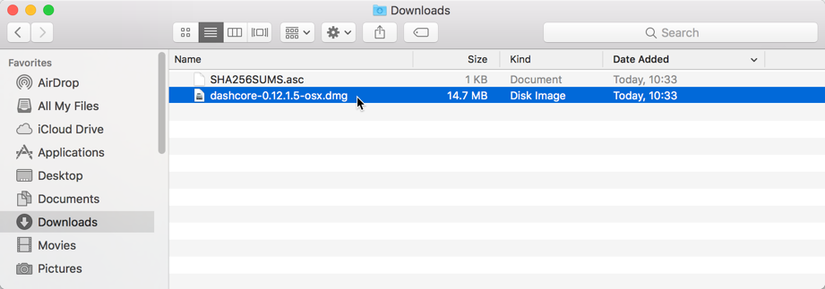

   Opening the Dash Core .dmg file

Drag the Dash Core application file into your Applications folder to
install Dash Core.

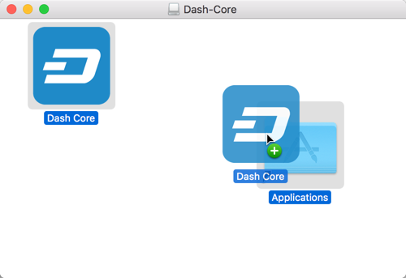

   Installing Dash Core

Running Dash Core for the first time
------------------------------------

To run Dash Core for the first time, either open Launchpad or browse to
your **Applications** folder in Finder. Double-click **Dash Core** or
**Dash-Qt** to start the application. You may see a warning about
opening an app from an unidentified developer. To resolve this problem,
simply Control-click the app icon and choose **Open** from the shortcut
menu, then click **Open** again in the dialog box. The app is saved as
an exception to your security settings, and you can open it in the
future by double-clicking it just as you can any registered app.

.. image:: img/macos/112414895.png
   :width: 280px

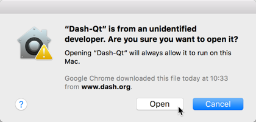

   Unblocking macOS from running Dash Core

The first time the program is launched, you will be offered a choice of
where you want to store your blockchain and wallet data. Choose a
location with enough free space, as the blockchain can reach 30GB+ in
size. It is recommended to use the default data folder if possible.

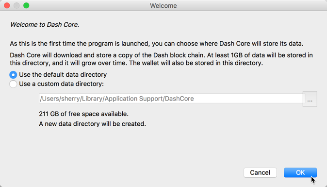

   Choosing the Dash Core data folder

Dash Core will then start up. This will take a little longer than usual
the first time you run it, since Dash Core needs to generate
cryptographic data to secure your wallet.

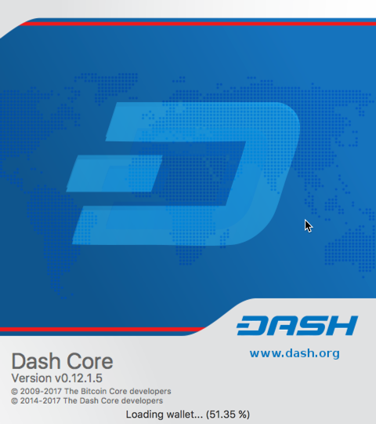

   Starting Dash Core

Synchronizing Dash Core to the Dash network
-------------------------------------------

Once Dash Core is successfully installed and started, you will see the
wallet overview screen. You will notice that the wallet is “out of
sync”, and the status bar at the bottom of the window will show the
synchronization progress.

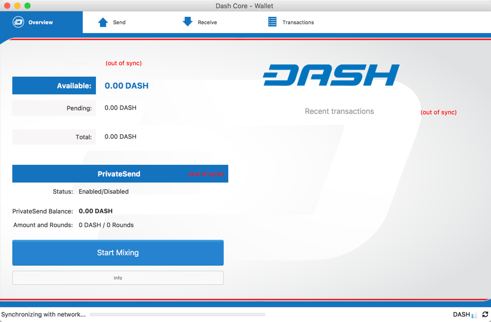

   Dash Core begins synchronizing with the Dash network

During this process, Dash Core will download a full copy of the Dash
blockchain from other nodes to your device. Depending on your internet
connection, this may take a long time. If you see the message “No block
source available”, check your internet connection. When synchronization
is complete, you will see a small blue tick in the lower right corner.

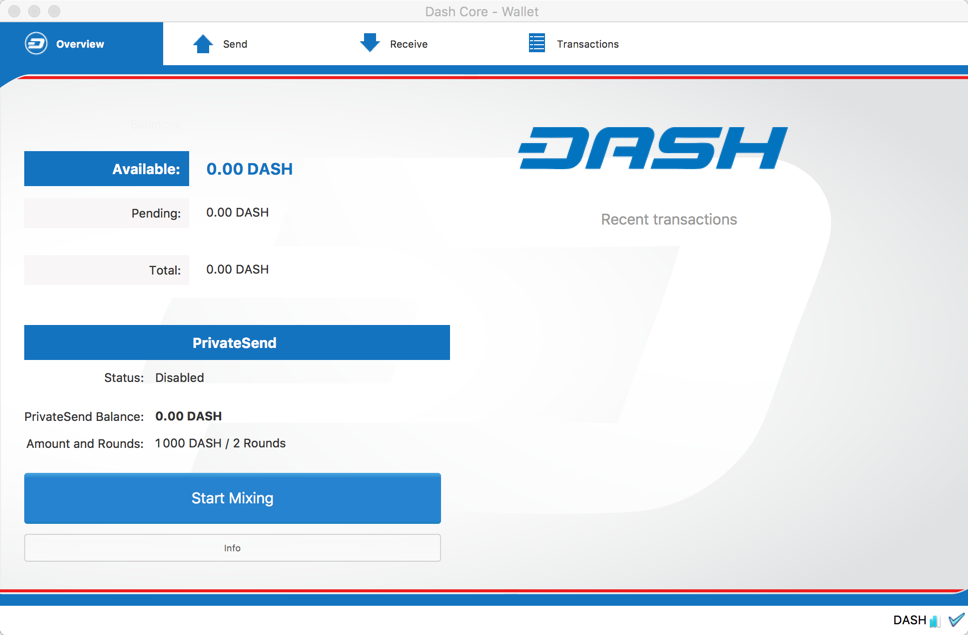

   Dash Core synchronization is complete

You can now begin to use your wallet to send and receive funds.

Encrypting your Dash wallet
---------------------------

After your wallet has synchronized with the Dash network, it is strongly
advised to encrypt the wallet with a password or passphrase to prevent
unauthorized access. You should use a strong, new password that you have
never used somewhere else. Take note of your password and store it
somewhere safe or you will be locked out of your wallet and lose access
to your funds.

To encrypt your wallet, click **Settings** > **Encrypt Wallet**.

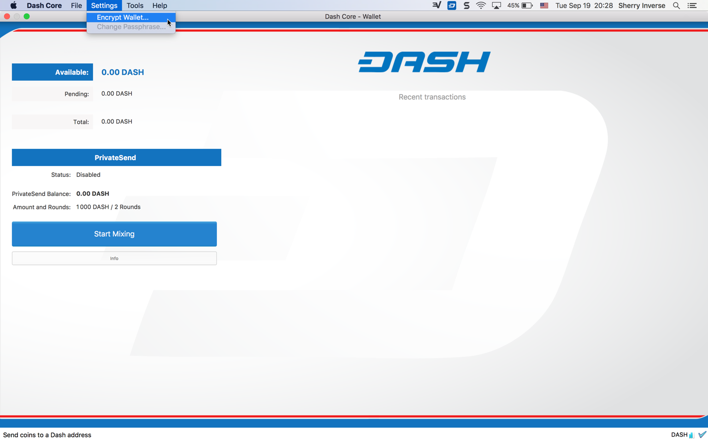

   Encrypting the Dash wallet with a password

You will be asked to enter and verify a password.

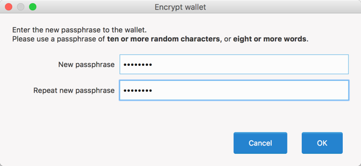

   Enter a password

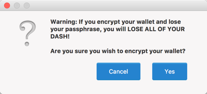

   Confirm you want to encrypt your wallet

When the encryption process is complete, you will see a warning that
past backups of your wallet will no longer be usable, and be asked to
shut down Dash Core. When you restart Dash Core, you will see a small
blue lock in the lower right corner.

   Fully encrypted and synchronized Dash Core wallet

You can now begin to use your wallet to safely send and receive funds.
