.. meta::
   :description: How to download, install and encrypt the Dash Core wallet in Windows
   :keywords: dash, core, wallet, windows, installation

.. _dashcore-installation-windows:

Windows Installation Guide
==========================

This guide describes how to download, install and encrypt the Dash Core
wallet for Windows. The guide is written for Windows 10, but the steps
should be similar for Windows XP, Vista, 7 and 8.

Downloading the Dash Core wallet
--------------------------------

Visit https://www.dash.org/downloads/ to download the latest Dash Core
wallet. In most cases, the website will properly detect which version
you need. Click **Download Installer** to download the installer
directly.

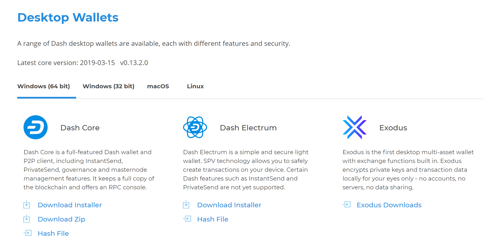

   The website properly detects the wallet appropriate for your system

If detection does not work, you will need to manually choose your
operating system and whether you need a 32 or 64 bit version. If you are
unsure whether your version of Windows is 32 or 64 bit, you can check in
Windows 10 under **Start > Settings > System > About**. For details on
how to check this in other versions of Windows, see
`here <https://www.lifewire.com/am-i-running-a-32-bit-or-64-bit-version-of-windows-2624475>`__.

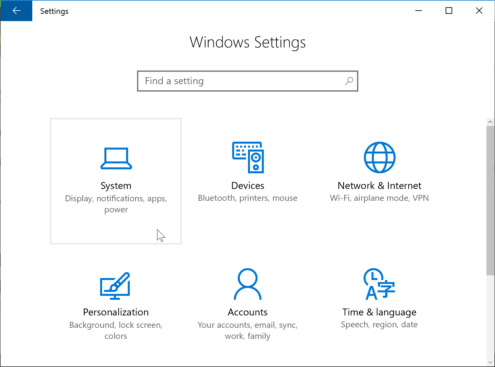

   In Windows Settings, click System

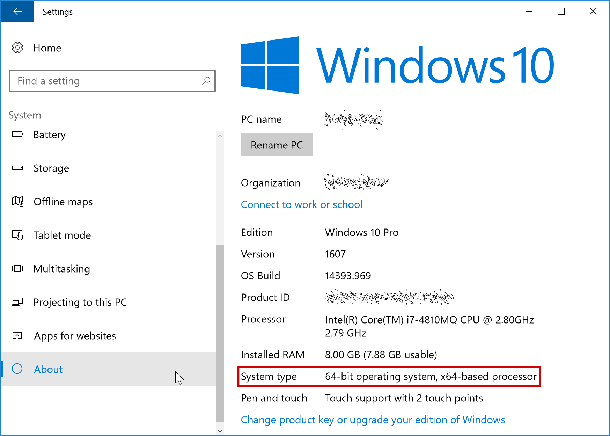

   Under the System section, click About to view the System type. This is
   a 64 bit system.

Once you know which version you need, download the Dash Core Installer
to your computer from https://www.dash.org/downloads/ and save the file
you downloaded to your Downloads folder.

Verifying Dash Core
-------------------

This step is optional, but recommended to verify the authenticity of the
file you downloaded. This is done by checking its detached signature
against the public key published by the Dash Core development team. To
download the detached signature, click the **Installer Signature**
button on the wallet download page and save it to the same folder as the
downloaded binary.

All releases of Dash are signed using GPG with one of the following keys:

- Alexander Block (codablock) with the key ``63A9 6B40 6102 E091``,
  `verifiable here on Keybase <https://keybase.io/codablock>`__ (`download <https://keybase.io/codablock/pgp_keys.asc>`__)
- Pasta (pasta) with the key ``5252 7BED ABE8 7984``, `verifiable here
  on Keybase <https://keybase.io/pasta>`__ (`download <https://keybase.io/pasta/pgp_keys.asc>`__)

Download the key files above. Install `Gpg4win <https://gpg4win.org/>`__
if it is not already available on your computer. Once it is installed,
open the **Kleopatra** certificate manager and click **File -> Import**.
Import the key files and verify the Key-ID matches the ID above. 

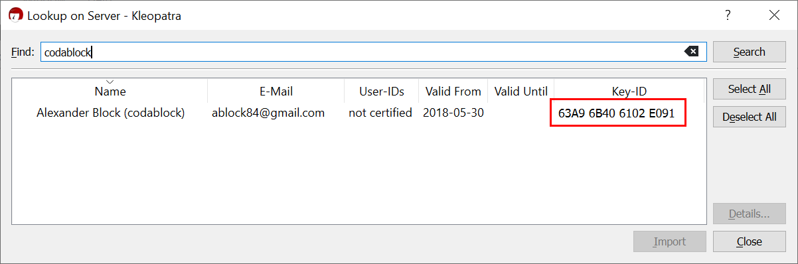

   Importing codablock's GPG public key

Skip any requests to certify the certificate with your own key. Next,
click **Decrypt/Verify...** and select the detached signature file named
``dashcore-0.16.0.1-win64-setup.exe.asc`` in the same folder as the
downloaded installer.

.. figure:: img/windows/setup-windows-kleopatra-verify.png
   :height: 250px

   Selecting the signature file for verification

If you see the first line of the message reads ``Verified
dashcore-0.16.0.1-win64-setup.exe with
dashcore-0.16.0.1-win64-setup.exe.asc`` then you have an authentic copy
of Dash Core for Windows.

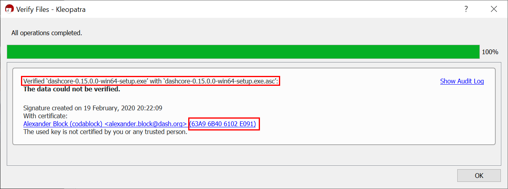

   The binary installer has been verified

Running the Dash Core installer
-------------------------------

Double-click the file to start installing Dash Core.

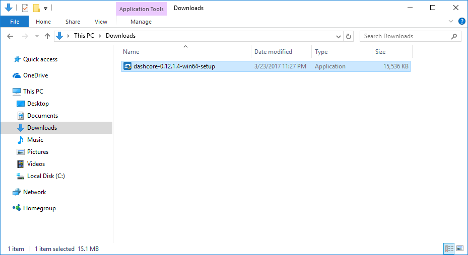

   The Dash Core installer in the Downloads folder

At this point, you may see a warning from Windows SmartScreen that the
app is unrecognized. You can safely skip past this warning by clicking
**More info**, then **Run anyway**.

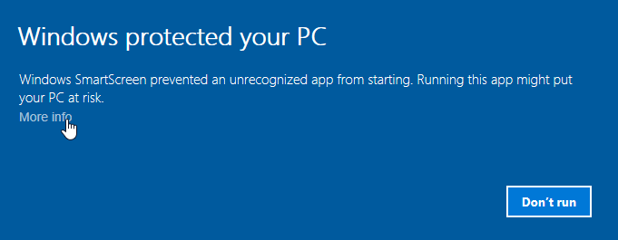

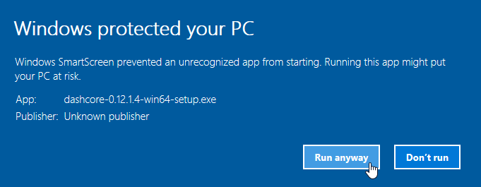

   Bypassing Windows SmartScreen to run the app. This warning is known 
   as a “false positive”.

The installer will then guide you through the installation process.

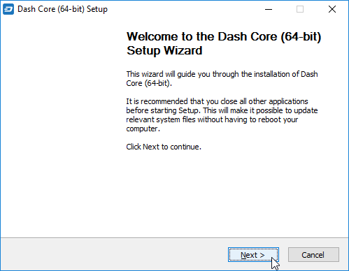

   The Dash Core installer welcome screen

Click through the following screens. All settings can be left at their
default values unless you have a specific reason to change something.

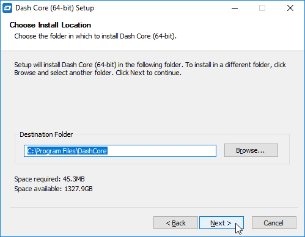

   Select the installation location

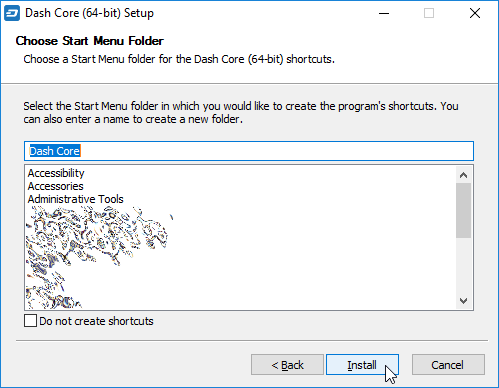

   Select the Start menu folder

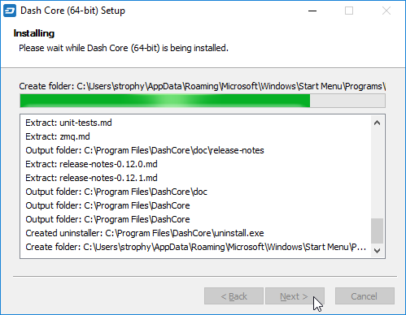

   Dash Core is being installed

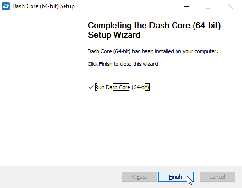

   Installation is complete

Running Dash Core for the first time
------------------------------------

Once installation is complete, Dash Core will start up immediately. If
it does not, click **Start > Dash Core > Dash Core** to start the
application. The first time the program is launched, you will be offered
a choice of where you want to store your blockchain and wallet data.
Choose a location with enough free space, as the blockchain can reach
30GB+ in size. It is recommended to use the default data folder
if possible.

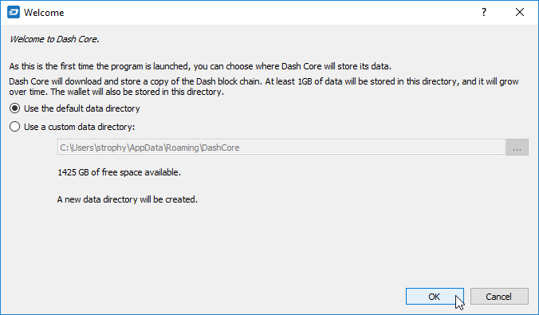

   Choosing the Dash Core data folder

Dash Core will then start up. This will take a little longer than usual
the first time you run it, since Dash Core needs to generate
cryptographic data to secure your wallet.

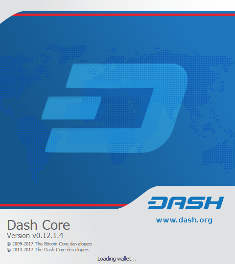

   Starting Dash Core

Synchronizing Dash Core to the Dash network
-------------------------------------------

Once Dash Core is successfully installed and started, you will see the
wallet overview screen. You will notice that the wallet is “out of
sync”, and the status bar at the bottom of the window will show the
synchronization progress.

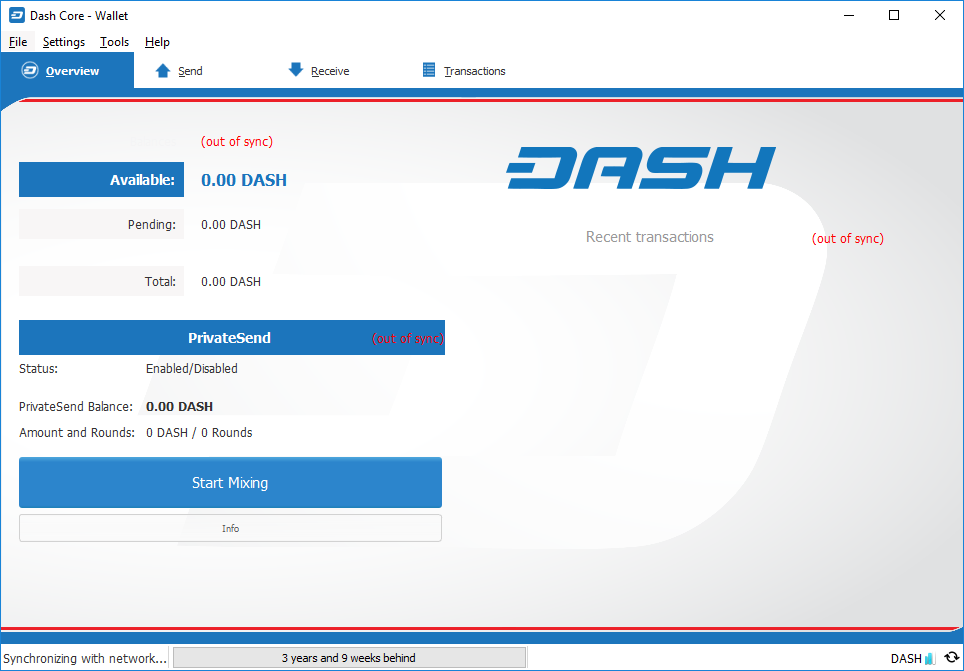

   Dash Core begins synchronizing with the Dash network

During this process, Dash Core will download a full copy of the Dash
blockchain from other nodes to your device. Depending on your internet
connection, this may take a long time. If you see the message “No block
source available”, check your internet connection. When synchronization
is complete, you will see a small blue tick in the lower right
corner.

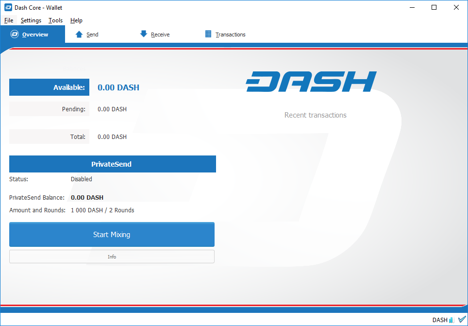

   Dash Core synchronization is complete

You can now begin to use your wallet to send and receive funds.

Encrypting your Dash wallet
---------------------------

After your wallet has synchronized with the Dash network, it is strongly
advised to encrypt the wallet with a password or passphrase to prevent
unauthorized access. You should use a strong, new password that you have
never used somewhere else. Take note of your password and store it
somewhere safe or you will be locked out of your wallet and lose access
to your funds.

To encrypt your wallet, click **Settings > Encrypt Wallet**.

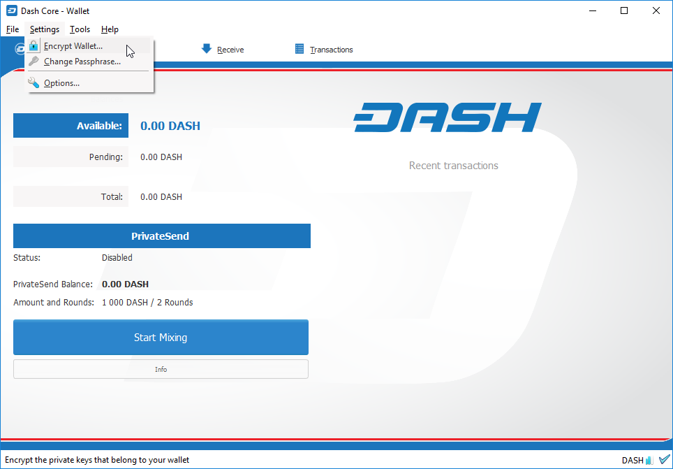

   Encrypting the Dash wallet with a password

You will be asked to enter and verify a password.

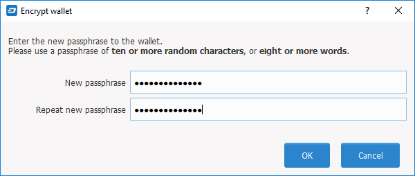

   Enter a password

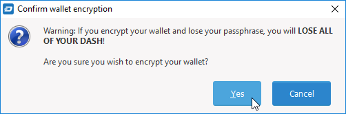

   Confirm you want to encrypt your wallet

When the encryption process is complete, you will see a warning that
past backups of your wallet will no longer be usable, and be asked to
shut down Dash Core. When you restart Dash Core, you will see a small
blue lock in the lower right corner.

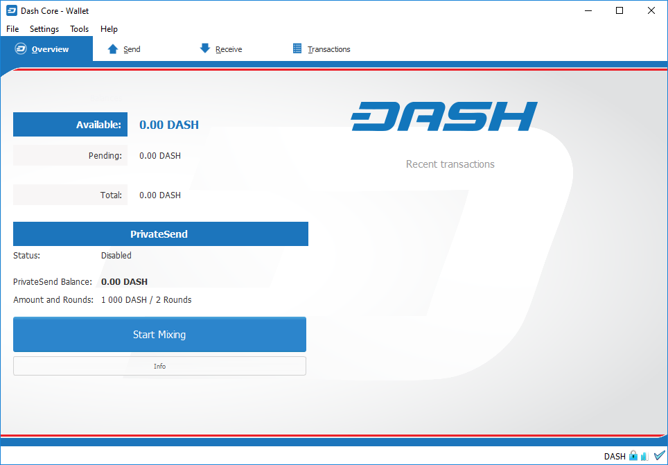

   Fully encrypted and synchronized Dash Core wallet

You can now begin to use your wallet to safely send and receive funds.
