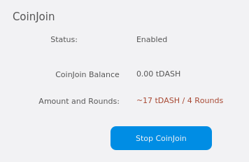

.. _dashcore-privatesend-instantsend:

===========================
PrivateSend and InstantSend
===========================

PrivateSend
===========

This documentation describes how to use Dash Core to send Dash
anonymously. PrivateSend, released as DarkSend in RC4 of the DarkCoin
client and rebranded to PrivateSend in May 2016, is a trustless method
of running a sequence of transactions (known as "mixing") such that an
external observer is unable to determine the source of funding when a
PrivateSend transaction is created. This gives your Dash the same
anonymous properties as cash withdrawn from an ATM, for example. The
mixing and denomination process is seamless, automatic, and requires no
intervention on the part of the user. The current implementation of
PrivateSend in the Dash Core wallet allows any amount of Dash to be
mixed for later use in PrivateSend transactions. As of April 2018,
PrivateSend is not currently available in other Dash wallets.

You can read more about PrivateSend theory and processes :ref:`here
<privatesend>`.

Configuration
-------------

1. Open your Dash Core wallet, go to **Settings** and select
   **Options**. Go to the **Wallet** tab.

   .. image:: img/privatesend-options.png
      :width: 300px

2. Next to **PrivateSend rounds to use**, enter a value between 1-8.
   Each round of PrivateSend performs one denominated fund mixing
   transaction. Higher numbers of rounds increase your overall level of
   anonymity while decreasing the chance of detection via node
   collusion. 8 is the highest number of rounds currently available.

   NOTE: To prevent system abuse, an average of one in ten rounds of
   masternode mixing incurs a fee of .001 DASH.

3. Enter a target value for **Amount of Dash to keep anonymized**. This
   value provides a lower boundary on the final amount of funds to be
   anonymized. Depending on how the client splits your wallet balance,
   you may end up with denominated inputs whose sum total is greater
   than the target amount. In this case the client will use all existing
   denominated inputs in the PrivateSend process. The final anonymized
   amount may be higher than your target, but should be close.

4. Click **OK** to save settings.

5. PrivateSend is disabled by default when you open the wallet. It will
   only start after you set the number of rounds and number of Dash to
   mix under settings and click **Start Mixing** on the **Overview** tab
   of your wallet.

Starting Mixing
---------------

The PrivateSend process is initiated by clicking the **Start Mixing**
button on the **Overview** tab of the Dash Core wallet. Mixing is
possible once the following conditions have been met:

- The wallet contains sufficient non-anonymized funds to create the
  minimum required denominated values
- The user has not disabled PrivateSend in the Options dialog
- The target value for anonymized Funds in the Options dialog is greater
  than zero

If your wallet is encrypted (highly recommended), you will be asked to
enter your wallet passphrase. Enable the **Only for mixing via
PrivateSend** checkbox to unlock the wallet for mixing only.

.. figure:: img/mixing-password.png
   :width: 300px

   Entering a password for PrivateSend mixing only

This will unlock your wallet, and the PrivateSend mixing process will
begin. The wallet will remain unlocked until PrivateSend mixing is
complete, at which point it will be locked automatically.

   PrivateSend interface after clicking the **Start Mixing** button.
   Note the **Status** is **Enabled**.

PrivateSend will begin creating transactions and your PrivateSend
balance will gradually increase. This process can take some time, so be
patient. You can monitor the process in more detail as described in the
following section.

Any of the following actions will interrupt the mixing process. Because the transactions are atomic (they either take place completely, or do not take place at all), it should be possible to safely interrupt PrivateSend mixing at any time.

- Clicking the Stop Mixing button on the Overview tab
- Closing the client before PrivateSend mixing is completed
- Sending PrivateSend funds from the wallet before PrivateSend rounds
  are completed
- Disabling PrivateSend before the process is complete

Monitoring Mixing
-----------------

If you want to monitor PrivateSend in more detail, you need to enable
some advanced features of the wallet. Go to **Settings**, select
**Options** and go to the **Wallet** tab. Check the boxes next to the
**Enable coin control features** and **Enable advanced PrivateSend
interface** options.

.. figure:: img/privatesend-settings.png
   :width: 300px

   Enabling advanced options for PrivateSend in the Dash Core wallet
   settings

This will allow you to monitor progress and see which individual
operations PrivateSend is carrying out in the background.

.. figure:: img/mixing-progress.png
   :width: 250px

   Monitoring PrivateSend progress

This will allow you to monitor progress and see which individual
operations PrivateSend is carrying out in the background.

Since PrivateSend mixing creates a lot of new address keys to send and
receive the anonymized denominations, you may receive a warning when the
number of remaining keys runs low. This is nothing to be worried about,
since the wallet will simply create more keys as necessary. However,
these keys will not exist in any previous backups of your wallet. For
this reason, it is important to backup your wallet again after mixing is
complete.

You can also monitor PrivateSend progress by viewing the transactions
created by the mixing process on the **Transactions** tab.

.. figure:: img/privatesend-transactions.png
   :width: 400px

   Transactions created by PrivateSend on the Transactions tab

You can also use the coin control feature to view which addresses hold
mixed denominations ready to be used for PrivateSend transactions. Go to
the **Send** tab of your wallet and click **Inputs** to view the possible input
addresses for your transactions. You can see how each address holds
given denominations of mixed Dash, and how many rounds of mixing have
been completed. This is to ensure that an efficient combination of
addresses can be used as inputs in PrivateSend transactions without too
much change, since amount in a PrivateSend transaction must be rounded
up to completely spend all inputs. The current minimum balance for an
input used in a PrivateSend transaction is 0.01000010 DASH.

.. figure:: img/privatesend-addresses.png
   :width: 400px

   Coin Selection dialog showing addresses holding PrivateSend mixed
   balances in different denominations

Paying with PrivateSend
-----------------------

You can only use PrivateSend for payments once you have mixed enough
Dash to make up the amount you are trying to send. Because the mixing
process takes time, it must be done in advance before you create the
send transaction. A PrivateSend transaction is effectively the same as
any other transaction on the blockchain, but it draws only from input
addresses where the denomination has previously been mixed to ensure
anonymity of funds. Because several input addresses are usually required
to make up the amount you are trying to send, a PrivateSend transaction
will usually take up more space (in kilobytes) on the blockchain, and
therefore will be charged a slightly higher fee. 

To send a payment using PrivateSend, go to the **Send** tab of the Dash
Core wallet and enable the **PrivateSend** option. The balance displayed
will change to show your PrivateSend balance instead of the total
balance. You can then enter the **Pay To** address, **Label**,
**Amount** and click **Send** as usual. Your payment will be rounded up
to completely spend the lowest possible denomination of mixed balance
available (currently to the nearest 0.01 DASH). You will be prompted to
enter your password and receive a detailed breakdown of the fee
structure for PrivateSend before sending.

.. figure:: img/privatesend-send.png
   :width: 400px

   Dash Core ready to send a PrivateSend transaction. Note PrivateSend
   is enabled and the amount to be sent is less than the available
   PrivateSend balance

InstantSend
===========

Introduction
------------

This documentation describes how to use InstantSend to instantly send
funds to any other Dash user around the world. Dash InstantSend is
supported by many wallets and vendors, including (but not limited to)
the following:

- Dash Core Wallet
- Dash Android Wallet
- Dash iOS Wallet
- Dash Copay Wallet
- My Dash Wallet
- Kraken
- Bitrefill
- and many more...

You can read more about InstantSend theory and processes :ref:`here
<instantsend>`.

Paying with InstantSend
-----------------------

InstantSend functions by setting a flag on the transaction, causing
deterministic selection of a quorum of 10 masternodes for each input
spent in an InstantSend transaction. The masternodes examine the input,
and if a majority determines it has at least six confirmations, they
then accept the transaction. The input is then locked until the
transaction has been confirmed in six mined blocks, at which point the
output can be used as an input in another InstantSend transaction. This
differs from inputs used in normal transactions, which can be spent
after just one confirmation regardless of whether the Dash was received
using InstantSend or not. A higher fee will be charged for InstantSend
transactions, according to the :ref:`fee schedule <fees>`. Note that the
receiving wallet must also be aware of InstantSend in order to be able
to immediately continue with the transaction or display an apporiate
notification that the transaction should be considered locked. If the
receiving wallet is not aware of InstantSend, it will simply appear as a
normal transaction and you will need to wait for standard block
confirmations.

To pay with InstantSend, simply check the relevant checkbox in your app.
The following screenshots indicate where this setting can be found in
the Dash Core, iOS and Android wallets.

.. image:: ../img/instantsend-dashcore.png
   :width: 400px

.. image:: ../img/instantsend-android.png
   :width: 200px
.. image:: ../img/instantsend-ios.png
   :width: 200px

*Dash Wallets showing InstantSend option*
