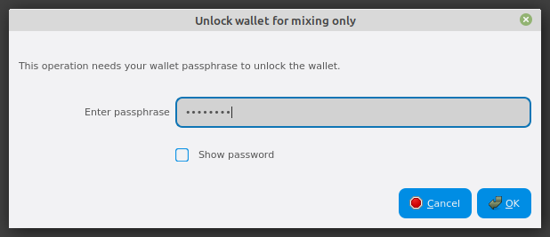
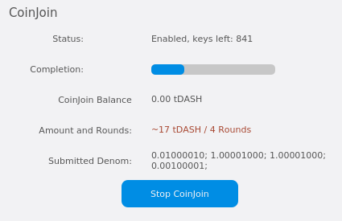

.. meta::
   :description: Using InstantSend and PrivateSend with Dash
   :keywords: dash, core, mobile, wallet, privatesend, instantsend

.. _dashcore-privatesend-instantsend:

===========================
PrivateSend and InstantSend
===========================

PrivateSend
===========

This documentation describes how to use Dash Core to send Dash
with enhanced privacy.

Background
----------

PrivateSend, released as DarkSend in 0.9-RC4 of the DarkCoin client and
rebranded to PrivateSend in May 2016, is a trustless method of running a
sequence of transactions (known as "mixing") such that an external
observer is unable to determine the source of funding when a PrivateSend
transaction is created. This gives your Dash the same privacy properties
as cash withdrawn from an ATM, for example. The mixing and denomination
process is seamless, automatic, and requires no intervention on the part
of the user. The current implementation of PrivateSend in the Dash Core
wallet allows any amount of Dash to be mixed for later use in
PrivateSend transactions. PrivateSend is also available in the
:ref:`Dash Electrum <dash-electrum-wallet>` wallet.

Knowledge of the exact number of rounds of PrivateSend mixing used in
any given PrivateSend transaction has a `quantifiable effect
<https://www.dash.org/forum/threads/evaluating-the-privacy-of-
privatesend.32472/>`_ on the confidence an adversary may have when
attempting to guess the source of a PrivateSend transaction. For this
reason, the recommended (and default) number of rounds of PrivateSend
mixing is set to four, and some inputs may be mixed by additional rounds
to further improve privacy.

You can read more about PrivateSend theory and processes :ref:`here
<privatesend>`.

Configuration
-------------

1. Open your Dash Core wallet, go to **Settings** and select
   **Options**. Go to the **PrivateSend** tab.

   .. image:: img/options-privatesend.png
      :width: 300px

2. Next to **PrivateSend rounds to use**, enter a value between 1-16.
   Each round of PrivateSend performs one denominated fund mixing
   transaction. Higher numbers of rounds increase your overall level of
   privacy while decreasing the chance of detection via node
   collusion. 16 is the highest number of rounds currently available.

   NOTE: To prevent system abuse, an average of one in ten rounds of
   masternode mixing incurs a fee of .0001 DASH.

3. Enter a **Target PrivateSend balance**. This value provides a lower
   boundary on the final amount of funds to be mixed. Depending on how
   the client splits your wallet balance, you may end up with
   denominated inputs whose sum total is slightly greater than the
   target amount.

4. Click **OK** to save settings.

5. PrivateSend is disabled by default when you open the wallet. It will
   only start after you set the number of rounds and number of Dash to
   mix under settings and click **Start Mixing** on the **Overview** tab
   of your wallet.

Starting Mixing
---------------

The PrivateSend process is initiated by clicking the **Start Mixing**
button on the **Overview** tab of the Dash Core wallet. Mixing is
possible once the following conditions have been met:

- The wallet contains sufficient non-mixed funds to create the minimum
  required denominated values
- The user has not disabled PrivateSend in the Options dialog
- The target value for mixed Funds in the Options dialog is greater than
  zero

If your wallet is encrypted (highly recommended), you will be asked to
enter your wallet passphrase. Enable the **Only for mixing via
PrivateSend** checkbox to unlock the wallet for mixing only.

   Entering a password for PrivateSend mixing only

This will unlock your wallet, and the PrivateSend mixing process will
begin. The wallet will remain unlocked until PrivateSend mixing is
complete, at which point it will be locked automatically.

.. figure:: img/mixing.png
   :width: 250px

   PrivateSend interface after clicking the **Start Mixing** button.
   Note the **Status** is **Enabled**.

PrivateSend will begin creating transactions and your PrivateSend
balance will gradually increase. This process can take some time, so be
patient. You can monitor the process in more detail as described in the
following section.

Any of the following actions will interrupt the mixing process. Because
the transactions are atomic (they either take place completely, or do
not take place at all), it is possible to safely interrupt PrivateSend
mixing at any time.

- Clicking the Stop Mixing button on the Overview tab
- Closing the client before PrivateSend mixing is completed
- Sending PrivateSend funds from the wallet before PrivateSend rounds
  are completed
- Disabling PrivateSend before the process is complete

Monitoring Mixing
-----------------

If you want to monitor PrivateSend in more detail, you need to enable
some advanced features of the wallet. Go to **Settings**, select
**Options** and go to the **Wallet** tab. Check the **Enable advanced
PrivateSend interface** checkbox. This will allow you to monitor
progress and see which individual operations PrivateSend is carrying out
in the background.

   Monitoring PrivateSend progress

Since PrivateSend mixing creates a lot of new address keys to send and
receive the mixed denominations, you may receive a warning when the
number of remaining keys runs low. This is nothing to be worried about,
since the wallet will simply create more keys as necessary. However,
these keys will not exist in any previous backups of your wallet. For
this reason, it is important to backup your wallet again after mixing is
complete.

You can also monitor PrivateSend progress by viewing the transactions
created by the mixing process on the **Transactions** tab.

.. figure:: img/privatesend-transactions.png
   :width: 400px

   Transactions created by PrivateSend on the Transactions tab

The following table describes the PrivateSend-related transactions displayed in
the Type column of the **Transactions** tab:

+------------------------------------+--------------------------------------------+
| PrivateSend Transaction Type       | Transaction Description                    |
+====================================+============================================+
| PrivateSend Make Collateral Inputs | Wallet funds were moved to collateral      |
| (*Mixing*)                         | inputs that will be used to make           |
|                                    | collateral payments. This is done to       |
|                                    | minimize traceability of collaterals.      |
+------------------------------------+--------------------------------------------+
| PrivateSend Create Denominations   | Wallet funds were broken into              |
| (*Mixing*)                         | PrivateSend denominations (Step 1          |
|                                    | :ref:`here <privatesend>`)                 |
+------------------------------------+--------------------------------------------+
| PrivateSend Denominate             | A transaction was sent to a masternode     |
| (*Mixing*)                         | in order to participate in a mixing        |
|                                    | session (Step 3 :ref:`here <privatesend>`) |
+------------------------------------+--------------------------------------------+
| PrivateSend Collateral Payment     | The mixing session collateral was          |
| (*Mixing*)                         | claimed. This fee is charged in ~10%       |
|                                    | of mixing sessions to prevent spam         |
|                                    | attacks.                                   |
+------------------------------------+--------------------------------------------+
| PrivateSend                        | Mixed funds were used to send a payment    |
| (*Spending*)                       | to someone. Note: Unlike the previous 4    |
|                                    | transaction types, this is not a mixing    |
|                                    | process transaction.                       |
+------------------------------------+--------------------------------------------+

You can also use the coin control feature to view which addresses hold
mixed denominations ready to be used for PrivateSend transactions. Go to
the **Send** tab of your wallet and click **Inputs** to view the
possible input addresses for your transactions. You can see how each
address holds given denominations of mixed Dash, and how many rounds of
mixing have been completed. This is to ensure that an efficient
combination of addresses can be used as inputs in PrivateSend
transactions without too much change, since amount in a PrivateSend
transaction must be rounded up to completely spend all inputs. The
current minimum balance for an input used in a PrivateSend transaction
is 0.00100010 DASH.

.. figure:: img/privatesend-addresses.png
   :width: 400px

   Coin Selection dialog showing addresses holding PrivateSend mixed
   balances in different denominations

Paying with PrivateSend
-----------------------

You can only use PrivateSend for payments once you have mixed enough
Dash to make up the amount you are trying to send. Because the mixing
process takes time, it must be done in advance before you create the
send transaction. A PrivateSend transaction is effectively the same as
any other transaction on the blockchain, but it draws only from input
addresses where the denomination has previously been mixed to ensure
privacy of funds. Because several input addresses are usually required
to make up the amount you are trying to send, a PrivateSend transaction
will usually take up more space (in kilobytes) on the blockchain, and
therefore will be charged a slightly higher fee.

To send a payment using PrivateSend, go to the **PrivateSend** tab of
the Dash Core wallet. The balance displayed is your PrivateSend balance
instead of the total balance as shown on the **Send** tab. You can then
enter the **Pay To** address, **Label**, **Amount** and click
**PrivateSend**. Your payment will be rounded up to completely spend the
lowest possible denomination of mixed balance available (currently to
the nearest 0.001 DASH). You will be prompted to enter your password and
receive a detailed breakdown of the fee structure for PrivateSend before
sending.

.. figure:: img/privatesend-send.png
   :width: 400px

   Dash Core ready to send a PrivateSend transaction. Note use of the
   PrivateSend tab and the amount to be sent is less than the available
   PrivateSend balance

Inputs
------

Like all Dash transactions, PrivateSend transactions are composed of a
number of inputs and one or more outputs. PrivateSend transactions do
not use change addresses, so any remaining Dash will be spent on the
transaction fee.

Due to the probabilistic nature of the PrivateSend mixing
process, increasing the number of inputs in a transaction may
marginally reduce privacy. For this reason, using PrivateSend is not
recommended for users requiring a high level of privacy. While it is not
possible to link a PrivateSend transaction to a single source address
with absolute certainty, using more inputs may make a transaction more
vulnerable to different potential linking attacks.

You can reduce the number of inputs in a PrivateSend transaction by
defining the transaction amount in such a way that it consumes your
available input denominations more efficiently, or by mixing more Dash
to ensure enough appropriately denominated inputs are available. Use the
:ref:`Coin Control <coin-control>` function in the PrivateSend tab to
view and select or deselect mixed UTXOs currently available for use as
transaction inputs.

InstantSend
===========

Introduction
------------

This documentation describes how to use InstantSend to instantly send
funds to any other Dash user around the world. Since the release of
InstantSend based on Long Living Masternode Quorums (`LLMQ-IS <https://github.com/dashpay/dips/blob/master/dip-0010.md>`__)
in Dash 0.14, the Dash network itself will attempt to generate an
InstantSend lock for almost every transaction processed by the network,
according to :ref:`these rules <is-broadcast>`. Unlike the prior
implementation of InstantSend, which required a higher fee, LLMQ-IS
locks transactions without any action taken by the user. For this
reason, only the recipient needs to monitor the network for the
transaction lock in order to be able to receive funds and process
transactions with immediate settlement.

Dash InstantSend is supported by many wallets and vendors, including
(but not limited to) the following:

- Dash Core Wallet
- Dash Android Wallet
- Dash iOS Wallet
- My Dash Wallet
- Kraken
- Bitrefill
- and many more...

You can read more about InstantSend theory and processes :ref:`here
<instantsend>`.

InstantSend Transactions
------------------------

Since Dash 0.14, all user-facing interface options to create an
InstantSend transaction have been removed, because all transactions are
effectively InstantSend transactions. As before, the recipient is
responsible for monitoring the network for the InstantSend lock and
implementing user-facing logic and interfaces to continue with
transaction processing after payment has been recieved. See the
:ref:`InstantSend Integration <integration-instantsend>` documentation
for more information on how to monitor for InstandSend locks.
