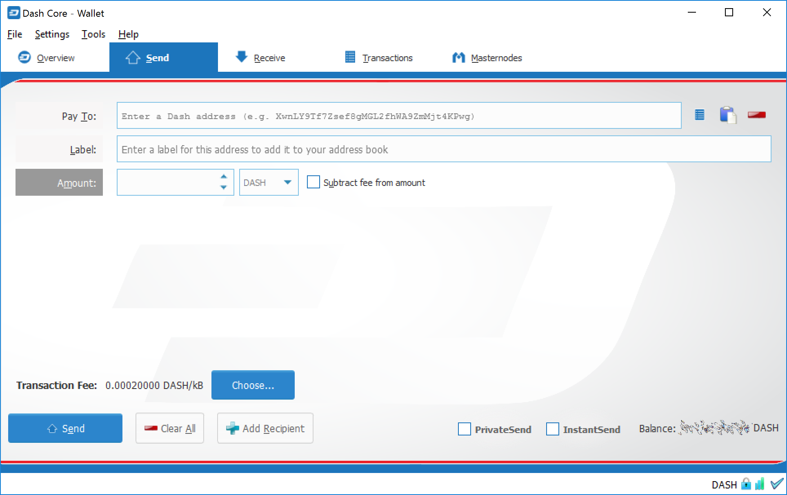

.. _dashcore_introduction:

============================
How to send and receive Dash
============================

Your Dash Core Wallet is associated with a number of unique addresses
that can be used to send and receive Dash. Each address holds its own
balance, and the sum of all your balances is what appears on the
**Overview** tab. When you send Dash, your wallet will automatically
transfer funds from as many of your addresses as necessary to the
destination address, which is controlled by another Dash user and
associated with their wallet. You can control which addresses you use
using the Coin Control feature.

When you confirm a transaction, Dash Core will enter the transaction in
a block, which will then be added to the blockchain for other clients to
confirm. A transaction is generally considered confirmed once six blocks
have been added after the block containing your transaction, although
masternode and mining payments are only released after 101 blocks. Note
that a different process is used for InstantSend and PrivateSend
transactions.

Dash addresses are 34 characters long and begin with an uppercase X.

Sending Dash
------------

You can use Dash Core to send Dash from your balance to another user.
The receiving user will provide you with a Dash address to which you
should send the funds. Click the **Send** tab in the tab bar and enter
the destination address in the **Pay To** field.

   The website properly detects the wallet appropriate for your system

You can also use the three icons |sendicons| to the right of the **Pay
To** field to select a previously used address, paste an address from
the clipboard, or clear the current address. If this is a new address,
you can enter a name for the address in the **Label** field to help
identify it again later. Finally, enter the amount of Dash you want to
transfer in the **Amount** field.

