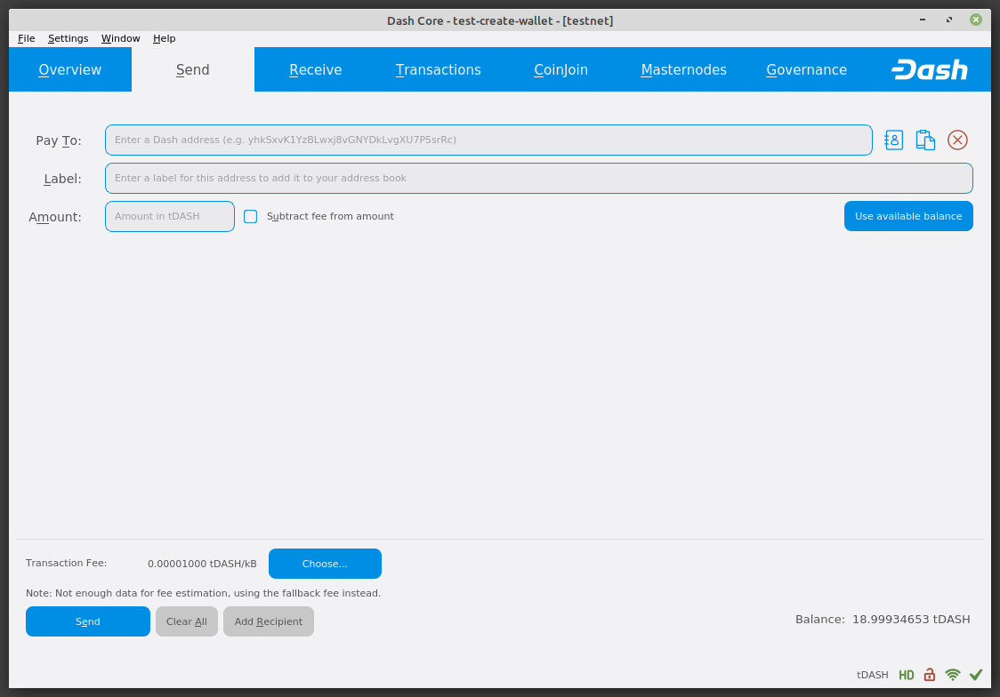
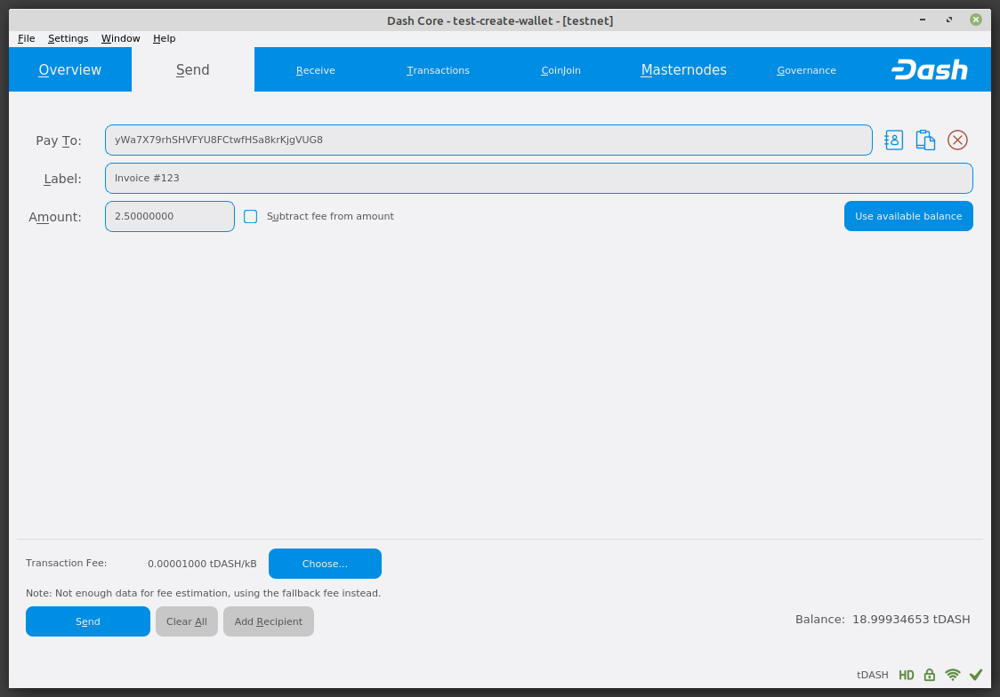
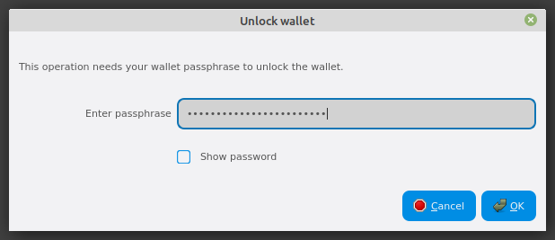
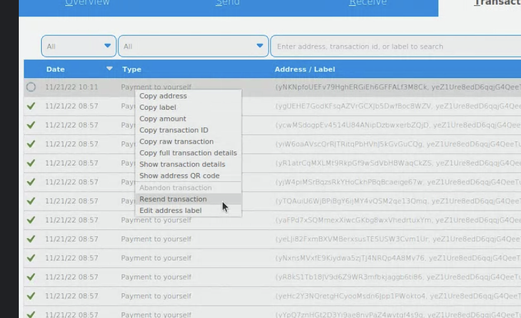
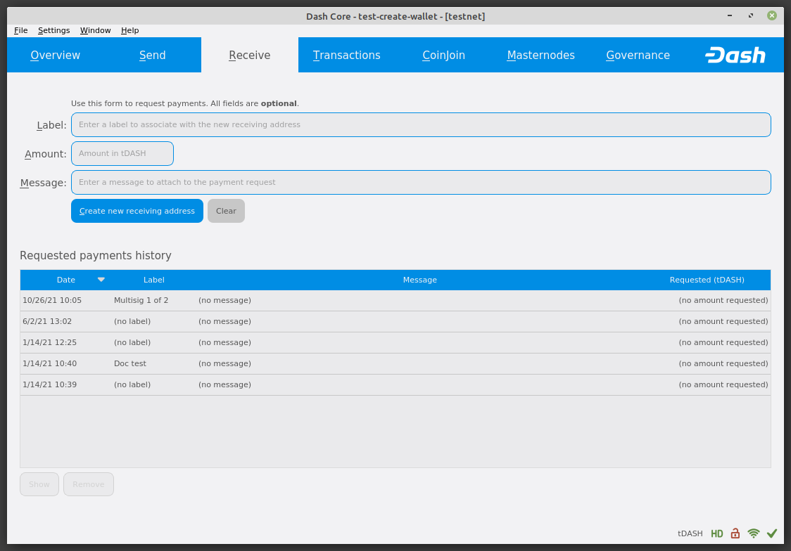
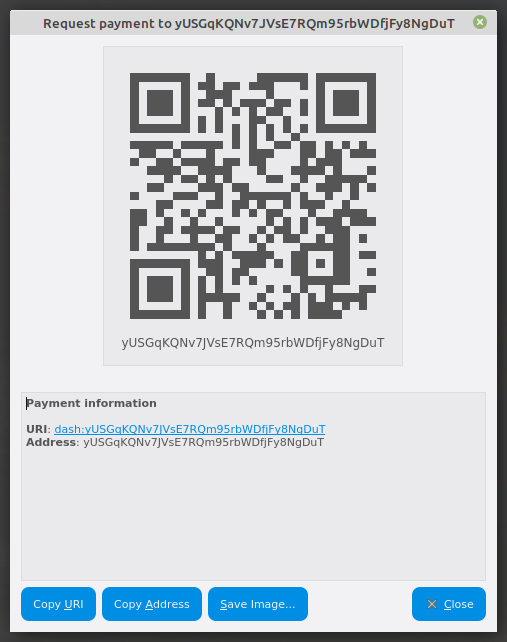

.. meta::
   :description: Guide to sending and receiving Dash using the Dash Core wallet
   :keywords: dash, core, wallet, send, receive, transaction

.. _dashcore-send-receive:

=====================
Sending and receiving
=====================

Your Dash Core Wallet is associated with a number of unique addresses
that can be used to send and receive Dash. Each address holds its own
balance, and the sum of all your balances is what appears on the
**Overview** tab. When you send Dash, your wallet will automatically
transfer funds from as many of your addresses as necessary to the
destination address, which is controlled by another Dash user and
associated with their wallet. You can control which addresses you use
using the Coin Control feature.

When you confirm a transaction, Dash Core will enter the transaction in
a block, which will then be added to the blockchain for other clients to
confirm. A transaction is generally considered confirmed once six blocks
have been added after the block containing your transaction, although
masternode and mining payments are only released after 101 blocks. Note
that a different process is used for InstantSend and CoinJoin transactions.

Dash addresses are 34 characters long and begin with an uppercase X.

Sending Dash
============

You can use Dash Core to send Dash from your balance to another user.
The receiving user will provide you with a Dash address to which you
should send the funds. Click the **Send** tab in the tab bar and enter
the destination address in the **Pay To** field.

   The Dash Core Send tab

You can also use the three icons |sendicons| to the right of the **Pay
To** field to select a previously used address, paste an address from
the clipboard, or clear the current address. If this is a new address,
you can enter a name for the address in the **Label** field to help
identify it again later. Finally, enter the amount of Dash you want to
transfer in the **Amount** field.

.. |sendicons| image:: img/sendicons.png
   :width: 80px

The other options relate to fees. You can
choose if you want to pay the network fee in addition to the amount
sent, or subtract it from the amount sent. You can also increase your
fee to encourage nodes on the network to prioritize your transaction.

Let’s try an example. Say you have received an invoice which you now
want to pay with Dash. The writer of the invoice has included a Dash
address, which can be seen in the following window beginning with *yWa*.
The invoice is for 2.5 Dash, which you fill in the **Amount** field.

   The Send tab filled out for a transaction

Once you have entered the destination address and the amount, click the
**Send** button. If you have encrypted your wallet, you will now be
required to enter your password to unlock the wallet.

   Entering the password to unlock the wallet

Finally, you are given one final confirmation and chance to cancel your
send transaction before Dash Core processes the transaction on the
blockchain.

.. figure:: img/confirm.png
   :width: 250px

   Final confirmation window

If you respond with **Yes**, your transaction will be processed. Your
operating system may display a notification, and the transaction will
appear on the Transactions tab, where you can monitor its progress.

.. figure:: img/sent-notification.png
   :width: 200px

   The Windows 10 sent transaction confirmation notification

Note that the amount of the transaction increased by .00003926 Dash.
This is the transaction fee. In the next section, we will see what this
procedure looks like from the receiving side.

Stuck transactions can be resent one-by-one using the "Resend transactions"
option in the menu. 

   Resending transactions

Receiving Dash
==============

To receive Dash, you must first create a receiving address to give to the
sending party. To do this, click the **Receive** tab in the tab bar.

   The Receive tab

Create a new address by clicking the **Request new receiving address** button.

   The Request payment window

Click **Copy Address** on the Request payment window that opens and give this
address to the person who will send you Dash. Your wallet does not need to be
open to receive funds, but if it is, you can watch the transaction arrive in
real time. This is because your wallet constantly watches for new blocks on the
blockchain when it is open, and will recognize a new transaction involving your
receiving address when it occurs.

.. figure:: img/received-notification.png
   :width: 200px

   The Windows 10 received transaction confirmation notification

Once you have been paid, you can see the balance both on the
**Overview** tab and on the **Transactions** tab.

.. figure:: img/received.png
   :width: 400px

   The received transaction

Viewing Addresses
=================

To view all previously created receiving addresses, click **Window > Receiving
addresses**. In the same way, sending addresses can be seen by clicking **Window
> Sending addresses**.

.. figure:: img/receiving-addresses.png
   :width: 350px

   The Receiving addresses window

You can edit an existing address by right clicking and selecting **Edit**
address from the context menu.
