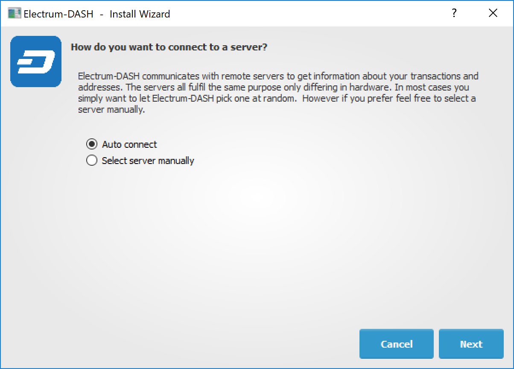
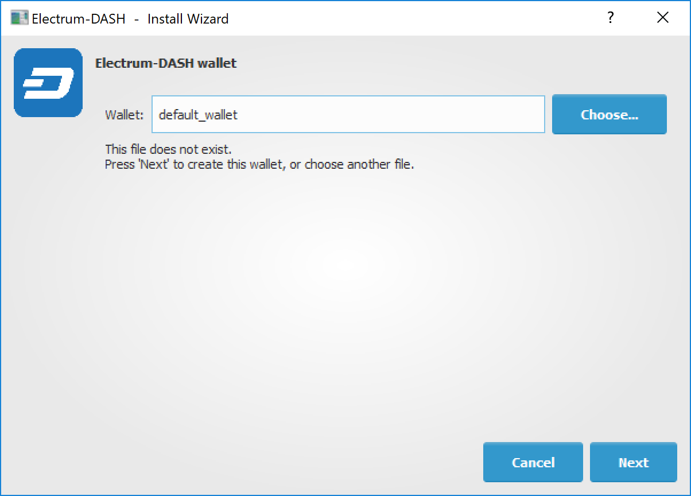
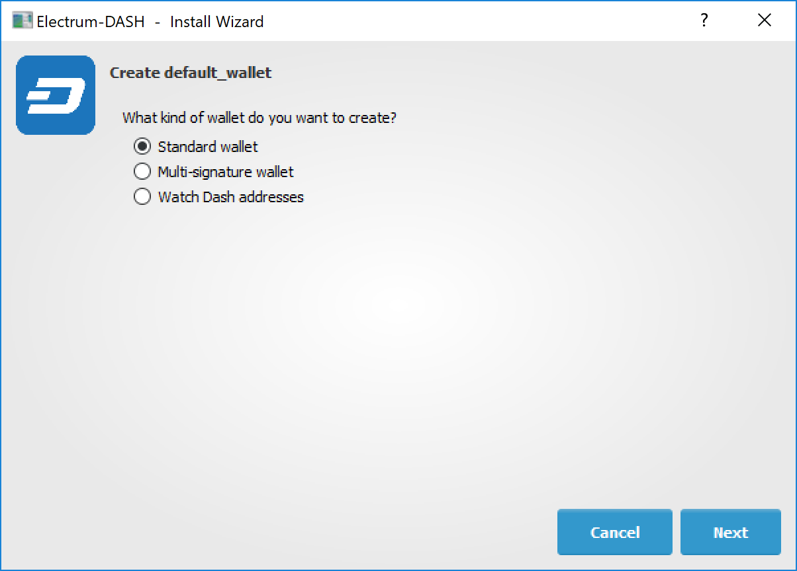
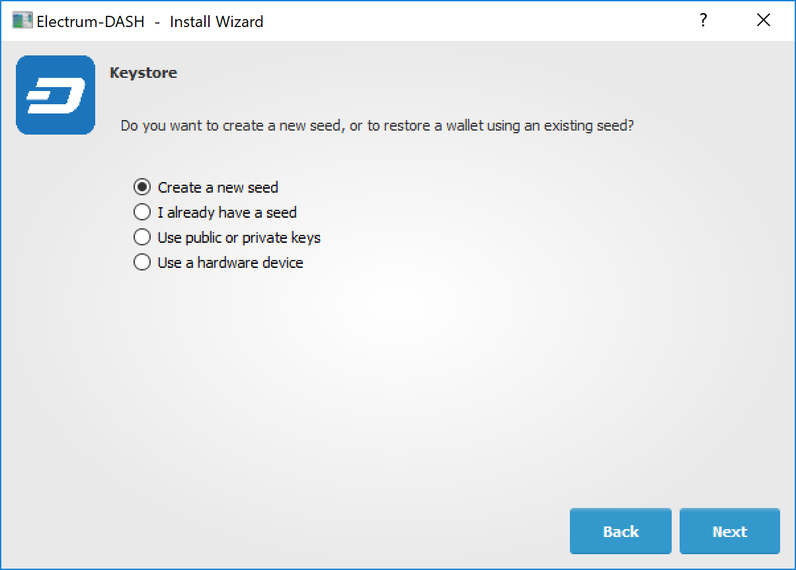
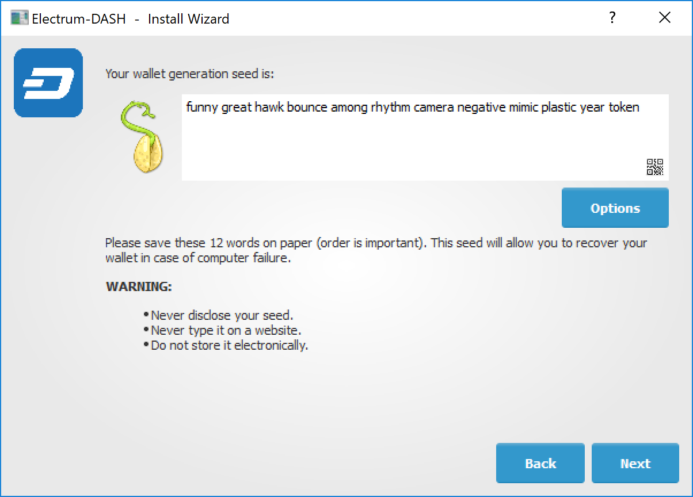
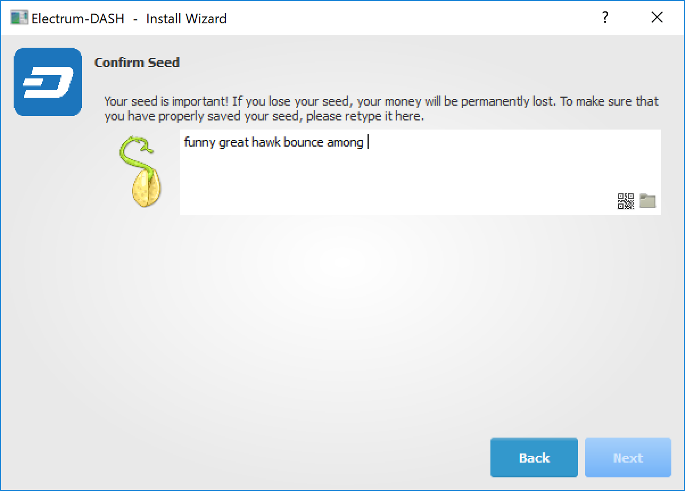
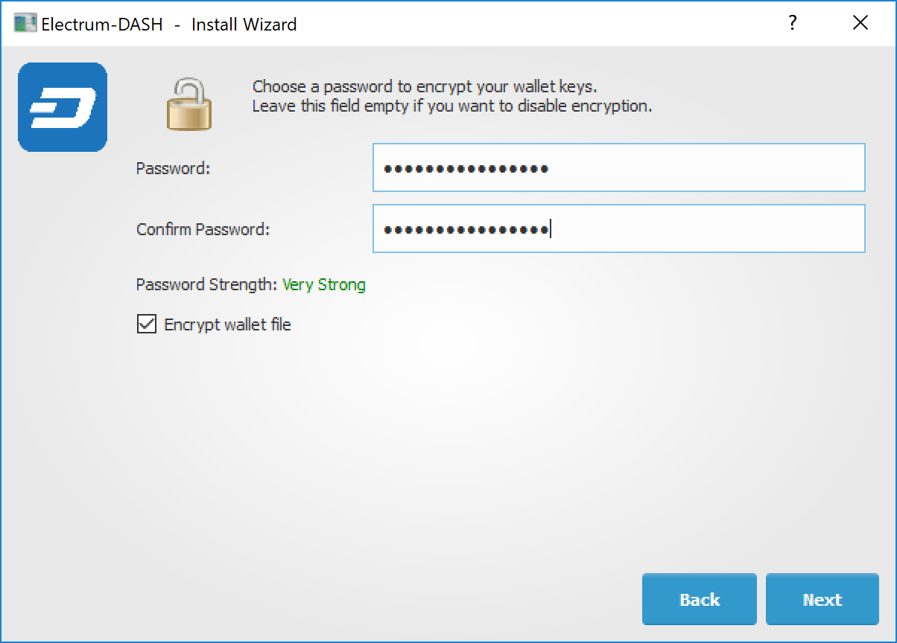

.. meta::
   :description: How to install and create a new Dash Electrum wallet on Windows, Linux, macOS and Android
   :keywords: dash, mobile, wallet, electrum, android, linux, windows, macos, installation, compile

.. _electrum-installation:

============
Installation
============

Download
========

You can download Dash Electrum from the official Dash website or the
Dash Electrum minisite.

- https://www.dash.org/downloads/
- https://electrum.dash.org

Dash Electrum is developed by community member **akhavr** and is
released through his GitHub account. 

- https://github.com/akhavr/electrum-dash/releases

You can optionally verify the authenticity of your download by checking
its detached signature against the public key published by akhavr. Run
the following commands (example for Linux)::

  wget https://github.com/akhavr/electrum-dash/releases/download/3.3.8.7/Dash-Electrum-3.3.8.7.tar.gz
  wget https://github.com/akhavr/electrum-dash/releases/download/3.3.8.7/Dash-Electrum-3.3.8.7.tar.gz.asc
  curl https://keybase.io/akhavr/pgp_keys.asc | gpg --import
  gpg --verify Dash-Electrum-3.3.8.7.tar.gz.asc

The output should contain the following line::

  Good signature from "Andriy Khavryuchenko <akhavr@khavr.com>"

Linux
-----

Dash Electrum for Linux is available from a PPA for Ubuntu and Linux
Mint, and as a source tarball for other systems. As of version 3.0.6, it
requires Python 3 to run. Enter the following commands to install from
PPA::

  sudo add-apt-repository ppa:akhavr/dash-electrum
  sudo apt update
  sudo apt install electrum-dash

You can also download the official package, unpack it and run it from
its root directory with installation as follows::

  wget https://github.com/akhavr/electrum-dash/releases/download/3.3.8.7/Dash-Electrum-3.3.8.7.tar.gz
  tar -zxvf Dash-Electrum-3.3.8.7.tar.gz
  cd Dash-Electrum-3.3.8.7
  ./electrum-dash

Finally, you can install Dash Electrum to your system from the source
tarball as follows::

  sudo apt install python3-pyqt5 python3-pip python3-setuptools libgmp3-dev
  wget https://github.com/akhavr/electrum-dash/releases/download/3.3.8.7/Dash-Electrum-3.3.8.7.tar.gz
  tar -zxvf Dash-Electrum-3.3.8.7.tar.gz
  cd Dash-Electrum-3.3.8.7
  sudo python3 setup.py install

You can then run ``electrum-dash`` from the terminal.

macOS
-----

Simply download and run the DMG file. You may need to grant permission
to install, depending on your security settings. Click through the
installation wizard and run Dash Electrum from your Applications folder
when complete.

Windows
-------

Simply download and run the installer file to set up Dash Electrum. You
may need to grant permission to install, depending on your security
settings. Click through the installation wizard and run Dash Electrum
from the Start menu when complete.

Android
-------

Download and run the APK file from https://electrum.dash.org to set up
Dash Electrum. You may need to grant permission to install from unknown
sources, depending on your security settings. Click through the
installation wizard and run Dash Electrum when complete.

Creating a New Wallet
=====================

Dash Electrum gathers configuration data when run for the first time.
For more on the concepts behind this process, skip to the later sections
of this guide discussing backups, security, and addresses. When setting
up Dash Electrum for the first time, a wizard will guide you through the
process of creating your first wallet. The first screen asks how you
would like to connect to the remote server. Select **Auto connect** and
click **Next** to continue. You will see a notice that no wallet
currently exists. Enter a name for your wallet (or accept the default
name) and click **Next** to create your wallet.

   Selecting the server and naming your first wallet

You will be asked what kind of wallet you want to create. Choose between
**Standard wallet**, **Multi-signature wallet** and **Watch Dash
addresses**. If you are unsure, select **Standard wallet** and click
**Next** to continue. You will then be asked how you want to
store/recover the seed. If stored safely, a seed can be used to restore
a lost wallet on another computer. Choose between **Create a new seed**,
**I already have a seed**, **Use public or private keys** or **Use a
hardware device**. If you are using Electrum Dash for the first time and
not restoring an existing wallet, choose **Create a new seed** and click
**Next** to continue.

   Selecting the wallet type and keystore

Electrum Dash will generate your wallet and display the recovery seed.
Write this seed down, ideally on paper and not in an electronic format,
and store it somewhere safe. This seed is the only way you can recover
your wallet if you lose access for any reason. To make sure you have
properly saved your seed, Electrum Dash will ask you to type it in as a
confirmation. Type the words in the correct order and click **Next** to
continue.

   Generating and confirming the recovery seed

A password optionally secures your wallet against unauthorized access.
Adding a memorable, strong password now improves the security of your
wallet by encrypting your seed from the beginning. Skipping encryption
at this point by not selecting a password risks potential theft of funds
later, however unlikely the threat may be. Enter and confirm a password,
ensure the **Encrypt wallet file** checkbox is ticked and click **Next**
to continue.

   Entering and confirming a wallet encryption password

Your Dash Electrum wallet is now set up and ready for use.

.. figure:: img/electrum.png
   :width: 400px

   Dash Electrum after setup is complete
