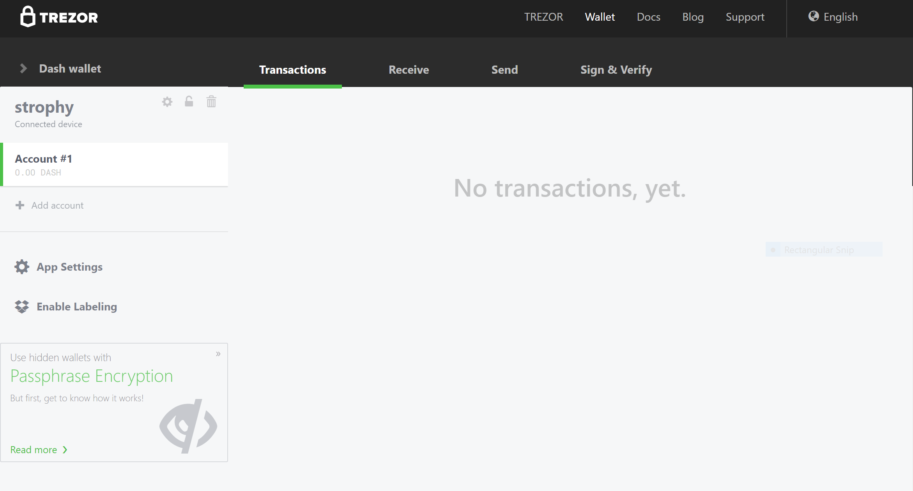
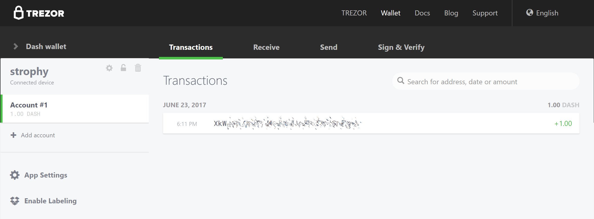
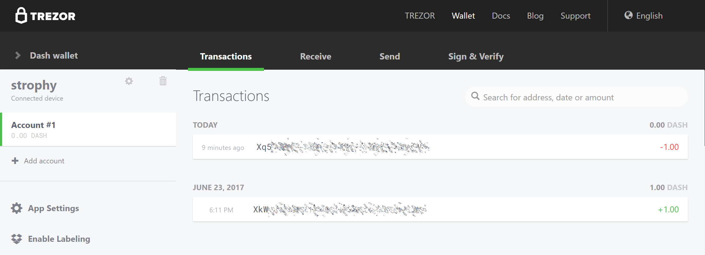

.. _dash_hardware_wallet:

Introduction
============

Hardware wallets offer you the security of storing your keys in secure
device while still allowing you to make simple transactions through a
web interface. Three major manufacturers of hardware wallets currently
exist, with Dash supported on all of them.

Trezor
======

Developed by Czech startup `SatoshiLabs <https://satoshilabs.com>`_, the
$99 device is essentially a USB dongle designed to add an extra
authentication layer to all outbound bitcoin transactions. Trezor has
supported Dash since January 2017 with the release of firmware version
1.4.2.

By virtue of its design, Trezor can be used to sign transactions on
'unsafe' computers and is impervious to keyloggers and many other
vectors of attack, so even if your host PC is compromised, the attacker
has no way of getting your private key. That's also where the device
gets its name, as 'trezor' translates into 'vault' in most Slavic
languages, including Czech. A kind of 'vault' for your private bitcoin
key, Trezor claims to use a number of clever tricks to maintain security
even on compromised and unsafe machines.

- Site: https://trezor.io
- Review: http://www.coindesk.com/review-bitcoin-vault-trezor-lives-name
- Shop: https://shop.trezor.io
- Wallet: https://wallet.trezor.io

It is also possible to operate a Dash masternode using your Trezor. See
here for details.

Getting Started
---------------

Once you have bought your Trezor from https://shop.trezor.io or an
`authorized reseller <https://trezor.io/resellers>`_, you will need a
wallet to use it with. Trezor supports the following Dash wallets:

- `Trezor Wallet <https://wallet.trezor.io>`_ (`documentation
  <https://doc.satoshilabs.com/trezor-apps/trezorwallet.html>`_)
- `Dash Electrum Wallet <https://electrum.dash.org>`_
  (:ref:`documentation <dash_electrum_wallet>`)
- `Dash Masternode Tool <https://github.com/Bertrand256/dash-masternode-
  tool>`_ (:ref:`documentation <dash_masternode_tool>`)

This documentation describes how to get started using the official
Trezor web wallet at `https://wallet.trezor.io
<https://wallet.trezor.io>`_. Always confirm the URL is correct and SSL
encryption is enabled when working with the Trezor Wallet. Follow these
steps when setting up your Trezor for the first time:

#. Inspect the packaging for tampering. There should be two seals and
   the flaps should be glued shut. It should be impossible to remove the
   device without totally destroying the packaging.

#. Go to https://trezor.io/start/ and watch the video to introduce the
   concepts of a shifting PIN layout and recovery seed.

#. Go to https://wallet.trezor.io/ to begin the setup process.

#. If not already installed, install the Trezor Bridge application from
   https://wallet.trezor.io/#/bridge

#. Connect the Trezor to your computer when prompted.

#. If this is the first time you connect your Trezor, you will be
   prompted to install firmware. Click the **Install** button, wait for
   the download and confirm on the device.

#. When complete, the device will display a fingerprint. Verify that
   this matches the fingerprint shown on the screen. Note that this is
   hexadecimal and therefore not case-sensitive.

#. After verification is complete, disconnect and reconnect your device.
   Enter a device label on the screen that appears.

#. Enter and confirm a PIN by clicking on the squares according to the
   mapping shown on the device.

#. Your Trezor device will now display a sequence of 24 words on the
   screen. This is your recovery seed. Write the words down in the order
   they appear on the recovery card. Never store your recovery seed in
   any digital format, including photos or text.

#. Verify the seed against what you have written down and store it in a
   safe place.

#. You will be asked to enter your PIN again.

#. The Trezor Wallet will appear with a message that your device is
   ready for use. Your device name will appear on the device.

#. Switch to the Dash wallet using the menu at the top left. You can now
   use your Trezor to send and receive Dash.

   Trezor Web Wallet for Dash ready for first use

Receiving Dash
--------------

We will now create a Dash receiving address and attempt to receive 1.0
DASH.

1. In the Trezor Dash wallet, click **Account #1**, then click Receive. 
2. A Dash address will appear. Click **Show full address** to verify the
   address on the Trezor device.

  .. image:: img/trezor-address.jpg
     :width: 100px

3. Send 1 DASH to this address using an exchange or another wallet.
4. Once the transaction is confirmed, it will appear on the
   **Transactions** tab of your Trezor Wallet.

   Trezor Web Wallet after receiving Dash

Sending Dash
------------

We will now send the Dash (minus transaction costs) to an external
address.

1. In the Trezor Dash wallet, click **Account #1**, then click **Send**.
2. Enter the Dash address and amount in the fields.

  .. image:: img/trezor-send.png
     :width: 400px

3. Enter your PIN.
4. Confirm the address on the device, then confirm the action.

  .. image:: img/trezor-confirm.jpg
     :width: 100px

5. The transaction will be transmitted to the network and the recipient
   receives the funds.

   Trezor Web Wallet after sending Dash
