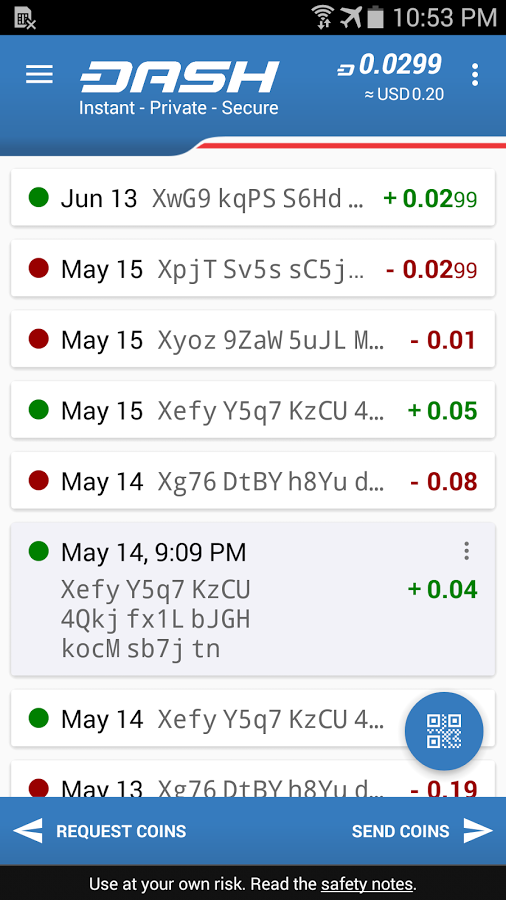
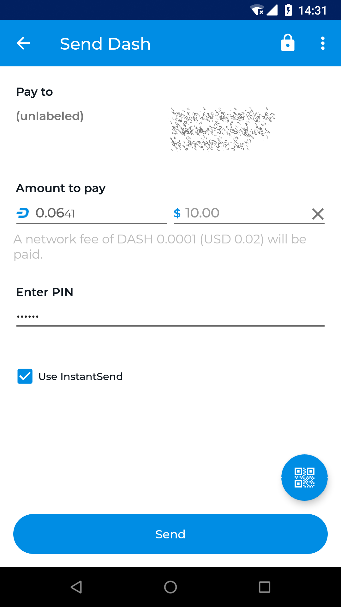
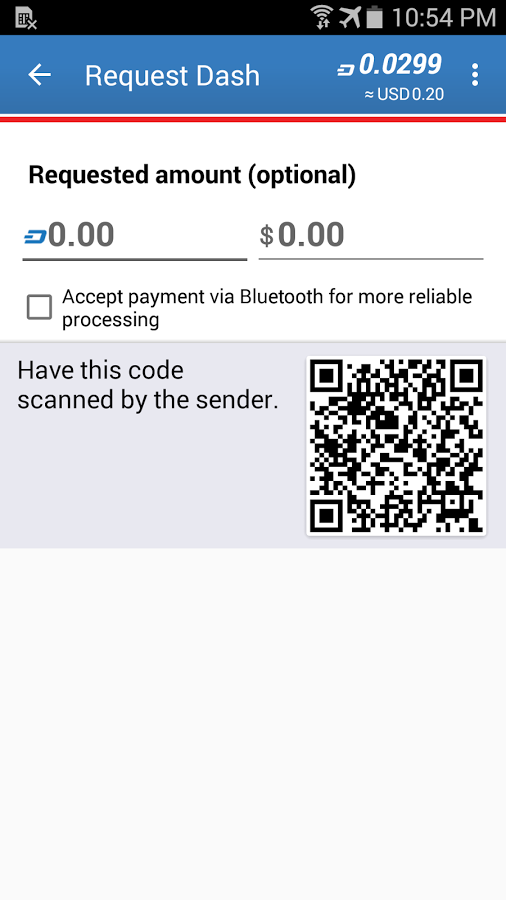

.. _wallets:

=======
Wallets
=======
Whenever you are storing objects with a market value, security is
necessary. This applies to barter systems as well as economies using
currency as a medium of exchange. While banks store balances on a
private ledger, cryptocurrencies store balances under unique addresses
on a distributed public ledger. The cryptographic private keys to access
the balance stored on each public address are therefore the object of
value in this system. This section of the documentation discusses
different practical methods of keeping these keys safe in wallets, while
still remaining useful for day-to-day needs.

.. _dash_core_wallet:

Dash Core Wallet
================

Dash Core Wallet is the full official release supporting all Dash
features as they are released, including InstantSend and PrivateSend, as
well as the governance, masternode and voting features. It is identical
to the software used by the Dash masternodes, and as such, it requires
you to download the entire Dash blockchain. It is available for macOS,
Linux, Raspberry Pi and Windows.

.. toctree::
   :maxdepth: 1

   dashcore/index.rst
   dashcore/interface.rst
   dashcore/installation.rst

.. _dash_copay_wallet:

Dash Copay Wallet
=================

The Dash Copay wallet is a modern and feature-rich wallet available for
both mobile and desktop devices. It supports advanced Dash features
including InstantSend, HD address generation, user-friendly address
books, multiple wallets in one app and easy to use multi-signature
wallets. Dash Copay is a light wallet, meaning that even though a full
copy of the blockchain is not required for use, the private keys to your
addresses are stored securely on your device and under your control at
all times.

.. toctree::
   :maxdepth: 2

   copay/index.rst

.. _dash_electrum_wallet:

Dash Electrum Wallet
====================

Electrum-Dash is a light wallet which uses powerful external servers to
index the blockchain, while still securing the keys on your personal
computer. Transactions are verified on the Dash blockchain using a
technique called Secure Payment Verification (SPV), which only requires
the block headers and not the full block. This means that wallet startup
is almost instant, while still keeping your funds secure and mobile. It
does not currently support advanced InstantSend and PrivateSend
features.

.. _dash_android_wallet:

Dash Android Wallet
===================

Dash offers a standalone wallet for Android, with development supported 
by the Dash budget. The Dash Android Wallet supports advanced Dash 
features, including contact management and InstandSend. You can scan and 
display QR codes for quick transfers, backup and restore your wallet, 
keep an address book of frequently used addresses, pay with NFC, sweep 
paper wallets and more.

.. toctree::
   :maxdepth: 1

   android/installation.rst
   android/getting-started.rst
   android/advanced-functions.rst

*Screenshots showing the Dash Wallet balance, send and receive screens*

.. _dash_ios_wallet:

Dash iOS Wallet
===============

Mobile wallets allow you to send and receive Dash from the convenience
of your mobile device. The keys are stored on the device, and the
recovery seed allows you to quickly recover your funds if your device is
lost. Dash mobile apps for Android and iOS support InstantSend so you
can pay vendors without waiting for block confirmations.

.. toctree::
   :maxdepth: 2

   android/index.rst

Hardware Wallets
================

Hardware wallets offer you the security of storing your keys in secure
device while still allowing you to make simple transactions through a
web interface.

Paper Wallet
============

The Dash Paper Wallet allows you to generate, encrypt and secure the
keys to a single Dash address on a clean computer without ever
connecting to the internet. Perfect for long term secure storage.

3rd Party Wallets
=================

These wallets have been developed by external developers to support
Dash.

Web Wallets
===========

Web wallets are services which keep a Dash balance for you, while
maintaining control of the private keys on your behalf. Any Dash stored
on exchanges falls under this category, but there are also some services
claiming to store Dash for you through simple Google/Facebook login
systems. Be extremely careful with web storage, as your Dash is only as
secure as the reputation of the company storing it for you.