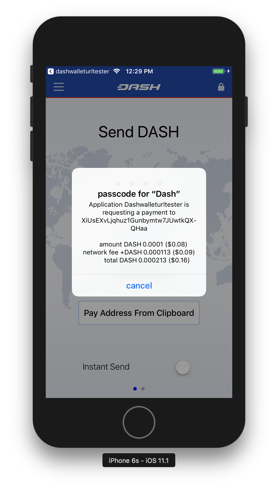

.. meta::
   :description: URL scheme, master public key and requesting payment in Dash on your iOS device
   :keywords: dash, mobile, wallet, ios, send, receive, payment, url, public key

.. _dash-ios-advanced-functions:

==================
Advanced functions
==================

URL Scheme
==========

iOS allows apps to communicate with one another through URL schemes. The
Dash Wallet for iOS implements the dashwallet:// scheme, allowing you to
call the wallet to complete a transaction denominated in Dash. This page
documents the methods available using the URL scheme.

Payment
-------

Payment request URL format::

  dashwallet://pay=<address>&amount=<amount>&(req-)IS=<0/1>&sender=<sender>

Notes:

- ``sender`` is both your callback URL and the name of the app that you
  show to the user. This is to prevent 3rd party apps from phishing.
- ``req-`` can be added before IS to force use of InstantSend for the
  transaction. If the user doesn’t have InstantSend enabled and doesn’t
  want to enable it, he will not be offered the option to send as a
  normal transaction.

The user will see something similar to this:

   Payment request in iOS

If the user enters the correct passcode, then the transaction is sent
and the user is returned to the sender app following the callback URL.

Callback URL format::

  <sender>://callback=payack&address=<example:XiUsEXvLjqhuz1Gunbymtw7JUwtkQXQHaa>&txid=<example:09855ac1c57725d8be2c03b53f72d1cb00ecb7b927bc9e7f5aed95cb3a985d76>

Master public key
-----------------

Master public key request format::

  dashwallet://request=masterPublicKey&account=0&sender=<sender>

Note: account is optional and corresponds to BIP32/BIP44 account, most
of the time this should be 0. If account is not specified, we use
account 0. This will send back both the extended public key at
``44’/5’/<account>’`` and ``<account>’``

Callback::

  <sender>://callback=masterPublicKey&masterPublicKeyBIP32=<example:xpub68GSYNiJZ7k1beEHGmkMUjPsawFvhM7adhbXgnaY1zj5iucUgKPJNDh5iCB8KV2A9FFAGKcGZp5JtQ1XNmT7j2ErRnf8eb4Mt4wjLG6uRcN>&masterPublicKeyBIP44=<example:xpub6DTuSViCnkd1jcgoiQLcghtTAAntBX4zWhfwNMSsmcD94JATNaWZ1tC4NEv6bxcD1YA4474S2BzCDsBA97sM52jiJcmFPBiXcH9JzZSLQJm>&account=0&source=dashwallet

Get address for payment
-----------------------

``dashwallet://request=address&sender=<sender>``

Callback::

  <sender>://callback=address&address=<example:XjkMY3GiK5aHwbpg9Uaw7QCPk3QE63Nh5i>&source=dashwallet
