.. _dash_ios_getting_started:

Getting Started
===============

Creating a New Wallet
---------------------

When you first start your Dash Wallet, you will be prompted to choose
between creating a new wallet or recovering an existing wallet. Choose
**new wallet** to create a new wallet unless you have existing funds
stored in another wallet using a recovery phrase. Your new wallet will
be generated, and a recovery phrase will appear so you can recover the
funds later if you lose or damage your phone or need to transfer the
account to another device. Write the phrase down and store it in a safe
place - if you lose this, you will also lose access to your funds
forever.

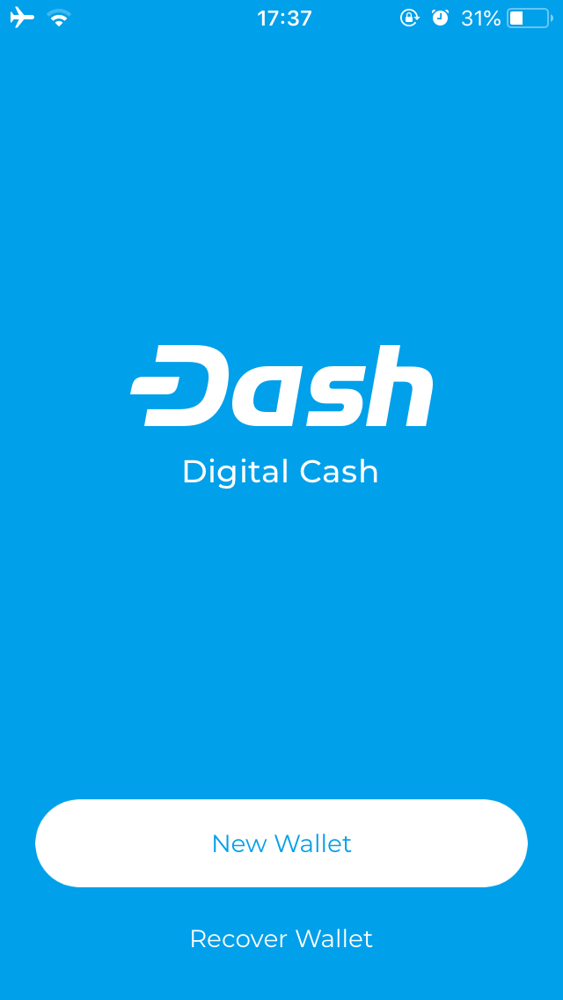
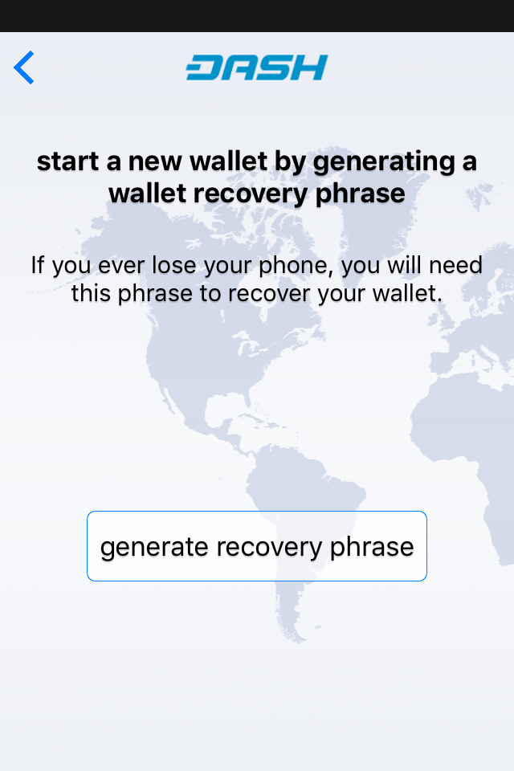
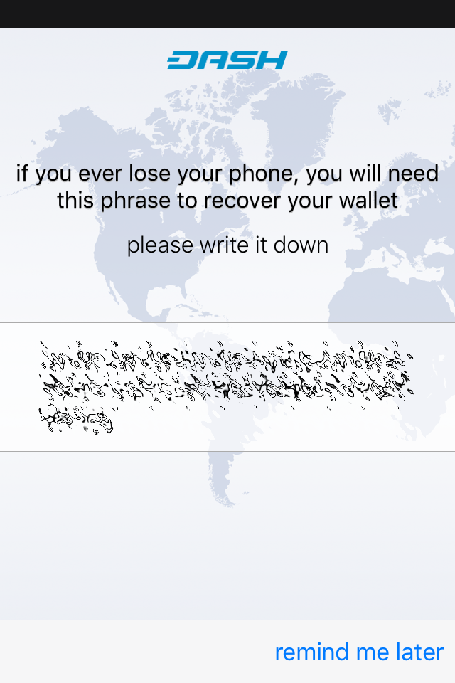

*Creating a new wallet and generating the recovery phrase in iOS Dash
Wallet*

You may also be asked to specify a PIN or link the app with your
TouchID. You can tap the Dash logo at the top of the app to view your
balance. You will need to unlock your wallet for this, as well as to
view your transaction history or send Dash.

Receiving Dash
--------------

Once you have set up your wallet, you will have two screens available to
send and receive Dash. You can swipe left and right between the screens.
To receive Dash, the app will generate an address which appears at the
bottom of the screen. You can tap this to copy and share, or scan the QR
code directly. Once the transfer is complete, you can view your balance,
transaction history and the status of any pending transactions by
clicking the menu button at the top left.

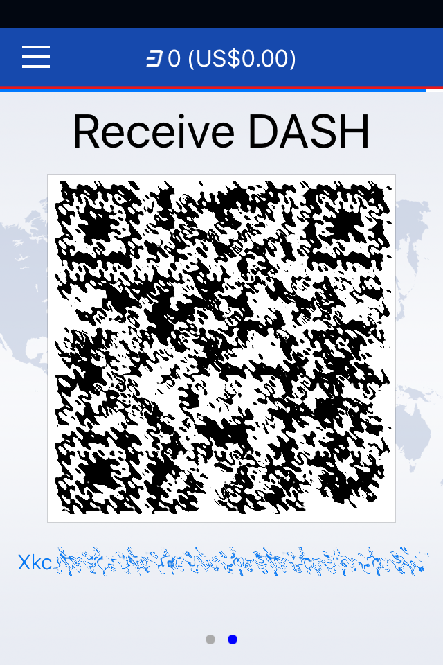
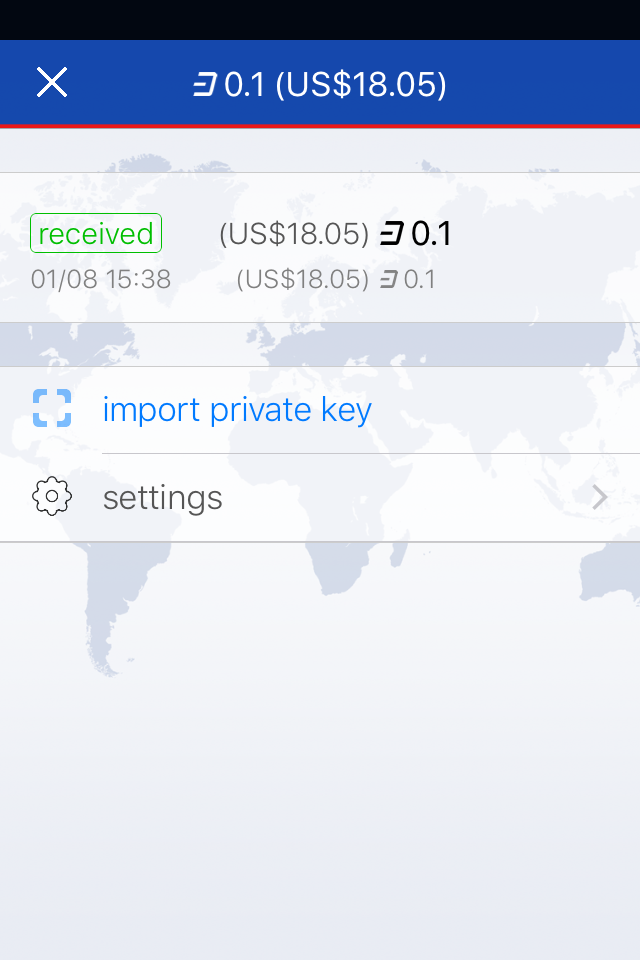

*Receiving Dash and viewing your balance in iOS Dash Wallet*

Sending Dash
------------

The Send DASH screen gives you two options to enter the payment address:
**Scan QR Code** or **Pay Address From Clipboard**. You can choose to
use **InstandSend** for instant confirmation, or disable this to send a
normal transaction which will require more time for confirmation.
Depending on the code you are scanning, the amount of Dash requested may
be included, or you can enter it yourself. A confirmation screen will
appear to explain the fee structure and request your unlock code (PIN or
TouchID). The transaction will then be sent.

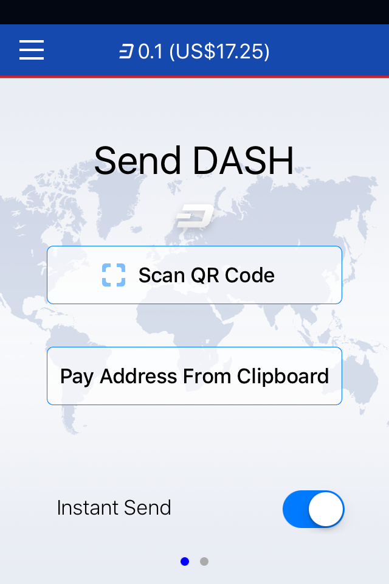
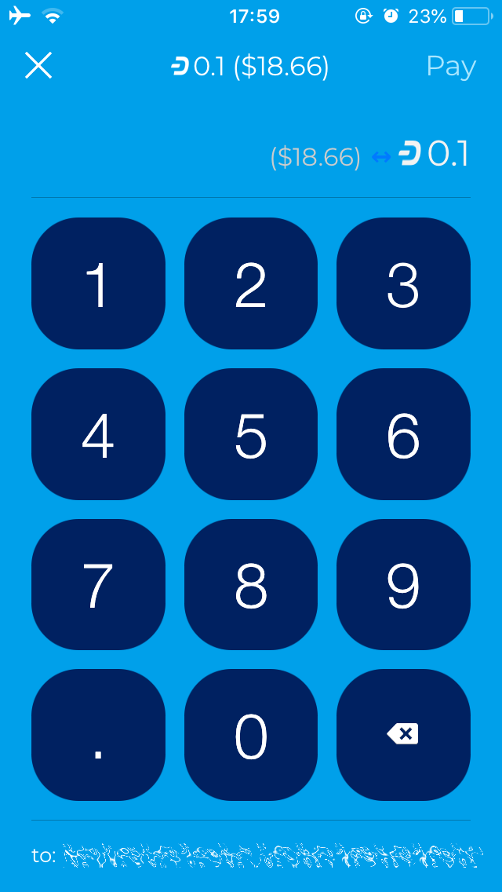
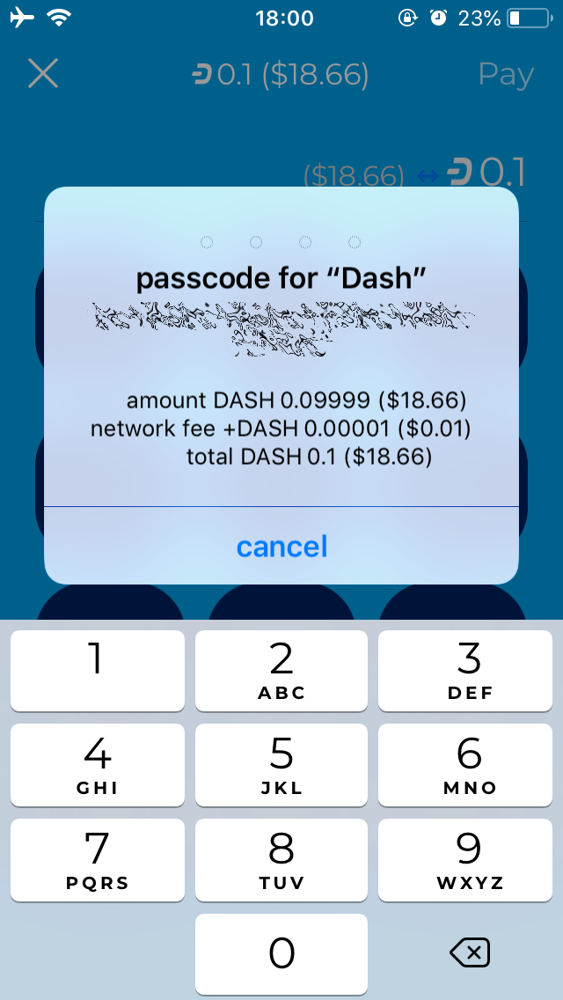
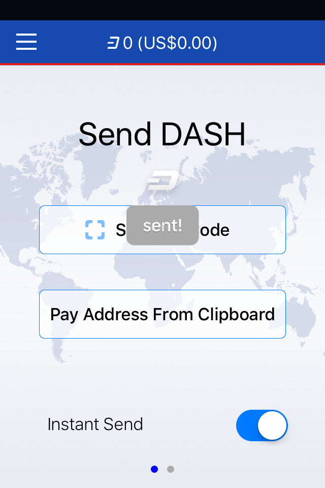

*Sending Dash from iOS Dash Wallet*

Sending to a Bitcoin address
----------------------------

You can also send from your Dash Wallet directly to a Bitcoin address
using services provided by ShapeShift that are integrated directly in
the wallet. If you scan or enter a Bitcoin address, you will be asked to
enter the amount to be send in Bitcoin instead of Dash. Once you have
entered the amount, click the **Shapeshift!** button shown an additional
confirmation screen to confirm the ShapeShift fees before the
transaction is processed. Make sure your destination Bitcoin address on
this screen is correct. (If you see an error message about the value
being too low, tap the greyed out Dash amount at the top to specify the
amount to be transferred in Dash instead of Bitcoin.) Once your
transaction is accepted, the Dash Wallet for iOS will display
**Shapeshift in progress** until the transaction is complete.

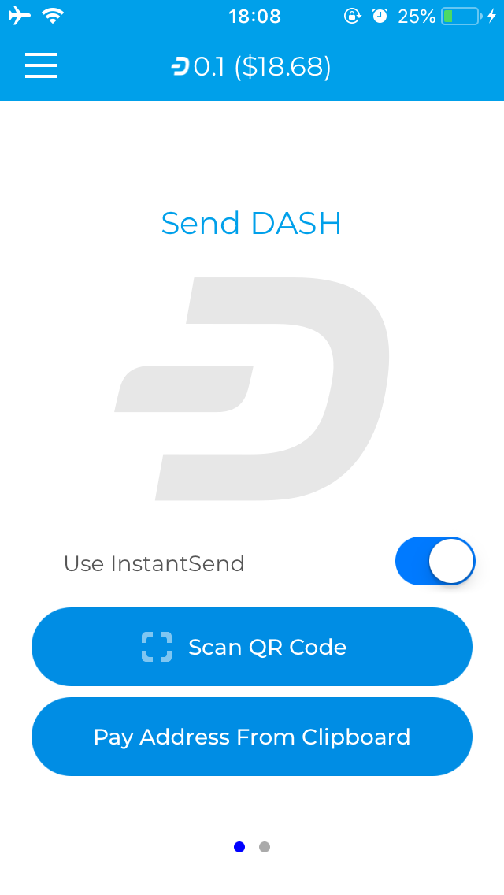
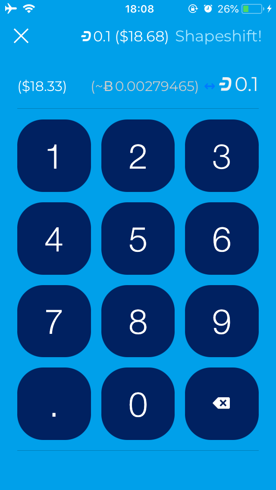
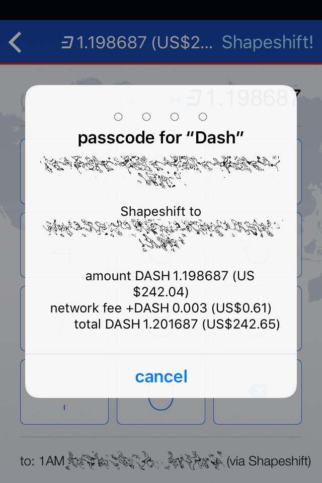
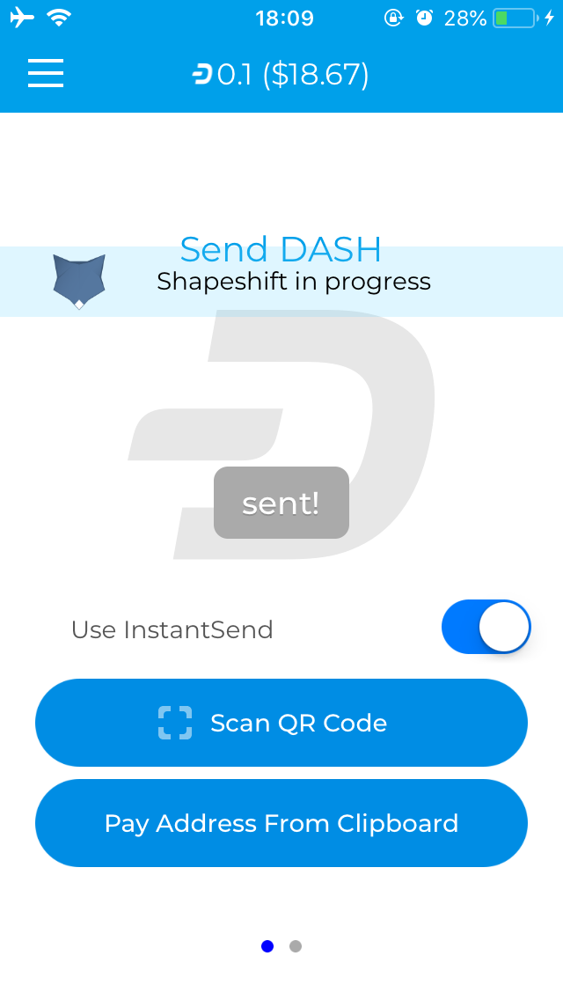

*Sending Dash to a Bitcoin address via ShapeShift from iOS Dash Wallet*
