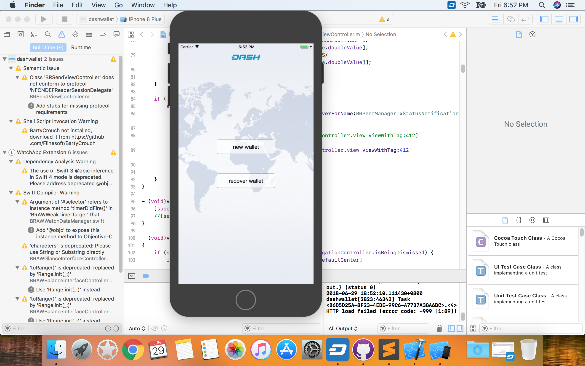

.. meta::
   :description: How to install the Dash wallet on your iOS device
   :keywords: dash, mobile, wallet, ios, installation, compile

.. _dash-ios-installation:

Installation
============

App Store
---------

The easiest way to install the Dash Wallet for iOS is from the `App Store <https://apps.apple.com/app/id1206647026>`__. 
While older versions of iOS are supported, you will need to be using iOS
10.0 or newer to use the latest version.

.. image:: img/app-store.png
    :width: 250 px
    :target: https://apps.apple.com/app/id1206647026

Compiling from source
---------------------

The source code for the wallet is available `here
<https://github.com/QuantumExplorer/dashwallet>`_. The following steps
describe how to download and compile the wallet from source.

1. Install `Xcode <https://apps.apple.com/us/app/xcode/id497799835?mt=12>`_ 
   from the App Store. The download is about 5GB, so this step may take
   some time.

2. Open **Xcode**, agree to the terms and conditions, then close the 
   app.

3. Open the **Terminal** app and enter the following commands::

     cd ~/Documents
     mkdir src
     cd src
     git clone https://github.com/QuantumExplorer/dashwallet.git

4. Open **Xcode** again and click **File -> Open**

5. Navigate to ``~/Documents/src/dashwallet/DashWallet.xcodeproj`` and
   click **Open**.

6. Click **Product > Run** to build and run the app in **Simulator**.

   Dash iOS wallet running in Simulator after compiling in Xcode

You can also make modifications to the code and sideload the app onto
your iOS device. For details, see `this post on Reddit
<https://www.reddit.com/r/sideloaded/wiki/how-to-sideload>`_.
