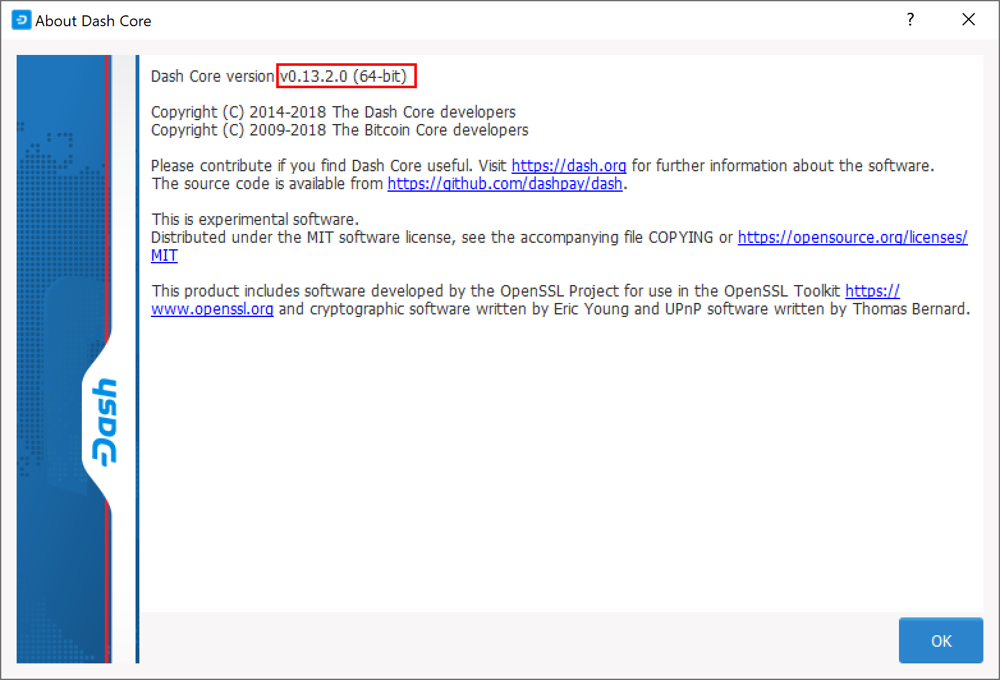
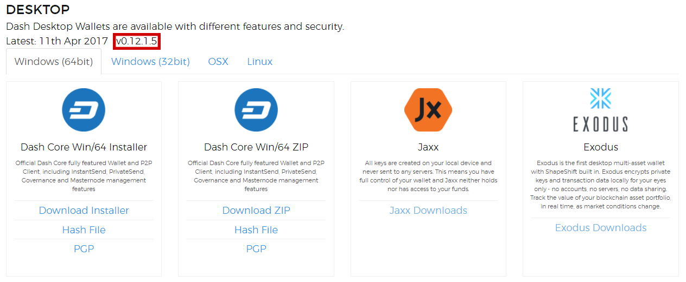

.. _wallet-recovery:

============
Introduction
============

Long-time users of cryptocurrency sometimes find old wallet files on USB
drives or cloud storage that they have forgotten about. Others may have
a backup, but can't remember the software they used to create it, or
have forgotten the password. Other users may have an old version of Dash
Core that no longer works because the network has upgraded. This
documentation is intended to help these users restore access to their
funds.

Determining the backup format
=============================

The first step is to determine the format of your backup. In most cases,
this will either be a file, probably named *wallet.dat*, or a phrase of
words. In some cases, you may have stored the private key for a Dash
address directly. The following list shows the possibilities and methods
to restore your wallet in order of probability.

- Backup is stored in an older version of Dash Core that no longer works

  - Follow instructions for restoring wallet files using :ref:`Dash Core <dashcore-restore>`

- Backup is a file

  - If file name is similar to wallet.dat, try to restore using :ref:`Dash Core <dashcore-restore>`
  - If file name is similar to dash-wallet-backup or includes the word 'mobile', try to restore using Dash Wallet for Android

- Backup is a phrase of words

  - If 12 words long, try to restore using Dash Electrum, Jaxx or Dash wallet for Android/iOS, depending what you used to create the backup
  - If 13 words long, try to restore using Dash Electrum wallet
  - If 12, 18 or 24 or 25 words long, try to restore with the hardware wallet you used to create the recovery phrase

- Backup is a long string of random characters or a QR code

  - If 34 characters long and starting with X, this is a public address and cannot be used to restore access to lost funds. You need the private key.

- If 51 characters long and starting with 7, this is a private key in WIF, import using Dash Core
- If 58 characters long and starting with 6P, this is a BIP38 encrypted private key, decrypt using paper wallet then import using Dash Core

Once you have determined your backup format, follow the links to view
the restore guide for that format.

.. _dashcore-restore:

Dash Core
---------

One of the most common wallet backup formats is a *wallet.dat* file from
Dash Core wallet. Before you begin, make absolutely sure that you have a
copy of this file stored somewhere safe in case the restore process
accidentally corrupts your wallet file! In most cases, *wallet.dat*
backups will also be protected by a password, which you will need to
know to regain access to your Dash funds. If you already have Dash Core
installed, first ensure it has been updated to the latest version by
clicking **Help > About Dash Core**. Compare this with the latest
available version of `Dash Core on the website
<https://www.dash.org/wallets/#wallets>`_ as follows:

   Comparing the installed version of Dash Core with the latest version
   available on the website

Update Dash Core to the latest version according to the
:ref:`installation instructions <dashcore-installation>`. If you have
only a wallet file and no existing installation of Dash Core, simply
install Dash Core according to the instructions here and start it once
to create the DashCore folder. Then close Dash Core and copy the
*wallet.dat* file you want to restore to the DashCore folder in the
location specified below, replacing or renaming the existing file.

+----------+--------------------------------+-----------------------------------------------------------------------------------+
| Platform | Path to data folder            | How to navigate                                                                   |
+==========+================================+===================================================================================+
| Linux    | ~/                             | Go to your home folder and press Ctrl+H to show hidden files, then open .dashcore |
+----------+--------------------------------+-----------------------------------------------------------------------------------+
| macOS    | ~/Library/Application Support/ | Press Shift + Control + G, type ~/Library/Application Support, then open DashCore |
+----------+--------------------------------+-----------------------------------------------------------------------------------+
| Windows  | %APPDATA%                      | Press Windows Key+R and type %APPDATA%, then open DashCore                        |
+----------+--------------------------------+-----------------------------------------------------------------------------------+

If your existing version of Dash Core is older than v0.12.1.x, you may need to rename your data folder from ``Dash`` to ``DashCore``.

To repair a broken installation, navigate to the DashCore folder and
delete all *.log* and *.dat* files except *wallet.dat*. The following
files can be safely deleted:

- *banlist.dat*
- *budget.dat*
- *db.log*
- *debug.log*
- *fee_estimates.dat*
- *governance.dat*
- *mncache.dat*
- *mnpayments.dat*
- *netfulfilled.dat*
- *peers.dat*

