.. meta::
   :description: List and detailed information on third-party wallets supporting the Dash cryptocurrency
   :keywords: dash, wallet, mobile, edge, ethos, paytomat, mobi, guarda, exodus, atomic, jaxx, coinomi, cobo, cryptonator, trust, kurepay, ownbit, abra, vegawallet

.. _dash-third-party:

Introduction
============

The Dash protocol and many Dash products such as Dash Core and the
mobile wallets are entirely open source, which makes it easy for third
parties to integrate Dash with their existing cryptocurrency wallet
solutions. This section describes some of the third party wallets
available and the functions they offer. Please note that Dash does not
provide support for any of these wallets, and any listing here should
not be considered an endorsement or recommendation. Contact the software
vendor for support.

Abra
====

https://www.abra.com

Abra is a multi-cryptocurrency wallet supporting Dash amongst other
currencies. It is designed for investment and can be funded from your
bank account, credit/debit card, cash (in the Philippines), Bitcoin,
Bitcoin Cash, or Litecoin. Dash deposits and withdrawals are currently
not supported.

Installation
------------

Abra is available from the `Google Play Store for Android <https://play.google.com/store/apps/details?id=com.plutus.wallet>`__ 
and the `Apple App Store for iOS <https://apps.apple.com/app/id966301394>`__.

Documentation
-------------

Abra offers detailed documentation of all functions at
https://abra.zendesk.com

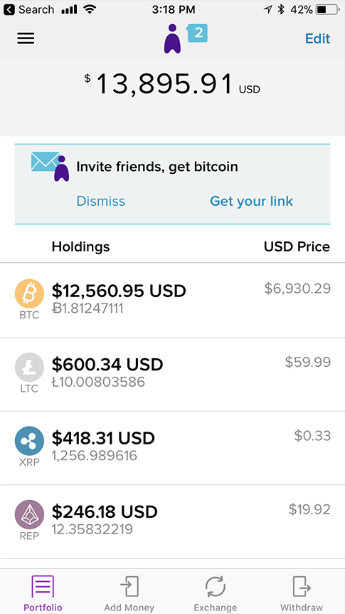

   Abra wallet running on iOS

ADAMANT
=======

https://adamant.im

ADAMANT is a web wallet and messaging application with a strong focus on
privacy. The app allows users to transfer Dash within a chat
application. No registration or KYC is required, and the app is entirely
open source.

.. image:: img/adamant.png
   :width: 100px
   :align: right
   :target: https://adamant.im

Installation
------------

ADAMANT desktop wallets are available from https://adamant.im/#adm-apps
for Linux, macOS and Windows. ADAMANT is also available from the 
`Google Play Store for Android <https://play.google.com/store/apps/details?id=im.adamant.adamantmessengerpwa>`__
and the `Apple App Store for iOS <https://apps.apple.com/app/id1341473829>`__.

Documentation
-------------

Join the `ADAMANT Telegram group <https://t.me/adamant_en>`_ for
ADAMANT support.

.. figure:: img/adamant-wallet.png
   :width: 200px

   ADAMANT Wallet Dash screen

Atomic Wallet
=============

https://atomicwallet.io

Atomic Wallet is a multi-asset custody-free wallet with atomic swap
exchange and decentralized orderbook functionality. It provides a
powerful, secure service that transparently and reliablly allows users
to reduce effort spent on managing and exchanging crypto assets​.

Installation
------------

All Atomic Wallet releases are available from https://atomicwallet.io -
simply download and install the appropriate package for your system.
Atomic Wallet is also available from the `Google Play Store for Android
<https://play.google.com/store/apps/details?id=io.atomicwallet>`__ and
coming soon to the Apple App Store for iOS.

Documentation
-------------

Atomic Wallet offers detailed documentation of all functions at
https://atomicwallet.freshdesk.com and a few quick links are also
collected here:

- `Getting started with Atomic Wallet Part 1 <https://atomicwallet.freshdesk.com/support/solutions/articles/36000066359-getting-started-with-atomic-wallet-part-1->`_
- `Getting started with Atomic Wallet Part 2 <https://atomicwallet.freshdesk.com/support/solutions/articles/36000087950-getting-started-with-atomic-wallet-part-2->`_
- `How to create a wallet <https://atomicwallet.freshdesk.com/support/solutions/articles/36000066354-how-to-create-a-wallet->`_
- `Getting started with Atomic Swaps <https://atomicwallet.freshdesk.com/support/solutions/articles/36000073262-getting-started-with-atomic-swaps>`_

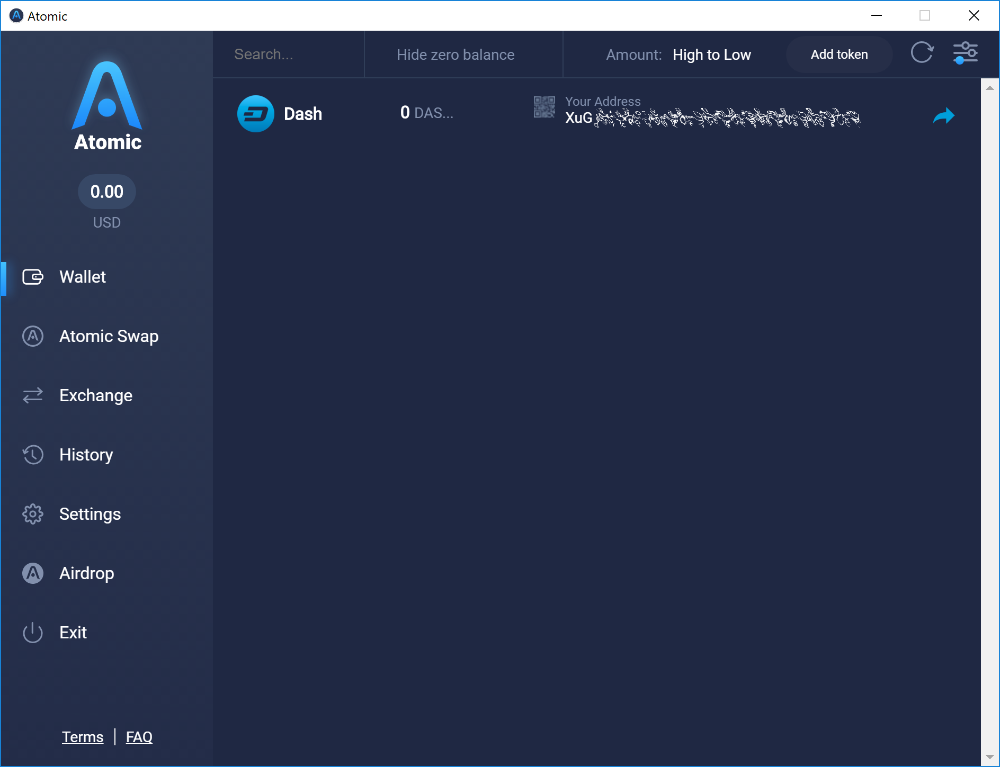

   Atomic Wallet Portfolio screen

Channels
========

https://exscudo.com/channels/

Built by Exscudo, Channels is a secure messaging system with a built-in
money transfer for many cryptocurrencies, including Dash. The underlying
EON token facilitates secure identity verification to reduce fraud.

Installation
------------

Channels is available from the `Google Play Store for Android <https://play.google.com/store/apps/details?id=com.exscudo.channels>`__ 
and the `Apple App Store for iOS <https://apps.apple.com/app/id1367425342>`__.

Documentation
-------------

Channels offers a FAQ at https://exscudo.com/blog/exscudo/frequently-asked-questions/

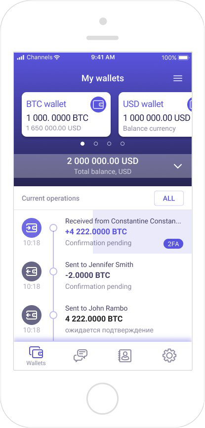

   Channels running on iOS

Cobo
====

https://cobo.com

Cobo is a multi-currency mobile wallet supporting Dash with options to
either register a cloud wallet (private keys backed up on the cloud) or
generate your own HD wallet seed (private keys encrypted on your
device), giving you maximum control over how you handle the crypographic
keys to all assets in the wallet. The wallet offers a unique "staking"
feature where users can pool their Dash to set up masternodes and enjoy
weekly returns.

Installation
------------

Cobo is available from the `Google Play Store for Android <https://play.google.com/store/apps/details?id=cobo.wallet>`__ 
and the `Apple App Store for iOS <https://apps.apple.com/app/id1406282615>`__.

Documentation
-------------

Cobo offers detailed documentation of all functions at
https://support.cobo.com

.. figure:: img/cobo-wallet.png
   :width: 200px

   Cobo wallet

Coinomi
=======

https://www.coinomi.com

Coinomi is an open-source multi-currency mobile wallet available for iOS
and Android. Your private keys never leave your device, and strong
wallet encryption guarantees that your funds are always under your
control only. Instant exchange is available directly in the wallet
through ShapeShift and Changelly integrations.

Download
--------

Coinomi desktop wallets are available from
https://www.coinomi.com/downloads/ for Linux, macOS and Windows. Coinomi
is also available from the `Google Play Store for Android <https://play.google.com/store/apps/details?id=com.coinomi.wallet>`__
and the `Apple App Store for iOS <https://apps.apple.com/app/id1333588809>`__.

Documentation
-------------

Coinomi offers detailed documentation of all functions at
https://coinomi.freshdesk.com 

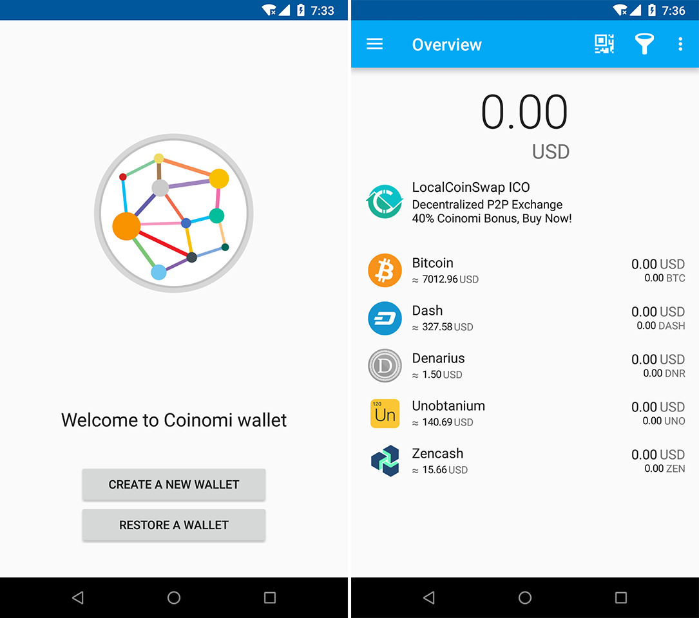

   Coinomi wallet running on Android

Cryptonator
===========

https://www.cryptonator.com

Cryptonator offers a web/mobile wallet which can be accessed using a
simple username/password combination. It supports multiple currencies
including Dash, and offers instant exchange between the various
currencies. It also support Euro-denominated SEPA payments directly from
within the account.

Download
--------

Cryptonator is available from the `Google Play Store for Android <https://play.google.com/store/apps/details?id=com.cryptonator.android>`__
and online at https://www.cryptonator.com

Documentation
-------------

Cryptonator offers detailed documentation of all functions at
https://cryptonator.zendesk.com

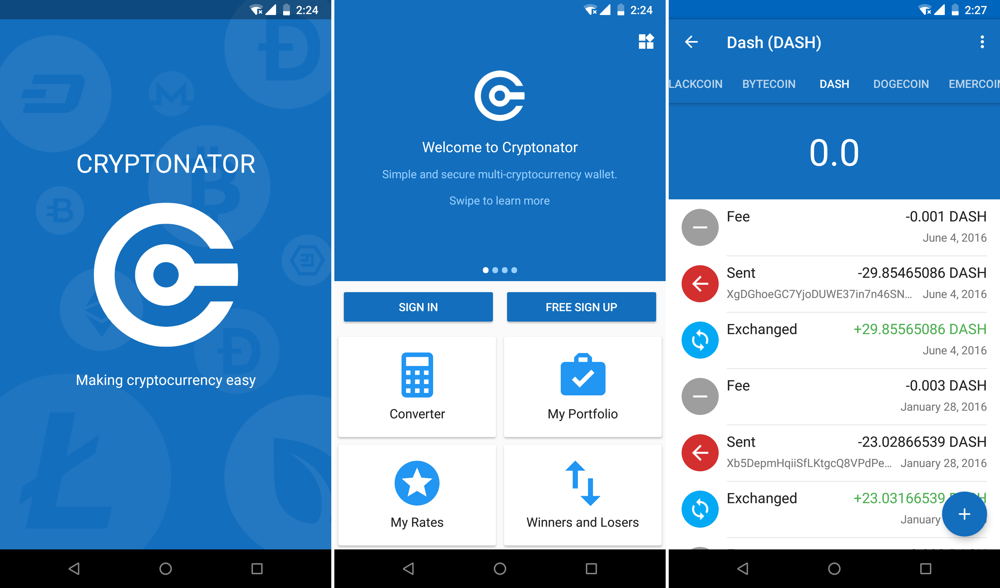

   Cryptonator wallet running on Android

Edge
====

https://edge.app

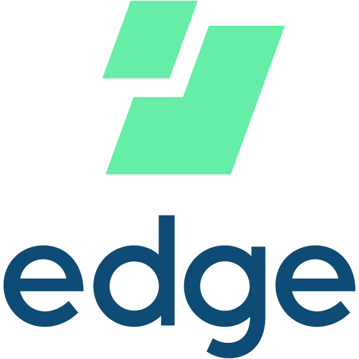

Edge is a secure multi-currency wallet for iOS and Android. It offers a
unique login system to store your encrypted HD seed on the cloud while
still performing all sensitive operations requiring a private key on
your device. Edge is fast and simple to use, allowing you to scan QR
codes and sign transactions using your fingerprint ID or a simple PIN
code. ShapeShift is also integrated to facilitate exchange between
different cryptocurrencies.

Installation
------------

Edge is available from the `Google Play Store for Android <https://play.google.com/store/apps/details?id=co.edgesecure.app>`__ 
and the `Apple App Store for iOS <https://apps.apple.com/app/id1344400091>`__.

Documentation
-------------

Edge offers detailed documentation of all functions at
https://support.edge.app and a few quick links are also collected
here:

- `Getting started <https://support.edge.app/en/support/solutions/8000051596>`__
- `How do I create a new wallet? <https://support.edge.app/en/support/solutions/articles/8000058907>`_
- `How do I send money? <https://support.edge.app/en/support/solutions/articles/8000058750>`_
- `How do I receive money into my account? <https://support.edge.app/en/support/solutions/articles/8000058749>`_

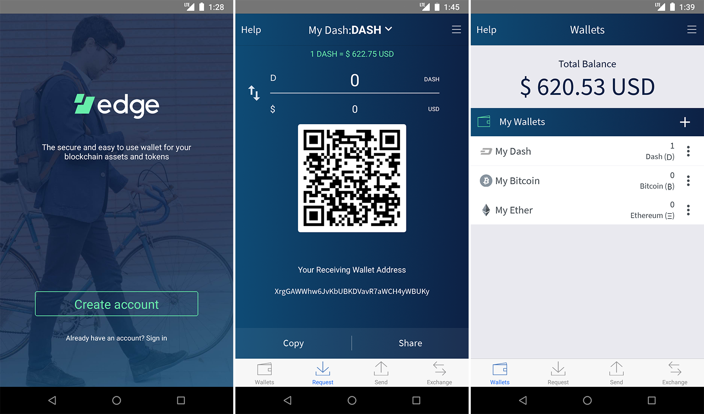

   Edge Welcome, Receive Dash and Balance screens

Ethos
=====

https://www.ethos.io

.. image:: img/ethos.png
   :width: 100px
   :align: right
   :target: https://www.ethos.io

The Ethos Universal Wallet allows you to store Dash and over 100 other
cryptocurrencies. It features a single recovery phrase, known as the
SmartKey, with which you can restore all balances on another device.
Features include human-readable usernames, ShapeShift coin conversion
and a portfolio tracker.

Installation
------------

Ethos Universal Wallet is available from the `Google Play Store for Android <https://play.google.com/store/apps/details?id=io.ethos.universalwallet>`__ 
and the `Apple App Store for iOS <https://apps.apple.com/app/id1376959464>`__.

Documentation
-------------

Ethos offers detailed documentation of all functions at
https://support.ethos.io and a few quick links are also collected
here:

- `Getting Started - Create Your Ethos Account <https://support.ethos.io/support/solutions/articles/35000097575-getting-started-create-your-ethos-account>`__
- `Ethos Universal Wallet - Smart Key <https://support.ethos.io/support/solutions/articles/35000097576-ethos-universal-wallet-smartkey>`_
- `SmartWallet - User Guide <https://support.ethos.io/support/solutions/articles/35000097578-smartwallet-user-guide>`_
- `Sending & Receiving Crypto – User Guide <https://support.ethos.io/support/solutions/articles/35000097579-sending-receiving-crypto-user-guide>`_

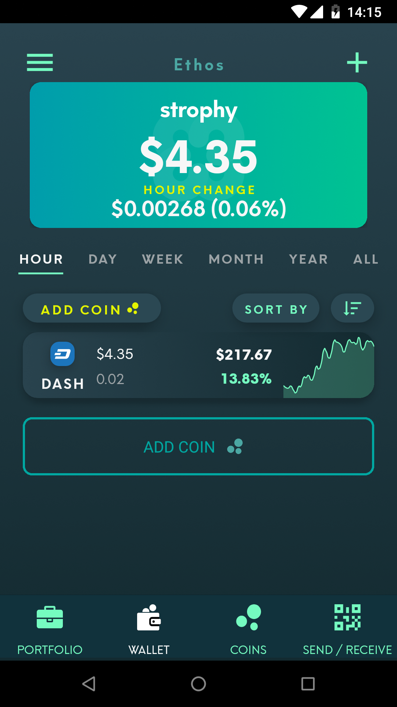

   Ethos Universal Wallet on Android

Evercoin
========

https://evercoin.com

.. image:: img/evercoin.png
   :width: 100px
   :align: right
   :target: https://evercoin.com

Evercoin is a multi-currency mobile wallet combined with the full power
of an instant exchange, all in one app. Advanced features like limit
orders allow you to execute advantageous trades without having to copy
addresses around and use complicated online exchanges. Private keys are
stored on the device and backed up using a typical 12-word phrase. An
Evercoin hardware wallet is also due to launch soon.

Installation
------------

Evercoin is available from the `Google Play Store for Android <https://play.google.com/store/apps/details?id=com.evercoin>`__ 
and the `Apple App Store for iOS <https://apps.apple.com/app/id1277924158>`__.

Documentation
-------------

Read the `FAQ <https://evercoin.com/#faq>`__ or visit the `Evercoin site
<https://evercoin.com>`_ to chat with the support team directly.

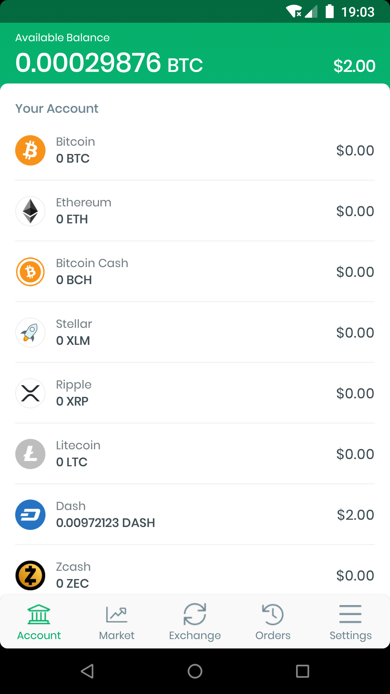

   Evercoin wallet running on Android

Exodus
======

https://www.exodus.io

The Exodus wallet features an engaging visual design and can
simultaneously store multiple currencies. It is available for Windows,
Mac, Linux and iOS. It is also fully integrated with Shapeshift to offer
exchange between the different currencies.

Installation
------------

All Exodus releases are available from https://www.exodus.io/download -
simply download and install the appropriate package for your system.
Exodus is also available from the `Apple App Store for iOS
<https://apps.apple.com/app/id1414384820>`__.

Documentation
-------------

Exodus offers detailed documentation of all functions at
https://support.exodus.io and a few quick links are also collected here:

- `How do I install Exodus? <https://support.exodus.io/article/36-how-do-i-install-exodus>`_
- `How do I get started with Exodus? <https://support.exodus.io/article/37-how-do-i-get-started-with-exodus>`_

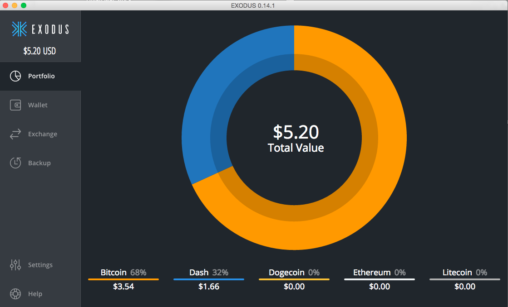

   Exodus wallet Portfolio screen

Guarda
======

https://guarda.com

.. image:: img/guarda.png
   :width: 100px
   :align: right
   :target: https://guarda.com

Guarda offers an entire blockchain ecosystem consisting of desktop, web
and mobile wallets, OTC crypto sales and instant crypto exchange. Dash
is supported throughout the ecosystem, making it an easy and convenient
way for new users to get started. All keys are held by the user,
ensuring the safety of your funds.

Installation
------------

Guarda desktop wallets are available from https://guarda.com/desktop for
Linux, macOS and Windows, or you can use web wallet at
https://guarda.co/app/ to create new or restore existing wallets. Guarda
is also available from the `Google Play Store for Android <https://play.google.com/store/apps/details?id=com.crypto.multiwallet>`__ 
and the `Apple App Store for iOS <https://apps.apple.com/app/id1442083982>`__.

Documentation
-------------

Guarda offers detailed documentation of all functions at
https://guarda.freshdesk.com and a few quick links are also collected
here:

- `How to create a wallet? <https://guarda.freshdesk.com/support/solutions/articles/36000032815-how-to-create-a-wallet->`_

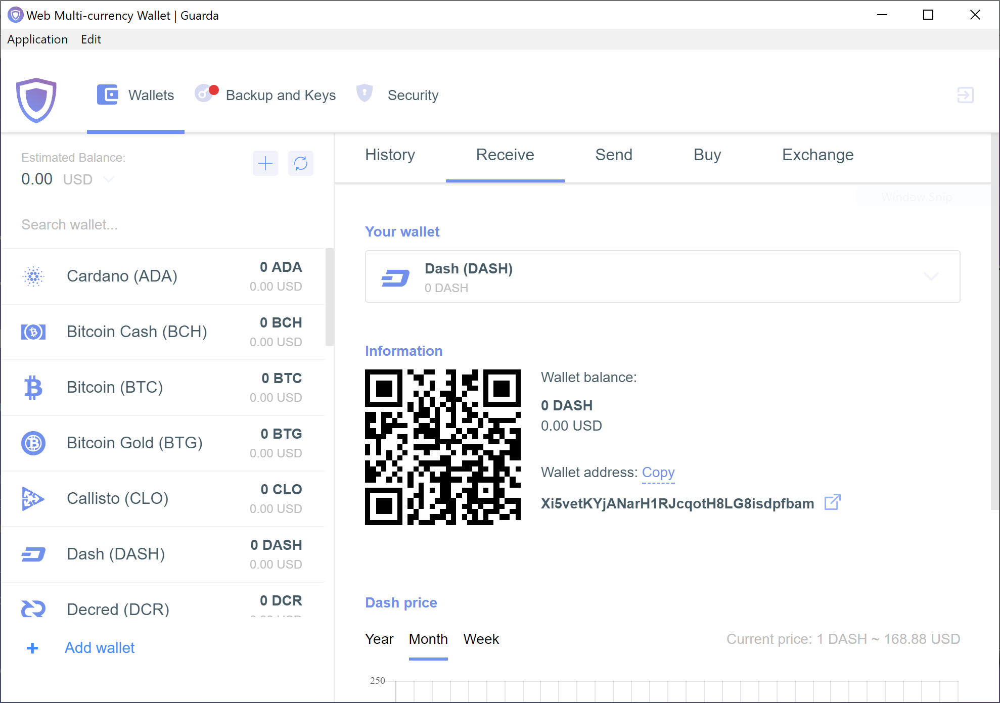

   Guarda wallet

Huobi Wallet
============

https://www.huobiwallet.com

.. image:: img/huobi-wallet.png
   :width: 100px
   :align: right
   :target: https://www.huobiwallet.com

Huobi Wallet is a professional, convenient, safe and secure solution to
secure your cryptocurrency assets. Users have full control over their
assets, since they manage their own private keys. The wallet supports
multisig and a built-in one-click exchange.

Installation
------------

Huobi Wallet is available from the `Google Play Store for Android <https://play.google.com/store/apps/details?id=com.huobionchainwallet.gp>`__ 
and the `Apple App Store for iOS <https://apps.apple.com/app/id1433883012>`__.

Documentation
-------------

Huobi offers detailed documentation of all functions at
https://support.huobiwallet.com and a few quick links are also collected
here:

- `Basic Tutorial <https://support.huobiwallet.com/hc/en-us/categories/360000036582-Basic-Tutorial>`_
- `Wallet Security <https://support.huobiwallet.com/hc/en-us/categories/360000036622-Wallet-Security>`_

Jaxx
====

https://jaxx.io

Jaxx supports multiple currencies in one wallet, including Dash. It is
available for almost all platforms including Android, iOS, macOS,
Windows, Linux and also as a Chrome extension. Jaxx is open source
software.

Installation
------------

All Jaxx releases are available from https://jaxx.io/downloads.html -
simply download and install the appropriate package for your system.
Jaxx is also available from the `Google Play Store for Android <https://play.google.com/store/apps/details?id=com.liberty.jaxx>`__ 
and the `Apple App Store for iOS <https://apps.apple.com/app/id1435383184>`__.

Documentation
-------------

Jaxx offers detailed documentation of all functions at
https://support.decentral.ca and the getting started link is below:

- `Getting started <https://support.decentral.ca/hc/en-us/sections/204038798-Getting-Started>`__

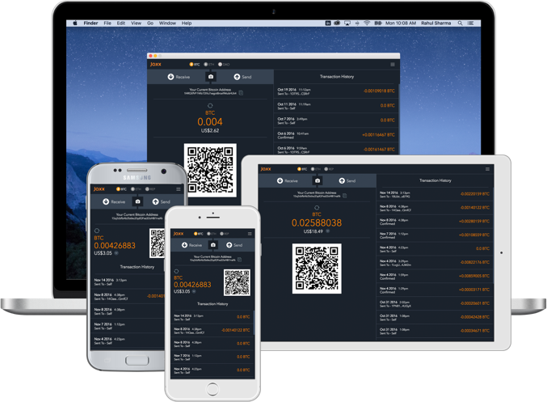

   Jaxx wallet running on various devices

KurePay
=======

https://wallet.kurepay.com

KurePay offers a web and mobile wallet, with options to fund via
credit/debit card and cryptocurrencies and withdrawals in Naira to
Nigerian bank accounts. It is also possible to convert funds and pay
utliities in Nigeria.

Installation
------------

KurePay is available from the `Google Play Store for Android <https://play.google.com/store/apps/details?id=com.kurewallet>`__.

Documentation
-------------

Read the `FAQ <https://kurepay.com/ewallet.html>`__ or send an email to
info@kurepay.com for support with KurePay.

Magnum
======

https://magnumwallet.co

Magnum is a multi-currency web and mobile wallet with support for 100+
cryptocurrencies, including Dash. The wallet integrates Changelly for
in-app exchange and supports staking, delegation and airdrop functions.
Magnum focuses on providing a simple and secure interface to store and
interact with your digital assets.

Installation
------------

Magnum is available from the `Google Play Store for Android <https://play.google.com/store/apps/details?id=com.btcc.wallet>`__.

Documentation
-------------

Join the `Magnum Telegram group <https://t.me/magnumwalletco>`_ for
Magnum support.

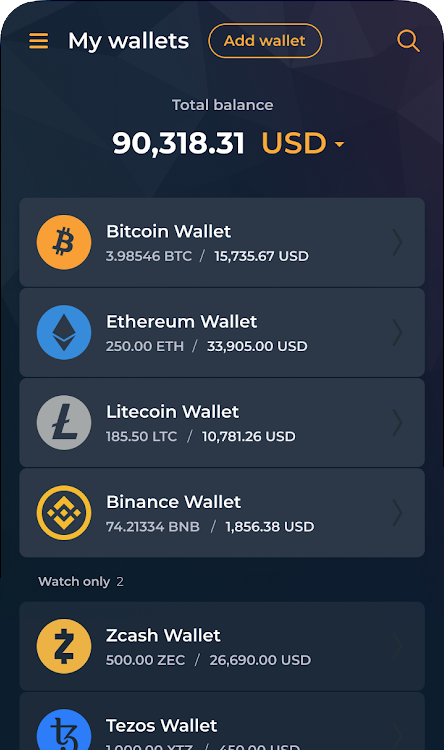

   Magnum wallet running on Android

Mobi
====

https://www.mobi.me

Mobi is a multi-currency mobile wallet linked to your phone number. As a
hosted wallet, Mobi holds the private keys to your funds on your behalf,
meaning you can restore your funds simply by receiving a text message
and entering your PIN. However, you must trust Mobi to act responsibly
with these private keys, and you will lose access to your funds if you
lose access to your phone number. A web interface is also available, and
you can use fiat currency to buy cryptocurrency in the app.

Installation
------------

Mobi is available from the `Google Play Store for Android <https://play.google.com/store/apps/details?id=com.btcc.mobiwallet>`__ 
and the `Apple App Store for iOS <https://apps.apple.com/app/id1180017272>`__.

Documentation
-------------

Read the `FAQ <https://www.mobi.me/faq>`__, join the `Mobi Telegram
group <https://t.me/btccmobi>`_ or send an email to support@mobi.me for
support with Mobi.

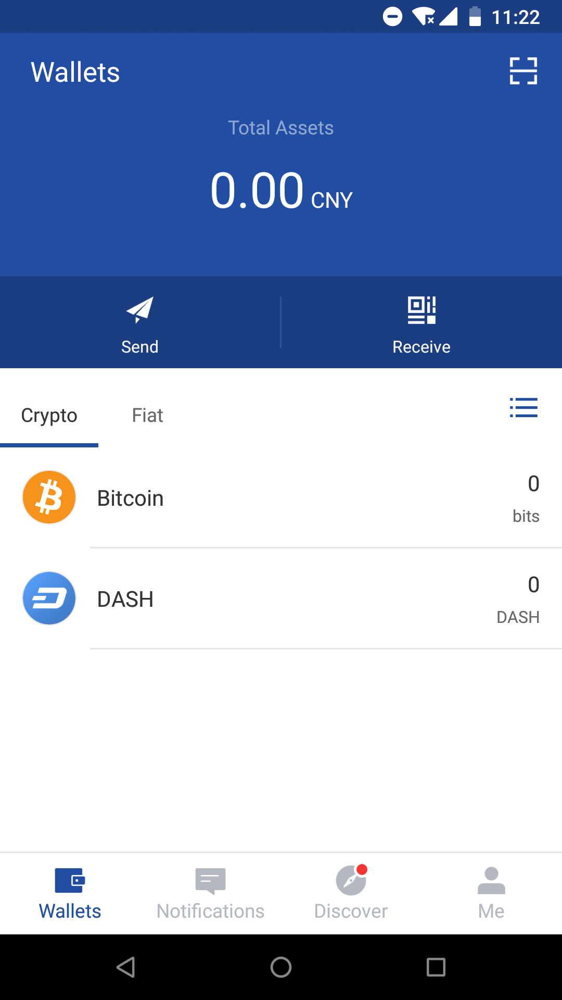

   Mobi wallet running on Android

Ownbit
======

https://ownbit.io

Ownbit is a multi-currency and multi-signature capable mobile wallet
with support for Dash. It allows you to manage multiple wallets and
contacts to faciliate easy transactions.

Installation
------------

Ownbit is available from the `Google Play Store for Android <https://play.google.com/store/apps/details?id=com.bitbill.www>`__ 
and the `Apple App Store for iOS <https://apps.apple.com/app/id1321798216>`__.

Documentation
-------------

Join the `Ownbit Telegram group <https://t.me/bitbill>`_ or send an
email to hi@bitbill.com for support with Ownbit.

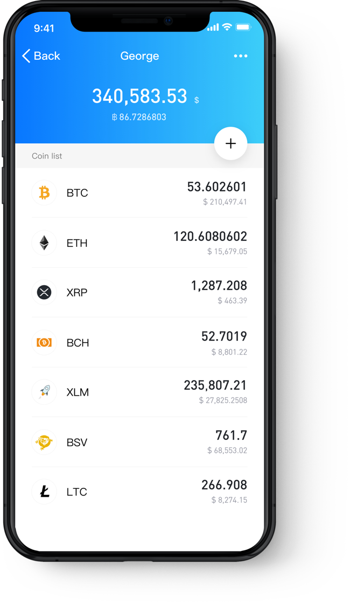

   Ownbit wallet

Paytomat
========

https://paytomat.com

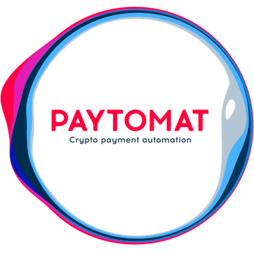

Paytomat offers a multicurrency wallet for Android and iOS which
integrates a loyalty program to incentivize retailers and consumers to
transact in Dash.

Installation
------------

Paytomat is available from the `Google Play Store for Android <https://play.google.com/store/apps/details?id=com.paytomat>`__ 
and the `Apple App Store for iOS <https://apps.apple.com/app/id1415300709>`__.

Documentation
-------------

Join the `Paytomat Telegram group <https://t.me/paytomat>`_ or send an
email to support@paytomat.com for support with Paytomat.

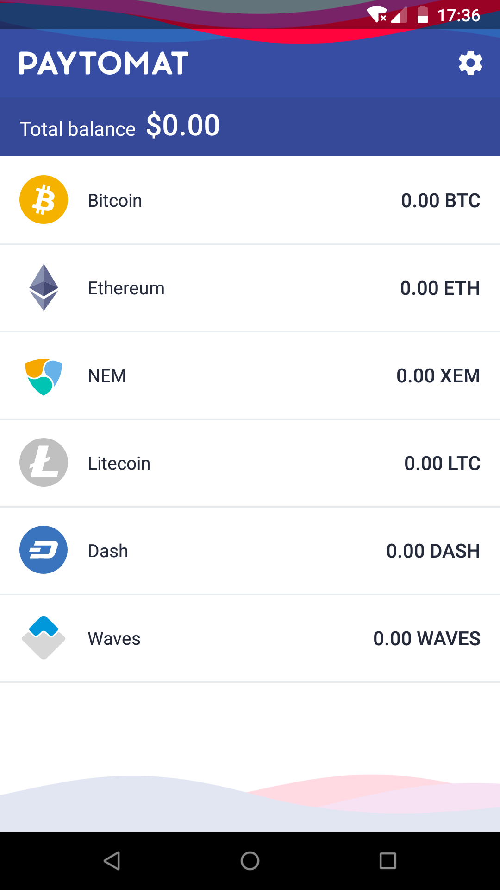

   Paytomat wallet running on Android

Spend
=====

https://www.spend.com

Spend offers a multicurrency wallet for Android and iOS, which is also
used to manage balance for the Spend Visa Card and loyalty program.

Installation
------------

Spend is available from the `Google Play Store for Android <https://play.google.com/store/apps/details?id=com.spend.app>`__ 
and the `Apple App Store for iOS <https://apps.apple.com/app/id1357740381>`__.

Documentation
-------------

Support for Spend is available at https://help.spend.com

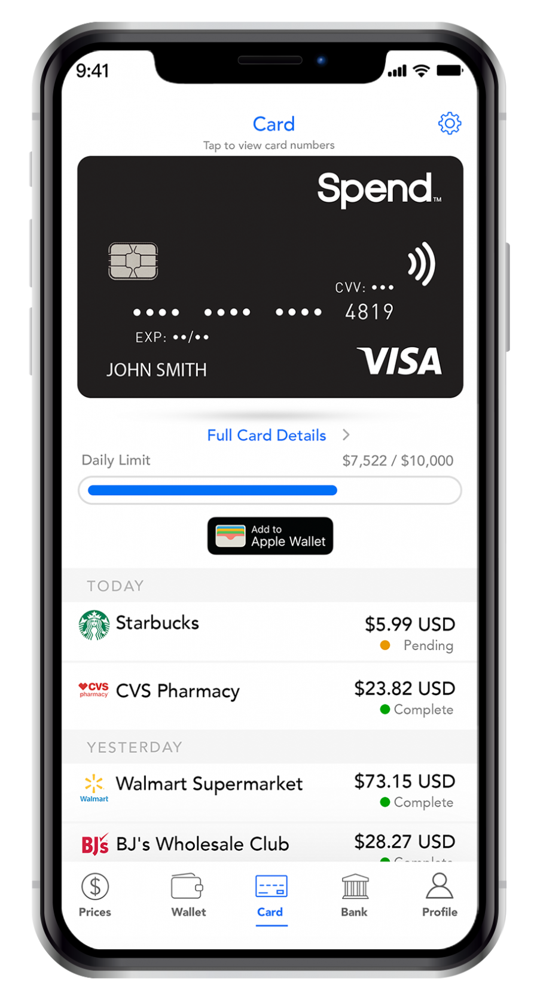

   Spend wallet running on iOS

Trust
=====

https://trustwallet.com

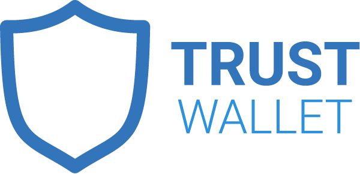

Backed by `Binance <https://www.binance.com>`__, Trust wallet is a
secure and intuitive multi-currency mobile wallet with support for Dash,
Bitcoin, Ethereum and a wide range of tokens and DApps.

Installation
------------

Trust is available from the `Google Play Store for Android <https://play.google.com/store/apps/details?id=com.wallet.crypto.trustapp>`__ 
and the `Apple App Store for iOS <https://apps.apple.com/app/id1288339409>`__.

Documentation
-------------

See the `Help Center <https://help.trustwalletapp.com>`__ or join the
`Trust Telegram group <https://t.me/trustwallet>`_ for support with
Trust.

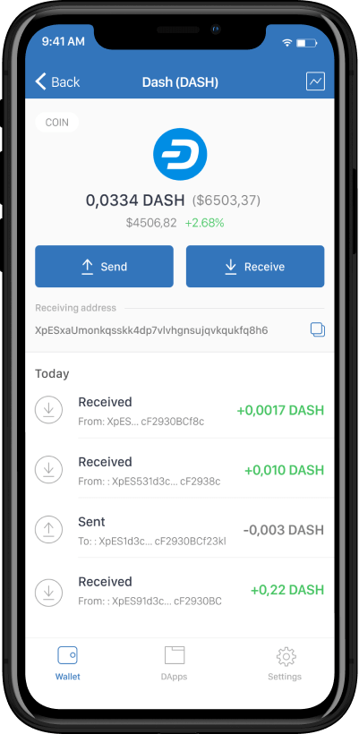

   Trust wallet running on iOS

VegaWallet
==========

https://www.vegawallet.com

VegaWallet offers a secure multi-asset, multi-currency wallet with
support for Dash InstantSend and multi-signature wallets. The wallet
integrates with several exchanges and price sources, as well as offering
advanced NFC functionality for payments.

Installation
------------

VegaWallet desktop wallets are available from https://www.vegawallet.com
for macOS and Windows. VegaWallet is also available from the 
`Google Play Store for Android <https://play.google.com/store/apps/details?id=com.vegawallet.in>`__ 
and the `Apple App Store for iOS <https://apps.apple.com/app/id1449594992>`__.

Documentation
-------------

VegaWallet maintains a `FAQ
<https://www.vegawallet.com/pages/faq.html>`__ and a `Telegram group
<https://t.me/VegaWalletSupport>`_ for support. The team also responds
to support queries by email at `support@vegawallet.com
<support@vegawallet.com>`__

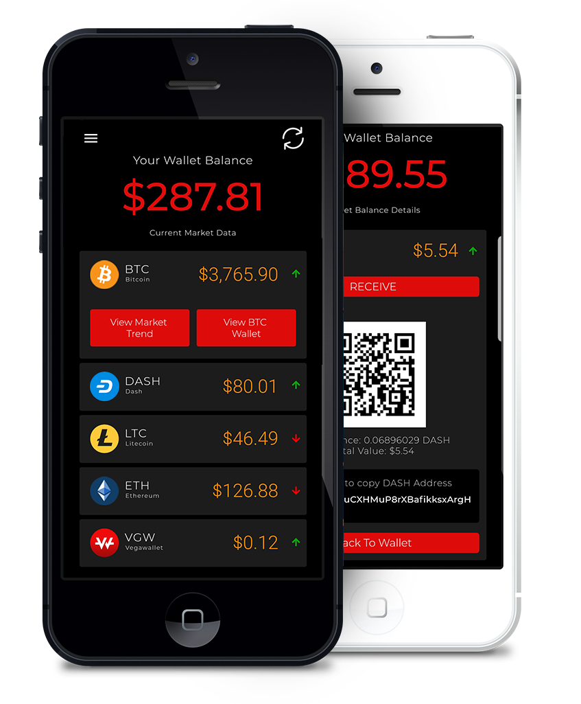

   VegaWallet wallet running on iOS
