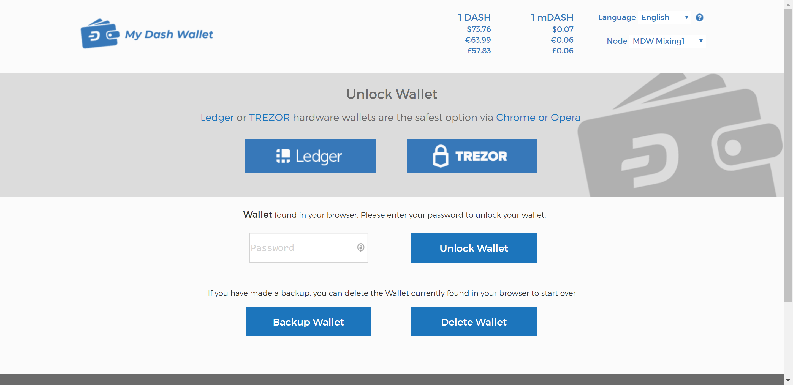

.. _dash-web-wallet:

My Dash Wallet
==============

`MyDashWallet <https://mydashwallet.org/>`_ is a web interface to the
Dash blockchain, inspired by `MyEtherWallet
<https://www.myetherwallet.com>`_ and created by `DeltaEngine.net
<https://deltaengine.net/>`_. It is explicitly not an online wallet,
meaning you maintain control over your private keys at all times. Unlike
many other light wallets, MyDashWallet also supports advanced Dash
features such as InstantSend and PrivateSend. The project is non-profit,
open source and free to use. You can load a wallet and transact in a
variety of wallet formats:

- Keystore wallet (file-based)
- Ledger hardware wallet
- Trezor hardware wallet
- Private key
- BIP39/44 HD recovery phrase (coming soon)
- BIP32 HD recovery phrase (coming soon)

MyDashWallet offers complete and detailed documentation for all functions.

- `Getting started <https://mydashwallet.org/About>`_
- `How to Create a Wallet via Keystore file <https://mydashwallet.org/AboutCreateNewWallet>`_
- `Using the Ledger Hardware Wallet on MyDashWallet <https://mydashwallet.org/AboutLedgerHardwareWallet>`_
- `Using the Trezor Hardware Wallet on MyDashWallet <https://mydashwallet.org/AboutTrezorHardwareWallet>`_
- `How to does DASH InstantSend work on MyDashWallet? <https://mydashwallet.org/AboutInstantSend>`_
- `How to does DASH PrivateSend work on MyDashWallet? <https://mydashwallet.org/AboutPrivateSend>`_

.. image:: img/mydashwallet-opened.png
   :width: 400px
